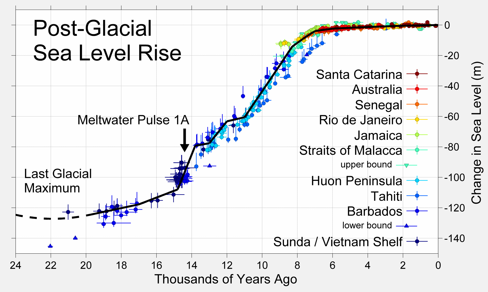

# A Chronicle of Nature, Science, & Technology

This is a chronicle of humanity, and [everything that led up to
us](https://en.wikipedia.org/wiki/Big_History).  I've shown each known branch
along the path of [human
evolution](https://en.wikipedia.org/wiki/Human_evolution).  The branch leading
to humans is on the left.

I'm interested in alphabets, number systems, printing, writing, reproducible
ideas in publications, patents,
[inventions](https://en.wikipedia.org/wiki/Timeline_of_historic_inventions),
and [innovations](https://en.wikipedia.org/wiki/Innovation). My goal is a
[universal history](https://en.wikipedia.org/wiki/Universal_history) of
science and nature.

Accessible explanations let us [stand on the shoulders of
giants](https://en.wikipedia.org/wiki/Standing_on_the_shoulders_of_giants).

Environmental data provide context.  Atmospheric oxygen (O₂) tells the
[eucharyotes'](https://en.wikipedia.org/wiki/Eukaryote) story.  Atmospheric
[carbon dioxide
(CO₂)](https://en.wikipedia.org/wiki/Carbon_dioxide_in_Earth%27s_atmosphere)
tells temperature's story. [Sea level
varies](https://en.wikipedia.org/wiki/Past_sea_level) with temperature.

In [the Holocene epoch](https://en.wikipedia.org/wiki/Holocene), the average
global temperature has varied [< ±2 °C from the 20th century
average](https://commons.wikimedia.org/wiki/File:All_palaeotemps.svg)
of [15.0°C (59.0°F)](https://www.ncdc.noaa.gov/sotc/global/).  Atmospheric CO₂
has steadily increased from about 260 ppm, and dust levels have stayed below
0.1 ppm.  Dust levels exceed 0.4 ppm when the global average temperature drops
more than 6 °C below the Holocene average, during major
[glaciations](https://en.wikipedia.org/wiki/Glacial_period): the air becomes
cold and dry.

---

## Units

- [bya: 1 billion years ago (10⁹)](https://en.wikipedia.org/wiki/Year#Abbreviations_yr_and_ya)
- [mya: 1 million years ago (10⁶)](https://en.wikipedia.org/wiki/Year#Abbreviations_yr_and_ya)
- [kya: 1 thousand years ago (10³)](https://en.wikipedia.org/wiki/Year#Abbreviations_yr_and_ya)
- [ka:  1 thousand years](https://en.wikipedia.org/wiki/Year#Abbreviations_yr_and_ya)
- [ybp: years before present](https://en.wikipedia.org/wiki/Before_Present)
- [atm: approximate atmospheric pressure at sea level](https://en.wikipedia.org/wiki/Atmosphere_%28unit%29)
- [ppm: parts per million](https://en.wikipedia.org/wiki/Parts-per_notation)

## Contents

- [The Big Bang](#the-big-bang)
- [< 10 Billion Years Ago](#-10-billion-years-ago):
  [Mitochondria](#mitochondria), [Chloroplasts](#chloroplasts)
- [< 1 Billion Years Ago](#-1-billion-years-ago):
  [Hox](#hox), [Gut](#gut), [Spine](#spine), [Eye](#eye), [Jaw](#jaw),
  [Lungs](#lungs), [Limbs](#limbs), [Amniotic Sac](#amniotic-sac)
- [< 100 Million Years Ago](#-100-million-years-ago):
  [Thumb](#thumb), [Color Vision](#color-vision), [No Tail](#no-tail)
- [< 10 Million Years Ago](#-10-million-years-ago):
  [Tools](#tools), [Fire](#fire)
- [< 1 Million Years Ago](#-1-million-years-ago):
  [Anatomically Modern Humans](#anatomically-modern-humans)
- [< 100 Thousand Years Ago](#-100-thousand-years-ago):
  [Clothing](#clothing), [Dogs](#dogs), [Agriculture](#agriculture)
- [< 10 Thousand Years Ago](#-10-thousand-years-ago):
  [Cats](#cats), [Writing](#writing), [History](#history),
  [Medicine](#medicine), [Mathematics](#mathematics)
- [Common Era](#common-era):
  [Zero](#zero), [Algebra](#algebra), [Soap](#soap), [Printing](#printing)
- [1500s](#1500s)
- [1600s](#1600s):
  [Cell Biology](#cell-biology), [Calculus](#calculus), [Principia](#principia)
- [1700s](#1700s): [Metal Lathe](#metal-lathe), [Flush Toilet](#flush-toilet)
- [1800s](#1800s)
  - [1810s](#1810s)
  - [1820s](#1820s)
  - [1830s](#1830s)
  - [1840s](#1840s): [Anesthesia](#anesthesia)
  - [1850s](#1850s): [Telegraph](#telegraph)
  - [1860s](#1860s): [Antiseptics](#antiseptics)
  - [1870s](#1870s): [Statistics](#statistics)
  - [1880s](#1880s): [Telephone](#telephone)
  - [1890s](#1890s): [Radio](#radio)
- [1900s](#1900s): [Assembly Line](#assembly-line)
  - [1910s](#1910s)
  - [1920s](#1920s)
  - [1930s](#1930s): [Turing Machine](#turing-machine)
  - [1940s](#1940s)
  - [1950s](#1950s)
  - [1960s](#1960s): [Internet](#internet)
  - [1970s](#1970s)
  - [1980s](#1980s)
  - [1990s](#1990s): [World Wide Web](#world-wide-web)
- [2000s](#2000s)
  - [2010s](#2010s): [Reusable Orbital Rockets](#reusable-orbital-rockets)
  - [2020s](#2020s)
- [Resources](#resources)

---

## The Big Bang

- 13.80 bya: The [Big Bang](https://en.wikipedia.org/wiki/Big_Bang) occurred, and 370,000 years later produced the [cosmic microwave background radiation (CMBR)](https://en.wikipedia.org/wiki/Cosmic_microwave_background)
- 13.53 bya: The [first stars](https://en.wikipedia.org/wiki/Reionization) formed
- 13.2 bya: The [Milky Way](https://en.wikipedia.org/wiki/Milky_Way) galaxy formed

## < 10 Billion Years Ago

- 4.7 bya: [Neutron stars collided, seeding a dust cloud with heavy elements](https://www.scientificamerican.com/article/scientists-trace-neutron-star-crash-that-helped-form-our-solar-system/)
- 4.603 bya: The [Sun](https://en.wikipedia.org/wiki/Sun) formed, containing 99.86% of the mass in the solar system
- 4.543 bya: [Gaia](https://en.wikipedia.org/wiki/Early_Earth) formed
- 4.51 bya: [Theia](https://en.wikipedia.org/wiki/Theia_%28planet%29) collided with Gaia, then the [Earth & Moon formed from the debris](https://en.wikipedia.org/wiki/Giant-impact_hypothesis)
- 4.4 bya: [Liquid water and an atmosphere](https://en.wikipedia.org/wiki/Hadean) (of CO₂, H₂, & water vapor) existed on Earth at a pressure above 27 atm, with temperatures of 230 °C
- ? bya: [Pyrimidine](https://en.wikipedia.org/wiki/Pyrimidine) (precursor to cytosine, thymine, and uracil) existed
- ? bya: [Purine](https://en.wikipedia.org/wiki/Purine) (precursor to adenine and guanine) existed
- ? bya: [RNA](https://en.wikipedia.org/wiki/RNA) existed
- ? bya: [DNA](https://en.wikipedia.org/wiki/DNA) existed
- 4.29-3.48 bya: Our [last universal common ancestor (LUCA)](https://en.wikipedia.org/wiki/Last_universal_common_ancestor) lived
- 4.1-3.8 bya: The [Late Heavy Bombardment (LHB)](https://en.wikipedia.org/wiki/Late_Heavy_Bombardment) of the inner Solar System may have occurred
- 3.8 bya: [Archaeal](https://en.wikipedia.org/wiki/Archaea) [lipids](https://en.wikipedia.org/wiki/Lipid) existed
- 3.6-2.7 bya: The supercontinent [Vaalbara](https://en.wikipedia.org/wiki/Vaalbara) existed
- 3.5 bya: [Earliest oxygen](https://en.wikipedia.org/wiki/Geological_history_of_oxygen) production in shallow oceans, absorbed by the sea and sea bed
- 3.5 bya: [Single celled life](https://en.wikipedia.org/wiki/Unicellular_organism) existed
- ? bya: [Actin](https://en.wikipedia.org/wiki/Actin), a protein family necessary for [phagocytosis](https://en.wikipedia.org/wiki/Phagocytosis), existed
- ? bya: The [cell nucleus](https://en.wikipedia.org/wiki/Cell_nucleus) (present in archaea & eukaryotes, but not eubacteria) existed
- 2.9 bya: The [Pongola glaciation](https://en.wikipedia.org/wiki/Mesoarchean) occurred
- 2.8-2.4 bya: The supercontinent [Ur](https://en.wikipedia.org/wiki/Ur_%continent%29) existed
- 2.7-2.5 bya: The supercontinent [Kenorland](https://en.wikipedia.org/wiki/Kenorland) existed
- 2.7-2.4 bya: Nickel deposits, necessary for chemosynthetic [methane producers](https://en.wikipedia.org/wiki/Methanogen), decreased dramatically
- 2.5-2.0 bya: The supercontinent [Arctica](https://en.wikipedia.org/wiki/Arctica) existed
- 2.45 bya: O₂ production started, practically no atmospheric O₂ before this, with the possible exception of shallow oceans
- 2.45-2.22 bya: [Huronian glaciation](https://en.wikipedia.org/wiki/Huronian_glaciation), caused by oxygen
- 2.4 bya: An asteroid impacted Earth, creating the [Suavjärvi crater](https://en.wikipedia.org/wiki/Suavjärvi_crater) which is 3 km in diameter
- 2.4-2.05 bya: [Great Oxidation Event](https://en.wikipedia.org/wiki/Great_Oxidation_Event), Earth's 3rd atmosphere began
- ? bya: [Asgardarchaeota](https://en.wikipedia.org/wiki/Asgard_%28archaea%29) split from [Crenarchaeota](https://en.wikipedia.org/wiki/Crenarchaeota)

### Mitochondria

- 2.1-1.7 bya: A [prokaryote](https://en.wikipedia.org/wiki/Prokaryote) ("before kernel") incorporated a [Rickettsiales](https://en.wikipedia.org/wiki/Rickettsiales), the source of [mitochondria](https://en.wikipedia.org/wiki/Mitochondrion), via [phagocytosis](https://en.wikipedia.org/wiki/Phagocytosis)
- 2.1 bya: [Eukaryota](https://en.wikipedia.org/wiki/Eukaryote) ("true kernels") split from [Lokiarchaeota](https://en.wikipedia.org/wiki/Lokiarchaeota) ("ancient things"), possibly evolving the [nuclear envelope](https://en.wikipedia.org/wiki/Nuclear_envelope) to protect the genome from [reactive oxygen species (ROS)](https://en.wikipedia.org/wiki/Reactive_oxygen_species) produced by the cells' pre-mitochondria
- 2.023 bya: An asteroid impacted Earth, creating the [Vredefort crater](https://en.wikipedia.org/wiki/Vredefort_crater) which is 160 km in diameter
- 1.9-1.0 bya: The supercontinent [Atlantica](https://en.wikipedia.org/wiki/Atlantica) existed
- 1.85 bya: The [Boring Billion](https://en.wikipedia.org/wiki/Boring_Billion) began; O₂ reached 0.03 atm, but oceans and seabed rock absorbed most of it
- 1.849 bya: A comet impacted Earth, creating the [Sudbury Basin](https://en.wikipedia.org/wiki/Sudbury_Basin) which is 130 km in diameter
- 1.8-1.4 bya: The supercontinent [Nuna](https://en.wikipedia.org/wiki/Columbia_%28supercontinent%29) existed

### Chloroplasts

- 1.4 bya: A eukaryote incorporated a [cyanobacteria](https://en.wikipedia.org/wiki/Cyanobacteria), [Gloeomargarita lithophora](https://en.wikipedia.org/wiki/Gloeomargarita_lithophora), the source of [choloroplasts](https://en.wikipedia.org/wiki/Chloroplast) via phagocytosis
- ? bya: [Orthokaryotes](https://en.wikipedia.org/wiki/Orthokaryotes) split from [Discicristata](https://en.wikipedia.org/wiki/Discicristata)
- ? bya: [Neokaryotes](https://en.wikipedia.org/wiki/Neokaryotes) (all unikonts & bikonts) split from [Jakobids](https://en.wikipedia.org/wiki/Jakobid) (which have bacteria-like mitochondria)
- ? bya: [Scotokaryotes (a.k.a. Opimoda)](https://en.wikipedia.org/wiki/Scotokaryotes) split from [Corticata](https://en.wikipedia.org/wiki/Corticata) ("one with a cortex", a.k.a. [Diphoda or Bikonts](https://en.wikipedia.org/wiki/Bikont), e.g. plants, algae, etc.)
- ? bya: [Podiata](https://en.wikipedia.org/wiki/Podiata) split from [Malawimonas](https://en.wikipedia.org/wiki/Malawimonas)
- ? bya: [Amorphea (a.k.a. Unikonts](https://en.wikipedia.org/wiki/Unikont), "one pole", i.e. a flagellum) split from [CRuMs](https://en.wikipedia.org/wiki/CRuMs) ([heterotrophic](https://en.wikipedia.org/wiki/Heterotroph) protists)
- ? bya: [Obazoa](https://en.wikipedia.org/wiki/Obazoa) split from [Amoebozoa](https://en.wikipedia.org/wiki/Amoebozoa) (amoeboid protists)
- 1.23-0.825 bya: The supercontinent [Rodinia](https://en.wikipedia.org/wiki/Rodinia) existed
- 1.1 bya: [Opisthokonts](https://en.wikipedia.org/wiki/Opisthokont) ("rear pole", i.e. a flagellum) split from [Apusomonadida](https://en.wikipedia.org/wiki/Apusomonadida) (protozoan zooflagellates)
- 1.1 bya: [Holozoa](https://en.wikipedia.org/wiki/Holozoa) split from [Holomycota](https://en.wikipedia.org/wiki/Holomycota) (fungi, slime molds, & amoebae)
- ? ybp: [Filozoa](https://en.wikipedia.org/wiki/Filozoa) ("thread animals") split from [Pluriformea](https://en.wikipedia.org/wiki/Pluriformea) ("many shapes")

## < 1 Billion Years Ago

- 950? mya: [Choanozoa](https://en.wikipedia.org/wiki/Choanozoa) ("collar animal", a.k.a. Apoikozoa, "colony animal") split from [Filasterea](https://en.wikipedia.org/wiki/Filasterea) (amoeboid protists)
- 952 mya: [Animalia](https://en.wikipedia.org/wiki/Animal) (a.k.a. Metazoa) split from [Choanoflagellate](https://en.wikipedia.org/wiki/Choanoflagellate) ("funnel whips", single-celled eukaryotes with flagella)
- 948 mya: [Eumetazoa](https://en.wikipedia.org/wiki/Eumetazoa) ("well after animal") split from [Porifera](https://en.wikipedia.org/wiki/Porifera) (sponges)
- 850 mya: The [Boring Billion](https://en.wikipedia.org/wiki/Boring_Billion) ended; O₂ was still 0.03 atm, but escaped the oceans and absorbed into land, then atmospheric levels rose quickly

### [Hox](https://en.wikipedia.org/wiki/Hox_gene)

- ? mya: The Protohox gene diverged into [Hox](https://en.wikipedia.org/wiki/Hox_gene) & [ParaHox](https://en.wikipedia.org/wiki/ParaHox)
- ? mya: [ParaHoxozoa](https://en.wikipedia.org/wiki/ParaHoxozoa) split from [Ctenophora](https://en.wikipedia.org/wiki/Ctenophora) (comb jellies)
- ? mya: [Planulozoa](https://en.wikipedia.org/wiki/Planulozoa) split from [Placozoa](https://en.wikipedia.org/wiki/Placozoa) ("flat animals")
- 824 mya: [Bilateria](https://en.wikipedia.org/wiki/Bilateria) (embryos have bilateral symmetry) split from [Cnidaria](https://en.wikipedia.org/wiki/Cnidaria) (jellyfish & polyps)
- 800 mya: Massive uptick in zinc composition of marine sediments, attributed to eukaryotes

### Gut

- 797 mya: [Nephrozoa](https://en.wikipedia.org/wiki/Nephrozoa) split from [Xenacoelomorpha](https://en.wikipedia.org/wiki/Xenacoelomorpha) (small, soft bodied, aquatic, worm-like animals without a gut)
- 717 mya: The [Sturtian glaciation](https://en.wikipedia.org/wiki/Sturtian_glaciation) (snowball Earth) began
- 684 mya: [Deuterostomes](https://en.wikipedia.org/wiki/Deuterostome) ("second mouth") split from [Protostomia](https://en.wikipedia.org/wiki/Protostome) ("first mouth")
- 684 mya: [Chordata](https://en.wikipedia.org/wiki/Chordate) split from [Ambulacraria](https://en.wikipedia.org/wiki/Ambulacraria) (echinoderms and hemichordates)
- 676 mya: [Olfactores](https://en.wikipedia.org/wiki/Olfactores) ("smellers") split from [Cephalochordata](https://en.wikipedia.org/wiki/Cephalochordate) (lancelets)
- 662 mya: The [Sturtian glaciation](https://en.wikipedia.org/wiki/Sturtian_glaciation) (snowball Earth) ended
- 650-635 mya: The [Marinoan glaciation](https://en.wikipedia.org/wiki/Marinoan_glaciation) (snowball Earth) occurred
- 633-573 mya: The supercontinent [Pannotia](https://en.wikipedia.org/wiki/Pannotia) existed at the South Pole

### Spine

- 615 mya: [Vertebrata](https://en.wikipedia.org/wiki/Chordate) (chordates with backbones) split from Tunicata (e.g. sea squirts)
- 600 mya: O₂ exceeded 0.1 atm
- 600 mya: An asteroid impacted Earth, creating the [Beaverhead crater](https://en.wikipedia.org/wiki/Beaverhead_crater) which is 60 km in diameter
- 580 mya: An asteroid impacted Earth, creating the [Acraman crater](https://en.wikipedia.org/wiki/Acraman_crater) which is 90 km in diameter
- 579 mya: The [Gaskiers glaciation](https://en.wikipedia.org/wiki/Gaskiers_glaciation) (snowball Earth) occurred for ~340 ka
- 575 mya: The [Avalon explosion of evolution](https://en.wikipedia.org/wiki/Avalon_explosion) occurred, producing the [Ediacaran biota](https://en.wikipedia.org/wiki/Ediacaran_biota)
- 542 mya: The [End-Ediacaran extinction](https://en.wikipedia.org/wiki/End-Ediacaran_extinction) occurred

### Eye

- 541 mya: The [Cambrian explosion of evolution](https://en.wikipedia.org/wiki/Cambrian_explosion) occurred, CO₂ was 4000 ppm, O₂ was 0.12 atm, global temp was +13 °C
- 517 mya: The [End-Botomian extinction event](https://en.wikipedia.org/wiki/End-Botomian_mass_extinction) occurred
- 502 mya: The [Dresbachian extinction event](https://en.wikipedia.org/wiki/Dresbachian) occurred
- 500 mya: The [Steptoean Positive Carbon Isotope Excursion (SPICE)](https://en.wikipedia.org/wiki/Steptoean_positive_carbon_isotope_excursion) occurred, O₂ was 0.30 atm, global temp peaked at +15 °C
- 490 mya: [Green algae](https://en.wikipedia.org/wiki/Green_algae) evolved into [Embryophyta (land plants)](https://en.wikipedia.org/wiki/Embryophyte)
- 488 mya: The [Cambrian–Ordovician extinction event](https://en.wikipedia.org/wiki/Cambrian%E2%80%93Ordovician_extinction_event) occurred

### Jaw

- 473 mya: [Gnathostomata](https://en.wikipedia.org/wiki/Gnathostomata) ("jaw mouth", a.k.a. jawed fish) split from [Osteostraci](https://en.wikipedia.org/wiki/Osteostraci) ("bony shields") & [Pituriaspida](https://en.wikipedia.org/wiki/Pituriaspida) ("pituri shield")
- 469 mya: The [Great Ordovician Biodiversification Event (GOBE)](https://en.wikipedia.org/wiki/Ordovician_radiation) occurred, with fish diversifying rapidly
- 468 mya: The [L chondrite](https://en.wikipedia.org/wiki/L_chondrite) parent bodies collided between Mars & Jupiter, producing many asteroids that still impact Earth
- 467.5 mya: The [Ordovician meteor event](https://en.wikipedia.org/wiki/Ordovician_meteor_event) occurred, due to the [L chondrite](https://en.wikipedia.org/wiki/L_chondrite) parent body collision, with 100x meteorites compared to today
- 460-440 mya: The [Late Ordovician glaciation](https://en.wikipedia.org/wiki/Late_Ordovician_glaciation) occurred, CO₂ fell to 2000 ppm
- 450 mya: The global temperature fell to about 4 °C above the 20th century average
- 450-420 mya: The [Andean-Saharan glaciation](https://en.wikipedia.org/wiki/Andean-Saharan_glaciation) occurred
- 440 mya: The [Ordovician–Silurian extinction events](https://en.wikipedia.org/wiki/Ordovician%E2%80%93Silurian_extinction_events) occurred, 86% of species lost

### Lungs

- 435 mya: [Euteleostomi](https://en.wikipedia.org/wiki/Euteleostomi) (bony vertebrates, a.k.a. Osteichthyes) split from [Chondrichthyes](https://en.wikipedia.org/wiki/Chondrichthyes) (cartilaginous fish)
- 424 mya: The [Lau extinction event](https://en.wikipedia.org/wiki/Lau_event) occurred
- 420 mya: [Elegestolepis](https://en.wikipedia.org/wiki/Elegestolepis), a primitive [shark](https://en.wikipedia.org/wiki/Shark), existed

### Limbs

- 413 mya: [Sarcopterygii](https://en.wikipedia.org/wiki/Sarcopterygii) ("lobe-finned fish") split from [Actinopterygii](https://en.wikipedia.org/wiki/Actinopterygii) ("ray-finned fish")
- 409 mya: [Tungsenia](https://en.wikipedia.org/wiki/Tungsenia), a bony fish and the earliest known [ancestor of tetrapods](https://en.wikipedia.org/wiki/Tetrapodomorpha), existed
- 400 mya: O₂ exceeded 0.15 atm, and the global temperature rose to about 12 °C above the 20th century average
- 400 mya: [Rhipidistia](https://en.wikipedia.org/wiki/Rhipidistia) split from the [Coelacanth](https://en.wikipedia.org/wiki/Coelacanth) ("hollow spine")
- 385 mya: [Wattieza](https://en.wikipedia.org/wiki/Wattieza), an early tree, existed
- 380 mya: [Elpistostege](https://en.wikipedia.org/wiki/Elpistostege), an early tetrapod that was basically a fish with arms, had [digits](https://news.flinders.edu.au/blog/2020/03/19/ancient-fossil-reveals-origin-of-the-human-hand/), small bones that would eventually become fingers
- 375 mya: The [Late Devonian extinction event](https://en.wikipedia.org/wiki/Late_Devonian_extinction) occurred, 75% of species lost
- 360-345 mya: [Archaeopteris](https://en.wikipedia.org/wiki/Archaeopteris), an early tree, existed
- 360-260 mya: The [Late Paleozoic icehouse (a.k.a. Karoo ice age)](https://en.wikipedia.org/wiki/Late_Paleozoic_icehouse) occurred
- 352 mya: [Tetrapoda](https://en.wikipedia.org/wiki/Tetrapod) ("four legs") split from [Dipnoi (lungfish)](https://en.wikipedia.org/wiki/Lungfish)
- 350 mya: O₂ exceeded 0.2 atm, and the global temperature fell to about 5 °C above the 20th century average
- 335-175 mya: The supercontinent [Pangaea](https://en.wikipedia.org/wiki/Pangaea) existed

### Amniotic Sac

- 312 mya: [Amniota](https://en.wikipedia.org/wiki/Amniote) (membrane surrounding the fetus) split from [Amphibia](https://en.wikipedia.org/wiki/Amphibian) ("both kinds of life")
- 305 mya: The [Carboniferous rainforest collapse](https://en.wikipedia.org/wiki/Carboniferous_rainforest_collapse) occurred
- 300 mya: [Pinophyta (a.k.a. conifers)](https://en.wikipedia.org/wiki/Pinophyta) existed
- 300 mya: O₂ peaked at 0.2-0.35 atm, and the global temperature fell to about 2 °C below the 20th century average, all modern classes of [fungi](https://en.wikipedia.org/wiki/Fungus) existed
- 273 mya: [Olson's Extinction](https://en.wikipedia.org/wiki/Olson%27s_Extinction) occurred
- 260 mya: The [Late Paleozoic icehouse](https://en.wikipedia.org/wiki/Late_Paleozoic_icehouse) ended, and global temperature stayed above the 20th century average for the next 256 million years
- 260 mya: The [Capitanian extinction event](https://en.wikipedia.org/wiki/Capitanian_mass_extinction_event) occurred, 35% of species lost
- 252 mya: The [Permian–Triassic extinction event](https://en.wikipedia.org/wiki/Permian%E2%80%93Triassic_extinction_event), i.e. "The Great Dying" occurred, 96% of species lost to volcanoes, O₂ fell to 0.15 atm
- 250 mya: The global temperature rose to about 11 °C above the 20th century average
- 245-202 mya: [Angiosperms ("enclosed seeds", a.k.a. flowering plants)](https://en.wikipedia.org/wiki/Flowering_plant) split from [Gymnosperms ("naked seeds", a.k.a. seed-producing plants)](https://en.wikipedia.org/wiki/Gymnosperm)
- 230 mya: [Eoraptor](https://en.wikipedia.org/wiki/Eoraptor), an early dinosaur, existed
- 215-175 mya: The supercontinent [Pangaea](https://en.wikipedia.org/wiki/Pangaea) split into [Laurasia](https://en.wikipedia.org/wiki/Laurasia) & [Gondwana](https://en.wikipedia.org/wiki/Gondwana), creating the [North Atlantic Ocean](https://en.wikipedia.org/wiki/Opening_of_the_North_Atlantic_Ocean) between North America and northwest Africa
- 214 mya: An asteroid impacted Earth, creating the [Manicouagan crater](https://en.wikipedia.org/wiki/Manicouagan_Reservoir) which is 85 km in diameter
- 201.3 mya: The [Triassic–Jurassic extinction event](https://en.wikipedia.org/wiki/Triassic%E2%80%Jurassic_extinction_event) occurred, 80% of species lost
- 200 mya: O₂ exceeded 0.2 atm, CO₂ was > 3000 ppm, and the global temperature fell to about 2 °C above the 20th century average
- 183 mya: The [Pliensbachian-Toarcian extinction events](https://en.wikipedia.org/wiki/Toarcian_turnover) occurred
- 177 mya: [Synapsida](https://en.wikipedia.org/wiki/Synapsid) ("fused arch", e.g. mammals) split from [Sauropsida](https://en.wikipedia.org/wiki/Sauropsida) ("lizard faces", e.g. reptiles & birds)
- 159 mya: [Theriiformes](https://en.wikipedia.org/wiki/Theriiformes) ("beastlike") split from [Prototheria](https://en.wikipedia.org/wiki/Prototheria) ("first beasts", a.k.a. monotremes, e.g. platypi & echidnas)
- 150 mya: O₂ exceeded 0.26 atm, CO₂ was > 3000 ppm, global temp rose to about 5 °C above the 20th century average
- 145 mya: An asteroid impacted Earth, creating the [Morokweng crater](https://en.wikipedia.org/wiki/Morokweng_crater) which is 70 km in diameter
- 129-125 mya: [Poaceae, a.k.a. Gramineae or grasses](https://en.wikipedia.org/wiki/Poaceae) evolved
- 116 mya: The [Aptian extinction event](https://en.wikipedia.org/wiki/Aptian_extinction) occurred
- 105 mya: [Eutheria](https://en.wikipedia.org/wiki/Eutheria) ("true beasts", placental mammals) split from [Metatheria](https://en.wikipedia.org/wiki/Metatheria) ("changed beasts", e.g. marsupials)
- 100 mya: The global temperature rose to about 8 °C above the 20th century average

## < 100 Million Years Ago

- 96 mya: [Boreoeutheria](https://en.wikipedia.org/wiki/Boreoeutheria) ("northern true beasts") split from [Atlantogenata](https://en.wikipedia.org/wiki/Atlantogenata) (elephants, sloths, etc.)
- 94 mya: The [Cenomanian-Turonian anoxic event](https://en.wikipedia.org/wiki/Cenomanian-Turonian_boundary_event), a mass extinction, occurred
- 90 mya: [Euarchontoglires](https://en.wikipedia.org/wiki/Euarchontoglires) (Supraprimates) split from [Laurasiatheria](https://en.wikipedia.org/wiki/Laurasiatheria) (dogs, cats, giraffes, whales, etc.)
- 88 mya: [Euarchonta](https://en.wikipedia.org/wiki/Euarchonta) ("true ancestors") split from [Glires](https://en.wikipedia.org/wiki/Glires) (dormice), maybe
- 86.2 mya: [Primatomorpha](https://en.wikipedia.org/wiki/Primatomorpha) split from [Scandentia (tree shrews)](https://en.wikipedia.org/wiki/Treeshrew)
- 79.6 mya: [Primates](https://en.wikipedia.org/wiki/Primate) split from [Dermoptera (gliding mammals)](https://en.wikipedia.org/wiki/Colugo)
- 78 mya: [Even-toed ungulates](https://en.wikipedia.org/wiki/Even-toed_ungulate) (e.g. pigs, cows, sheep, goats, camels, llamas, deer, giraffes, hippos, whales, and dolphins) split from [odd-toed ungulates](https://en.wikipedia.org/wiki/Odd-toed_ungulate) (i.e. horses, asses, zebras, rhinos, and tapirs)
- 70.3 mya: An asteroid impacted Earth, creating the [Kara crater](https://en.wikipedia.org/wiki/Kara_crater) which is 65 km in diameter

### Thumb

- 70 mya: [Primates evolved thumbs](https://en.wikipedia.org/wiki/Thumb#Human_Evolution)
- 67 mya: [Haplorhini](https://en.wikipedia.org/wiki/Haplorhini) ("simple nosed", a.k.a. dry nosed primates) split from [Strepsirrhini](https://en.wikipedia.org/wiki/Haplorhini) ("twisted nosed", a.k.a. moist nosed primates)
- 67 mya: The global temperature fell to about 6 °C above the 20th century average, [CO₂ was 350-500 ppm](https://en.wikipedia.org/wiki/Climate_across_Cretaceous%E2%80%93Paleogene_boundary)
- 66.7 mya: The [first known bird](https://www.cam.ac.uk/stories/wonderchicken) existed: a recent common ancestor of chickens and ducks
- 66 mya: An asteroid impacted Earth, creating the [Chicxulub crater](https://en.wikipedia.org/wiki/Chicxulub_crater) which is 150 km in diameter
- 66 mya: The [Cretaceous–Paleogene (K-Pg) extinction event](https://en.wikipedia.org/wiki/Cretaceous%E2%80%93Paleogene_extinction_event) occurred, 76% of species lost (including all dinosaurs except birds)
- 65 mya: The global temperature rose to about 11 °C above the 20th century average, [CO₂ was 2300 ppm](https://en.wikipedia.org/wiki/Climate_across_Cretaceous%E2%80%93Paleogene_boundary)
- 60 mya: [Angiosperms (a.k.a. flowering plants)](https://en.wikipedia.org/wiki/Flowering_plant) replaced [Pinophyta (a.k.a. conifers)](https://en.wikipedia.org/wiki/Pinophyta) as the dominant trees
- 56 mya: [Laurasia](https://en.wikipedia.org/wiki/Laurasia) split into North America & Eurasia
- 55 mya: The [Paleocene–Eocene Thermal Maximum (PETM)](https://en.wikipedia.org/wiki/Paleocene%E2%80%93Eocene_Thermal_Maximum) occurred; atmospheric CO₂ increased, and the global temperature spiked to over 14 °C above the 20th century average
- 50 mya: [Pinnipeds ("fin-foot", a.k.a. seals)](https://en.wikipedia.org/wiki/Pinniped) split from other [Caniformes](https://en.wikipedia.org/wiki/Caniformia) ("dog-like" carnivores)
- 49-45 mya: [Cetaceans (whales)](https://en.wikipedia.org/wiki/Cetacea) evolved from land mammals back into sea mammals
- 45 mya: The global temperature fell to about 9 °C above the 20th century average
- 43 mya: [Simians](https://en.wikipedia.org/wiki/Simian) (flat nosed primates) split from [tarsiers](https://en.wikipedia.org/wiki/Tarsier)
- 42 mya: [Caniformia](https://en.wikipedia.org/wiki/Caniformia) ("dog-like" carnivores) split from [Feliformia](https://en.wikipedia.org/wiki/Feliformia)  ("cat-like" carnivores)
- 40 mya: O₂ dropped to 0.23 atm, and the global temperature spiked to about 11 °C above the 20th century average
- 35 mya: An asteroid impacted Earth, creating the [Popigai crater](https://en.wikipedia.org/wiki/Popigai_crater) which is 90 km in diameter
- 35 mya: The global temperature fell to about 3 °C above the 20th century average, and began to oscillate a couple °C
- 33.9 mya: The [Late Cenozoic Ice Age](https://en.wikipedia.org/wiki/Late_Cenozoic_Ice_Age) began, and is ongoing
- 30 mya: The global temperature peaked at least 6 °C above the 20th century average, and continued to oscillate around 4-6 °C above for the next 10 million years

### Color Vision

- 29 mya: [Catarrhini ("narrow nosed", Old World monkeys)](https://en.wikipedia.org/wiki/Catarrhini) split from [Platyrrhini ("flat nosed", New World monkeys)](https://en.wikipedia.org/wiki/New_World_monkey)
- 28 mya: The [East Antarctic Ice Sheet (EAIS)](https://en.wikipedia.org/wiki/East_Antarctic_Ice_Sheet) formed, due to declining atmospheric CO₂
- 25 mya: O₂ dropped to 0.21 atm, the global temperature peaked about 7 °C above the 20th century average, and continued to oscillate around 4-6 °C above for the next 5 million years

### No Tail

- 20 mya: [Hominoidea (apes)](https://en.wikipedia.org/wiki/Ape) split from [Cercopithecidae (Old World monkeys)](https://en.wikipedia.org/wiki/Old_World_monkey)
- 15.7 mya: [Hominidae (great apes)](https://en.wikipedia.org/wiki/Hominidae) [split](https://en.wikipedia.org/wiki/Gibbon%E2%80%93human_last_common_ancestor) from [gibbons (lesser apes)](https://en.wikipedia.org/wiki/Gibbon)
- 15 mya: The global temperature peaked at least 7 °C above the 20th century average
- 14 mya: The [Middle Miocene disruption](https://en.wikipedia.org/wiki/Middle_Miocene_disruption) occurred, extinctions related to cooling
- 14 mya: The [East Antarctic Ice Sheet (EAIS)](https://en.wikipedia.org/wiki/East_Antarctic_Ice_Sheet) reached its current extent
- 10 mya: The global temperature fell to about 4 °C above the 20th century average, and began to oscillate around 2-4 °C above for the next 4 million years

## < 10 Million Years Ago

- 9 mya: [Homininae](https://en.wikipedia.org/wiki/Homininae) [split](https://en.wikipedia.org/wiki/Orangutan%E2%80%93human_last_common_ancestor) from [orangutans](https://en.wikipedia.org/wiki/Orangutan)
- 8 mya: [Hominini](https://en.wikipedia.org/wiki/Hominini) split from [gorillas](https://en.wikipedia.org/wiki/Gorilla)
- 7 mya: [Hominina](https://en.wikipedia.org/wiki/Human_taxonomy#Hominina) [split](https://en.wikipedia.org/wiki/Chimpanzee%E2%80%93human_last_common_ancestor) from [Panina](https://en.wikipedia.org/wiki/Pan_%28genus%29), i.e. [chimpanzees](https://en.wikipedia.org/wiki/Chimpanzee) and [bonobos](https://en.wikipedia.org/wiki/Bonobo)
- 6 mya: The global temperature fell to about 1 °C above the 20th century average
- 5.96-5.33 mya: The [Messinian salinity crisis](https://en.wikipedia.org/wiki/Messinian_salinity_crisis) desiccated the Mediterranean Sea, ending with the [Zanclean flood](https://en.wikipedia.org/wiki/Zanclean_flood)
- 5 mya: The global temperature peaked at least 4 °C above the 20th century average, and began to oscillate around 1-3 °C above for the next million years
- 4.2-3.8 mya: [Australopithecus anamensis](https://en.wikipedia.org/wiki/Australopithecus_anamensis) evolved in Ethiopia & Kenya
- 4 mya: [Early humans evolved to walk on two legs (bipedalism)](https://en.wikipedia.org/wiki/Human_skeletal_changes_due_to_bipedalism)

### Tools

- 3.4 mya: The [Stone Age](https://en.wikipedia.org/wiki/Stone_Age) began (tools made in Ethiopia, near Gona)
- 3.3 mya: [Early humans made large stone tools in Kenya (Lomekwi 3)](https://en.wikipedia.org/wiki/Lomekwi)
- 3 mya: The global temperature began to regularly dip below the 20th century average, and oscillate between +3 & -3 °C for the next million years
- 2.8 mya: [Homo habilis](https://en.wikipedia.org/wiki/Homo_habilis) evolved
- 2 mya: The global temperature began to regularly peak below the 20th century average, and oscillate between 0 & -3 °C for the next 1.6 million years
- 1.9 mya: [Homo erectus](https://en.wikipedia.org/wiki/Homo_erectus) evolved
- 1.89 mya: Humans began to run long distances, and sweat, and lose body hair
- 1.8 mya: [Homo erectus](https://en.wikipedia.org/wiki/Homo_erectus) migrated [out of Africa](https://en.wikipedia.org/wiki/Early_expansions_of_hominins_out_of_Africa) by this time
- 1.25-0.7 mya: The [Mid-Pleistocene Transition](https://en.wikipedia.org/wiki/Mid-Pleistocene_Transition) occurred, glacial cycles switched from 41 ka to 100 ka
- 1.07 mya: An asteroid created [Lake Bosumtwi](https://en.wikipedia.org/wiki/Lake_Bosumtwi) in Ghana

### Fire

- 1.0 mya: [Homo erectus](https://en.wikipedia.org/wiki/Homo_erectus) [controlled fire](https://en.wikipedia.org/wiki/Control_of_fire_by_early_humans) in [Wonderwerk Cave](https://en.wikipedia.org/wiki/Wonderwerk_Cave), in the Asbestos Mountains of South Africa

## < 1 Million Years Ago

- 990-950 kya: The [Jaramillo reversal](https://en.wikipedia.org/wiki/Jaramillo_reversal) of Earth's magnetic field occurred
- 970 kya: Sea level was 79 m below the 20th century average
- 800 kya: CO₂ dipped below 190 ppm, global temp -9 °C from present
- 790 kya: CO₂ peaked around 260 ppm, global temp -1 °C from present
- 781 kya: The [Brunhes-Matuyama reversal](https://en.wikipedia.org/wiki/Brunhes%E2%80%93Matuyama_reversal) of Earth's magnetic field occurred
- 750 kya: CO₂ dipped below 180 ppm, global temp -9 °C from present
- 740 kya: CO₂ peaked around 210 ppm, global temp -4 °C from present
- 720 kya: CO₂ dipped below 190 ppm, global temp -9 °C from present
- 700 kya: CO₂ peaked around 240 ppm, global temp -2 °C from present
- 670 kya: CO₂ dipped below 170 ppm, global temp -11 °C from present
- 660 kya: CO₂ peaked around 200 ppm, global temp -7 °C from present
- 640 kya: CO₂ dipped below 190 ppm, global temp -9 °C from present
- 610 kya: CO₂ peaked around 260 ppm, global temp -1 °C from present
- 600 kya: CO₂ dipped below 220 ppm, global temp -7 °C from present
- 590 kya: CO₂ peaked around 250 ppm, global temp -2 °C from present
- 580 kya: CO₂ dipped below 200 ppm, global temp -7 °C from present
- 540 kya: CO₂ peaked around 250 ppm, global temp -1 °C from present
- 530 kya: CO₂ dipped below 200 ppm, global temp -8 °C from present
- 490 kya: CO₂ peaked around 250 ppm, global temp -1 °C from present
- 440 kya: CO₂ dipped below 200 ppm, global temp -9 °C from present
- 415 kya: [Early humans controlled fire in Suffolk, England](https://en.wikipedia.org/wiki/Control_of_fire_by_early_humans)
- 400 kya: CO₂ peaked around 280 ppm, global temp +2 °C from present, first time it exceeded 20th century average since 2 million years ago
- 350 kya: CO₂ dipped below 200 ppm, global temp -9 °C from present
- 320 kya: CO₂ peaked around 300 ppm, global temp +2 °C from present
- 315 kya: [Homo sapiens](https://en.wikipedia.org/wiki/Homo_sapiens) evolved
- 300 kya: Most homo species lived in hunter-gatherer societies, with tools, culture, and speech
- 270 kya: [Y-chromosomal Adam](https://en.wikipedia.org/wiki/Y-chromosomal_Adam) lived ([Y-DNA haplogroup A](https://en.wikipedia.org/wiki/Haplogroup_A_%28Y-DNA%29)00)
- 260 kya: CO₂ dipped below 200 ppm, global temp -9 °C from present, sea level was 80 m below
- 250 kya: [Homo neanderthalensis](https://en.wikipedia.org/wiki/Neanderthal) evolved
- 240 kya: CO₂ peaked around 280 ppm, global temp +2 °C from present
- 200 kya: [7 subspecies of early humans, including Homo sapiens](https://en.wikipedia.org/wiki/Human_taxonomy#Subspecies) existed
- 194 kya: The [Penultimate Glacial Period](https://en.wikipedia.org/wiki/Penultimate_Glacial_Period) began
- 173 kya: [African wildcats](https://en.wikipedia.org/wiki/African_wildcat) split from [European wildcats](https://en.wikipedia.org/wiki/European_wildcat)
- 160 kya: CO₂ dipped below 200 ppm, global temp -9 °C from present
- 150 kya: [Mitochondrial Eve](https://en.wikipedia.org/wiki/Mitochondrial_Eve) lived before this [(mt-DNA haplogroup L)](https://en.wikipedia.org/wiki/Macro-haplogroup_L_%28mtDNA%29)
- 150 kya: Sea level was 1 m above the 20th century average
- 140 kya: The [Penultimate Glacial Period](https://en.wikipedia.org/wiki/Penultimate_Glacial_Period) reached its maximum, sea level was 150 m below present

### Anatomically Modern Humans

- 140-110 kya: [Anatomically modern humans (AMH)](https://en.wikipedia.org/wiki/Homo_sapiens#Anatomical_modernity) evolved a larger fore-brain, smaller teeth, and longer distal bones
- 135 kya: The [Penultimate Glacial Period](https://en.wikipedia.org/wiki/Penultimate_Glacial_Period) ended
- 131 kya: [North African/Near Eastern wildcats](https://en.wikipedia.org/wiki/African_wildcat) split from [Southern African wildcats](https://en.wikipedia.org/wiki/Southern_African_wildcat) & [Asiatic wildcats](https://en.wikipedia.org/wiki/Asiatic_wildcat)
- 130 kya: The [Eemian interglacial period](https://en.wikipedia.org/wiki/Eemian) began
- 128 kya: [Early humans cooked with fire regularly](https://en.wikipedia.org/wiki/Control_of_fire_by_early_humans)
- 120 kya: CO₂ peaked around 280 ppm, global temp +3 °C from present, [sea level was 6 m above present, warmest in the past 3 million years](https://en.wikipedia.org/wiki/Eemian)
- 115 kya: The [Last Glacial Period (LGP)](https://en.wikipedia.org/wiki/Last_Glacial_Period) began

## < 100 Thousand Years Ago

### Clothing

- 83 kya: [Humans wore clothing](https://en.wikipedia.org/wiki/History_of_clothing_and_textiles) ([body lice](https://en.wikipedia.org/wiki/Body_louse) diverged from head lice)
- 73 kya: The [Toba volcano erupted](https://en.wikipedia.org/wiki/Toba_catastrophe_theory)
- 70-50 kya: [Homo sapiens migrated out of Africa](https://en.wikipedia.org/wiki/Recent_African_origin_of_modern_humans)
- 50-40 kya: [Early human tools and cultures became more sophisticated](https://en.wikipedia.org/wiki/Behavioral_modernity) in an explosion of innovation
- 50-30 kya: ["Gracile" anatomically modern humans (AMH)](https://en.wikipedia.org/wiki/Homo_sapiens#Anatomical_modernity) evolved
- 43 kya: [Early European Farmers (EEF)](https://en.wikipedia.org/wiki/Early_European_Farmers) split from [Western Hunter-Gatherers (WHG)](https://en.wikipedia.org/wiki/Western_Hunter-Gatherer)
- 40 kya: Humans lived in the [Maribyrnong River](https://en.wikipedia.org/wiki/Maribyrnong_River) valley near modern Melbourne
- 32 kya: [Dogs diverged from wolves](https://en.wikipedia.org/wiki/Origin_of_the_domestic_dog)
- 26.5-20 kya: The [Last Glacial Maximum (LGM)](https://en.wikipedia.org/wiki/Last_Glacial_Maximum) occurred, CO₂ dipped to 180 ppm, global temp -9 °C from present, dust exceeded 1.6 ppm
- 25 kya: [Ancestral Native Americans (ANA)](https://en.wikipedia.org/wiki/Genetic_history_of_indigenous_peoples_of_the_Americas) split from [East Asians](https://en.wikipedia.org/wiki/East_Asian_people)
- 23 kya: [Ancestral Native Americans (ANA)](https://en.wikipedia.org/wiki/Genetic_history_of_indigenous_peoples_of_the_Americas) migrated across [Beringia](https://en.wikipedia.org/wiki/Beringia)
- 23 kya: [Early European Farmers (EEF)](https://en.wikipedia.org/wiki/Early_European_Farmers) split from [Caucasus Hunter-Gatherers (CHG)](https://en.wikipedia.org/wiki/Caucasus_hunter-gatherer)
- 22 kya: [Ancient North Eurasians (ANE)](https://en.wikipedia.org/wiki/Ancient_North_Eurasian) split from [Western Hunter-Gatherers (WHG)](https://en.wikipedia.org/wiki/Western_Hunter-Gatherer)
- 20 kya: [Ancestral Native Americans (ANA)](https://en.wikipedia.org/wiki/Genetic_history_of_indigenous_peoples_of_the_Americas) split from [Ancient Beringians (AB)](https://en.wikipedia.org/wiki/Ancient_Beringian)
- 20 kya: [Sea level](https://en.wikipedia.org/wiki/Past_sea_level) was 130 m below present
- 18 kya: CO₂ fell to local minimum around 200 ppm, global temp -10 °C from present, [sea level](https://en.wikipedia.org/wiki/Past_sea_level) was 120 m below present
- 17-15 kya: The [Oldest Dryas](https://en.wikipedia.org/wiki/Oldest_Dryas) occurred, global temperatures declined sharply
- 15 kya: [Sea level](https://en.wikipedia.org/wiki/Past_sea_level) was 110 m below present
- 15-13 kya: The [Late Glacial Interstadial (LGI)](https://en.wikipedia.org/wiki/Late_Glacial_Interstadial) occurred, first pronounced warming since LGM, global temp spiking to -1 °C from present
- 14.7-13.5 kya: [Meltwater pulse 1A](https://en.wikipedia.org/wiki/Meltwater_pulse_1A) occurred, and the [sea level](https://en.wikipedia.org/wiki/Past_sea_level) rose from > 100 m to < 80 m below present
- 14.6 kya: [Heinrich event](https://en.wikipedia.org/wiki/Heinrich_event) H1 occurred, with many [glaciers calving icebergs](https://en.wikipedia.org/wiki/Ice_calving) rapidly
- 14.5 kya: [Humans made bread at Shubayqa](https://en.wikipedia.org/wiki/Shubayqa_1) in modern Jordan
- 14.5-5.5 kya: The [African humid period](https://en.wikipedia.org/wiki/African_humid_period) occurred

### Dogs

- 14.2 kya: [Dogs lived with humans](https://en.wikipedia.org/wiki/Origin_of_the_domestic_dog#Bonn%E2%80%93Oberkassel_dog) along the [Rhine River](https://en.wikipedia.org/wiki/Rhine)
- 14.2-14.1 kya: The [Older Dryas](https://en.wikipedia.org/wiki/Older_Dryas) occurred, global temperatures declined sharply

### Agriculture

- 14 kya: Other homo species have died, [agriculture](https://en.wikipedia.org/wiki/Agriculture) becomes common
- 14 kya: [Sea level](https://en.wikipedia.org/wiki/Past_sea_level) was 80 m below present, global temp was 2 °C below present
- 13.5 kya: [Natufians](https://en.wikipedia.org/wiki/Natufian_culture) established [Abu Hureyra](https://en.wikipedia.org/wiki/Tell_Abu_Hureyra) near the [Euphrates River](https://en.wikipedia.org/wiki/Euphrates): a few hundred people lived there year-round, the largest settlement of people anywhere at the time
- 13 kya: [Sea level](https://en.wikipedia.org/wiki/Past_sea_level) was 78 m below present, global temp was 2 °C below present
- 13 kya: [Natufians](https://en.wikipedia.org/wiki/Natufian_culture) brewed [beer](https://en.wikipedia.org/wiki/Beer) at [Raqefet Cave](https://en.wikipedia.org/wiki/Raqefet_Cave), near Haifa
- 12.9-11.7 kya: The [Younger Dryas](https://en.wikipedia.org/wiki/Younger_Dryas) occurred, global temperatures declined sharply
- 12.2 kya: [Neolithic age](https://en.wikipedia.org/wiki/Neolithic) began, agriculture existed in the Levant, CO₂ exceeded 250 ppm, global temp rose to the present level
- 12.2 kya: [Natufians](https://en.wikipedia.org/wiki/Natufian_culture) established [Mureybet](https://en.wikipedia.org/wiki/Mureybet) near the [Euphrates River](https://en.wikipedia.org/wiki/Euphrates), the first known settlement with rectangular structures
- 12 kya: [Sea level](https://en.wikipedia.org/wiki/Past_sea_level) was 65 m below present, global temp was 2 °C below present
- 12 kya: People in [Asia](https://en.wikipedia.org/wiki/Asia) domesticated the [bottle gourd](https://en.wikipedia.org/wiki/Bottle_gourd)
- 9700 BCE: The [Holocene epoch](https://en.wikipedia.org/wiki/Holocene) began, global temperatures increased, CO₂ was 270 ppm
- 9500 BCE: People near the upper [Euphrates River](https://en.wikipedia.org/wiki/Euphrates) built [Göbekli Tepe](https://en.wikipedia.org/wiki/G%C3%B6bekli_Tepe), the oldest known temple, using the oldest [megaliths](https://en.wikipedia.org/wiki/Megalith)
- 9500-9200 BCE: [Meltwater pulse 1B](https://en.wikipedia.org/wiki/Meltwater_pulse_1B) occurred
- 9400 BCE: People in [Cyprus](https://en.wikipedia.org/wiki/Cyprus) had [domesticated pigs](https://en.wikipedia.org/wiki/Domestic_pig) from the mainland
- 9000 BCE: [Sea level](https://en.wikipedia.org/wiki/Past_sea_level) was 60 m below present
- 9000 BCE: [Natufians](https://en.wikipedia.org/wiki/Natufian_culture) settled [Jericho](https://en.wikipedia.org/wiki/Jericho)
- 9000 BCE: People in the [Fertile Crescent](https://en.wikipedia.org/wiki/Fertile_Crescent) domesticated [peas](https://en.wikipedia.org/wiki/Pea), [wheat](https://en.wikipedia.org/wiki/Wheat), [rye](https://en.wikipedia.org/wiki/Rye), & [barley](https://en.wikipedia.org/wiki/Barley) which tolerates salty soil better than the others
- 9000 BCE: People in what is now [China](https://en.wikipedia.org/wiki/China) domesticated [soybeans](https://en.wikipedia.org/wiki/Soybean)
- 8500 BCE: People in the [Mediterranean Basin](https://en.wikipedia.org/wiki/Mediterranean_Basin) domesticated the [sheep](https://en.wikipedia.org/wiki/Domestic_sheep)
- 8500 BCE: People in the [Tigris basin](https://en.wikipedia.org/wiki/Tigris) [domesticated pigs](https://en.wikipedia.org/wiki/Domestic_pig) and [cattle](https://en.wikipedia.org/wiki/Cattle#Domestication_and_husbandry), perhaps near [Çayönü Tepesi](https://en.wikipedia.org/wiki/%C3%87ay%C3%B6n%C3%BC)
- 8350 BCE: People in the [Levant](https://en.wikipedia.org/wiki/Levant) settled [ʿAin Ghazal ("Spring of the Gazelle")](https://en.wikipedia.org/wiki/%CA%BFAin_Ghazal) by the [Zarqa River](https://en.wikipedia.org/wiki/Zarqa_River), where the city of Amman is today
- 8000 BCE: People in the [Levant](https://en.wikipedia.org/wiki/Levant) settled [Gesher](https://en.wikipedia.org/wiki/Gesher_%28archaeological_site%29) in the [Jordan Valley](https://en.wikipedia.org/wiki/Jordan_Valley)
- 8000 BCE: People in what is now [Iran](https://en.wikipedia.org/wiki/Iran) domesticated the [goat](https://en.wikipedia.org/wiki/Goat)
- 8000 BCE: [Sea level](https://en.wikipedia.org/wiki/Past_sea_level) was 45 m below present

## < 10 Thousand Years Ago

### Cats

- 7500 BCE: [A farmer lived with a domesticated African wildcat in Cyprus](https://en.wikipedia.org/wiki/Evolution_of_the_domesticated_cat)
- 7100 BCE: People in [Anatolia](https://en.wikipedia.org/wiki/Anatolia) established [Çatalhöyük](https://en.wikipedia.org/wiki/Çatalhöyük), the largest known settlement at several thousand people
- 7000-3000 BCE: The [Holocene Climatic Optimum (HCO)](https://en.wikipedia.org/wiki/Holocene_climatic_optimum) occurred, with Arctic temperatures 2 °C above the 20th century average, or more
- 7000 BCE: [Sea level](https://en.wikipedia.org/wiki/Past_sea_level) was 30 m below present
- 7000 BCE: People on the plains of the [Indus River](https://en.wikipedia.org/wiki/Indus_River) domesticated the [zebu](https://en.wikipedia.org/wiki/Zebu), founded [Mehrgarh](https://en.wikipedia.org/wiki/Mehrgarh) near the [Bolan Pass](https://en.wikipedia.org/wiki/Bolan_Pass), the earliest known farming settlement of the [Indus Valley Civilisation](https://en.wikipedia.org/wiki/Indus_Valley_Civilisation), and grew wheat from the [Fertile Crescent](https://en.wikipedia.org/wiki/Fertile_Crescent)
- 6500-6200 BCE: [Doggerland](https://en.wikipedia.org/wiki/Doggerland) flooded and became the North Sea
- 6400 BCE: People in the [Fertile Crescent](https://en.wikipedia.org/wiki/Fertile_Crescent) made [pottery](https://en.wikipedia.org/wiki/Pottery)
- 6000 BCE: People in [Southeast Asia](https://en.wikipedia.org/wiki/Southeast_Asia) domesticated the [chicken](https://en.wikipedia.org/wiki/Chicken)
- 6000 BCE: People in what is now [China](https://en.wikipedia.org/wiki/China) independently [domesticated pigs](https://en.wikipedia.org/wiki/Domestic_pig)
- 6000 BCE: [Sea level](https://en.wikipedia.org/wiki/Past_sea_level) was 15 m below present
- 5500 BCE: [Sea level](https://en.wikipedia.org/wiki/Past_sea_level) was 6 m below present
- 5400 BCE: [Sumerians](https://en.wikipedia.org/wiki/Sumer) founded the city of [Eridu](https://en.wikipedia.org/wiki/Eridu)
- 5202 BCE: People made [ceramics](https://en.wikipedia.org/wiki/Ceramic), [flutes](https://en.wikipedia.org/wiki/Flute), and [inscribed markings](https://en.wikipedia.org/wiki/Dispilio_Tablet) near [Dispilio](https://en.wikipedia.org/wiki/Dispilio), Greece
- 5000 BCE: People smelted [copper](https://en.wikipedia.org/wiki/Copper) on [Rudnik Mountain](https://en.wikipedia.org/wiki/Rudnik_%28mountain%29) in modern Serbia
- 5000 BCE: People in what is now [Peru](https://en.wikipedia.org/wiki/Peru) domesticated [guinea pigs](https://en.wikipedia.org/wiki/Guinea_pig)
- 5000 BCE: People in [Egypt](https://en.wikipedia.org/wiki/Egypt) domesticated the [donkey](https://en.wikipedia.org/wiki/Donkey)
- 5000 BCE: [Sumerians](https://en.wikipedia.org/wiki/Sumer) founded the city of [Uruk](https://en.wikipedia.org/wiki/Uruk)
- 5000 BCE: [Sea level](https://en.wikipedia.org/wiki/Past_sea_level) was 4 m below present
- 4000 BCE: [Sea level](https://en.wikipedia.org/wiki/Past_sea_level) was 3 m below present
- 4000 BCE: People in what is now [China](https://en.wikipedia.org/wiki/China) domesticated the [duck](https://en.wikipedia.org/wiki/Domestic_duck)
- 4000 BCE: People in what is now [India](https://en.wikipedia.org/wiki/India) & [China](https://en.wikipedia.org/wiki/China) domesticated the [water buffalo](https://en.wikipedia.org/wiki/Water_buffalo)
- 4000 BCE: People in [Africa](https://en.wikipedia.org/wiki/Africa), [Asia](https://en.wikipedia.org/wiki/Asia), & [Europe](https://en.wikipedia.org/wiki/Europe) domesticated the [honey bee](https://en.wikipedia.org/wiki/Honey_bee)
- 4000 BCE: People in [Arabia](https://en.wikipedia.org/wiki/Arabian_Peninsula) domesticated the [dromedary camel](https://en.wikipedia.org/wiki/Dromedary_camel)
- 3900-3500 BCE: Human populations rapidly increased with the spread of agriculture, pottery, the wheel, and animal husbandry, see the [Neolithic decline](https://en.wikipedia.org/wiki/Neolithic_decline)
- 3500 BCE: The [Botai culture](https://en.wikipedia.org/wiki/Botai_culture) in northern [Kazakhstan](https://en.wikipedia.org/wiki/Kazakhstan) domesticated the [horse](https://en.wikipedia.org/wiki/Horse)
- 3400 BCE: The [Neolithic decline](https://en.wikipedia.org/wiki/Neolithic_decline) began, with human settlements abandoned permanently, decreased cereal production, and the emergence of communicable diseases such as [pneumonic plague](https://en.wikipedia.org/wiki/Pneumonic_plague)

### Writing

- 3300 BCE: The [Bronze Age](https://en.wikipedia.org/wiki/Bronze_Age) began in Southern Asia
- 3300 BCE: [Sumerians](https://en.wikipedia.org/wiki/Sumer) in [Uruk](https://en.wikipedia.org/wiki/Uruk) on the ancient channel of the [Euphrates River](https://en.wikipedia.org/wiki/Euphrates) wrote [cuneiform](https://en.wikipedia.org/wiki/Cuneiform)
- 3300 BCE: People in the [Indus Valley Civilization](https://en.wikipedia.org/wiki/Indus_Valley_Civilisation) wrote the [Indus script](https://en.wikipedia.org/wiki/Indus_script)
- 3300 BCE: [Eastern Hunter-Gatherer (EHG)](https://en.wikipedia.org/wiki/Eastern_Hunter-Gatherer) males mated with [Caucasus Hunter-Gatherer (CHG)](https://en.wikipedia.org/wiki/Caucasus_hunter-gatherer) females to produce [Western Steppe Herders (WSH)](https://en.wikipedia.org/wiki/Western_Steppe_Herders)
- 3200 BCE: The [Gerzeh culture](https://en.wikipedia.org/wiki/Gerzeh_culture) in Egypt wrote [hieroglyphs](https://en.wikipedia.org/wiki/Hieroglyph) ("sacred carvings"), descended from [Sumerian](https://en.wikipedia.org/wiki/Sumer) [cuneiform](https://en.wikipedia.org/wiki/Cuneiform)
- 3100 BCE: [Sumerians](https://en.wikipedia.org/wiki/Sumer) founded the city of [Kish](https://en.wikipedia.org/wiki/Kish_%28Sumer%29)
- 3000 BCE: [Sea level](https://en.wikipedia.org/wiki/Past_sea_level) was 2 m below present
- 3000 BCE: The [Indus Valley Civilisation](https://en.wikipedia.org/wiki/Indus_Valley_Civilisation) had many [advanced technologies](https://en.wikipedia.org/wiki/List_of_inventions_and_discoveries_of_the_Indus_Valley_Civilisation), notably [sanitation](https://en.wikipedia.org/wiki/Sanitation_of_the_Indus_Valley_Civilisation) using separate channels for wastewater and rainwater
- 3000 BCE: People in what is now [China](https://en.wikipedia.org/wiki/China) domesticated the [silkmoth](https://en.wikipedia.org/wiki/Bombyx_mori)
- 3000 BCE: People in the [Mediterranean Basin](https://en.wikipedia.org/wiki/Mediterranean_Basin) domesticated the [pigeon](https://en.wikipedia.org/wiki/Domestic_pigeon)
- 2600 BCE: [Western Steppe Herders (WSH)](https://en.wikipedia.org/wiki/Western_Steppe_Herders) migrated across Eurasia, spreading the [Indo-European language family](https://en.wikipedia.org/wiki/Indo-European_languages)
- 2500 BCE: People in [Egypt](https://en.wikipedia.org/wiki/Egypt) [fried food](https://en.wikipedia.org/wiki/Frying)
- 2500 BCE: The [*Instructions of Shuruppak*](https://en.wikipedia.org/wiki/Instructions_of_Shuruppak), an example of [Sumerian](https://en.wikipedia.org/wiki/Sumer) [wisdom literature](https://en.wikipedia.org/wiki/Wisdom_literature), existed by this time
- 2300 BCE: [Urukagina](https://en.wikipedia.org/wiki/Urukagina) enacted the first known government reforms, to combat corruption
- 2200 BCE: A major drought, the [4.2-kiloyear event](https://en.wikipedia.org/wiki/4.2-kiloyear_event), may have contributed to the collapse of civilizations across Asia & Africa
- 2200 BCE: The [Indus Valley Civilisation](https://en.wikipedia.org/wiki/Indus_Valley_Civilisation) founded the city of [Lothal](https://en.wikipedia.org/wiki/Lothal) on an ancient course of the [Sabarmati River](https://en.wikipedia.org/wiki/Sabarmati_River) where it met the [Arabian Sea](https://en.wikipedia.org/wiki/Arabian_Sea)
- 2100 BCE: [Minoans](https://en.wikipedia.org/wiki/Minoan_civilization) on the [Aegean Islands](https://en.wikipedia.org/wiki/Aegean_Islands) wrote [Cretan hieroglyphs](https://en.wikipedia.org/wiki/Cretan_hieroglyphs)
- 2050 BCE: [Ur-Nammu](https://en.wikipedia.org/wiki/Ur-Nammu) enacted the [Code of Ur-Nammu](https://en.wikipedia.org/wiki/Code_of_Ur-Nammu)
- 2050 BCE: The [Sintashta culture](https://en.wikipedia.org/wiki/Sintashta_culture) near the [Ural](https://en.wikipedia.org/wiki/Ural_%28river%29) and [Tobol](https://en.wikipedia.org/wiki/Tobol) rivers invented the [spoked wheel](https://en.wikipedia.org/wiki/Spoke) and light [chariot](https://en.wikipedia.org/wiki/Chariot)
- 2000 BCE: [Sea level](https://en.wikipedia.org/wiki/Past_sea_level) was 1 m below present
- 2000 BCE: [Sumerians](https://en.wikipedia.org/wiki/Sumer) in [Larsa](https://en.wikipedia.org/wiki/Larsa) inscribed the [*Sumerian King List*](https://en.wikipedia.org/wiki/Sumerian_King_List) on a clay tablet
- 2000 BCE: The last [woolly mammoths](https://en.wikipedia.org/wiki/Woolly_mammoth) lived on [Wrangel Island](https://en.wikipedia.org/wiki/Wrangel_Island)
- 1900 BCE: [People smelted and smithed iron](https://en.wikipedia.org/wiki/Iron_Age) in Anatolia or Caucasus
- 1850 BCE: People near Wadi El-Hol, Egypt wrote [Proto-Sinaitic script](https://en.wikipedia.org/wiki/Proto-Sinaitic_script)
- 1800 BCE: Assyrians from [Assur](https://en.wikipedia.org/wiki/Assur) on the [Tigris River](https://en.wikipedia.org/wiki/Tigris) introduced [cuneiform](https://en.wikipedia.org/wiki/Cuneiform) to [Hattusa](https://en.wikipedia.org/wiki/Hattusa), the capital of the [Hittite Empire](https://en.wikipedia.org/wiki/Hittites)
- 1800-1450 BCE: [Minoans](https://en.wikipedia.org/wiki/Minoan_civilization) on the [Aegean Islands](https://en.wikipedia.org/wiki/Aegean_Islands) wrote [Linear A](https://en.wikipedia.org/wiki/Linear_A), descended from Cretan hieroglyphs
- 1754 BCE: [Hammurabi](https://en.wikipedia.org/wiki/Hammurabi) enacted the [Code of Hammurabi](https://en.wikipedia.org/wiki/Code_of_Hammurabi)
- 1700 BCE: [King Anitta](https://en.wikipedia.org/wiki/Anitta), who wrote the oldest known [Indo-European](https://en.wikipedia.org/wiki/Indo-European_languages) text in [Hittite](https://en.wikipedia.org/wiki/Hittite_language), burned [Hattusa](https://en.wikipedia.org/wiki/Hattusa)
- 1600 BCE: The [Thera volcano erupted](https://en.wikipedia.org/wiki/Minoan_eruption) on the island now called [Santorini](https://en.wikipedia.org/wiki/Santorini), destroying the [Minoan](https://en.wikipedia.org/wiki/Minoan_civilization) settlement [Akrotiri](https://en.wikipedia.org/wiki/Akrotiri_%28prehistoric_city%29)
- 1450-1200 BCE: [Mycenaeans in Greece](https://en.wikipedia.org/wiki/Mycenaean_Greece) wrote [Linear B](https://en.wikipedia.org/wiki/Linear_B), descended from Linear A
- 1300 BCE: [Mycenaeans in Greece](https://en.wikipedia.org/wiki/Mycenaean_Greece) made [concrete](https://en.wikipedia.org/wiki/Concrete) floors in the royal palace of [Tiryns](https://en.wikipedia.org/wiki/Tiryns) on the [Peloponnese peninsula](https://en.wikipedia.org/wiki/Peloponnese)
- 1200 BCE: People at [Yinxu](https://en.wikipedia.org/wiki/Yinxu), China carved [oracle bone script](https://en.wikipedia.org/wiki/Oracle_bone_script)
- 1200-1150 BCE: The [Late Bronze Age Collapse](https://en.wikipedia.org/wiki/Late_Bronze_Age_collapse) occurred, with invading [Sea Peoples](https://en.wikipedia.org/wiki/Sea_Peoples) introducing iron in large quantities to the eastern Mediterranean
- 1050 BCE: [Phoenicians](https://en.wikipedia.org/wiki/Phoenicia) wrote using the [Phoenician alphabet](https://en.wikipedia.org/wiki/Phoenician_alphabet), descended from Linear B
- 1000 BCE: [Sea level](https://en.wikipedia.org/wiki/Past_sea_level) was 1 m below present
- 900 BCE: [Olmecs](https://en.wikipedia.org/wiki/Olmecs) carved characters into the [Cascajal Block](https://en.wikipedia.org/wiki/Cascajal_Block)
- 800 BCE: The [Greek alphabet](https://en.wikipedia.org/wiki/Archaic_Greek_alphabets) descended from the Phoenician alphabet, introducing vowels
- 800 BCE: The [Aramaic alphabet](https://en.wikipedia.org/wiki/Aramaic_alphabet) descended from the Phoenician alphabet
- 800 BCE: The [Hebrew alphabet](https://en.wikipedia.org/wiki/Hebrew_alphabet) descended from the Aramaic alphabet
- 743 BCE: [Tiglath-Pileser III](https://en.wikipedia.org/wiki/Tiglath-Pileser_III) organized the first [standing army](https://en.wikipedia.org/wiki/Standing_army)
- 700 BCE: [Etruscans](https://en.wikipedia.org/wiki/Etruscan_civilization) wrote using the [Etruscan alphabet](https://en.wikipedia.org/wiki/Etruscan_alphabet), descended from the Greek alphabet
- 700 BCE: [Nabatean](https://en.wikipedia.org/wiki/Nabataean_Kingdom) traders discovered [hydraulic lime](https://en.wikipedia.org/wiki/Hydraulic_lime) and pioneered [concrete](https://en.wikipedia.org/wiki/Concrete), using it to make waterproof underground [cisterns](https://en.wikipedia.org/wiki/Cistern) in the desert
- 688 BCE: The [Assyrian](https://en.wikipedia.org/wiki/Assyria) [Jerwan](https://en.wikipedia.org/wiki/Jerwan) [Aqueduct](https://en.wikipedia.org/wiki/Aqueduct_%28water_supply%29) used waterproof [concrete](https://en.wikipedia.org/wiki/Concrete)
- 668 BCE: [Ashurbanipal](https://en.wikipedia.org/wiki/Ashurbanipal) systematically collected the [first known library](https://en.wikipedia.org/wiki/Library_of_Ashurbanipal) in [Nineveh](https://en.wikipedia.org/wiki/Nineveh) on the [Tigris River](https://en.wikipedia.org/wiki/Tigris), including the [*Epic of Gilgamesh*](https://en.wikipedia.org/wiki/Epic_of_Gilgamesh)
- 650 BCE: [Hesiod](https://en.wikipedia.org/wiki/Hesiod) wrote [*Theogony*](https://en.wikipedia.org/wiki/Theogony) & [*Works and Days*](https://en.wikipedia.org/wiki/Works_and_Days) no later than this
- 630 BCE: The [Homeridae](https://en.wikipedia.org/wiki/Homeridae) developed the [Iliad](https://en.wikipedia.org/wiki/Iliad) and the [Odyssey](https://en.wikipedia.org/wiki/Odyssey) no later than this
- 620 BCE: [Draco (a.k.a. Drakon)](https://en.wikipedia.org/wiki/Draco_%28lawgiver%29), Athens' first democratic legislator, introduced the [Draconian constitution](https://en.wikipedia.org/wiki/Draconian_constitution), replacing [oral law](https://en.wikipedia.org/wiki/Oral_law) and [blood feud](https://en.wikipedia.org/wiki/Blood_feud) with a [written code](https://en.wikipedia.org/wiki/Code_%28law%29) displayed publicly
- 600 BCE: [Latin script](https://en.wikipedia.org/wiki/Latin_script) originated, descended from the Etruscan alphabet
- 594 BCE: [Solon](https://en.wikipedia.org/wiki/Solon) reformed the [Draconian constitution](https://en.wikipedia.org/wiki/Draconian_constitution), cancelling debts, freeing slaves, and eliminating the death penalty except for homicide
- 566 BCE: [Peisistratos](https://en.wikipedia.org/wiki/Peisistratos) commissioned official texts of the [Iliad](https://en.wikipedia.org/wiki/Iliad) and the [Odyssey](https://en.wikipedia.org/wiki/Odyssey) for the [Panathenaic Games](https://en.wikipedia.org/wiki/Panathenaic_Games)
- 550 BCE: [Cyrus the Great](https://en.wikipedia.org/wiki/Cyrus_the_Great) founded the [Achaemenid Empire](https://en.wikipedia.org/wiki/Achaemenid_Empire), the first historical event as described by [Herodotus](https://en.wikipedia.org/wiki/Herodotus)
- 546 BCE: [Anaximander](https://en.wikipedia.org/wiki/Anaximander) wrote [*On Nature*](https://en.wikipedia.org/wiki/On_Nature_%28Anaximander%29), describing an early theory of evolution, and other works on science and geometry, including a world map, by the time he died
- 530 BCE: [Eupalinos](https://en.wikipedia.org/wiki/Eupalinos) engineered the [Tunnel of Eupalinos](https://en.wikipedia.org/wiki/Tunnel_of_Eupalinos), the first geometrically excavated tunnel, through Mount Kastro in Samos
- 530 BCE: [Pythagoras](https://en.wikipedia.org/wiki/Pythagoras) founded a school at [Croton](https://en.wikipedia.org/wiki/Crotone)
- 500 BCE: [Darius I](https://en.wikipedia.org/wiki/Darius_the_Great) standardized the [Aramaic alphabet](https://en.wikipedia.org/wiki/Aramaic_alphabet), descended from the Phoenician alphabet
- 500 BCE: [Sun Tzu](https://en.wikipedia.org/wiki/Sun_Tzu) wrote [*The Art of War*](https://en.wikipedia.org/wiki/The_Art_of_War)
- 476 BCE: [Hecataeus of Miletus](https://en.wikipedia.org/wiki/Hecataeus_of_Miletus) wrote *Περίοδος γῆς* (*Periodos ges*, *Journey Around the Earth* or *World Survey*), and *Γενεαλογίαι* (*Genealogiai*) or the *Ἱστορία* (*Historia*) by the time he died
- 472 BCE: [Aeschylus](https://en.wikipedia.org/wiki/Aeschylus)' [tragedy](https://en.wikipedia.org/wiki/Greek_tragedy) [*The Persians*](https://en.wikipedia.org/wiki/The_Persians) won first prize in the Athens City [Dionysia festival](https://en.wikipedia.org/wiki/Dionysia)
- 458 BCE: [Aeschylus](https://en.wikipedia.org/wiki/Aeschylus)' [tragedy](https://en.wikipedia.org/wiki/Greek_tragedy) [*The Oresteia*](https://en.wikipedia.org/wiki/Oresteia) won first prize in the Athens City [Dionysia festival](https://en.wikipedia.org/wiki/Dionysia)

### History

- 440 BCE: [Herodotus](https://en.wikipedia.org/wiki/Herodotus) wrote [*The Histories*](https://en.wikipedia.org/wiki/Histories_%28Herodotus%29), establishing [historiography](https://en.wikipedia.org/wiki/Historiography)
- 431-411 BCE [Thucydides](https://en.wikipedia.org/wiki/Thucydides) wrote the [*History of the Peloponnesian War*](https://en.wikipedia.org/wiki/History_of_the_Peloponnesian_War), establishing [scientific history](https://en.wikipedia.org/wiki/Historical_method) and documenting how the [Plague of Athens](https://en.wikipedia.org/wiki/Plague_of_Athens) spread via infection, an important milestone in the [germ theory of disease](https://en.wikipedia.org/wiki/Germ_theory_of_disease)
- 430 BCE: [Aeschylus](https://en.wikipedia.org/wiki/Aeschylus), or someone else, wrote [Prometheus Bound](https://en.wikipedia.org/wiki/Prometheus_Bound) by this time
- 423 BCE: [Aristophanes](https://en.wikipedia.org/wiki/Aristophanes) produced [*The Clouds*](https://en.wikipedia.org/wiki/The_Clouds), mocking [Socrates](https://en.wikipedia.org/wiki/Socrates)
- 422 BCE: [Aristophanes](https://en.wikipedia.org/wiki/Aristophanes) produced [*The Wasps*](https://en.wikipedia.org/wiki/The_Wasps), ridiculing [Cleon](https://en.wikipedia.org/wiki/Cleon)
- 420 BCE: [Democritus](https://en.wikipedia.org/wiki/Democritus) & [Leucippus](https://en.wikipedia.org/wiki/Leucippus) formulated the [atomic theory](https://en.wikipedia.org/wiki/Atomic_theory) at [Abdera, Thrace](https://en.wikipedia.org/wiki/Abdera,_Thrace)
- 420 BCE: The "Old Oligarch" wrote the [*Athenaion Politeia* (*Athenian Constitution*)](https://en.wikipedia.org/wiki/Constitution_of_the_Athenians_%28Pseudo-Xenophon%29)
- 403 BCE: The city of [Athens](https://en.wikipedia.org/wiki/Athens) officially adopted the standard 24-letter [Greek alphabet](https://en.wikipedia.org/wiki/Greek_alphabet)
- 400 BCE: [Laozi](https://en.wikipedia.org/wiki/Laozi) wrote the [*Tao Te Ching*](https://en.wikipedia.org/wiki/Tao_Te_Ching)
- 399 BCE: The city of [Athens tried Socrates for moral corruption and impiety](https://en.wikipedia.org/wiki/Trial_of_Socrates)
- 387 BCE: [Plato](https://en.wikipedia.org/wiki/Plato) founded his [Academy](https://en.wikipedia.org/wiki/Platonic_Academy)
- 375 BCE: [Plato](https://en.wikipedia.org/wiki/Plato) wrote the [*Republic*](https://en.wikipedia.org/wiki/Republic_%28Plato%29), an influential work on [philosophy](https://en.wikipedia.org/wiki/Philosophy) & [political theory](https://en.wikipedia.org/wiki/Political_philosophy)

### Medicine

- 370 BCE: [Hippocrates](https://en.wikipedia.org/wiki/Hippocrates) by the time he died had written or inspired the [Hippocratic Corpus](https://en.wikipedia.org/wiki/Hippocratic_Corpus), [establishing medicine](https://en.wikipedia.org/wiki/History_of_medicine) and coining the [Hippocratic Oath](https://en.wikipedia.org/wiki/Hippocratic_Oath)
- 370 BCE: [Xenophon](https://en.wikipedia.org/wiki/Xenophon) wrote:
  - [*Apology of Socrates to the Jury*](https://en.wikipedia.org/wiki/Apology_%28Xenophon%29)
  - [*Memorabilia*](https://en.wikipedia.org/wiki/Memorabilia_%28Xenophon%29), a collection of [Socratic dialogues](https://en.wikipedia.org/wiki/Socratic_dialogue)
  - [*Lacedaemonion Politeia* (*Spartan Constitution*)](https://en.wikipedia.org/wiki/Constitution_of_the_Lacedaemonians)
  - [*Anabasis* (*Expedition*)](https://en.wikipedia.org/wiki/Anabasis_%28Xenophon%29)
  - [*Cyropaedia*](https://en.wikipedia.org/wiki/Cyropaedia)
- 362 BCE: [Xenophon](https://en.wikipedia.org/wiki/Xenophon) wrote [*Hellenica*](https://en.wikipedia.org/wiki/Hellenica), describing the last 7 years of the [Peloponnesian War](https://en.wikipedia.org/wiki/Peloponnesian_War), following [Thucydides](https://en.wikipedia.org/wiki/Thucydides)
- 361 BCE: [Xenophon](https://en.wikipedia.org/wiki/Xenophon) wrote the [*Oeconomicus* (*Economics*)](https://en.wikipedia.org/wiki/Oeconomicus), a [Socratic dialogue](https://en.wikipedia.org/wiki/Socratic_dialogue) on agriculture and managing a household
- 360 BCE: [Xenophon](https://en.wikipedia.org/wiki/Xenophon) wrote [*Symposium*](https://en.wikipedia.org/wiki/Symposium_%28Xenophon%29) & [*Agesilaus*](https://en.wikipedia.org/wiki/Agesilaus_%28Xenophon%29)
- 360 BCE: [Aristotle](https://en.wikipedia.org/wiki/Aristotle) wrote [*Timaeus*](https://en.wikipedia.org/wiki/Timaeus_%28dialogue%29)
- 360 BCE: [Aristotle](https://en.wikipedia.org/wiki/Aristotle) wrote [*Poetics*](https://en.wikipedia.org/wiki/Poetics_%28Aristotle%29)
- 355 BCE: [Xenophon](https://en.wikipedia.org/wiki/Xenophon) wrote [*Ways and Means*](https://en.wikipedia.org/wiki/Ways_and_Means_%28Xenophon%29)
- 354 BCE: [Xenophon](https://en.wikipedia.org/wiki/Xenophon) wrote [*On Horsemanship*](https://en.wikipedia.org/wiki/On_Horsemanship), [*Hipparchicus*](https://en.wikipedia.org/wiki/Hipparchicus), & [*Cynegeticus* (*On Hunting*)](https://en.wikipedia.org/wiki/Cynegeticus) by the time he died
- 350 BCE: [Aristotle](https://en.wikipedia.org/wiki/Aristotle) wrote [*Περὶ οὐρανοῦ*, a.k.a. *De Caelo* (*On the Heavens*)](https://en.wikipedia.org/wiki/On_the_Heavens)
- 334 BCE: [Aristotle](https://en.wikipedia.org/wiki/Aristotle) founded the [Lyceum](https://en.wikipedia.org/wiki/Lyceum_%28Classical%29)
- 325 BCE: [Dakṣiputra Pāṇini](https://en.wikipedia.org/wiki/P%C4%81%E1%B9%87ini) wrote *Aṣṭādhyāyī* on Sanskrit grammar
- 322 BCE: [Aristotle](https://en.wikipedia.org/wiki/Aristotle) wrote many works on [biology](https://en.wikipedia.org/wiki/Aristotle%27s_biology), [*Rhetoric*](https://en.wikipedia.org/wiki/Rhetoric_%28Aristotle%29), and other subjects by the time he died

### Mathematics

- 300 BCE: [Euclid](https://en.wikipedia.org/wiki/Euclid) wrote [*Elements*](https://en.wikipedia.org/wiki/Euclid%27s_Elements), beginning formal mathematics
- 300 BCE: [Zeno of Citium](https://en.wikipedia.org/wiki/Zeno_of_Citium) founded [Stoicism](https://en.wikipedia.org/wiki/Stoicism)
- 300 BCE: [Indian mathematicians](https://en.wikipedia.org/wiki/Indian_mathematics) wrote the [Bakhshali manuscript](https://en.wikipedia.org/wiki/Bakhshali_manuscript) around this time, using *shunya-bindu* ("the dot of the empty place") to represent [zero](https://en.wikipedia.org/wiki/0) as a small circle
- 295 BCE: [Demetrius of Phalerum](https://en.wikipedia.org/wiki/Demetrius_of_Phalerum) acquired writings of [Aristotle](https://en.wikipedia.org/wiki/Aristotle) and [Theophrastus](https://en.wikipedia.org/wiki/Theophrastus) for [Ptolemy I Soter](https://en.wikipedia.org/wiki/Ptolemy_I_Soter)
- 287 BCE: [Theophrastus](https://en.wikipedia.org/wiki/Theophrastus) wrote [*Historia Plantarum* (*History of Botany*)](https://en.wikipedia.org/wiki/Historia_Plantarum_%28Theophrastus_book%29)
- 283 BCE: [Ptolemy II Philadeplhus](https://en.wikipedia.org/wiki/Ptolemy_II_Philadelphus) created the [Library of Alexandria](https://en.wikipedia.org/wiki/Library_of_Alexandria), continuing work started by [Ptolemy I Soter](https://en.wikipedia.org/wiki/Ptolemy_I_Soter)
- 260 BCE: [Ashoka](https://en.wikipedia.org/wiki/Ashoka) carved the [Kandahar Bilingual Rock Inscription](https://en.wikipedia.org/wiki/Kandahar_Bilingual_Rock_Inscription)
- 259 BCE: [Ashoka](https://en.wikipedia.org/wiki/Ashoka) carved the [Minor Rock Edicts](https://en.wikipedia.org/wiki/Minor_Rock_Edicts) with [Brahmi numerals](https://en.wikipedia.org/wiki/Brahmi_numerals), precursors to the [Hindu numeral system](https://en.wikipedia.org/wiki/Hindu%E2%80%93Arabic_numeral_system) but lacking [zero](https://en.wikipedia.org/wiki/0)
- 250 BCE: [Archimedes of Syracuse](https://en.wikipedia.org/wiki/Archimedes) designed the [block and tackle pulley system](https://en.wikipedia.org/wiki/Block_and_tackle)
- 250 BCE: [Archimedes of Syracuse](https://en.wikipedia.org/wiki/Archimedes) wrote [*On Floating Bodies*](https://en.wikipedia.org/wiki/On_Floating_Bodies), describing [Archimedes' principle](https://en.wikipedia.org/wiki/Archimedes%27_principle)
- 240 BCE: [Halley's Comet](https://en.wikipedia.org/wiki/Halley%27s_Comet) passed near the Earth
- 240 BCE: [Eratosthenes](https://en.wikipedia.org/wiki/Eratosthenes) measured the [Earth's circumference](https://en.wikipedia.org/wiki/Earth's_circumference)
- 234 BCE: [Archimedes of Syracuse](https://en.wikipedia.org/wiki/Archimedes) described the [screw pump](https://en.wikipedia.org/wiki/Archimedes%27_screw)
- 233 BCE: The [Taupo volcano erupted](https://en.wikipedia.org/wiki/Hatepe_eruption) on New Zealand's North Island
- 230 BCE: [Aristarchus of Samos](https://en.wikipedia.org/wiki/Aristarchus_of_Samos) by the time he died wrote [*Peri megethon kai apostematon* (*On the Sizes and Distances*)](https://en.wikipedia.org/wiki/On_the_Sizes_and_Distances_%28Aristarchus%29), calculating that the Sun is larger than the Moon, and suggesting that [planets orbit the Sun](https://en.wikipedia.org/wiki/Heliocentrism)
- 220 BCE: [Li Si](https://en.wikipedia.org/wiki/Li_Si) compiled the [*Cangjiepian* (*Three Chapters*)](https://en.wikipedia.org/wiki/Cangjiepian), standardizing [Small seal script](https://en.wikipedia.org/wiki/Small_seal_script)
- 220-150 BCE: [Apollonius of Perga](https://en.wikipedia.org/wiki/Apollonius_of_Perga) invented the [astrolabe](https://en.wikipedia.org/wiki/Astrolabe), a [celestial navigation](https://en.wikipedia.org/wiki/Celestial_navigation) device that determines [latitude](https://en.wikipedia.org/wiki/Latitude), i.e. one's north-south position on Earth
- 212 BCE: [Archimedes of Syracuse](https://en.wikipedia.org/wiki/Archimedes) wrote many mathematical works including [*Perí sfaíras kaí kylíndrou* (*On the Sphere & Cylinder*)](https://en.wikipedia.org/wiki/On_the_Sphere_and_Cylinder) which gave the [Archimedean property](https://en.wikipedia.org/wiki/Archimedean_property) by the time he died
- 200 BCE: [Apollonius of Perga](https://en.wikipedia.org/wiki/Apollonius_of_Perga) wrote *Conics* and other works on mathematics
- 180 BCE: [Marcus Aurelius](https://en.wikipedia.org/wiki/Marcus_Aurelius) completed his [*Meditations*](https://en.wikipedia.org/wiki/Meditations)
- 164 BCE: [Halley's Comet](https://en.wikipedia.org/wiki/Halley%27s_Comet) passed near the Earth
- 163 BCE: [Terence](https://en.wikipedia.org/wiki/Terence) wrote *Ἑαυτὸν τιμωρούμενος* (*The Self-Tormentor*), a.k.a. *Heauton Timorumenos*, with the line "Homo sum, humani nihil a me alienum puto", or "I am human, nothing human is alien to me."
- 150 BCE: [Patañjali](https://en.wikipedia.org/wiki/Patanjali) wrote [*Mahābhāṣya*](https://en.wikipedia.org/wiki/Mah%C4%81bh%C4%81%E1%B9%A3ya) on Sanskrit grammar
- 135 BCE: [Hipparchus](https://en.wikipedia.org/wiki/Hipparchus) compiled a star catalog, later copied by [Ptolemy](https://en.wikipedia.org/wiki/Ptolemy)
- 127 BCE: [Hipparchus](https://en.wikipedia.org/wiki/Hipparchus) wrote two books on the [precession](https://en.wikipedia.org/wiki/Axial_precession) of the equinoxes: *On the Displacement of the Solsticial and Equinoctial Points* & *On the Length of the Year*
- 120 BCE: [Hipparchus](https://en.wikipedia.org/wiki/Hipparchus) wrote [*Peri megethon kai apostematon* (*On Sizes and Distances*)](https://en.wikipedia.org/wiki/On_Sizes_and_Distances_%28Hipparchus%29), *Pròs tèn Eratosthénous geographían* (*Against the Geography of Eratosthenes*), and many others by the time he died
- 107 BCE: [Roman tribunes](https://en.wikipedia.org/wiki/Ballot_laws_of_the_Roman_Republic) required [secret ballots](https://en.wikipedia.org/wiki/Secret_ballot)
- 100 BCE: [Nabataeans](https://en.wikipedia.org/wiki/Nabataeans) wrote the [Nabataean alphabet](https://en.wikipedia.org/wiki/Nabataean_alphabet), a descendant of the Aramaic alphabet that developed into the Arabic alphabet
- 87 BCE: [Halley's Comet](https://en.wikipedia.org/wiki/Halley%27s_Comet) passed near the Earth
- 56 BCE: [Lucretius](https://en.wikipedia.org/wiki/Lucretius) wrote [*De rerum natura* (*On the Nature of Things*)](https://en.wikipedia.org/wiki/De_rerum_natura), stating that the world contained "seeds" that can sicken you if inhaled or ingested
- 46 BCE: [Julius Caesar](https://en.wikipedia.org/wiki/Julius_Caesar) proposed the [Julian calendar](https://en.wikipedia.org/wiki/Julian_calendar)
- 44 BCE: The [Palmyrene alphabet](https://en.wikipedia.org/wiki/Palmyrene_alphabet) descended from cursive versions of the Aramaic alphabet
- 40 BCE: [Andronicus of Rhodes](https://en.wikipedia.org/wiki/Andronicus_of_Rhodes) wrote down Aristotle's [*Organon*](https://en.wikipedia.org/wiki/Organon) (*Instrument*), on [logic](https://en.wikipedia.org/wiki/Logic)
- 36 BCE: [Marcus Terentius Varro](https://en.wikipedia.org/wiki/Marcus_Terentius_Varro) wrote *Rerum rusticarum libri III* (*Three Books on Agriculture*), which states "Precautions must also be taken in the neighborhood of swamps […] because there are bred certain minute creatures which cannot be seen by the eyes, which float in the air and enter the body through the mouth and nose and there cause serious diseases."
- 36 BCE: [Diodorus of Sicily](https://en.wikipedia.org/wiki/Diodorus_Siculus) wrote [*Bibliotheca historica*](https://en.wikipedia.org/wiki/Bibliotheca_historica), a [universal history](https://en.wikipedia.org/wiki/Universal_history)
- 15 BCE: [Vitruvius](https://en.wikipedia.org/wiki/Vitruvius) wrote [*De architectura, libri decem* (*Ten Books on Architecture*)](https://en.wikipedia.org/wiki/De_architectura)
- 12 BCE: [Halley's Comet](https://en.wikipedia.org/wiki/Halley%27s_Comet) passed near the Earth
- 7 BCE: [Strabo](https://en.wikipedia.org/wiki/Strabo) wrote the first edition of his [*Geographica* ("Geography")](https://en.wikipedia.org/wiki/Geographica)
- ? BCE: [Patañjali](https://en.wikipedia.org/wiki/Patanjali) wrote the [*Yoga Sūtras*](https://en.wikipedia.org/wiki/Yoga_Sutras_of_Patanjali)

## Common Era

- 1 CE: [Sea level](https://en.wikipedia.org/wiki/Past_sea_level) was near the present
- 12 CE: [Livy](https://en.wikipedia.org/wiki/Livy) wrote [*Ab Urbe Condita Libri CXLII* (*From the Founding of the City in 142 Books*)](https://en.wikipedia.org/wiki/Ab_Urbe_Condita_Libri), a [history of ancient Rome](https://en.wikipedia.org/wiki/History_of_Rome)
- 50 CE: The [Syriac alphabet](https://en.wikipedia.org/wiki/Syriac_alphabet) descended from the Palmyrene alphabet
- 66 CE: [Halley's Comet](https://en.wikipedia.org/wiki/Halley%27s_Comet) passed near the Earth
- 70 CE: [Hero (a.k.a. Heron) of Alexandria](https://en.wikipedia.org/wiki/Hero_of_Alexandria) wrote many works on mathematics and engineering, including *Metrica* which explores geometry in 3D, by the time he died
- 70 CE: [Pedanius Dioscorides](https://en.wikipedia.org/wiki/Pedanius_Dioscorides) wrote *De materia medica* (*On the matter of medicine*), an influential work on [pharmacology](https://en.wikipedia.org/wiki/Pharmacology) for 1500 years
- 77 CE: [Pliny the Elder](https://en.wikipedia.org/wiki/Pliny_the_Elder) wrote [*Naturalis Historia* (*Natural History*)](https://en.wikipedia.org/wiki/Natural_History_%28Pliny%29)
- 95 CE: [Quintillian](https://en.wikipedia.org/wiki/Quintilian) wrote [*Institutio Oratoria* (*Institutes of Oratory*)](https://en.wikipedia.org/wiki/Institutio_Oratoria): his aim was "the education of the perfect orator", and he taught Pliny the Younger [rhetoric](https://en.wikipedia.org/wiki/Rhetoric)
- 99 CE: [Pliny the Younger](https://en.wikipedia.org/wiki/Pliny_the_Younger) wrote the first book of his [*Epistulae* (*Letters*)](https://en.wikipedia.org/wiki/Epistulae_%28Pliny%29)
- 108 CE: [Arrian of Nicomedia](https://en.wikipedia.org/wiki/Arrian) wrote [*Discourses of Epictetus*](https://en.wikipedia.org/wiki/Discourses_of_Epictetus)
- 109 CE: [Pliny the Younger](https://en.wikipedia.org/wiki/Pliny_the_Younger) wrote the first 9 books of his [*Epistulae* (*Letters*)](https://en.wikipedia.org/wiki/Epistulae_%28Pliny%29)
- 111 CE: [Ban Biao](https://en.wikipedia.org/wiki/Ban_Biao)'s children wrote [*The Book of Han*](https://en.wikipedia.org/wiki/Book_of_Han), a [history of China](https://en.wikipedia.org/wiki/History_of_China)
- 125 CE: [Arrian of Nicomedia](https://en.wikipedia.org/wiki/Arrian) wrote [*Enchiridion of Epictetus*](https://en.wikipedia.org/wiki/Enchiridion_of_Epictetus)
- 131 CE: [Arrian of Nicomedia](https://en.wikipedia.org/wiki/Arrian) wrote [*Periplus of the Euxine Sea*](https://en.wikipedia.org/wiki/Periplus_of_the_Euxine_Sea)
- 137 CE: [Arrian of Nicomedia](https://en.wikipedia.org/wiki/Arrian) wrote *Techne Taktike*, on [Roman military tactics](https://en.wikipedia.org/wiki/Roman_infantry_tactics)
- 141 CE: [Halley's Comet](https://en.wikipedia.org/wiki/Halley%27s_Comet) passed near the Earth
- 150 CE: [Claudius Ptolemy](https://en.wikipedia.org/wiki/Ptolemy) wrote the [*Almagest*](https://en.wikipedia.org/wiki/Almagest) on [astronomy](https://en.wikipedia.org/wiki/Astronomy), and [*Geography*](https://en.wikipedia.org/wiki/Geography_%28Ptolemy%29) on [cartography](https://en.wikipedia.org/wiki/Cartography), borrowing from [Hipparchus'](https://en.wikipedia.org/wiki/Hipparchus) work
- 160 CE: [Arrian of Nicomedia](https://en.wikipedia.org/wiki/Arrian) wrote [*Alexándrou Anábasis* (*The Anabasis of Alexander*)](https://en.wikipedia.org/wiki/The_Anabasis_of_Alexander), [*Indica*](https://en.wikipedia.org/wiki/Indica_%28Arrian%29), *Ta met' Alexandron* (*Events after Alexander*), *Kynēgetikos* (*On Hunting*), and many other books by the time he died
- 175 CE: [Galen](https://en.wikipedia.org/wiki/Galen) wrote *On Initial Causes* & *On the Different Types of Fever*, speculating that some patients might have "seeds of fever" that are present in the air
- 178 CE: [Galen](https://en.wikipedia.org/wiki/Galen) wrote *Epidemics*, stating that a "seed of the disease" lurked in patients' bodies
- 180 CE: [Pausanias](https://en.wikipedia.org/wiki/Pausanias_%28geographer%29) wrote his *Hellados Periegesis* (*Description of Greece*), a gift to [modern archaeology](https://en.wikipedia.org/wiki/Modern_archaeology)
- 250 CE: [Diogenes Laërtius](https://en.wikipedia.org/wiki/Diogenes_La%C3%ABrtius) wrote [*Lives and Opinions of Eminent Philosophers*](https://en.wikipedia.org/wiki/Lives_and_Opinions_of_Eminent_Philosophers)
- 263 CE: [Liu Hui](https://en.wikipedia.org/wiki/Liu_Hui) wrote commentary on [*The Nine Chapters of Mathematical Art*](https://en.wikipedia.org/wiki/The_Nine_Chapters_on_the_Mathematical_Art), demonstrating [negative numbers](https://en.wikipedia.org/wiki/Negative_number)
- 313 CE: The [Sogdian alphabet](https://en.wikipedia.org/wiki/Sogdian_alphabet) descended from the Syriac alphabet
- 374 CE: [Halley's Comet](https://en.wikipedia.org/wiki/Halley%27s_Comet) passed near the Earth
- 400 CE: The [Arabic alphabet](https://en.wikipedia.org/wiki/Arabic_alphabet) descended from the Nabataean alphabet
- 400 CE: [Joannes Stobaeus](https://en.wikipedia.org/wiki/Stobaeus) compiled *Eklogon, apophthegmaton, hypothekon biblia tessara* (*Four Books of Extracts, Sayings and Precepts*) an [anthology](https://en.wikipedia.org/wiki/Anthology) of [classical Greek](https://en.wikipedia.org/wiki/Classical_Greece) literature including the [Delphic maxims](https://en.wikipedia.org/wiki/Delphic_maxims), e.g. ["Know thyself"](https://en.wikipedia.org/wiki/Know_thyself)
- 451 CE: [Halley's Comet](https://en.wikipedia.org/wiki/Halley%27s_Comet) passed near the Earth
- 500 CE: [Indian mathematicians](https://en.wikipedia.org/wiki/Indian_mathematics) developed the [Hindu numeral system](https://en.wikipedia.org/wiki/Hindu%E2%80%93Arabic_numeral_system)
- 510 CE: [Aryabhata](https://en.wikipedia.org/wiki/Aryabhata) wrote [Aryabhatiya](https://en.wikipedia.org/wiki/Aryabhatiya), which states "sthānāt sthānaṁ daśaguṇaṁ syāt" ("from place to place each is ten times the preceding"), originating the modern decimal-based place value notation
- 524 CE: [Boethius](https://en.wikipedia.org/wiki/Boethius) wrote [*The Consolation of Philosophy*](https://en.wikipedia.org/wiki/The_Consolation_of_Philosophy)
- 525 CE: [Dionysius Exiguus](https://en.wikipedia.org/wiki/Dionysius_Exiguus) invented the [*Anno Domini*](https://en.wikipedia.org/wiki/Anno_Domini) [calendar era](https://en.wikipedia.org/wiki/Calendar_era), an alternative to the [Era of the Martyrs](https://en.wikipedia.org/wiki/Era_of_the_Martyrs)
- 529 CE: [Justinian I](https://en.wikipedia.org/wiki/Justinian_I) ordered [Tribonian](https://en.wikipedia.org/wiki/Tribonian) to compile the [*Corpus Juris Civilis* (*Body of Civil Law*)](https://en.wikipedia.org/wiki/Corpus_Juris_Civilis), an influential work in [jurisprudence](https://en.wikipedia.org/wiki/Jurisprudence)
- 607 CE: [Halley's Comet](https://en.wikipedia.org/wiki/Halley%27s_Comet) passed near the Earth
- 613 CE: [Isidore of Seville](https://en.wikipedia.org/wiki/Isidore_of_Seville) wrote *De natura rerum* (*On the Nature of Things*), mentioning "pestifera semina" ("plague-bearing seeds")

### Zero

- 628 CE: [Brahmagupta](https://en.wikipedia.org/wiki/Brahmagupta) wrote the [Brāhmasphuṭasiddhānta](https://en.wikipedia.org/wiki/Br%C4%81hmasphu%E1%B9%ADasiddh%C4%81nta), demonstrating [zero](https://en.wikipedia.org/wiki/0) and [negative numbers](https://en.wikipedia.org/wiki/Negative_number)
- 630 CE: [Isidore of Seville](https://en.wikipedia.org/wiki/Isidore_of_Seville) wrote [*Etymologiae* (*Etymologies*)](https://en.wikipedia.org/wiki/Etymologiae), an influential [encyclopedia](https://en.wikipedia.org/wiki/Encyclopedia)
- 661 CE: [Muawiyah I](https://en.wikipedia.org/wiki/Muawiyah_I) founded the [Umayyad Caliphate](https://en.wikipedia.org/wiki/Umayyad_Caliphate), and the [Bayt al-Hikma (House of Wisdom)](https://en.wikipedia.org/wiki/House_of_Wisdom) library in [Damascus](https://en.wikipedia.org/wiki/Damascus)
- 684 CE: [Halley's Comet](https://en.wikipedia.org/wiki/Halley%27s_Comet) passed near the Earth
- 700 CE: The [Old Uyghur alphabet](https://en.wikipedia.org/wiki/Old_Uyghur_alphabet) descended from the Sogdian alphabet, in [Turpan](https://en.wikipedia.org/wiki/Turpan)
- 732 CE: [Bede](https://en.wikipedia.org/wiki/Bede) wrote the [*Ecclesiastical History of the English People*](https://en.wikipedia.org/wiki/Ecclesiastical_History_of_the_English_People), popularizing the *Anno Domini* era
- 782-796 CE: [Alcuin of York](https://en.wikipedia.org/wiki/Alcuin) developed [Carolingian minuscule](https://en.wikipedia.org/wiki/Carolingian_minuscule) from [Roman half uncial](https://en.wikipedia.org/wiki/Uncial_script#Half-uncial) & [Irish insular](https://en.wikipedia.org/wiki/Insular_script) scripts, introducing lowercase letters, which improved legibility
- 786 CE: [Harun al-Rashid](https://en.wikipedia.org/wiki/Harun_al-Rashid) reestablished the [Bayt al-Hikma (House of Wisdom)](https://en.wikipedia.org/wiki/House_of_Wisdom) library in [Baghdad](https://en.wikipedia.org/wiki/Baghdad), the capital of the [Abbasid Caliphate](https://en.wikipedia.org/wiki/Abbasid_Caliphate)
- 813 CE: [Al-Ma'mun](https://en.wikipedia.org/wiki/Al-Ma'mun) expanded the [Bayt al-Hikma (House of Wisdom)](https://en.wikipedia.org/wiki/House_of_Wisdom) library in [Baghdad](https://en.wikipedia.org/wiki/Baghdad)

### Algebra

- 820 CE: [Muhammad ibn Musa al-Khwarizmi](https://en.wikipedia.org/wiki/Muhammad_ibn_Musa_al-Khwarizmi) wrote [*Al-jabr*](https://en.wikipedia.org/wiki/The_Compendious_Book_on_Calculation_by_Completion_and_Balancing) ("reunion of broken parts"), the basis of [algebra](https://en.wikipedia.org/wiki/Algebra)
- 825 CE: [Muhammad ibn Musa al-Khwarizmi](https://en.wikipedia.org/wiki/Muhammad_ibn_Musa_al-Khwarizmi) wrote *On the Calculation with Hindu Numerals*, including an explanation of [zero](https://en.wikipedia.org/wiki/0)
- 830 CE: [Al-Kindi](https://en.wikipedia.org/wiki/Al-Kindi) wrote *On the Use of the Hindu Numerals*
- 830 CE: [Rabanus Maurus](https://en.wikipedia.org/wiki/Rabanus_Maurus) wrote *De rerum naturis* (*On the nature of things*), an [encyclopedia](https://en.wikipedia.org/wiki/Encyclopedia) based on [Isidore of Seville](https://en.wikipedia.org/wiki/Isidore_of_Seville)'s [*Etymologiae*](https://en.wikipedia.org/wiki/Etymologiae)
- 837 CE: [Halley's Comet](https://en.wikipedia.org/wiki/Halley%27s_Comet) passed near the Earth
- 863 CE: [Saints Cyril & Methodius](https://en.wikipedia.org/wiki/Saints_Cyril_and_Methodius) developed the [Glagolitic script](https://en.wikipedia.org/wiki/Glagolitic_script), derived from medieval cursive [Greek minuscule script](https://en.wikipedia.org/wiki/Greek_minuscule)
- 893 CE: [Cyrillic script](https://en.wikipedia.org/wiki/Cyrillic_script) developed, based on Greek [uncial script](https://en.wikipedia.org/wiki/Uncial_script) & Glagolitic script
- 900 CE: [Arab navigators](https://en.wikipedia.org/wiki/Geography_and_cartography_in_medieval_Islam) originated the [kamal](https://en.wikipedia.org/wiki/Kamal_%28navigation%29), a [celestial navigation](https://en.wikipedia.org/wiki/Celestial_navigation) device that determines [latitude](https://en.wikipedia.org/wiki/Latitude), i.e. one's north-south position on Earth
- 912 CE: [Halley's Comet](https://en.wikipedia.org/wiki/Halley%27s_Comet) passed near the Earth
- 915 CE: [Al-Tabari](https://en.wikipedia.org/wiki/Al-Tabari) wrote his [*History of the Prophets and Kings*](https://en.wikipedia.org/wiki/History_of_the_Prophets_and_Kings), a detailed and comprehensive chronicle of Mediterranean and Middle Eastern history

### Soap

- 932 CE: [Al-Razi, a.k.a. Rhazes](https://en.wikipedia.org/wiki/Muhammad_ibn_Zakariya_al-Razi) wrote [*Al-Hawi* (*The Comprehensive Book on Medicine*)](https://en.wikipedia.org/wiki/Al-Hawi), and many other books on medicine, philosophy, and chemistry, describing the modern recipe for [soap](https://en.wikipedia.org/wiki/Soap) by the time he died
- 946 CE: The [Paektu volcano erupted](https://en.wikipedia.org/wiki/946_eruption_of_Paektu_Mountain) in [Manchuria](https://en.wikipedia.org/wiki/Manchuria)
- 947 CE: [Al-Masudi](https://en.wikipedia.org/wiki/Al-Masudi) wrote the first edition of [*Murūj aḏ-Ḏahab wa-Maʿādin al-Jawhar* (*Meadows of Gold and Mines of Gems*)](https://en.wikipedia.org/wiki/The_Meadows_of_Gold), a book on [world history](https://en.wikipedia.org/wiki/World_history), the first to combine history and [scientific](https://en.wikipedia.org/wiki/Science) [geography](https://en.wikipedia.org/wiki/Geography) in a large-scale work
- 964 CE: [Abd al-Rahman al-Sufi](https://en.wikipedia.org/wiki/Abd_al-Rahman_al-Sufi) wrote the [*kitāb suwar al-kawākib* (*Book of Fixed Stars*)](https://en.wikipedia.org/wiki/Book_of_Fixed_Stars), updating Hipparchus' astronomical observations
- 976 CE: The [*Codex Vigilanus* (*Watchful Manuscript*)](https://en.wikipedia.org/wiki/Codex_Vigilanus) introduced [Arabic numerals](https://en.wikipedia.org/wiki/Arabic_numerals) (except zero) to [the West](https://en.wikipedia.org/wiki/Western_world)
- 977 CE: [Muhammad ibn Ahmad al-Khwarizmi](https://en.wikipedia.org/wiki/Muhammad_ibn_Ahmad_al-Khwarizmi) compiled *Mafātīḥ al-ʿulūm* (*The Keys of the Sciences*), an [encyclopedia](https://en.wikipedia.org/wiki/Encyclopedia), stating that if no number appears in the place of tens in a calculation, a little circle (called a ṣifr) should be used "to keep the rows"
- 980 CE: [Al-Majusi](https://en.wikipedia.org/wiki/%27Ali_ibn_al-%27Abbas_al-Majusi) published [*Kāmil al-ṣināʻa al-ṭibbīya* (*The Complete Book of the Medical Art*)](https://en.wikipedia.org/wiki/The_Complete_Book_of_the_Medical_Art)
- 987 CE: [Ibn al-Nadim](https://en.wikipedia.org/wiki/Ibn_al-Nadim) wrote *Kitāb al-Fihrist* (*The Book Catalogue*), an [encyclopedia](https://en.wikipedia.org/wiki/Encyclopedia)
- 1000 CE: Soudas wrote the [Suda](https://en.wikipedia.org/wiki/Suda), an [encyclopedia](https://en.wikipedia.org/wiki/Encyclopedia)
- 1000 CE: [Al-Biruni](https://en.wikipedia.org/wiki/Al-Biruni) wrote [*al-Athar al-Baqqiya 'an al-Qorun al-Khaliyya* (*The remaining traces of past centuries*)](https://en.wikipedia.org/wiki/The_Remaining_Signs_of_Past_Centuries)
- 1021 CE: [Ibn al-Haytham](https://en.wikipedia.org/wiki/Ibn_al-Haytham) wrote [*Kitāb al-Manāẓir* (*Book of Optics*)](https://en.wikipedia.org/wiki/Book_of_Optics), among many other works on physics, mathematics, and astronomy
- 1025 CE: [Avicenna](https://en.wikipedia.org/wiki/Avicenna) wrote [*The Canon of Medicine*](https://en.wikipedia.org/wiki/The_Canon_of_Medicine)
- 1027 CE: [Avicenna](https://en.wikipedia.org/wiki/Avicenna) wrote [*The Book of Healing*](https://en.wikipedia.org/wiki/The_Book_of_Healing)
- 1030 CE: [Al-Biruni](https://en.wikipedia.org/wiki/Al-Biruni) completed his *Tārīkh al-Hind* (*History of India*)
- 1036 CE: [Al-Biruni](https://en.wikipedia.org/wiki/Al-Biruni) listed *Kitab al-saydala fi al-tibb* (*Book on the [Pharmacopoeia](https://en.wikipedia.org/wiki/Pharmacopoeia) of Medicine*) among 103 titles he had written on astrology, astronomy, geography, geology, history, mathematics, medicine, physics, psychology, sociology, and theology
- 1037 CE: [Al-Biruni](https://en.wikipedia.org/wiki/Al-Biruni) wrote *Codex Masudicus*, noting that Eurasia only covers 2/5 of the Earth's surface and another continent must exist on the other side of the planet
- 1065 CE: [Nizam al-Mulk](https://en.wikipedia.org/wiki/Nizam_al-Mulk) established [Al-Nizamiyya of Baghdad](https://en.wikipedia.org/wiki/Al-Nizamiyya_of_Baghdad), the largest university of the Medieval world
- 1066 CE: [Halley's Comet](https://en.wikipedia.org/wiki/Halley%27s_Comet) passed near the Earth
- 1145 CE: [Halley's Comet](https://en.wikipedia.org/wiki/Halley%27s_Comet) passed near the Earth
- 1150 CE: [Medieval universities](https://en.wikipedia.org/wiki/Medieval_university) developed [Blackletter, a.k.a. Gothic script](https://en.wikipedia.org/wiki/Blackletter) from [Carolingian minuscule](https://en.wikipedia.org/wiki/Carolingian_minuscule), which was faster for scribes to write and took up less space on the page, though less legible
- 1154 CE: [Muhammad al-Idrisi](https://en.wikipedia.org/wiki/Muhammad_al-Idrisi) created the [*Nuzhat al-mushtāq fi'khtirāq al-āfāq* (*The book of pleasant journeys into faraway lands*), a.k.a. *Kitab Rujar*, *Tabula Rogeriana*, or *Map of Roger*](https://en.wikipedia.org/wiki/Tabula_Rogeriana), a [world map](https://en.wikipedia.org/wiki/World_map) later used by [Christopher Columbus](https://en.wikipedia.org/wiki/Christopher_Columbus) & [Vasco da Gama](https://en.wikipedia.org/wiki/Vasco_da_Gama)
- 1200 CE: [Alexander of Villedieu](https://en.wikipedia.org/wiki/Alexander_of_Villedieu) wrote *Carmen de Algorismo* (*Poem about Arithmetic*), demonstrating the [Hindu-Arabic numeral system](https://en.wikipedia.org/wiki/Hindu%E2%80%93Arabic_numeral_system)
- 1202 CE: [Fibonacci](https://en.wikipedia.org/wiki/Fibonacci) wrote [*Liber Abaci* (*The Book of the Abacus*)](https://en.wikipedia.org/wiki/Liber_Abaci), popularizing the [Hindu-Arabic numeral system](https://en.wikipedia.org/wiki/Hindu%E2%80%93Arabic_numeral_system) and introducing [zero](https://en.wikipedia.org/wiki/0) to the West
- 1222 CE: [Halley's Comet](https://en.wikipedia.org/wiki/Halley%27s_Comet) passed near the Earth
- 1225 CE: [Johannes de Sacrobosco](https://en.wikipedia.org/wiki/Johannes_de_Sacrobosco) wrote *Algorismus Vulgaris* (*Common Algorithms*)
- 1231 CE: [Ali ibn al-Athir](https://en.wikipedia.org/wiki/Ali_ibn_al-Athir) wrote [*al-Kāmil fit-Tārīkh* (*The Complete History*)](https://en.wikipedia.org/wiki/The_Complete_History)
- 1240 CE: [Bartholomeus Anglicus (Bartholomew of England)](https://en.wikipedia.org/wiki/Bartholomeus_Anglicus) compiled *De proprietatibus rerum* (*On the Properties of Things*), a widely translated [encyclopedia](https://en.wikipedia.org/wiki/Encyclopedia)
- 1247 CE: [Qin Jiushao](https://en.wikipedia.org/wiki/Qin_Jiushao) wrote [*Mathematical Treatise in Nine Sections*](https://en.wikipedia.org/wiki/Mathematical_Treatise_in_Nine_Sections), the oldest surviving [Chinese mathematical](https://en.wikipedia.org/wiki/Chinese_mathematics) text using a round symbol for [zero](https://en.wikipedia.org/wiki/0)
- 1250 CE: [Tata-tonga](https://en.wikipedia.org/wiki/Tata-tonga) introduced the [Old Uyghur alphabet](https://en.wikipedia.org/wiki/Old_Uyghur_alphabet) to [Genghis Khan](https://en.wikipedia.org/wiki/Genghis_Khan), and adapted it into [Mongolian script](https://en.wikipedia.org/wiki/Mongolian_script)
- 1257 CE: The [Samalas volcano erupted](https://en.wikipedia.org/wiki/1257_Samalas_eruption) in present day [Indonesia](https://en.wikipedia.org/wiki/Indonesia), and may have contributed to the [Little Ice Age](https://en.wikipedia.org/wiki/Little_Ice_Age)
- 1258 CE: [Tusi](https://en.wikipedia.org/wiki/Nasir_al-Din_al-Tusi) rescued about 400,000 manuscripts from the [Bayt al-Hikma (House of Wisdom)](https://en.wikipedia.org/wiki/House_of_Wisdom) library before [Hulagu Khan sacked Baghdad](https://en.wikipedia.org/wiki/Siege_of_Baghdad_%281258%29)
- 1259 CE: [Tusi](https://en.wikipedia.org/wiki/Nasir_al-Din_al-Tusi) convinced [Hulagu Khan](https://en.wikipedia.org/wiki/Hulagu_Khan) to build the [Maragheh observatory](https://en.wikipedia.org/wiki/Maragheh_observatory)
- 1272 CE: [Tusi](https://en.wikipedia.org/wiki/Nasir_al-Din_al-Tusi) compiled [*Zīj-i Īlkhānī*](https://en.wikipedia.org/wiki/Zij-i_Ilkhani), a star catalog
- 1274 CE: [Tusi](https://en.wikipedia.org/wiki/Nasir_al-Din_al-Tusi) wrote many works on astronomy, biology, chemistry, logic, and mathematics, establishing [trigonometry](https://en.wikipedia.org/wiki/Trigonometry) as a separate discipline from astronomy by the time he died
- 1279 CE: [Faraj ben Salim](https://en.wikipedia.org/wiki/Faraj_ben_Salim) translated [Al-Razi](https://en.wikipedia.org/wiki/Muhammad_ibn_Zakariya_al-Razi)'s [*Al-Hawi* (*The Comprehensive Book on Medicine*)](https://en.wikipedia.org/wiki/Al-Hawi) into Latin
- 1295 CE: [Ramon Llull](https://en.wikipedia.org/wiki/Ramon_Llull) may have used a [mariner's astrolabe](https://en.wikipedia.org/wiki/Mariner%27s_astrolabe), a [celestial navigation](https://en.wikipedia.org/wiki/Celestial_navigation) device that determines [latitude](https://en.wikipedia.org/wiki/Latitude), i.e. one's north-south position on Earth
- 1300 CE: [Marco Polo](https://en.wikipedia.org/wiki/Marco_Polo) & [Rustichello da Pisa](https://en.wikipedia.org/wiki/Rustichello_da_Pisa) wrote [*Livres des Merveilles du Monde* (*Books of the Wonders of the World*)](https://en.wikipedia.org/wiki/The_Travels_of_Marco_Polo)
- 1301 CE: [Halley's Comet](https://en.wikipedia.org/wiki/Halley%27s_Comet) passed near the Earth
- 1315-1329 CE: [Abu'l-Fida](https://en.wikipedia.org/wiki/Abu%27l-Fida) wrote [*Tarikhu 'al-Mukhtasar fi Akhbar al-Bashar* (*The Concise History of Humanity or Chronicles*)](https://en.wikipedia.org/wiki/Concise_History_of_Humanity), a [universal history](https://en.wikipedia.org/wiki/Universal_history)
- 1345 CE: [Tommaso del Garbo](https://en.wikipedia.org/wiki/Tommaso_del_Garbo) mentioned Galen's "seeds of plague" in his work *Commentaria non-parum utilia in libros Galeni* (*Helpful commentaries on the books of Galen*)
- 1354 CE: [Ibn Battuta](https://en.wikipedia.org/wiki/Ibn_Battuta) & [Ibn Juzayy](https://en.wikipedia.org/wiki/Ibn_Juzayy) wrote *الرحلة* (*Rihla* or *The Travels*), describing the [medieval](https://en.wikipedia.org/wiki/Middle_Ages) [Islamic world](https://en.wikipedia.org/wiki/Muslim_world)
- 1369 CE: Ibn Khatima & [Ibn al-Khatib](https://en.wikipedia.org/wiki/Ibn_al-Khatib) hypothesized that "minute bodies" cause infectious diseases, and described how garments, vessels, and earrings can transmit them
- 1377 CE: [Ibn Khaldun](https://en.wikipedia.org/wiki/Ibn_Khaldun) wrote the [*Muqaddimah* (*Prolegomena* or *Introduction*)](https://en.wikipedia.org/wiki/Muqaddimah), the first book of the *Kitāb al-ʻIbar* (*Book of Lessons*): an early view of [universal history](https://en.wikipedia.org/wiki/Universal_history) that introduced the [scientific method](https://en.wikipedia.org/wiki/Scientific_method) to the [social sciences](https://en.wikipedia.org/wiki/Social_science), and included an outline of the labor [theory of value](https://en.wikipedia.org/wiki/Theory_of_value_%28economics%29), an early example of [political economy](https://en.wikipedia.org/wiki/Political_economy)
- 1378 CE: [Halley's Comet](https://en.wikipedia.org/wiki/Halley%27s_Comet) passed near the Earth
- 1429 CE: [Jamshīd al-Kāshī (a.k.a. Al-Kashi)](https://en.wikipedia.org/wiki/Jamsh%C4%ABd_al-K%C4%81sh%C4%AB) wrote many works on astronomy and mathematics, including calculating 2π to 9 sexagesimal digits, and converting them to 16 decimals, as 6.2831853071795865, i.e. π = 3.1415926535897936 (the modern value to 16 digits is 3.1415926535897932)
- 1437 CE: [Ulugh Beg](https://en.wikipedia.org/wiki/Ulugh_Beg) published [*Zīj-i Sulṭānī*](https://en.wikipedia.org/wiki/Zij-i_Sultani), the most accurate star catalog to date

### Printing

- 1440 CE: [Johannes Gutenberg](https://en.wikipedia.org/wiki/Johannes_Gutenberg) invented the [printing press](https://en.wikipedia.org/wiki/Printing_press)
- 1455 CE: [Johannes Gutenberg](https://en.wikipedia.org/wiki/Johannes_Gutenberg) published the [Gutenburg Bible](https://en.wikipedia.org/wiki/Gutenberg_Bible)
- 14?? CE: [Johannes Gutenberg](https://en.wikipedia.org/wiki/Johannes_Gutenberg) published [*Das Werk der Bücher* (*The Work of Books*)](https://en.wikipedia.org/wiki/Gutenberg_Bible#The_production_process%3A_Das_Werk_der_B%C3%BCcher)
- 1456 CE: [Halley's Comet](https://en.wikipedia.org/wiki/Halley%27s_Comet) passed near the Earth
- 1470 CE: Scribes copied [Quintillian](https://en.wikipedia.org/wiki/Quintilian)'s [*Institutio Oratoria* (*Institutes of Oratory*)](https://en.wikipedia.org/wiki/Institutio_Oratoria) into [New Latin](https://en.wikipedia.org/wiki/New_Latin), combining two [Koine Greek](https://en.wikipedia.org/wiki/Koine_Greek) words (ἐγκύκλιος παιδεία, "enkyklios paedia") into one: [encyclopaedia](https://en.wikipedia.org/wiki/Encyclopedia)
- 1474 CE: [Piero della Francesca](https://en.wikipedia.org/wiki/Piero_della_Francesca) wrote [*De prospectiva pingendi* (*On the Perspective of Painting*)](https://en.wikipedia.org/wiki/De_prospectiva_pingendi)
- 1485 CE: [Piero della Francesca](https://en.wikipedia.org/wiki/Piero_della_Francesca) wrote [*De quinque corporibus regularibus* (*On the five regular solids*)](https://en.wikipedia.org/wiki/De_quinque_corporibus_regularibus)
- 1489 CE: [Poliziano (a.k.a. Politianus)](https://en.wikipedia.org/wiki/Poliziano) published *Miscellanea*, an influential series of discursive essays on philology and [criticism](https://en.wikipedia.org/wiki/Criticism)
- 1494 CE: [Luca Pacioli](https://en.wikipedia.org/wiki/Luca_Pacioli) published [*Summa de arithmetica, geometria, proportioni et proportionalita* (*Summary of arithmetic, geometry, proportions and proportionality*)](https://en.wikipedia.org/wiki/Summa_de_arithmetica), explaining [double-entry bookkeeping](https://en.wikipedia.org/wiki/Summa_de_arithmetica) among other accounting practices

## 1500s

- 1501 CE: [Giorgio Valla](https://en.wikipedia.org/wiki/Giorgio_Valla) published *De expetendis et fugiendis rebus* (*On Desired & Avoided Affairs*), an [encyclopedia](https://en.wikipedia.org/wiki/Encyclopedia) containing newly discovered and translated [ancient Greek mathematical](https://en.wikipedia.org/wiki/Greek_mathematics) texts
- 1503 CE: [Gregor Reisch](https://en.wikipedia.org/wiki/Gregor_Reisch%29) published the *Margarita Philosophica*, an [encyclopedia](https://en.wikipedia.org/wiki/Encyclopedia) explaining the [7 liberal arts](https://en.wikipedia.org/wiki/Liberal_arts_education#Seven_liberal_arts)
- 1505 CE: [Leonardo da Vinci](https://en.wikipedia.org/wiki/Leonardo_da_Vinci) published [*Codex on the Flight of Birds*](https://en.wikipedia.org/wiki/Codex_on_the_Flight_of_Birds)
- 1507 CE: [Martin Waldseemüller](https://en.wikipedia.org/wiki/Martin_Waldseem%C3%BCller) published [*Cosmographiae Introductio* (*Introduction to Cosmography*)](https://en.wikipedia.org/wiki/Cosmographiae_Introductio), containing the [first world map to mention America](https://en.wikipedia.org/wiki/Waldseem%C3%BCller_map)
- 1509 CE: [Luca Pacioli](https://en.wikipedia.org/wiki/Luca_Pacioli) & [Leonardo da Vinci](https://en.wikipedia.org/wiki/Leonardo_da_Vinci) published *Divina proportione* (*Divine proportion*)
- 1525 CE: [Antonio Pigafetta](https://en.wikipedia.org/wiki/Antonio_Pigafetta) published *Relazione del primo viaggio intorno al mondo* (*Report of the first trip around the world*) & *Regole sull'arte del navigare* (*Rules on the art of sailing*), describing [Ferdinand Magellan's circumnavigation of Earth](https://en.wikipedia.org/wiki/Magellan_expedition)
- 1531 CE: [Halley's Comet](https://en.wikipedia.org/wiki/Halley%27s_Comet) passed near the Earth
- 1532 CE: [Niccolò Machiavelli's](https://en.wikipedia.org/wiki/Niccol%C3%B2_Machiavelli) [*The Prince*](https://en.wikipedia.org/wiki/The_Prince) published
- 1537 CE: [Niccolò Fontana Tartaglia](https://en.wikipedia.org/wiki/Niccol%C3%B2_Fontana_Tartaglia) published *Nova Scientia* (*A New Science*), on [ballistics](https://en.wikipedia.org/wiki/Ballistics)
- 1543 CE: [Andreas Vesalius](https://en.wikipedia.org/wiki/Andreas_Vesalius) published [*De humani corporis fabrica* (*On the fabric of the human body*)](https://en.wikipedia.org/wiki/De_humani_corporis_fabrica), including [Leonardo da Vinci](https://en.wikipedia.org/wiki/Leonardo_da_Vinci)'s work on anatomy & physiology
- 1543 CE: [Nicolaus Copernicus](https://en.wikipedia.org/wiki/Nicolaus_Copernicus) published [*De revolutionibus orbium coelestium* (*Revolutions of heavenly spheres*)](https://en.wikipedia.org/wiki/De_revolutionibus_orbium_coelestium), promoting [heliocentrism](https://en.wikipedia.org/wiki/Heliocentrism)
- 1543 CE: [Robert Recorde](https://en.wikipedia.org/wiki/Robert_Recorde) published [*The Ground of Arts*](https://en.wikipedia.org/wiki/The_Ground_of_Arts), the first English book on [algebra](https://en.wikipedia.org/wiki/Algebra)
- 1545 CE: [Conrad Gessner](https://en.wikipedia.org/wiki/Conrad_Gessner) published [*Bibliotheca universalis* (*Universal Library*)](https://en.wikipedia.org/wiki/Bibliotheca_universalis), a [bibliography](https://en.wikipedia.org/wiki/Bibliography) listing all known books printed in Latin, Greek, or Hebrew
- 1545 CE: [Gerolamo Cardano](https://en.wikipedia.org/wiki/Gerolamo_Cardano) published [*Artis magnae, sive de regulis algebraicis* (*The Great Art or About Algebraic Rules*) a.k.a. *Ars Magna*](https://en.wikipedia.org/wiki/Ars_Magna_%28Cardano_book%29), with solutions to the [cubic](https://en.wikipedia.org/wiki/Cubic_equation) & [quartic equations](https://en.wikipedia.org/wiki/Quartic_equation), demonstrating [negative numbers](https://en.wikipedia.org/wiki/Negative_numbers), and acknowledging [imaginary numbers](https://en.wikipedia.org/wiki/Imaginary_number)
- 1546 CE: [Girolamo Fracastoro](https://en.wikipedia.org/wiki/Girolamo_Fracastoro) published *De Contagione et Contagiosis Morbis* (*The contamination and contagious sickness*), proposing that transferable seed-like entities (seminaria morbi) cause epidemic diseases, and can infect by direct or indirect contact, even over long distances; also categorizing diseases based on how they were transmitted and how long they could lie dormant
- 1548 CE: [Conrad Gessner](https://en.wikipedia.org/wiki/Conrad_Gessner) published [*Pandectae*](https://en.wikipedia.org/wiki/Bibliotheca_universalis)
- 1551 CE: [Conrad Gessner](https://en.wikipedia.org/wiki/Conrad_Gessner) published [*Historia animalium* (*History of the Animals*)](https://en.wikipedia.org/wiki/Historia_animalium_%28Gessner_book%29) Volume 1: Live-bearing four-footed animals (viviparous quadrupeds)
- 1554 CE: [Conrad Gessner](https://en.wikipedia.org/wiki/Conrad_Gessner) published [*Historia animalium* (*History of the Animals*)](https://en.wikipedia.org/wiki/Historia_animalium_%28Gessner_book%29) Volume 2: Egg-laying (oviparous) quadrupeds (reptiles and amphibia)
- 1555 CE: [Conrad Gessner](https://en.wikipedia.org/wiki/Conrad_Gessner) published [*Historia animalium* (*History of the Animals*)](https://en.wikipedia.org/wiki/Historia_animalium_%28Gessner_book%29) Volume 3: Birds
- 1557 CE: [Robert Recorde](https://en.wikipedia.org/wiki/Robert_Recorde) published *The Whetstone of Witte*, the first English book to use [plus and minus signs](https://en.wikipedia.org/wiki/Plus_and_minus_signs), and introducing the [equals sign](https://en.wikipedia.org/wiki/Equals_sign)
- 1558 CE: [Conrad Gessner](https://en.wikipedia.org/wiki/Conrad_Gessner) published [*Historia animalium* (*History of the Animals*)](https://en.wikipedia.org/wiki/Historia_animalium_%28Gessner_book%29) Volume 4: Fish and aquatic animals
- 1560 CE: [Niccolò Fontana Tartaglia](https://en.wikipedia.org/wiki/Niccol%C3%B2_Fontana_Tartaglia) posthumously published *General Trattato di Numeri et Misure* (*General Treatise on Number and Measure*)
- 1570 CE: [Abraham Ortelius](https://en.wikipedia.org/wiki/Abraham_Ortelius) published [*Theatrum Orbis Terrarum* (*Theatre of the Orb of the World*)](https://en.wikipedia.org/wiki/Theatrum_Orbis_Terrarum), the first modern [atlas](https://en.wikipedia.org/wiki/Atlas)
- 1570 CE: [Gerolamo Cardano](https://en.wikipedia.org/wiki/Gerolamo_Cardano) published *Opus novum, De Proportionibus numerorum, motuum, ponderum, sonorum, aliarumque rerum mensurandarum. Item de aliza regula* (*A new work on the proportions of numbers, motions, weights, sounds, and other things to be measured. Also about aliza rule*, introducing the [binomial theorem](https://en.wikipedia.org/wiki/Binomial_theorem), and [Cardan's movement](https://en.wikipedia.org/wiki/Tusi_couple#Later_examples) which was used to convert circular motion into linear motion in the first high speed printing presses
- 1572 CE: [Rafael Bombelli](https://en.wikipedia.org/wiki/Rafael_Bombelli) published *L'Algebra*, describing [imaginary numbers](https://en.wikipedia.org/wiki/Imaginary_number)
- 1573 CE: [Tycho Brahe](https://en.wikipedia.org/wiki/Tycho_Brahe) published *De nova stella* (*The new star*)
- 1573 CE: [Benedetto Cotrugli](https://en.wikipedia.org/wiki/Benedetto_Cotrugli) posthumously published *Della mercatura e del mercante perfetto* (*Of the market and the perfect merchant*), written in 1458
- 1582 CE: [Pope Gregory XIII](https://en.wikipedia.org/wiki/Pope_Gregory_XIII) introduced the [Gregorian calendar](https://en.wikipedia.org/wiki/Gregorian_calendar)
- 1585 CE: [Taqi ad-Din Muhammad ibn Ma'ruf](https://en.wikipedia.org/wiki/Taqi_ad-Din_Muhammad_ibn_Ma%27ruf) compiled *Sidrat al-muntah al-afkar fi malkūt al-falak al-dawār– al-zij al-Shāhinshāhi* (*The tree of ultimate knowledge in the Kingdom of the Revolving Spheres*), a star catalog that improved on Ulugh Beg's, among many other works by the time he died
- 1587 CE: [Conrad Gessner](https://en.wikipedia.org/wiki/Conrad_Gessner) posthumously published [*Historia animalium* (*History of the Animals*)](https://en.wikipedia.org/wiki/Historia_animalium_%28Gessner_book%29) Volume 5: Snakes and scorpions
- 1588 CE: [Tycho Brahe](https://en.wikipedia.org/wiki/Tycho_Brahe) published *De Mundi Aetherei Recentioribus Phaenomenis Liber Secundus* (*Second Book About Recent Phenomena in the Celestial World*)
- 1591 CE: [François Viète](https://en.wikipedia.org/wiki/Fran%C3%A7ois_Vi%C3%A8te) published *In artem analyticem isagoge* (*Introduction to the art of analysis*), a.k.a. *Algebra Nova* (*New Algebra*), introducing modern [algebra](https://en.wikipedia.org/wiki/Algebra) notation, using letters to represent variables
- 1593 CE: [Galileo Galilei](https://en.wikipedia.org/wiki/Galileo_Galilei) invented the modern [thermometer](https://en.wikipedia.org/wiki/Thermometer)
- 1596 CE: [Abraham Ortelius](https://en.wikipedia.org/wiki/Abraham_Ortelius) published a new edition of *Thesaurus geographicus* (*Geographic treasure*), and proposed [continental drift](https://en.wikipedia.org/wiki/Continental_drift)
- 1596 CE: [John Harington](https://en.wikipedia.org/wiki/John_Harington_%28writer%29) published *A New Discourse of a Stale Subject, Called the Metamorphosis of Ajax*, describing an early [flush toilet](https://en.wikipedia.org/wiki/Flush_toilet)
- 1596 CE: [Johannes Kepler](https://en.wikipedia.org/wiki/Johannes_Kepler) published [*Mysterium Cosmographicum* (*The Cosmographic Mystery*)](https://en.wikipedia.org/wiki/Mysterium_Cosmographicum), defending [heliocentrism](https://en.wikipedia.org/wiki/Heliocentrism)
- 1598 CE: [Galileo Galilei](https://en.wikipedia.org/wiki/Galileo_Galilei) improved the [military compass](https://en.wikipedia.org/wiki/Sector_%28instrument%29)
- 1598 CE: [Tycho Brahe](https://en.wikipedia.org/wiki/Tycho_Brahe) published *Astronomiae instauratae mechanica* or *Instruments for the restoration of astronomy*
- 1599 CE: [Nurhaci](https://en.wikipedia.org/wiki/Nurhaci) adapted [Mongolian script](https://en.wikipedia.org/wiki/Mongolian_script) into the [Manchu alphabet](https://en.wikipedia.org/wiki/Manchu_alphabet)

## 1600s

- 1603 CE: [Tycho Brahe](https://en.wikipedia.org/wiki/Tycho_Brahe) posthumously published *Astronomiae Instauratae Progymnasmata* (*Introduction to the New Astronomy*)
- 1604 CE: [Johannes Kepler](https://en.wikipedia.org/wiki/Johannes_Kepler) published *Astronomiae Pars Optica* (*Some Astronomical Optics*), the foundation of modern optics
- 1607 CE: [Halley's Comet](https://en.wikipedia.org/wiki/Halley%27s_Comet) passed near the Earth
- 1608 CE: [Hans Lipperhey](https://en.wikipedia.org/wiki/Hans_Lipperhey) filed a patent for a [refracting telescope](https://en.wikipedia.org/wiki/Refracting_telescope)
- 1609 CE: [Johannes Kepler](https://en.wikipedia.org/wiki/Johannes_Kepler) published *Astronomia nova* (*New Astronomy*), the foundation of [planetary motion](https://en.wikipedia.org/wiki/Kepler's_laws_of_planetary_motion), describing orbits as [eccentric](https://en.wikipedia.org/wiki/Orbital_eccentricity)
- 1609 CE: [Galileo Galilei](https://en.wikipedia.org/wiki/Galileo_Galilei) improved the [telescope](https://en.wikipedia.org/wiki/Telescope) to be useful
- 1610 CE: [Galileo Galilei](https://en.wikipedia.org/wiki/Galileo_Galilei) published [*Sidereus Nuncius* (*Starry Messenger*)](https://en.wikipedia.org/wiki/Sidereus_Nuncius)
- 1611 CE: [Johannes Kepler](https://en.wikipedia.org/wiki/Johannes_Kepler) invented the [Keplerian telescope](https://en.wikipedia.org/wiki/Refracting_telescope#Keplerian_telescope)
- 1613 CE: [Galileo Galilei](https://en.wikipedia.org/wiki/Galileo_Galilei) published [*Letters on Sunspots*](https://en.wikipedia.org/wiki/Letters_on_Sunspots)
- 1614 CE: [Simon Marius](https://en.wikipedia.org/wiki/Simon_Marius) published *Mundus Iovialis* (*The Jovian World*), describing the planet Jupiter and naming its four largest moons
- 1619 CE: [Willem Boreel](https://en.wikipedia.org/wiki/Willem_Boreel) described [Cornelis Drebbel](https://en.wikipedia.org/wiki/Cornelis_Drebbel)'s [compound microscope](https://en.wikipedia.org/wiki/Optical_microscope#Compound_microscope)
- 1619 CE: [Johannes Kepler](https://en.wikipedia.org/wiki/Johannes_Kepler) published [*Harmonice Mundi* (*The Harmony of the World*)](https://en.wikipedia.org/wiki/Harmonices_Mundi), describing his [3rd law of planetary motion](https://en.wikipedia.org/wiki/Kepler%27s_laws_of_planetary_motion#Third_law)
- 1620 CE: [Francis Bacon](https://en.wikipedia.org/wiki/Francis_Bacon) published [*Novum Organum* (*New Organ*)](https://en.wikipedia.org/wiki/Novum_Organum), describing the [Baconian method](https://en.wikipedia.org/wiki/Baconian_method), establishing the modern [scientific method](https://en.wikipedia.org/wiki/Scientific_method)
- 1624 CE: [Vincent of Beauvais](https://en.wikipedia.org/wiki/Vincent_of_Beauvais) published the *Speculum Maius* (*Great Mirror*), an [encyclopedia](https://en.wikipedia.org/wiki/Encyclopedia)
- 1624 CE: [Galileo Galilei](https://en.wikipedia.org/wiki/Galileo_Galilei) improved the [compound microscope](https://en.wikipedia.org/wiki/Optical_microscope#Compound_microscope)
- 1627 CE: [Johannes Kepler](https://en.wikipedia.org/wiki/Johannes_Kepler) published the [*Rudolphine Tables*](https://en.wikipedia.org/wiki/Rudolphine_Tables), a [star catalogue](https://en.wikipedia.org/wiki/Star_catalogue) containing observations by [Tycho Brahe](https://en.wikipedia.org/wiki/Tycho_Brahe)
- 1632 CE: [Galileo Galilei](https://en.wikipedia.org/wiki/Galileo_Galilei) published his [*Dialogo sopra i due massimi sistemi del mondo* (*Dialogue Concerning the Two Chief World Systems*)](https://en.wikipedia.org/wiki/Dialogue_Concerning_the_Two_Chief_World_Systems), comparing [heliocentrism](https://en.wikipedia.org/wiki/Heliocentrism) & [geocentrism](https://en.wikipedia.org/wiki/Geocentric_model)
- 1632 CE: [Leonardo da Vinci](https://en.wikipedia.org/wiki/Leonardo_da_Vinci) posthumously published *Trattato della pittura* (*A Treatise on Painting*)
- 1636 CE: [Pierre de Fermat](https://en.wikipedia.org/wiki/Pierre_de_Fermat) published *Methodus ad disquirendam maximam et minimam et de tangentibus linearum curvarum* (*A method for discussing maximum and minimum and the tangents of curves*), contributing to [analytic geometry](https://en.wikipedia.org/wiki/Analytic_geometry)
- 1637 CE: [René Descartes](https://en.wikipedia.org/wiki/Ren%C3%A9_Descartes) published [*Discours de la Méthode Pour bien conduire sa raison, et chercher la vérité dans les sciences* (*Discourse on the Method of Rightly Conducting One's Reason and of Seeking Truth in the Sciences*)](https://en.wikipedia.org/wiki/Discourse_on_the_Method), where he said ["*je pense, donc je suis*" ("I think, therefore I am")](https://en.wikipedia.org/wiki/Cogito,_ergo_sum)
- 1637 CE: [René Descartes](https://en.wikipedia.org/wiki/Ren%C3%A9_Descartes) published [*La Géométrie*](https://en.wikipedia.org/wiki/La_G%C3%A9om%C3%A9trie), contributing to [analytic geometry](https://en.wikipedia.org/wiki/Analytic_geometry)
- 1638 CE: [Galileo Galilei](https://en.wikipedia.org/wiki/Galileo_Galilei) published [*Two New Sciences*](https://en.wikipedia.org/wiki/Two_New_Sciences), on [kinematics](https://en.wikipedia.org/wiki/Kinematics) and the [strength of materials](https://en.wikipedia.org/wiki/Strength_of_materials)
- 1639 CE: [William Gascoigne](https://en.wikipedia.org/wiki/William_Gascoigne_%28scientist%29) invented the [telescopic sight](https://en.wikipedia.org/wiki/Telescopic_sight) and telescope [micrometer](https://en.wikipedia.org/wiki/Micrometer_%28device%29)
- 1641 CE: [René Descartes](https://en.wikipedia.org/wiki/Ren%C3%A9_Descartes) published [*Meditationes de Prima Philosophia* (*Meditations on First Philosophy*)](https://en.wikipedia.org/wiki/Meditations_on_First_Philosophy), shifting the debate from "What is true?" to "Of what can I be certain?"
- 1644 CE: [René Descartes](https://en.wikipedia.org/wiki/Ren%C3%A9_Descartes) published [*Principia Philosophiæ* (*Principles of Philosophy*)](https://en.wikipedia.org/wiki/Principles_of_Philosophy), where he said ["*cogito, ergo sum*" ("I think, therefore I am")](https://en.wikipedia.org/wiki/Cogito,_ergo_sum)
- 1646 CE: [Thomas Browne](https://en.wikipedia.org/wiki/Thomas_Browne) published [*Pseudodoxia Epidemica* (a.k.a. *Vulgar Errors*)](https://en.wikipedia.org/wiki/Pseudodoxia_Epidemica)
- 1648 CE: [Marcus Zuerius van Boxhorn](https://en.wikipedia.org/wiki/Marcus_Zuerius_van_Boxhorn) discovered the similarity among [Indo-European languages](https://en.wikipedia.org/wiki/Indo-European_languages), and supposed the existence of a primitive common language
- 1649 CE: [René Descartes](https://en.wikipedia.org/wiki/Ren%C3%A9_Descartes) published [*Les Passions de l'âme* (*Passions of the Soul*)](https://en.wikipedia.org/wiki/Passions_of_the_Soul), on emotion
- 1658 CE: [Athanasius Kircher](https://en.wikipedia.org/wiki/Athanasius_Kircher) wrote *Scrutinium pestis physico-medicum*, inventing the [germ theory of disease](https://en.wikipedia.org/wiki/Germ_theory_of_disease)
- 1659 CE: [Christiaan Huygens](https://en.wikipedia.org/wiki/Christiaan_Huygens) published *De vi centrifuga*, describing [centripetal force](https://en.wikipedia.org/wiki/Centripetal_force)
- 1660 CE: Joost van Breen invented the spiegelboog ("mirror bow"), a [reflecting](https://en.wikipedia.org/wiki/Reflecting_instrument) [cross staff](https://en.wikipedia.org/wiki/Jacob%27s_staff), which is useful for [celestial navigation](https://en.wikipedia.org/wiki/Celestial_navigation), specifically finding [longitude](https://en.wikipedia.org/wiki/Longitude), i.e. one's east-west position on Earth
- 1661 CE: [Robert Boyle](https://en.wikipedia.org/wiki/Robert_Boyle) published [*The Sceptical Chymist*](https://en.wikipedia.org/wiki/The_Sceptical_Chymist)
- 1661 CE: [Frans van Schooten](https://en.wikipedia.org/wiki/Frans_van_Schooten) published the 2nd edition of a Latin translation of [René Descartes](https://en.wikipedia.org/wiki/Ren%C3%A9_Descartes)' [*La Géométrie*](https://en.wikipedia.org/wiki/La_G%C3%A9om%C3%A9trie), with helpful commentary, that [Leibniz](https://en.wikipedia.org/wiki/Gottfried_Leibniz) & [Newton](https://en.wikipedia.org/wiki/Isaac_Newton) studied
- 1663 CE: [Gerolamo Cardano](https://en.wikipedia.org/wiki/Gerolamo_Cardano) posthumously published *Liber de ludo aleae* (*Book on Games of Chance*), exploring [probability](https://en.wikipedia.org/wiki/Probability)

### Cell Biology

- 1665 CE: [Robert Hooke](https://en.wikipedia.org/wiki/Robert_Hooke) published [*Micrographia*](https://en.wikipedia.org/wiki/Micrographia), coining the biological term [cell](https://en.wikipedia.org/wiki/Cell_%28biology%29)
- 1666 CE: [Robert Hooke](https://en.wikipedia.org/wiki/Robert_Hooke) described a [reflecting instrument](https://en.wikipedia.org/wiki/Reflecting_instrument), which is useful for [celestial navigation](https://en.wikipedia.org/wiki/Celestial_navigation), specifically finding [longitude](https://en.wikipedia.org/wiki/Longitude), i.e. one's east-west position on Earth

### Calculus

- 1667 CE: [Isaac Barrow](https://en.wikipedia.org/wiki/Isaac_Barrow) published *Lectiones Opticae et Geometricae* (*Optics & Geometrics Lessons*), demonstrating the [fundamental theorem of calculus](https://en.wikipedia.org/wiki/Fundamental_theorem_of_calculus)
- 1668 CE: [Francesco Redi](https://en.wikipedia.org/wiki/Francesco_Redi) published *Esperienze Intorno alla Generazione degli Insetti* (*Experiments on the Generation of Insects*), disproving [spontaneous generation](https://en.wikipedia.org/wiki/Spontaneous_generation) by an experiment using a sealed jar
- 1669 CE: [Nicolas Steno](https://en.wikipedia.org/wiki/Nicolas_Steno) published *De solido intra solidum naturaliter contento dissertationis prodromus* (*Preliminary discourse to a dissertation on a solid body naturally contained within a solid*), defining [stratigraphy](https://en.wikipedia.org/wiki/Stratigraphy), and founding [geology](https://en.wikipedia.org/wiki/Geology), [paleontology](https://en.wikipedia.org/wiki/Paleontology), and [crystallography](https://en.wikipedia.org/wiki/Crystallography)
- 1673 CE: [Christiaan Huygens](https://en.wikipedia.org/wiki/Christiaan_Huygens) published [*Horologium Oscillatorium* (*The Pendulum Clock*)](https://en.wikipedia.org/wiki/Horologium_Oscillatorium)
- 1674 CE: [Anton van Leeuwenhoek](https://en.wikipedia.org/wiki/Anton_van_Leeuwenhoek) discovered [protists](https://en.wikipedia.org/wiki/Protist)
- 1677 CE: [Anton van Leeuwenhoek](https://en.wikipedia.org/wiki/Anton_van_Leeuwenhoek) discovered [spermatozoa](https://en.wikipedia.org/wiki/Spermatozoon)
- 1679 CE: [Pierre de Fermat](https://en.wikipedia.org/wiki/Pierre_de_Fermat) posthumously published *Ad Locos Planos et Solidos Isagoge* (*Introduction to Plane and Solid Loci)*
- 1681 CE: [Thomas Burnet](https://en.wikipedia.org/wiki/Thomas_Burnet) published *Sacred Theory of the Earth*
- 1682 CE: [Halley's Comet](https://en.wikipedia.org/wiki/Halley%27s_Comet) passed near the Earth
- 1682 CE: [Anton van Leeuwenhoek](https://en.wikipedia.org/wiki/Anton_van_Leeuwenhoek) discovered the banded pattern of [muscular fibers](https://en.wikipedia.org/wiki/Muscle)
- 1683 CE: [Anton van Leeuwenhoek](https://en.wikipedia.org/wiki/Anton_van_Leeuwenhoek) discovered [bacteria](https://en.wikipedia.org/wiki/Bacteria)
- 1683 CE: [Isaac Barrow](https://en.wikipedia.org/wiki/Isaac_Barrow) published *Lectiones Mathematicae* (*Mathematics Lessons*)
- 1684 CE: [Gottfried Wilhelm Leibniz](https://en.wikipedia.org/wiki/Gottfried_Wilhelm_Leibniz) published [*Nova Methodus pro Maximis et Minimis* (*New method for maximums and minimums*)](https://en.wikipedia.org/wiki/Nova_Methodus_pro_Maximis_et_Minimis), introducing [infinitesimal calculus](https://en.wikipedia.org/wiki/Calculus)
- 1684 CE: [Isaac Newton](https://en.wikipedia.org/wiki/Isaac_Newton) sent [Edmond Halley](https://en.wikipedia.org/wiki/Edmond_Halley) the manuscript [*De motu corporum in gyrum* (*On the motion of bodies in an orbit*)](https://en.wikipedia.org/wiki/De_motu_corporum_in_gyrum)
- 1686 CE: [Edmond Halley](https://en.wikipedia.org/wiki/Edmond_Halley) published *An Historical Account of the Trade Winds, and Monsoons, Observable in the Seas between and Near the Tropicks, with an Attempt to Assign the Phisical Cause of the Said Winds*, identifying solar heating as the cause of atmospheric motions, establishing the relationship between [barometric pressure](https://en.wikipedia.org/wiki/Barometer) and height above sea level, and contributing to the field of [information visualization](https://en.wikipedia.org/wiki/Information_visualization)

### Principia

- 1687 CE: [Isaac Newton](https://en.wikipedia.org/wiki/Isaac_Newton) published the [*Philosophiæ Naturalis Principia Mathematica* (*Mathematical Principles of Natural Philosophy)*](https://en.wikipedia.org/wiki/Philosophi%C3%A6_Naturalis_Principia_Mathematica) 1st edition, introducing [Newton's laws of motion](https://en.wikipedia.org/wiki/Newton%27s_laws_of_motion) and [universal gravitation](https://en.wikipedia.org/wiki/Newton%27s_law_of_universal_gravitation), and founding [classical mechanics](https://en.wikipedia.org/wiki/Classical_mechanics)
- 1689 CE: [John Locke](https://en.wikipedia.org/wiki/John_Locke) published [*Two Treatises of Government*](https://en.wikipedia.org/wiki/Two_Treatises_of_Government)
- 1690 CE: [John Locke](https://en.wikipedia.org/wiki/John_Locke) published [*An Essay Concerning Human Understanding*](https://en.wikipedia.org/wiki/An_Essay_Concerning_Human_Understanding)
- 1690 CE: [Christiaan Huygens](https://en.wikipedia.org/wiki/Christiaan_Huygens) published [*Traité de la Lumière* (*Treatise on Light*)](https://en.wikipedia.org/wiki/Treatise_on_Light)
- 1690 CE: [Nicholas Barbon](https://en.wikipedia.org/wiki/Nicholas_Barbon) published *A Discourse of Trade*, criticizing [mercantilism](https://en.wikipedia.org/wiki/Mercantilism) and laying the foundation for [classical economics](https://en.wikipedia.org/wiki/Classical_economics) by describing [supply and demand](https://en.wikipedia.org/wiki/Supply_and_demand)
- 1693 CE: [John Locke](https://en.wikipedia.org/wiki/John_Locke) published [*Some Thoughts Concerning Education*](https://en.wikipedia.org/wiki/Some_Thoughts_Concerning_Education)
- 1693 CE: [Edmond Halley](https://en.wikipedia.org/wiki/Edmond_Halley) published *An Estimate of the Degrees of the Mortality of Mankind*, an article on [life annuities](https://en.wikipedia.org/wiki/Life_annuity) that influenced [actuarial science](https://en.wikipedia.org/wiki/Actuarial_science) & [demography](https://en.wikipedia.org/wiki/Demography)
- 1696 CE: [Nicholas Barbon](https://en.wikipedia.org/wiki/Nicholas_Barbon) published *A Discourse Concerning Coining the New Money Lighter*, advocating the use of [paper money](https://en.wikipedia.org/wiki/Banknote) and [credit](https://en.wikipedia.org/wiki/Credit_theory_of_money)
- 1698 CE: [Jean Bouguer](https://en.wikipedia.org/wiki/Jean_Bouguer) published *Traité complet de la navigation* (*Complete Treaty of Navigation*)
- 1699 CE: [Isaac Newton](https://en.wikipedia.org/wiki/Isaac_Newton) invented the [octant](https://en.wikipedia.org/wiki/Octant_%28instrument%29), which is useful for [celestial navigation](https://en.wikipedia.org/wiki/Celestial_navigation), specifically finding [longitude](https://en.wikipedia.org/wiki/Longitude), i.e. one's east-west position on Earth

## 1700s

- 1700 CE: [Bartolomeo Cristofori](https://en.wikipedia.org/wiki/Bartolomeo_Cristofori) invented the [piano](https://en.wikipedia.org/wiki/Piano)
- 1703 CE: [Christiaan Huygens](https://en.wikipedia.org/wiki/Christiaan_Huygens) posthumously published *De motu corporum ex percussione*, describing [elastic collision](https://en.wikipedia.org/wiki/Elastic_collision)
- 1704 CE: [John Harris](https://en.wikipedia.org/wiki/John_Harris_%28writer%29) published his *Lexicon Technicum* (*Technical Dictionary*), the first alphabetical [encyclopedia](https://en.wikipedia.org/wiki/Encyclopedia) in English
- 1704 CE: [Isaac Newton](https://en.wikipedia.org/wiki/Isaac_Newton) published [*Opticks*](https://en.wikipedia.org/wiki/Opticks)
- 1705 CE: [John Law](https://en.wikipedia.org/wiki/John_Law_%28economist%29) published [*Money and Trade Considered: With a Proposal for Supplying the Nation with Money*](https://en.wikipedia.org/wiki/Money_and_Trade_Considered)
- 1705 CE: [Edmond Halley](https://en.wikipedia.org/wiki/Edmond_Halley) published *Synopsis of the Astronomy of Comets*, predicting [Halley's Comet](https://en.wikipedia.org/wiki/Halley%27s_Comet)'s return in 1758
- 1706 CE: [John Locke](https://en.wikipedia.org/wiki/John_Locke) posthumously published [*Of the Conduct of the Understanding*](https://en.wikipedia.org/wiki/Of_the_Conduct_of_the_Understanding), a handbook for autodidacts
- 1713 CE: [Isaac Newton](https://en.wikipedia.org/wiki/Isaac_Newton) published the [*Philosophiæ Naturalis Principia Mathematica* (*Mathematical Principles of Natural Philosophy)*](https://en.wikipedia.org/wiki/Philosophi%C3%A6_Naturalis_Principia_Mathematica) 2nd edition
- 1722 CE: [René Antoine Ferchault de Réaumur](https://en.wikipedia.org/wiki/Ren%C3%A9_Antoine_Ferchault_de_R%C3%A9aumur) published *L'art de convertir le fer forgé en acier, et l'art d'adoucir le fer fondu, ou de faire des ouvrages de fer fondu aussi finis que le fer forgé* (*The art of converting wrought iron into steel, and the art of softening molten iron, or making works of molten iron as finished as wrought iron*), describing how iron becomes [steel](https://en.wikipedia.org/wiki/Steel)
- 1726 CE: [Isaac Newton](https://en.wikipedia.org/wiki/Isaac_Newton) published the [*Philosophiæ Naturalis Principia Mathematica* (*Mathematical Principles of Natural Philosophy)*](https://en.wikipedia.org/wiki/Philosophi%C3%A6_Naturalis_Principia_Mathematica) 3rd edition
- 1726 CE: [Leonhard Euler](https://en.wikipedia.org/wiki/Leonhard_Euler) published *De Sono* (*On Sound*)
- 1727 CE: [Pierre Bouguer](https://en.wikipedia.org/wiki/Pierre_Bouguer) published *On the masting of ships*, *On the best method of observing the altitude of stars at sea*, and *On the best method of observing the variation of the compass at sea*
- 1728 CE: [Ephraim Chambers](https://en.wikipedia.org/wiki/Ephraim_Chambers) published [*Cyclopædia, or an Universal Dictionary of Arts and Sciences*](https://en.wikipedia.org/wiki/Cyclop%C3%A6dia,_or_an_Universal_Dictionary_of_Arts_and_Sciences), one of the first general [encyclopedias](https://en.wikipedia.org/wiki/Encyclopedia) produced in English
- 1728 CE: [James Bradley](https://en.wikipedia.org/wiki/James_Bradley) published [*an account of a new discovered motion of the fix'd stars*](https://royalsocietypublishing.org/doi/10.1098/rstl.1727.0064), describing the [aberration of light](https://en.wikipedia.org/wiki/Aberration_%28astronomy%29), and confirming the [heliocentric model](https://en.wikipedia.org/wiki/Heliocentrism) proposed by [Aristarchus](https://en.wikipedia.org/wiki/Aristarchus_of_Samos), [Copernicus](https://en.wikipedia.org/wiki/Nicolaus_Copernicus), & [Kepler](https://en.wikipedia.org/wiki/Johannes_Kepler)
- 1729 CE: [Pierre Bouguer](https://en.wikipedia.org/wiki/Pierre_Bouguer) published *Essai d'optique sur la gradation de la lumière* (*Optical test on the dimming of light*)
- 1731 CE: [John Hadley](https://en.wikipedia.org/wiki/John_Hadley) & [Thomas Godfrey](https://en.wikipedia.org/wiki/Thomas_Godfrey_%28inventor%29) implemented the [sextant](https://en.wikipedia.org/wiki/Sextant), which is useful for [celestial navigation](https://en.wikipedia.org/wiki/Celestial_navigation), specifically finding [longitude](https://en.wikipedia.org/wiki/Longitude), i.e. one's east-west position on Earth
- 1734 CE: [René Antoine Ferchault de Réaumur](https://en.wikipedia.org/wiki/Ren%C3%A9_Antoine_Ferchault_de_R%C3%A9aumur) published *Mémoires pour servir à l'histoire des insectes* (*Memories to serve in the history of insects*)
- 1735 CE: [Carl Linnaeus](https://en.wikipedia.org/wiki/Carl_Linnaeus) published [*Systema Naturae*](https://en.wikipedia.org/wiki/Systema_Naturae) 1st edition, introducing [Linnaean taxonomy](https://en.wikipedia.org/wiki/Linnaean_taxonomy)
- 1736 CE: [Leonhard Euler](https://en.wikipedia.org/wiki/Leonhard_Euler) published [*Mechanica* (*Mechanics*)](https://en.wikipedia.org/wiki/Mechanica)
- 1736 CE: [Leonhard Euler](https://en.wikipedia.org/wiki/Leonhard_Euler) published *Solutio problematis ad geometriam situs pertinentis* (*Solution to the geometry of position*), founding [graph theory](https://en.wikipedia.org/wiki/Graph_theory)
- 1736 CE: [John Harrison](https://en.wikipedia.org/wiki/John_Harrison) demonstrated H1, the first marine chronometer, helpful for finding [longitude](https://en.wikipedia.org/wiki/Longitude) and thus [navigation](https://en.wikipedia.org/wiki/Navigation)
- 1738 CE: [Daniel Bernoulli](https://en.wikipedia.org/wiki/Daniel_Bernoulli) published *Hydrodynamica* (*Hydrodynamics*), describing [conservation of energy](https://en.wikipedia.org/wiki/Conservation_of_energy)
- 1738 CE: [Daniel Bernoulli](https://en.wikipedia.org/wiki/Daniel_Bernoulli) published *Specimen theoriae novae de mensura sortis* (*Exposition of a New Theory on the Measurement of Risk*), recognizing that [people maximize utility](https://en.wikipedia.org/wiki/Expected_utility_hypothesis)
- 1744 CE: [Leonhard Euler](https://en.wikipedia.org/wiki/Leonhard_Euler) published *Methodus inveniendi lineas curvas* (*A method for finding curved lines*)
- 1745 CE: [Jacques de Vaucanson](https://en.wikipedia.org/wiki/Jacques_de_Vaucanson) invented the automated loom
- 1746 CE: [Pierre Bouguer](https://en.wikipedia.org/wiki/Pierre_Bouguer) published *Traité du navire* (*Ship Treaty*), becoming the "father of [naval architecture](https://en.wikipedia.org/wiki/Naval_architecture)"
- 1748 CE: [Leonhard Euler](https://en.wikipedia.org/wiki/Leonhard_Euler) published [*Introductio in analysin infinitorum* (*Introduction to the analysis of the infinite*)](https://en.wikipedia.org/wiki/Introductio_in_analysin_infinitorum)
- 1748 CE: [Pierre Bouguer](https://en.wikipedia.org/wiki/Pierre_Bouguer) invented the [heliometer](https://en.wikipedia.org/wiki/Heliometer), which makes precise measurements between objects seen through a telescope
- 1748 CE: [James Bradley](https://en.wikipedia.org/wiki/James_Bradley) published *an apparent motion observed in some of the fixed stars*, describing the [nutation of the Earth's axis](https://en.wikipedia.org/wiki/Astronomical_nutation)
- 1749 CE: [Pierre Bouguer](https://en.wikipedia.org/wiki/Pierre_Bouguer) published *La figure de la terre* (*The figure of the Earth*)
- 1751-1759 CE: [Denis Diderot](https://en.wikipedia.org/wiki/Denis_Diderot) & [Jean le Rond d'Alembert](https://en.wikipedia.org/wiki/Jean_le_Rond_d%27Alembert) published [*Encyclopédie*](https://en.wikipedia.org/wiki/Encyclop%C3%A9die), the first general encyclopedia to describe the [mechanical arts](https://en.wikipedia.org/wiki/Artes_mechanicae)
- 1753 CE: [Carl Linnaeus](https://en.wikipedia.org/wiki/Carl_Linnaeus) published [*Species Plantarum*](https://en.wikipedia.org/wiki/Species_Plantarum), introducing modern [botanical nomenclature](https://en.wikipedia.org/wiki/Botanical_nomenclature)
- 1754 CE: [Jean-Jacques Rousseau](https://en.wikipedia.org/wiki/Jean-Jacques_Rousseau) published [*Discourse on Inequality*](https://en.wikipedia.org/wiki/Discourse_on_Inequality)
- 1755 CE: [Leonhard Euler](https://en.wikipedia.org/wiki/Leonhard_Euler) published [*Institutiones calculi differentialis* (*Foundations of differential calculus*)](https://en.wikipedia.org/wiki/Institutiones_calculi_differentialis)
- 1755 CE: [Leonhard Euler](https://en.wikipedia.org/wiki/Leonhard_Euler) published *Élémens de la trigonométrie sphéroïdique tirés de la méthode des plus grands et plus petits* (*Elements of spheroidal trigonometry taken from the method of maxima and minima*), describing the [geodesic problem](https://en.wikipedia.org/wiki/Geodesics_on_an_ellipsoid)
- 1757 CE: [Leonhard Euler](https://en.wikipedia.org/wiki/Leonhard_Euler) published *Principes généraux de l'état d'équilibre d'un fluide* (*General principles of the equilibrium state of a fluid*)
- 1758 CE: [Joseph-Louis Lagrange](https://en.wikipedia.org/wiki/Joseph-Louis_Lagrange) et al. published *Miscellanea Taurinensia* (*Turin Miscellanea*), describing sound propagation & string vibration
- 1758 CE: [Carl Linnaeus](https://en.wikipedia.org/wiki/Carl_Linnaeus) published [*Systema Naturae* 10th edition](https://en.wikipedia.org/wiki/10th_edition_of_Systema_Naturae), introducing [binomial nomenclature](https://en.wikipedia.org/wiki/Binomial_nomenclature) for animals
- 1759 CE: [Halley's Comet](https://en.wikipedia.org/wiki/Halley%27s_Comet) passed near the Earth
- 1759 CE: [John Harrison](https://en.wikipedia.org/wiki/John_Harrison) invented H3, demonstrating the [bimetallic strip](https://en.wikipedia.org/wiki/Bimetallic_strip) and [caged roller bearing](https://en.wikipedia.org/wiki/Rolling-element_bearing)
- 1759 CE: [John Harrison](https://en.wikipedia.org/wiki/John_Harrison) invented H4, a handheld [marine chronometer](https://en.wikipedia.org/wiki/Marine_chronometer)
- 1759 CE: [Adam Smith](https://en.wikipedia.org/wiki/Adam_Smith) published [*The Theory of Moral Sentiments*](https://en.wikipedia.org/wiki/The_Theory_of_Moral_Sentiments)
- 1759 CE: [John Smeaton](https://en.wikipedia.org/wiki/John_Smeaton) published *An Experimental Enquiry Concerning the Natural Powers of Water and Wind to Turn Mills and Other Machines Depending on Circular Motion*
- 1759 CE: [John Smeaton](https://en.wikipedia.org/wiki/John_Smeaton) completed [Smeaton's Tower](https://en.wikipedia.org/wiki/Smeaton%27s_Tower), reintroducing [hydraulic lime](https://en.wikipedia.org/wiki/Hydraulic_lime) as a building material, previously used by the ancient Greek and Roman civilizations

### Metal Lathe

- 1760 CE: [Jacques de Vaucanson](https://en.wikipedia.org/wiki/Jacques_de_Vaucanson) invented the [metal lathe](https://en.wikipedia.org/wiki/Metal_lathe), [photo here](https://artsandculture.google.com/asset/metal-turning-lathe/kwGbpYqKSyzcSg)
- 1762 CE: [John Harrison](https://en.wikipedia.org/wiki/John_Harrison)'s son demonstrated the H4 on a transatlantic voyage
- 1762 CE: [Jean-Jacques Rousseau](https://en.wikipedia.org/wiki/Jean-Jacques_Rousseau) published [*Du contrat social* (*The Social Contract*)](https://en.wikipedia.org/wiki/The_Social_Contract)
- 1762 CE: [Jean-Jacques Rousseau](https://en.wikipedia.org/wiki/Jean-Jacques_Rousseau) published [*Émile, ou De l’éducation* (*Emile, or On Education*)](https://en.wikipedia.org/wiki/Emile,_or_On_Education)
- 1765 CE: [James Watt](https://en.wikipedia.org/wiki/James_Watt) increased the efficiency of the [steam engine](https://en.wikipedia.org/wiki/Watt_steam_engine) with a condenser and steam jacket
- 1765 CE: [Leonhard Euler](https://en.wikipedia.org/wiki/Leonhard_Euler) published *Vollständige Anleitung zur Algebra* (*Complete Guide to Algebra*)
- 1765 CE: [Suzuki Harunobu](https://en.wikipedia.org/wiki/Suzuki_Harunobu) produced [*Nishiki-e* ("brocade picture")](https://en.wikipedia.org/wiki/Nishiki-e), full-color [woodblock prints](https://en.wikipedia.org/wiki/Woodblock_printing_in_Japan)
- 1765 CE: [Alexander Cumming](https://en.wikipedia.org/wiki/Alexander_Cumming) invented the [barograph](https://en.wikipedia.org/wiki/Barograph), a barometer that records air pressure graphically over time
- 1766 CE: [Daniel Bernoulli](https://en.wikipedia.org/wiki/Daniel_Bernoulli) published *An attempt at a new analysis of the mortality caused by smallpox and of the advantages of inoculation to prevent it*
- 1768 CE: [Leonhard Euler](https://en.wikipedia.org/wiki/Leonhard_Euler) published [*Lettres à une princesse d'Allemagne sur divers sujets de physique et de philosophie* (*Letters to a German Princess, On Different Subjects in Physics and Philosophy*)](https://en.wikipedia.org/wiki/Letters_to_a_German_Princess)
- 1768 CE: [William Smellie](https://en.wikipedia.org/wiki/William_Smellie_%28encyclopedist%29) edited the [Encyclopædia Britannica 1st edition](https://en.wikipedia.org/wiki/Encyclop%C3%A6dia_Britannica_First_Edition)
- 1769 CE: [David Rittenhouse](https://en.wikipedia.org/wiki/David_Rittenhouse) accurately calculated the distance from the Earth to the Sun to be 93 million miles, based on observing the [transit of Venus](https://en.wikipedia.org/wiki/Transit_of_Venus)
- 1770 CE: [Leonhard Euler](https://en.wikipedia.org/wiki/Leonhard_Euler) published [*Institutionum calculi integralis* (*Foundations of integral calculus*)](https://en.wikipedia.org/wiki/Institutionum_calculi_integralis)
- 1770 CE: [Alexander Cumming](https://en.wikipedia.org/wiki/Alexander_Cumming) invented the [microtome](https://en.wikipedia.org/wiki/Microtome), and [John Hill](https://en.wikipedia.org/wiki/John_Hill_%28botanist%29) published *The Construction of Timber from its Early Growth* describing the device, which cuts thin slices of material for microscopy

### Flush Toilet

- 1775 CE: [Alexander Cumming](https://en.wikipedia.org/wiki/Alexander_Cumming) patented improvements to the [flush toilet](https://en.wikipedia.org/wiki/Flush_toilet), including the [S-bend](https://en.wikipedia.org/wiki/Trap_%28plumbing%29) to prevent odor, and a mechanism to flush and refill with one handle
- 1776 CE: [Adam Smith](https://en.wikipedia.org/wiki/Adam_Smith) published [*Wealth of Nations*](https://en.wikipedia.org/wiki/The_Wealth_of_Nations)
- 1776 CE: [Thomas Paine](https://en.wikipedia.org/wiki/Thomas_Paine) published [*Common Sense*](https://en.wikipedia.org/wiki/Common_Sense), advocating independence from Britain
- 1776 CE: [Johann Reinhold Forster](https://en.wikipedia.org/wiki/Johann_Reinhold_Forster) & [Georg Forster](https://en.wikipedia.org/wiki/Georg_Forster) published [*Characteres generum plantarum, quas in Itinere ad Insulas Maris Australis, Collegerunt, Descripserunt, Delinearunt* (*Characteristics of the types of plants collected, described, and delineated during a voyage to islands of the South Seas*)](https://en.wikipedia.org/wiki/Characteres_generum_plantarum), describing botanical discoveries made on [James Cook's second voyage](https://en.wikipedia.org/wiki/Second_voyage_of_James_Cook)
- 1777 CE: [Jesse Ramsden](https://en.wikipedia.org/wiki/Jesse_Ramsden) published *Description of an Engine for dividing Mathematical Instruments*, describing his [dividing engine](https://en.wikipedia.org/wiki/Dividing_engine)
- 1777 CE: [Georg Forster](https://en.wikipedia.org/wiki/Georg_Forster) published [*A Voyage Round the World*](https://en.wikipedia.org/wiki/A_Voyage_Round_the_World), describing [James Cook's second voyage](https://en.wikipedia.org/wiki/Second_voyage_of_James_Cook)
- 1778 CE: [Joseph Bramah](https://en.wikipedia.org/wiki/Joseph_Bramah) patented improvements to the [flush toilet](https://en.wikipedia.org/wiki/Flush_toilet), including a hinged flap to prevent water from freezing, and a float valve system for the flush tank
- 1778 CE: [Antoine Lavoisier](https://en.wikipedia.org/wiki/Antoine_Lavoisier) published *Considérations générales sur la nature des acides* (*General considerations on the nature of acids*), recognizing oxygen and naming it later that year
- 1778 CE: [Johann Reinhold Forster](https://en.wikipedia.org/wiki/Johann_Reinhold_Forster) published [*Observations Made During a Voyage Round the World*](https://en.wikipedia.org/wiki/Observations_Made_During_a_Voyage_Round_the_World), describing [James Cook's second voyage](https://en.wikipedia.org/wiki/Second_voyage_of_James_Cook)
- 1781 CE: [Charles Messier](https://en.wikipedia.org/wiki/Charles_Messier) published his *Catalogue des Nébuleuses & des amas d'Étoiles* (*Catalog of Nebulae & Star Clusters*), an [astronomical catalog](https://en.wikipedia.org/wiki/Astronomical_catalog) of what we now call the [Messier objects](https://en.wikipedia.org/wiki/Messier_object)
- 1783 CE: [Antoine Lavoisier](https://en.wikipedia.org/wiki/Antoine_Lavoisier) published *Réflexions sur le phlogistique* (*Reflections on [Phlogiston](https://en.wikipedia.org/wiki/Phlogiston_theory)*), recognizing and naming hydrogen, and establishing a scientific theory of combustion
- 1785 CE: [David Rittenhouse](https://en.wikipedia.org/wiki/David_Rittenhouse) invented the first man-made [diffraction grating](https://en.wikipedia.org/wiki/Diffraction_grating)
- 1785 CE: [Erasmus Darwin](https://en.wikipedia.org/wiki/Erasmus_Darwin) published *A System of Vegetables*
- 1786 CE: [William Herschel](https://en.wikipedia.org/wiki/William_Herschel) published *Catalogue of One Thousand New Nebulae and Clusters of Stars*
- 1787 CE: [Erasmus Darwin](https://en.wikipedia.org/wiki/Erasmus_Darwin) published *The Families of Plants*
- 1787 CE: [Mary Wollstonecraft](https://en.wikipedia.org/wiki/Mary_Wollstonecraft) published [*Thoughts on the Education of Daughters*](https://en.wikipedia.org/wiki/Thoughts_on_the_Education_of_Daughters)
- 1787 CE: [Antoine Lavoisier](https://en.wikipedia.org/wiki/Antoine_Lavoisier), [Louis-Bernard Guyton de Morveau](https://en.wikipedia.org/wiki/Louis-Bernard_Guyton_de_Morveau), [Claude Louis Berthollet](https://en.wikipedia.org/wiki/Claude_Louis_Berthollet), and [Antoine-François de Fourcroy](https://en.wikipedia.org/wiki/Antoine-François_de_Fourcroy) published *Méthode de nomenclature chimique* (*Method of Chemical Nomenclature*), introducing chemistry terminology modeled after [Linnaeus'](https://en.wikipedia.org/wiki/Carl_Linnaeus) taxonomy (e.g. "copper sulfate" instead of "vitriol of Venus")
- 1788 CE: [James Hutton](https://en.wikipedia.org/wiki/James_Hutton) published [*Theory of the Earth*](https://en.wikipedia.org/wiki/Theory_of_the_Earth), showing that the Earth is the product of natural forces, laying the foundations for modern [geology](https://en.wikipedia.org/wiki/Geology)
- 1788 CE: [Joseph-Louis Lagrange](https://en.wikipedia.org/wiki/Joseph-Louis_Lagrange) published [*Mécanique analytique* (*Analytical mechanics*)](https://en.wikipedia.org/wiki/M%C3%A9canique_analytique)
- 1789 CE: [Erasmus Darwin](https://en.wikipedia.org/wiki/Erasmus_Darwin) anonymously published [*The Loves of the Plants*](https://en.wikipedia.org/wiki/The_Botanic_Garden#The_Loves_of_the_Plants)
- 1789 CE: [Antoine Lavoisier](https://en.wikipedia.org/wiki/Antoine_Lavoisier) published [*Traité Élémentaire de Chimie* (*Elementary Treatise on Chemistry*)](https://en.wikipedia.org/wiki/Traité_Élémentaire_de_Chimie), the first modern chemistry textbook, promoting [conservation of mass](https://en.wikipedia.org/wiki/Conservation_of_mass)
- 1789 CE: [William Herschel](https://en.wikipedia.org/wiki/William_Herschel) published *Catalogue of a Second Thousand New Nebulae and Clusters of Stars*
- 1790 CE: [Mary Wollstonecraft](https://en.wikipedia.org/wiki/Mary_Wollstonecraft) published [*A Vindication of the Rights of Men*](https://en.wikipedia.org/wiki/A_Vindication_of_the_Rights_of_Men), advocating [republicanism](https://en.wikipedia.org/wiki/Republicanism)
- 1790 CE: [José Antonio de Alzate y Ramírez](https://en.wikipedia.org/wiki/Jos%C3%A9_Antonio_de_Alzate_y_Ram%C3%ADrez) patented the modern [ballcock](https://en.wikipedia.org/wiki/Ballcock), a mechanism for automatically filling water tanks like those in [flush toilets](https://en.wikipedia.org/wiki/Flush_toilet)
- 1791 CE: [Erasmus Darwin](https://en.wikipedia.org/wiki/Erasmus_Darwin) published [*The Botanic Garden*](https://en.wikipedia.org/wiki/The_Botanic_Garden)
- 1791 CE: [Thomas Paine](https://en.wikipedia.org/wiki/Thomas_Paine) published [*Rights of Man*](https://en.wikipedia.org/wiki/Rights_of_Man), advocating [republicanism](https://en.wikipedia.org/wiki/Republicanism)
- 1792 CE: [Mary Wollstonecraft](https://en.wikipedia.org/wiki/Mary_Wollstonecraft) published [*A Vindication of the Rights of Woman*](https://en.wikipedia.org/wiki/A_Vindication_of_the_Rights_of_Woman), an early work of [feminist philosophy](https://en.wikipedia.org/wiki/Feminist_philosophy)
- 1793 CE: [Thomas Young](https://en.wikipedia.org/wiki/Thomas_Young_%28scientist%29) explained [how the human eye focuses on objects at different distances](https://en.wikipedia.org/wiki/Accommodation_%28eye%29)
- 1794 CE: [Thomas Paine](https://en.wikipedia.org/wiki/Thomas_Paine) published [*The Age of Reason*](https://en.wikipedia.org/wiki/The_Age_of_Reason), promoting [natural theology](https://en.wikipedia.org/wiki/Natural_theology)
- 1795 CE: The [*Constitution of the Year III*](https://en.wikipedia.org/wiki/Constitution_of_the_Year_III) of the French Revolution states that "All elections are to be held by [secret ballot](https://en.wikipedia.org/wiki/Secret_ballot)"
- 1796 CE: Renatus Gotthelf Löbel edited the [*Conversations-Lexikon* (*Conversation Dictionary*)](https://en.wikipedia.org/wiki/Conversations-Lexikon_mit_vorz%C3%BCglicher_R%C3%BCcksicht_auf_die_gegenw%C3%A4rtigen_Zeiten), an [encyclopedia](https://en.wikipedia.org/wiki/Encyclopedia) later called the [*Brockhaus Enzyklopädie*](https://en.wikipedia.org/wiki/Brockhaus_Enzyklop%C3%A4die)
- 1796 CE: [Erasmus Darwin](https://en.wikipedia.org/wiki/Erasmus_Darwin) published [*Zoonomia*](https://en.wikipedia.org/wiki/Zoonomia)
- 1796 CE: [Priscilla Wakefield](https://en.wikipedia.org/wiki/Priscilla_Wakefield) published *An Introduction to Botany, in a Series of Familiar Letters*
- 1797 CE: [Thomas Paine](https://en.wikipedia.org/wiki/Thomas_Paine) published [*Agrarian Justice*](https://en.wikipedia.org/wiki/Agrarian_Justice), advocating for a [basic income](https://en.wikipedia.org/wiki/Basic_income)
- 1798 CE: [Edward Jenner](https://en.wikipedia.org/wiki/Edward_Jenner) published *Inquiry into the Variolae vaccinae known as the Cow Pox*, describing the [smallpox vaccine](https://en.wikipedia.org/wiki/Smallpox)
- 1798 CE: [Thomas Robert Malthus](https://en.wikipedia.org/wiki/Thomas_Robert_Malthus) published [*An Essay on the Principle of Population*](https://en.wikipedia.org/wiki/An_Essay_on_the_Principle_of_Population)
- 1798 CE: [Priscilla Wakefield](https://en.wikipedia.org/wiki/Priscilla_Wakefield) published *Reflection on the Present Condition of the Female Sex; with Suggestions for its Improvement*, promoting [feminist economics](https://en.wikipedia.org/wiki/Feminist_economics)

## 1800s

- 1800 CE: [Alessandro Volta](https://en.wikipedia.org/wiki/Alessandro_Volta) published a description of an [electric battery](https://en.wikipedia.org/wiki/History_of_the_battery)
- 1800 CE: [Henry Maudslay](https://en.wikipedia.org/wiki/Henry_Maudslay) developed the first industrially practical [screw-cutting lathe](https://en.wikipedia.org/wiki/Screw-cutting_lathe), allowing [interchangeable](https://en.wikipedia.org/wiki/Interchangeable_parts) nuts & bolts
- 1801 CE: [Carl Friedrich Gauss](https://en.wikipedia.org/wiki/Carl_Friedrich_Gauss) published [*Disquisitiones Arithmeticae* (*Arithmetical Investigations*)](https://en.wikipedia.org/wiki/Disquisitiones_Arithmeticae)
- 1801 CE: [William Smith](https://en.wikipedia.org/wiki/William_Smith_%28geologist%29) published *Delineation of the Strata of England*
- 1801 CE: [Thomas Young](https://en.wikipedia.org/wiki/Thomas_Young_%28scientist%29) published *On the mechanics of the eye*, describing [astigmatism](https://en.wikipedia.org/wiki/Astigmatism) for the first time
- 1802 CE: [Thomas Young](https://en.wikipedia.org/wiki/Thomas_Young_%28scientist%29) published *Bakerian Lecture: On the Theory of Light and Colours*, hypothesizing that colour perception depends on 3 kinds of nerve fibers in the [retina](https://en.wikipedia.org/wiki/Retina)
- 1802 CE: [John Dalton](https://en.wikipedia.org/wiki/John_Dalton) published *On the Expansion of Elastic Fluids by Heat*, introducing his [law of partial pressures](https://en.wikipedia.org/wiki/Dalton%27s_law)
- 1802 CE: [William Herschel](https://en.wikipedia.org/wiki/William_Herschel) published *Catalogue of 500 new Nebulae, nebulous Stars, planetary Nebulae, and Clusters of Stars; with Remarks on the Construction of the Heavens*
- 1803 CE: [William Herschel](https://en.wikipedia.org/wiki/William_Herschel) published *Account of the Changes that have happened, during the last Twenty-five Years, in the relative Situation of Double-stars; with an Investigation of the Cause to which they are owing*
- 1803 CE: [Erasmus Darwin](https://en.wikipedia.org/wiki/Erasmus_Darwin) posthumously published *The Temple of Nature*
- 1803 CE: [Thomas Young](https://en.wikipedia.org/wiki/Thomas_Young_%28scientist%29) demonstrated the [double-slit experiment](https://en.wikipedia.org/wiki/Double-slit_experiment)
- 1804 CE: [Thomas Young](https://en.wikipedia.org/wiki/Thomas_Young_%28scientist%29) published *Experiments and Calculations Relative to Physical Optics*
- 1804 CE: [Joseph Marie Jacquard](https://en.wikipedia.org/wiki/Joseph_Marie_Jacquard) invented the [Jacquard Loom](https://en.wikipedia.org/wiki/Jacquard_machine)
- 1804 CE: The [French Consulate](https://en.wikipedia.org/wiki/French_Consulate) established the [Napoleonic Code](https://en.wikipedia.org/wiki/Napoleonic_Code), a major step in replacing [feudal laws](https://en.wikipedia.org/wiki/Feudalism)
- 1805 CE: [Thomas Young](https://en.wikipedia.org/wiki/Thomas_Young_%28scientist%29) published *An Essay on the Cohesion of Fluids*
- 1805 CE: [John Dalton](https://en.wikipedia.org/wiki/John_Dalton) published *On the Absorption of Gases by Water and other Liquids*, introducing his [law of multiple proportions](https://en.wikipedia.org/wiki/Law_of_multiple_proportions)
- 1807 CE: [Thomas Young](https://en.wikipedia.org/wiki/Thomas_Young_%28scientist%29) published *A Course of Lectures on Natural Philosophy and the Mechanical Arts*
- 1807 CE: [François Budan de Boislaurent](https://en.wikipedia.org/wiki/Fran%C3%A7ois_Budan_de_Boislaurent) published a *Nouvelle méthode pour la résolution des équations numériques* (*New method for solving numerical equations*), formulating [Budan's theorem](https://en.wikipedia.org/wiki/Budan's_theorem)
- 1807 CE: [Alexander von Humboldt](https://en.wikipedia.org/wiki/Alexander_von_Humboldt) published *Essay on the Geography of Plants*
- 1807 CE: [Nicéphore](https://en.wikipedia.org/wiki/Nic%C3%A9phore_Ni%C3%A9pce) & [Claude Niépce](https://en.wikipedia.org/wiki/Claude_Ni%C3%A9pce) patented the [Pyréolophore](https://en.wikipedia.org/wiki/Pyr%C3%A9olophore), an [internal combustion engine (ICE)](https://en.wikipedia.org/wiki/Internal_combustion_engine)
- 1808 CE: [Thomas Young](https://en.wikipedia.org/wiki/Thomas_Young_%28scientist%29) published *Functions of the Heart and Arteries*
- 1808 CE: [John Dalton](https://en.wikipedia.org/wiki/John_Dalton) published *A New System of Chemical Philosophy*, introducing [atomic theory](https://en.wikipedia.org/wiki/Atomic_theory) to chemistry

### 1810s

- 1810 CE: [George Cayley](https://en.wikipedia.org/wiki/George_Cayley) published *On Aerial Navigation*
- 1810 CE: [Bernard Bolzano](https://en.wikipedia.org/wiki/Bernard_Bolzano) published *Beyträge zu einer begründeteren Darstellung der Mathematik* (*Contributions to a more justified representation of mathematics*)
- 1810 CE: [Alexander von Humboldt](https://en.wikipedia.org/wiki/Alexander_von_Humboldt) published *Vues des cordillères et monuments des peuples indigènes de l'Amerique* (*Views of the cordilleras and monuments of the indigenous peoples of America*)
- 1811 CE: [Georges Cuvier](https://en.wikipedia.org/wiki/Georges_Cuvier) & [Alexandre Brongniart](https://en.wikipedia.org/wiki/Alexandre_Brongniart) published *Description Geologiques des Environs de Paris* (*Geological Description of the Surroundings of Paris*)
- 1811 CE: [Amedeo Avogadro](https://en.wikipedia.org/wiki/Amedeo_Avogadro) published *Essai d'une manière de déterminer les masses relatives des molécules élémentaires des corps, et les proportions selon lesquelles elles entrent dans ces combinaisons* (*Essay on a manner of Determining the Relative Masses of the Elementary Molecules of Bodies and the Proportions by Which They Enter These Combinations*), which contains [Avogadro's law](https://en.wikipedia.org/wiki/Avogadro%27s_law)
- 1811 CE: [Caspar Wistar](https://en.wikipedia.org/wiki/Caspar_Wistar_%28physician%29) published *A System of Anatomy*
- 1811 CE: [Alexander von Humboldt](https://en.wikipedia.org/wiki/Alexander_von_Humboldt) published his *Essai politique sur le royaume de la Nouvelle Espagne* (*Political Essay on the Kingdom of New Spain*)
- 1813 CE: [Thomas Young](https://en.wikipedia.org/wiki/Thomas_Young_%28scientist%29) introduced the term [Indo-European language](https://en.wikipedia.org/wiki/Indo-European_languages)
- 1813 CE: [Thomas Young](https://en.wikipedia.org/wiki/Thomas_Young_%28scientist%29) published *System of Practical Nosology*
- 1814 CE: [Joseph von Fraunhofer](https://en.wikipedia.org/wiki/Joseph_von_Fraunhofer) invented the modern [spectroscope](https://en.wikipedia.org/wiki/Spectroscope)
- 1815 CE: [Thomas Young](https://en.wikipedia.org/wiki/Thomas_Young_%28scientist%29) published *A Practical and Historical Treatise on Consumptive Diseases*
- 1815 CE: [William Smith](https://en.wikipedia.org/wiki/William_Smith_%28geologist%29) published [*A Delineation of the Strata of England and Walse with part of Scotland*](https://commons.wikimedia.org/wiki/File:Geological_map_Britain_William_Smith_1815.jpg), an influential [geological map](https://en.wikipedia.org/wiki/Geologic_map)
- 1815 CE: The [Mount Tambora volcano erupted](https://en.wikipedia.org/wiki/1815_eruption_of_Mount_Tambora) in present day [Indonesia](https://en.wikipedia.org/wiki/Indonesia), causing the [Year Without a Summer](https://en.wikipedia.org/wiki/Year_Without_a_Summer) in 1816
- 1815 CE: [Alexander von Humboldt](https://en.wikipedia.org/wiki/Alexander_von_Humboldt) published *Personal narrative of travels to the equinoctial regions of America, during the years 1799–1804*
- 1816 CE: [Bernard Bolzano](https://en.wikipedia.org/wiki/Bernard_Bolzano) published *Der binomische Lehrsatz* (*The binomial theorem*)
- 1816 CE: [Priscilla Wakefield](https://en.wikipedia.org/wiki/Priscilla_Wakefield) published *An Introduction to the Natural History and Classification of Insects, in a Series of Letters*
- 1816 CE: [Franz Bopp](https://en.wikipedia.org/wiki/Franz_Bopp) published *On the conjugational system of the Sanskrit language compared with that of Greek, Latin, Persian and Germanic*, now called [Indo-European languages](https://en.wikipedia.org/wiki/Indo-European_languages)
- 1817 CE: [Bernard Bolzano](https://en.wikipedia.org/wiki/Bernard_Bolzano) published *Rein analytischer Beweis* (*Purely analytical proof*), rigorously defining [mathematical limits](https://en.wikipedia.org/wiki/Limit_of_a_function)
- 1817 CE: [David Ricardo](https://en.wikipedia.org/wiki/David_Ricardo) published [*On the Principles of Political Economy and Taxation*](https://en.wikipedia.org/wiki/On_the_Principles_of_Political_Economy_and_Taxation), advancing a [labor theory of value](https://en.wikipedia.org/wiki/Labor_theory_of_value) and describing [comparative advantage](https://en.wikipedia.org/wiki/Comparative_advantage)
- 1818 CE: [Augustin-Jean Fresnel](https://en.wikipedia.org/wiki/Augustin-Jean_Fresnel) deposited *Mémoire sur la diffraction de la lumière* (*Memoir on the diffraction of light*)
- 1818 CE: [Friedrich Bessel](https://en.wikipedia.org/wiki/Friedrich_Bessel) published *observationibus viri incomparabilis James Bradley* (*on the observations of the incomparable [James Bradley](https://en.wikipedia.org/wiki/James_Bradley)*)
- 1819 CE: [William Smith](https://en.wikipedia.org/wiki/William_Smith_%28geologist%29) published *Strata Identified by Organized Fossils*

### 1820s

- 1821 CE: [Joseph von Fraunhofer](https://en.wikipedia.org/wiki/Joseph_von_Fraunhofer) developed a [diffraction grating](https://en.wikipedia.org/wiki/Diffraction_grating)
- 1821 CE: [Augustin-Louis Cauchy](https://en.wikipedia.org/wiki/Augustin-Louis_Cauchy) published [*Cours d'Analyse* (*Analysis Course*)](https://en.wikipedia.org/wiki/Cours_d%27Analyse)
- 1821 CE: [James Mill](https://en.wikipedia.org/wiki/James_Mill) published *Elements of Political Economy*
- 1821 CE: [Michael Faraday](https://en.wikipedia.org/wiki/Michael_Faraday) demonstrated the [homopolar motor](https://en.wikipedia.org/wiki/Homopolar_motor), a type of [direct current](https://en.wikipedia.org/wiki/Direct_current) [electric motor](https://en.wikipedia.org/wiki/Electric_motor)
- 1822 CE: [Augustin-Jean Fresnel](https://en.wikipedia.org/wiki/Augustin-Jean_Fresnel) published *De la Lumière* (*On Light*)
- 1822 CE: [Augustin-Jean Fresnel](https://en.wikipedia.org/wiki/Augustin-Jean_Fresnel) published *Mémoire sur un nouveau système d'éclairage des phares* (*Memoir upon a new system of lighthouse illumination*)
- 1822 CE: [Joseph Fourier](https://en.wikipedia.org/wiki/Joseph_Fourier) published *Théorie analytique de la chaleur* (*The Analytical Theory of Heat*)
- 1823 CE: [Augustin-Louis Cauchy](https://en.wikipedia.org/wiki/Augustin-Louis_Cauchy) published *Le Calcul infinitésimal* (*Infinitesimal Calculus*)
- 1824 CE: [Joseph Fourier](https://en.wikipedia.org/wiki/Joseph_Fourier) published *Remarques générales sur les températures du globe terrestre et des espaces planétaires* (*General notes on temperatures of the globe and planetary spaces*)
- 1824 CE: [Joseph Aspdin](https://en.wikipedia.org/wiki/Joseph_Aspdin) patented [Portland cement](https://en.wikipedia.org/wiki/Portland_cement)
- 1825 CE: [Friedrich Bessel](https://en.wikipedia.org/wiki/Friedrich_Bessel) published *Über die Berechnung der geographischen Längen und Breiten aus geodätischen Vermessungen* (*The calculation of longitude and latitude from geodesic measurements*), solving the [geodesic problem](https://en.wikipedia.org/wiki/Geodesics_on_an_ellipsoid)
- 1825 CE: [Nicéphore Niépce](https://en.wikipedia.org/wiki/Nic%C3%A9phore_Ni%C3%A9pce) made the [earliest surviving photocopy](https://commons.wikimedia.org/wiki/File:Nic%C3%A9phore_Ni%C3%A9pce_Oldest_Photograph_1825.jpg)
- 1827 CE: [Nicéphore Niépce](https://en.wikipedia.org/wiki/Nic%C3%A9phore_Ni%C3%A9pce) took the [earliest surviving photograph](https://en.wikipedia.org/wiki/View_from_the_Window_at_Le_Gras)
- 1827 CE: [Joseph Fourier](https://en.wikipedia.org/wiki/Joseph_Fourier) published *Mémoire sur la température du globe terrestre et des espaces planétaires* (*Memoir on the temperature of the terrestrial globe and planetary spaces*)
- 1827 CE: [Augustin-Jean Fresnel](https://en.wikipedia.org/wiki/Augustin-Jean_Fresnel) published *Mémoire sur la double réfraction* (*Memoir on double refraction*)
- 1828 CE: [Augustin-Louis Cauchy](https://en.wikipedia.org/wiki/Augustin-Louis_Cauchy) published *Leçons sur les applications de calcul infinitésimal; La géométrie* (*Lessons on infinitesimal computing applications; Geometry*)
- 1829 CE: [Jacques Charles François Sturm](https://en.wikipedia.org/wiki/Jacques_Charles_Fran%C3%A7ois_Sturm) published *Analyse d'un mémoire sur la résolution des équations numériques* (*Analysis of a memoir on the solution of equations with numerical coefficients*), formulating [Sturm's theorem](https://en.wikipedia.org/wiki/Sturm%27s_theorem) concerning [real-root isolation](https://en.wikipedia.org/wiki/Real-root_isolation)
- 1829 CE: [Jacques Charles François Sturm](https://en.wikipedia.org/wiki/Jacques_Charles_Fran%C3%A7ois_Sturm) published *Extrait d'un mémoire sur l'intégration d'un système d'équations différentielles linéaires* (*Abstract of a memoir on the integration of a system of linear differential equations*)
- 1829 CE: [Peter Gustav Lejeune Dirichlet](https://en.wikipedia.org/wiki/Peter_Gustav_Lejeune_Dirichlet) published *Sur la convergence des séries trigonométriques qui servent à représenter une fonction arbitraire entre des limites données* (*On the convergence of trigonometric series that serve to represent an arbitrary function between given limits*) showing for which functions the convergence of the [Fourier series](https://en.wikipedia.org/wiki/Fourier_series) holds, under [certain conditions](https://en.wikipedia.org/wiki/Dirichlet_conditions), and giving the modern definition of a [function](https://en.wikipedia.org/wiki/Function_%28mathematics%29)

### 1830s

- 1831 CE: [Alexander von Humboldt](https://en.wikipedia.org/wiki/Alexander_von_Humboldt) published *Fragments de géologie et de climatologie asiatiques* (*Fragments of Asian geology and climatology*)
- 1833 CE: [Charles Lyell](https://en.wikipedia.org/wiki/Charles_Lyell) published [*Principles of Geology*](https://en.wikipedia.org/wiki/Principles_of_Geology)
- 1835 CE: [Halley's Comet](https://en.wikipedia.org/wiki/Halley%27s_Comet) passed near the Earth
- 1835 CE: [Jacques Charles François Sturm](https://en.wikipedia.org/wiki/Jacques_Charles_Fran%C3%A7ois_Sturm) published *Mémoire sur la résolution des équations numériques* (*Memoir on the solution of equations with numerical coefficients*)
- 1837 CE: [Bernard Bolzano](https://en.wikipedia.org/wiki/Bernard_Bolzano) published his *Wissenschaftslehre* (*Theory of Science*)
- 1838 CE: [Christoph Gudermann](https://en.wikipedia.org/wiki/Christoph_Gudermann) introduced the concept of [uniform convergence](https://en.wikipedia.org/wiki/Uniform_convergence)
- 1838 CE: [Friedrich Bessel](https://en.wikipedia.org/wiki/Friedrich_Bessel) published [*On the parallax of 61 Cygni*](https://academic.oup.com/mnras/article/4/17/152/1064462), estimating the distance to [61 Cygni](https://en.wikipedia.org/wiki/61_Cygni) at 10.3 light years (within 10% of the correct value, 11.4 light years)
- 1839 CE: [Peter Gustav Lejeune Dirichlet](https://en.wikipedia.org/wiki/Peter_Gustav_Lejeune_Dirichlet) proved the first [class number formula](https://en.wikipedia.org/wiki/Class_number_formula), for [quadratic forms](https://en.wikipedia.org/wiki/Quadratic_form)
- 1839 CE: [Michael Faraday](https://en.wikipedia.org/wiki/Michael_Faraday) published *Experimental Researches in Electricity*
- 1839 CE: [Edmond Becquerel](https://en.wikipedia.org/wiki/Edmond_Becquerel) published *Mémoire sur les effets électriques produits sous l'influence des rayons solaires*, describing the [photovoltaic effect](https://en.wikipedia.org/wiki/Photovoltaic_effect) (i.e. solar panels)

### 1840s

- 1840 CE: [Louis Agassiz](https://en.wikipedia.org/wiki/Louis_Agassiz) published *Études sur les glaciers* (*Studies on Glaciers*)
- 1840 CE: [Carl Friedrich Gauss](https://en.wikipedia.org/wiki/Carl_Friedrich_Gauss) published *Dioptrische Untersuchungen* (*Dioptric examinations*)
- 1841 CE: [William Thomson](https://en.wikipedia.org/wiki/William_Thomson,_1st_Baron_Kelvin) published *On the uniform motion of heat in homogeneous solid bodies, and its connection with the mathematical theory of electricity*
- 1842 CE: [Christian Doppler](https://en.wikipedia.org/wiki/Christian_Doppler) published [*Über das farbige Licht der Doppelsterne und einiger anderer Gestirne des Himmels* (*On the coloured light of binary stars and some other stars of the heavens*)](https://en.wikipedia.org/wiki/%C3%9Cber_das_farbige_Licht_der_Doppelsterne_und_einiger_anderer_Gestirne_des_Himmels)
- 1842 CE: [Charles Darwin](https://en.wikipedia.org/wiki/Charles_Darwin) published [*The Structure and Distribution of Coral Reefs*](https://en.wikipedia.org/wiki/The_Structure_and_Distribution_of_Coral_Reefs#Publication_and_subsequent_editions)
- 1842 CE: [Edwin Chadwick](https://en.wikipedia.org/wiki/Edwin_Chadwick) published his *Report on The Sanitary Condition of the Labouring Population of Great Britain*, an influential work on [sanitation](https://en.wikipedia.org/wiki/Sanitation) and [public health](https://en.wikipedia.org/wiki/Public_health)
- 1843 CE: [John Stuart Mill](https://en.wikipedia.org/wiki/John_Stuart_Mill) published [*A System of Logic*](https://en.wikipedia.org/wiki/A_System_of_Logic), describing [Mill's Methods](https://en.wikipedia.org/wiki/Mill%27s_Methods) of [inductive reasoning](https://en.wikipedia.org/wiki/Inductive_reasoning)
- 1843 CE: [Ada Lovelace](https://en.wikipedia.org/wiki/Ada_Lovelace) published [*Sketch of The Analytical Engine, with notes upon the Memoir by the Translator*](http://www.fourmilab.ch/babbage/sketch.html), translating [Luigi Menabrea](https://en.wikipedia.org/wiki/Luigi_Federico_Menabrea)'s description of [Charles Babbage](https://en.wikipedia.org/wiki/Charles_Babbage)'s [Analytical Engine](https://en.wikipedia.org/wiki/Analytical_Engine) and adding copious detailed notes, including the first [computer algorithm](https://en.wikipedia.org/wiki/Algorithm)
- 1844 CE: [Hermann Grassmann](https://en.wikipedia.org/wiki/Hermann_Grassmann) published *Die Lineale Ausdehnungslehre* (*The Theory of Linear Extension*), introducing [linear algebra](https://en.wikipedia.org/wiki/Linear_algebra)
- 1844 CE: [Charles Goodyear](https://en.wikipedia.org/wiki/Charles_Goodyear) [patented](https://patents.google.com/patent/US3462A/en?oq=US3462 "U.S. Patent No. 3,462") [vulcanization](https://en.wikipedia.org/wiki/Vulcanization): heat rubber to harden it, with sulfur maybe
- 1844 CE: [Friedrich Bessel](https://en.wikipedia.org/wiki/Friedrich_Bessel) published [*On the variations of the proper motions of Procyon and Sirius*](https://academic.oup.com/mnras/article/6/11/136/964304), predicting the existence of [Sirius B](https://en.wikipedia.org/wiki/Sirius#Sirius_B)
- 1845 CE: [Alexander von Humboldt](https://en.wikipedia.org/wiki/Alexander_von_Humboldt) published [*Kosmos – Entwurf einer physischen Weltbeschreibung* (*Cosmos: A Sketch of a Physical Description of the Universe*)](https://en.wikipedia.org/wiki/Cosmos_%28Humboldt%29), volume 1
- 1845 CE: [Jean-Baptiste Boussingault](https://en.wikipedia.org/wiki/Jean-Baptiste_Boussingault) published *Traité d'économie rurale* (*Rural economy treatise*)
- 1846 CE: [Julius Bodo Unger](https://de.wikipedia.org/wiki/Bodo_Unger_%28Chemiker%29) published *Das Guanin und seine Verbindungen* (*[Guanine](https://en.wikipedia.org/wiki/Guanine) and its compounds*)
- 1846 CE: [Adolphe Sax](https://en.wikipedia.org/wiki/Adolphe_Sax) patented the [Saxophone](https://en.wikipedia.org/wiki/Saxophone)
- 1847 CE: [Hermann von Helmholtz](https://en.wikipedia.org/wiki/Hermann_von_Helmholtz) published *Über die Erhaltung der Kraft* (*On the Conservation of Force*)
- 1847 CE: [Augustus de Morgan](https://en.wikipedia.org/wiki/Augustus_De_Morgan) published *Formal Logic*, introducing [De Morgan's laws](https://en.wikipedia.org/wiki/De_Morgan%27s_laws)

#### Anesthesia

- 1847 CE: [John Snow](https://en.wikipedia.org/wiki/John_Snow) published *On the Inhalation of the Vapor of Ether*, one of the first studies of [anesthesia](https://en.wikipedia.org/wiki/Anesthetic)
- 1848 CE: [Louis Pasteur](https://en.wikipedia.org/wiki/Louis_Pasteur) published *Mémoire sur la relation qui peut exister entre la forme cristalline et la composition chimique, et sur la cause de la polarisation rotatoire* (*Memoir on the relationship that can exist between crystalline form and chemical composition, and on the cause of rotary polarization*), demonstrating [molecular chirality](https://en.wikipedia.org/wiki/Chirality_%28chemistry%29) and explaining [isomers](https://en.wikipedia.org/wiki/Isomer)
- 1848 CE: [John Stuart Mill](https://en.wikipedia.org/wiki/John_Stuart_Mill) published [*Principles of Political Economy*](https://en.wikipedia.org/wiki/Principles_of_Political_Economy)
- 1848 CE: Jean Laurent Palmer developed the handheld [micrometer](https://en.wikipedia.org/wiki/Micrometer_%28device%29) [calipers](https://en.wikipedia.org/wiki/Caliper), still in use today
- 1849 CE: [John Snow](https://en.wikipedia.org/wiki/John_Snow) published *On the Mode of Communication of Cholera*, a key event in [epidemiology](https://en.wikipedia.org/wiki/Epidemiology)
- 1849 CE: [Crawford Long](https://en.wikipedia.org/wiki/Crawford_Long) published *An account of the first use of Sulphuric Ether by Inhalation as an Anaesthetic in Surgical Operations*, describing [anesthesia](https://en.wikipedia.org/wiki/Anesthetic)
- 1849 CE: [Alexander von Humboldt](https://en.wikipedia.org/wiki/Alexander_von_Humboldt) published *Aspects of nature, in different lands and different climates with scientific elucidations*
- 1849 CE: [Léon Foucault](https://en.wikipedia.org/wiki/L%C3%A9on_Foucault) published *Lumière électrique* (*Electric light*), describing experiments with absorption and emission lines

### 1850s

- 1850 CE: [Rudolf Clausius](https://en.wikipedia.org/wiki/Rudolf_Clausius) published *Ueber die bewegende Kraft der Wärme* (*On the Moving Force of Heat*)
- 1850 CE: [Alexander von Humboldt](https://en.wikipedia.org/wiki/Alexander_von_Humboldt) published *Views of nature, or, Contemplations on the sublime phenomena of creation: with scientific illustrations (1850)*
- 1850 CE: [August Schleicher](https://en.wikipedia.org/wiki/August_Schleicher) completed *Die Sprachen Europas in systematischer Uebersicht* (*The Languages of Europe in Systematic Perspective*), comparing language evolution with biology
- 1850 CE: [Léon Foucault](https://en.wikipedia.org/wiki/L%C3%A9on_Foucault) published *Lumière électrique* (*Electric light*), describing experiments with absorption and emission lines
- 1851 CE: [Hermann von Helmholtz](https://en.wikipedia.org/wiki/Hermann_von_Helmholtz) invented the [ophthalmoscope](https://en.wikipedia.org/wiki/Ophthalmoscope)
- 1851 CE: [Bernard Bolzano](https://en.wikipedia.org/wiki/Bernard_Bolzano) published [*Paradoxien des Unendlichen* (*The Paradoxes of the Infinite*)](https://en.wikipedia.org/wiki/The_Paradoxes_of_the_Infinite)
- 1851 CE: [William Thomson](https://en.wikipedia.org/wiki/William_Thomson,_1st_Baron_Kelvin) published *On the dynamical theory of heat; with numerical results deduced from Mr. Joule's equivalent of a thermal unit and M. Regnault's observations on steam*, stating the [second law of thermodynamics](https://en.wikipedia.org/wiki/Second_law_of_thermodynamics)
- 1851 CE: [Ferdinand Cohn](https://en.wikipedia.org/wiki/Ferdinand_Cohn) published *Zur Naturgeschichte des Protococcus Pluvialis* (*On the Natural History of Protococcus pluvialis*)
- 1851 CE: [Ferdinand Cohn](https://en.wikipedia.org/wiki/Ferdinand_Cohn) published *Die Menschheit und die Pflanzenwelt* (*Humanity and the flora*)
- 1851 CE: [Hippolyte Fizeau](https://en.wikipedia.org/wiki/Hippolyte_Fizeau) published *Sur les hypothèses relatives à l'éther lumineux* (*On the Hypotheses Relating to the Luminous Aether*), describing [an experiment to measure the speed of light in water](https://en.wikipedia.org/wiki/Fizeau_experiment)
- 1851 CE: [Léon Foucault](https://en.wikipedia.org/wiki/L%C3%A9on_Foucault) demonstrated that [a pendulum will rotate](https://en.wikipedia.org/wiki/Foucault_pendulum), providing evidence of Earth's rotation
- 1852 CE: [Léon Foucault](https://en.wikipedia.org/wiki/L%C3%A9on_Foucault) published *Sur les phénomènes d’orientation des corps tournants entraînés par un axe fixe à la surface de la terre – Nouveaux signes sensibles du mouvement diurne* (*On the phenomena of the orientation of rotating bodies carried along by an axis fixed to the surface of the earth – New perceptible signs of the daily movement*), naming the [gyroscope](https://en.wikipedia.org/wiki/Gyroscope) and providing evidence of Earth's rotation
- 1852 CE: [Florence Nightingale](https://en.wikipedia.org/wiki/Florence_Nightingale) published *Cassandra*, an influential work on [feminism](https://en.wikipedia.org/wiki/Feminism)
- 1852 CE: [George Jennings](https://en.wikipedia.org/wiki/George_Jennings) patented improvements to the [flush toilet](https://en.wikipedia.org/wiki/Flush_toilet), including a one-piece pan and [trap](https://en.wikipedia.org/wiki/Trap_%28plumbing%29)
- 1852 CE: [Franz Bopp](https://en.wikipedia.org/wiki/Franz_Bopp) completed his *Vergleichende Grammatik des Sanskrit, Zend, Griechischen, Lateinischen, Litthauischen, Altslawischen, Gotischen und Deutschen* (*Comparative Grammar of Sanskrit, Zend [Avestan], Greek, Latin, Lithuanian, Old Slavonic, Gothic and German*), or *Comparative Grammar* for short, on the similarities between the [Indo-European languages](https://en.wikipedia.org/wiki/Indo-European_languages)
- 1853 CE: [August Schleicher](https://en.wikipedia.org/wiki/August_Schleicher) published *Die ersten Spaltungen des indogermanischen Urvolkes* (*The first divisions of the Indo-European indigenous people*), [representing languages as a family tree](https://en.wikipedia.org/wiki/Tree_model)
- 1853 CE: [Hermann Grassmann](https://en.wikipedia.org/wiki/Hermann_Grassmann) published a theory of how colors mix, still taught as [Grassmann's law](https://en.wikipedia.org/wiki/Grassmann%27s_laws_%28color_science%29)
- 1853 CE: [Léon Foucault](https://en.wikipedia.org/wiki/L%C3%A9on_Foucault) published *Sur les vitesses relatives de la lumière dans l'air et dans l'eau* (*On the relative speeds of light in air and in water*), providing evidence against the [corpuscular theory of light](https://en.wikipedia.org/wiki/Corpuscular_theory_of_light)
- 1854 CE: [George Boole](https://en.wikipedia.org/wiki/George_Boole) published [*The Laws of Thought*](https://en.wikipedia.org/wiki/The_Laws_of_Thought), founding [Boolean algebra](https://en.wikipedia.org/wiki/Boolean_algebra)
- 1854 CE: [Karl Weierstrass](https://en.wikipedia.org/wiki/Karl_Weierstrass) published *Zur Theorie der Abelschen Funktionen* (*The Theory of Abelian Functions*)
- 1854 CE: [William Thomson](https://en.wikipedia.org/wiki/William_Thomson,_1st_Baron_Kelvin) published *On the theory of the electric telegraph*
- 1854 CE: [Ferdinand Cohn](https://en.wikipedia.org/wiki/Ferdinand_Cohn) published *Der Haushalt der Pflanzen* (*The Household Plants*)
- 1854 CE: [Ferdinand Cohn](https://en.wikipedia.org/wiki/Ferdinand_Cohn) published *Untersuchungen über die Entwicklungsgeschichte der Mikroskopischen Algen und Pilze* (*Investigations into the History of the Development of Microscopic Algae and Fungi*)
- 1854 CE: [Filippo Pacini](https://en.wikipedia.org/wiki/Filippo_Pacini) published *Osservazioni microscopiche e deduzioni patologiche sul cholera asiatico* (*Microscopical observations and pathological deductions on Asiatic [cholera](https://en.wikipedia.org/wiki/Cholera)*
- 1855 CE: [William Thomson](https://en.wikipedia.org/wiki/William_Thomson,_1st_Baron_Kelvin) published *On the peristaltic induction of electric currents in submarine telegraph wires*
- 1855 CE: [A. W. Hofmann](https://en.wikipedia.org/wiki/August_Wilhelm_von_Hofmann) published *On Insolinic Acid*, describing [aromatic compounds](https://en.wikipedia.org/wiki/Aromaticity)
- 1855 CE: [John Snow](https://en.wikipedia.org/wiki/John_Snow) published *On the Mode of Communication of Cholera* 2nd edition, a key event in [epidemiology](https://en.wikipedia.org/wiki/Epidemiology)
- 1855 CE: [William Nicholson](https://en.wikipedia.org/wiki/William_Nicholson_%28Australian_politician%29) proposed using [secret ballots](https://en.wikipedia.org/wiki/Secret_ballot) in Victoria, Australia
- 1855 CE: [Léon Foucault](https://en.wikipedia.org/wiki/L%C3%A9on_Foucault) described [eddy currents](https://en.wikipedia.org/wiki/Eddy_current) in copper exposed to a magnet

#### Telegraph

- 1856 CE: [David Edward Hughes](https://en.wikipedia.org/wiki/David_Edward_Hughes) patented an [*Improvement in telegraphs*](https://patents.google.com/patent/US14917A)
- 1856 CE: [Karl Weierstrass](https://en.wikipedia.org/wiki/Karl_Weierstrass) published *Theorie der Abelschen Funktionen* (*Theory of Abelian Functions*)
- 1856 CE: [William Thomson](https://en.wikipedia.org/wiki/William_Thomson,_1st_Baron_Kelvin) published *On the thermal effects of fluids in motion*, describing the [Joule–Thomson effect](https://en.wikipedia.org/wiki/Joule%E2%80%93Thomson_effect) and promoting the [kinetic theory of gases](https://en.wikipedia.org/wiki/Kinetic_theory_of_gases)
- 1856 CE: [Henry Samuel Chapman](https://en.wikipedia.org/wiki/Henry_Samuel_Chapman) drafted the "Victorian" or "Australian" voting system using [secret ballots](https://en.wikipedia.org/wiki/Secret_ballot)
- 1857 CE: [James Clerk Maxwell](https://en.wikipedia.org/wiki/James_Clerk_Maxwell) published *Experiments on Colour, as perceived by the Eye, with Remarks on Colour-Blindness*
- 1857 CE: [August Kekulé](https://en.wikipedia.org/wiki/August_Kekul%C3%A9) published *Über die s. g. gepaarten Verbindungen und die Theorie der mehratomigen Radicale* (*On the s. g. paired compounds and the theory of polyatomic radicals*), describing carbon as [tetravalent](https://en.wikipedia.org/wiki/Tetravalence)
- 1857 CE: [Abel Niépce de Saint-Victor](https://en.wikipedia.org/wiki/Abel_Niépce_de_Saint-Victor) published *Mémoire sur une nouvelle action de la lumière* (*Thesis on a new action of light*)
- 1858 CE: [Abel Niépce de Saint-Victor](https://en.wikipedia.org/wiki/Abel_Niépce_de_Saint-Victor) published *Deuxième mémoire sur une nouvelle action de la lumière* (*Second thesis on a new action of light*)
- 1858 CE: [Hermann von Helmholtz](https://en.wikipedia.org/wiki/Hermann_von_Helmholtz) published *Über Integrale der hydrodynamischen Gleichungen, welche den Wirbelbewegungen entsprechen* (*On Integrals of the hydrodynamic Equations, which correspond to the vortex movements*), introducing [Helmholtz' theorems for vortex dynamics in inviscid fluids](https://en.wikipedia.org/wiki/Helmholtz%27s_theorems)
- 1858 CE: [Stanislao Cannizzaro](https://en.wikipedia.org/wiki/Stanislao_Cannizzaro) published *Sunto di un corso di Filosofia chimica* (*Sketch of a course of chemical philosophy*), distinguishing between atomic and molecular weights as Avogadro hypothesized
- 1858 CE: [August Kekulé](https://en.wikipedia.org/wiki/August_Kekul%C3%A9) published *Ueber die Constitution und die Metamorphosen der chemischen Verbindungen und über die chemische Natur des Kohlenstoffs* (*About the constitution and metamorphoses of chemical compounds, and about the chemical nature of carbon*), announcing that carbon atoms can bond with each other
- 1858 CE: [Archibald Scott Couper](https://en.wikipedia.org/wiki/Archibald_Scott_Couper) published *On a new chemical theory*, proposing that carbon atoms can bond with each other
- 1858 CE: [Léon Foucault](https://en.wikipedia.org/wiki/L%C3%A9on_Foucault) published *Description des procédés employes pour reconnaitre la configuration des surfaces optiques* (*Description of the methods used to recognize the configuration of optical surfaces*), describing the [Foucault knife-edge test](https://en.wikipedia.org/wiki/Foucault_knife-edge_test) for measuring the shape of concave mirrors
- 1859 CE: [Léon Foucault](https://en.wikipedia.org/wiki/L%C3%A9on_Foucault) published *Mémoire sur la construction des télescopes en verre argenté* (*Memoir on the construction of reflecting telescopes*)
- 1859 CE: [Charles Darwin](https://en.wikipedia.org/wiki/Charles_Darwin) published [*On the Origin of Species*](https://en.wikipedia.org/wiki/On_the_Origin_of_Species), describing his theories of [common descent](https://en.wikipedia.org/wiki/Common_descent) and [natural selection](https://en.wikipedia.org/wiki/Natural_selection)
- 1859 CE: [David Edward Hughes](https://en.wikipedia.org/wiki/David_Edward_Hughes) patented an [*Improvement in electro-magnetic telegraphs*](https://patents.google.com/patent/US22531A) for [duplex communication](https://en.wikipedia.org/wiki/Duplex_%28telecommunications%29)
- 1859 CE: [David Edward Hughes](https://en.wikipedia.org/wiki/David_Edward_Hughes) patented an [*Improvement in telegraphfng-machlnes*](https://patents.google.com/patent/US22770A) for the [printing telegraph](https://en.wikipedia.org/wiki/Printing_telegraph)
- 1859 CE: [Thomas Sutton](https://en.wikipedia.org/wiki/Thomas_Sutton_%28photographer%29) developed a [panoramic camera](https://en.wikipedia.org/wiki/Panoramic_photography) with a [wide-angle lens](https://en.wikipedia.org/wiki/Wide-angle_lens)
- 1859 CE: [John Stuart Mill](https://en.wikipedia.org/wiki/John_Stuart_Mill) published [*On Liberty*](https://en.wikipedia.org/wiki/On_Liberty)
- 1859 CE: [Florence Nightingale](https://en.wikipedia.org/wiki/Florence_Nightingale) published [*Notes on Nursing: What Nursing Is, What Nursing is Not*](https://archive.org/stream/notesnursingwhat00nigh#page/n5/mode/2up), establishing the field of [nursing](https://en.wikipedia.org/wiki/Nursing) as a profession, and promoting [hygiene](https://en.wikipedia.org/wiki/Hygiene)

### 1860s

- 1860 CE: [James Clerk Maxwell](https://en.wikipedia.org/wiki/James_Clerk_Maxwell) published *Illustrations of the dynamical theory of gases* in two parts, deriving the [Maxwell–Boltzmann distribution](https://en.wikipedia.org/wiki/Maxwell%E2%80%93Boltzmann_distribution) via [heuristics](https://en.wikipedia.org/wiki/Heuristic)
- 1861 CE: [Thomas Sutton](https://en.wikipedia.org/wiki/Thomas_Sutton_%28photographer%29) invented the [single lens reflex (SLR) camera](https://en.wikipedia.org/wiki/Single-lens_reflex_camera)
- 1861 CE: [Thomas Sutton](https://en.wikipedia.org/wiki/Thomas_Sutton_%28photographer%29) & [James Clerk Maxwell](https://en.wikipedia.org/wiki/James_Clerk_Maxwell) demonstrated [color photography](https://en.wikipedia.org/wiki/Color_photography)
- 1861 CE: [James Clerk Maxwell](https://en.wikipedia.org/wiki/James_Clerk_Maxwell) published [*On Physical Lines of Force*](https://en.wikipedia.org/wiki/On_Physical_Lines_of_Force), deriving [Maxwell's equations](https://en.wikipedia.org/wiki/Maxwell%27s_equations) of electromagnetism
- 1861 CE: [Florence Nightingale](https://en.wikipedia.org/wiki/Florence_Nightingale) published [*Notes on Nursing for the Labouring Classes*](https://archive.org/stream/notesonnursingf00nighgoog#page/n9/mode/1up)
- 1861 CE: [Ignaz Semmelweis](https://en.wikipedia.org/wiki/Ignaz_Semmelweis) published [*Etiology, Concept and Prophylaxis of Childbed Fever*](https://en.wikipedia.org/wiki/Etiology,_Concept_and_Prophylaxis_of_Childbed_Fever) on [obstetrics](https://en.wikipedia.org/wiki/Obstetrics), promoting [hand washing](https://en.wikipedia.org/wiki/Hand_washing)
- 1861 CE: [August Schleicher](https://en.wikipedia.org/wiki/August_Schleicher) published *Compendium der vergleichenden Grammatik der indogermanischen Sprachen* (*Compendium of the comparative grammar of the [Indo-European languages](https://en.wikipedia.org/wiki/Indo-European_languages)*)
- 1862 CE: [Hermann Grassmann](https://en.wikipedia.org/wiki/Hermann_Grassmann) set out the first [axiomatic](https://en.wikipedia.org/wiki/Axiomatic_system) presentation of [arithmetic](https://en.wikipedia.org/wiki/Arithmetic), using [mathematical induction](https://en.wikipedia.org/wiki/Mathematical_induction)
- 1862 CE: [Léon Foucault](https://en.wikipedia.org/wiki/L%C3%A9on_Foucault) measured the [speed of light](https://en.wikipedia.org/wiki/Speed_of_light) at [298,000 km/s](https://en.wikipedia.org/wiki/Fizeau%E2%80%93Foucault_apparatus), within 1% of the currently accepted value
- 1863 CE: [Charles Lyell](https://en.wikipedia.org/wiki/Charles_Lyell) published [*Geological Evidences of the Antiquity of Man*](https://en.wikipedia.org/wiki/Geological_Evidences_of_the_Antiquity_of_Man)
- 1863 CE: [Hermann von Helmholtz](https://en.wikipedia.org/wiki/Hermann_von_Helmholtz) published [*Sensations of Tone*](https://en.wikipedia.org/wiki/Sensations_of_Tone)
- 1863 CE: [Peter Gustav Lejeune Dirichlet](https://en.wikipedia.org/wiki/Peter_Gustav_Lejeune_Dirichlet) & [Richard Dedekind](https://en.wikipedia.org/wiki/Richard_Dedekind) published their [*Vorlesungen über Zahlentheorie* (*Lectures on Number Theory*)](https://en.wikipedia.org/wiki/Vorlesungen_%C3%BCber_Zahlentheorie) stating [Dirichlet's theorem on arithmetic progressions](https://en.wikipedia.org/wiki/Dirichlet%27s_theorem_on_arithmetic_progressions) and creating [analytic number theory](https://en.wikipedia.org/wiki/Analytic_number_theory)
- 1865 CE: [James Clerk Maxwell](https://en.wikipedia.org/wiki/James_Clerk_Maxwell) published [*A Dynamical Theory of the Electromagnetic Field*](https://en.wikipedia.org/wiki/A_Dynamical_Theory_of_the_Electromagnetic_Field), proposing that electricity and magnetism are [waves](https://en.wikipedia.org/wiki/Wave) moving at [light speed](https://en.wikipedia.org/wiki/Speed_of_light), and predicting [radio](https://en.wikipedia.org/wiki/Radio_waves)
- 1865 CE: [A. W. Hofmann](https://en.wikipedia.org/wiki/August_Wilhelm_von_Hofmann) published *An Introduction to Modern Chemistry*
- 1865 CE: [August Kekulé](https://en.wikipedia.org/wiki/August_Kekul%C3%A9) published *Sur la constitution des substances aromatiques* (*On the constitution of aromatic substances*), describing the [chemical structure of benzene](https://en.wikipedia.org/wiki/Kekul%C3%A9_structure)
- 1866 CE: [Gregor Mendel](https://en.wikipedia.org/wiki/Gregor_Mendel) published [*Versuche über Pflanzenhybriden* (*Experiments on Plant Hybridization*)](https://en.wikipedia.org/wiki/Experiments_on_Plant_Hybridization)
- 1866 CE: [Ernst Haeckel](https://en.wikipedia.org/wiki/Ernst_Haeckel) published *Generelle Morphologie der Organismen* (*General Morphology of Organisms*)

#### Antiseptics

- 1867 CE: [Joseph Lister](https://en.wikipedia.org/wiki/Joseph_Lister) published [*On the Antiseptic Principle in the Practice of Surgery*](https://en.wikipedia.org/wiki/Antiseptic_Principle_of_the_Practice_of_Surgery)
- 1867 CE: [Rudolf Clausius](https://en.wikipedia.org/wiki/Rudolf_Clausius) published *The Mechanical Theory of Heat*, stating the [second law of thermodynamics](https://en.wikipedia.org/wiki/Second_law_of_thermodynamics) and coining ["entropy"](https://en.wikipedia.org/wiki/Entropy)
- 1867 CE: [Hermann von Helmholtz](https://en.wikipedia.org/wiki/Hermann_von_Helmholtz) published *Handbuch der Physiologischen Optik* (*Handbook of Physiological Optics*)
- 1867 CE: [Hermann Hankel](https://en.wikipedia.org/wiki/Hermann_Hankel) published [*Vorlesungen über die complexen Zahlen und ihre Functionen* (*Lectures on complex numbers and their functions*)](https://books.google.com/books?id=754KAAAAYAAJ)
- 1867 CE: [William Thomson](https://en.wikipedia.org/wiki/William_Thomson,_1st_Baron_Kelvin) & [Peter Tait](https://en.wikipedia.org/wiki/Peter_Tait_%28physicist%29) published their [*Treatise on Natural Philosophy*](https://en.wikipedia.org/wiki/Treatise_on_Natural_Philosophy) (a.k.a. *T & T* from the authors' initials), founding the study of [mechanics](https://en.wikipedia.org/wiki/Mechanics)
- 1868 CE: [James Clerk Maxwell](https://en.wikipedia.org/wiki/James_Clerk_Maxwell) published *On governors*, establishing the theoretical basis for [control engineering](https://en.wikipedia.org/wiki/Control_engineering)
- 1868 CE: [Edmond Becquerel](https://en.wikipedia.org/wiki/Edmond_Becquerel) published *La lumière: ses causes et ses effets* (*Light: its causes and effects*)
- 1869 CE: [Dmitri Mendeleev](https://en.wikipedia.org/wiki/Dmitri_Mendeleev) presented *The Dependence between the Properties of the Atomic Weights of the Elements*, describing his [periodic table of the elements](https://en.wikipedia.org/wiki/Periodic_table), which he saw in a dream

### 1870s

- 1870 CE: [Charles Sanders Peirce](https://en.wikipedia.org/wiki/Charles_Sanders_Peirce) published *Logic of Relatives*, extending the [theory of relations](https://en.wikipedia.org/wiki/Finitary_relation)
- 1870 CE: [Benjamin Peirce](https://en.wikipedia.org/wiki/Benjamin_Peirce) published [*Linear Associative Algebra*](http://legacy-www.math.harvard.edu/history/peirce_algebra/), coining the terms [idempotent](https://en.wikipedia.org/wiki/Idempotence) and [nilpotent](https://en.wikipedia.org/wiki/Nilpotent)
- 1871 CE: [Florence Nightingale](https://en.wikipedia.org/wiki/Florence_Nightingale) published [*Introductory Notes on Lying-In Institutions*](https://archive.org/stream/introductorynot00nighgoog#page/n6/mode/2up)
- 1871 CE: [James Clerk Maxwell](https://en.wikipedia.org/wiki/James_Clerk_Maxwell) published his [thermodynamic relations](https://en.wikipedia.org/wiki/Maxwell_relations)
- 1871 CE: [Charles Darwin](https://en.wikipedia.org/wiki/Charles_Darwin) published [*The Descent of Man, and Selection in Relation to Sex*](https://en.wikipedia.org/wiki/The_Descent_of_Man,_and_Selection_in_Relation_to_Sex)
- 1871 CE: [Friedrich Miescher](https://en.wikipedia.org/wiki/Friedrich_Miescher) published *Ueber die chemische Zusammensetzung der Eiterzellen* (*On the chemical composition of pus cells*), describing [nucleic acids](https://en.wikipedia.org/wiki/Nucleic_acid)
- 1872 CE: The [Ballot Act 1872](https://en.wikipedia.org/wiki/Ballot_Act_1872) required [secret ballots](https://en.wikipedia.org/wiki/Secret_ballot) for [UK parliamentary and local government elections](https://en.wikipedia.org/wiki/Elections_in_the_United_Kingdom)
- 1872 CE: [James Clerk Maxwell](https://en.wikipedia.org/wiki/James_Clerk_Maxwell) published *On the Theory of Colour Vision*
- 1872 CE: [Ferdinand Cohn](https://en.wikipedia.org/wiki/Ferdinand_Cohn) published *Neue Untersuchungen über Bakterien* (*New Studies on Bacteria*)
- 1872 CE: [August Kekulé](https://en.wikipedia.org/wiki/August_Kekul%C3%A9) published *Ueber einige Condensationsproducte des Aldehyds* (*On some condensation products of aldehydes*)
- 1873 CE: [James Clerk Maxwell](https://en.wikipedia.org/wiki/James_Clerk_Maxwell) published [*A Treatise on Electricity and Magnetism*](https://en.wikipedia.org/wiki/A_Treatise_on_Electricity_and_Magnetism)
- 1874 CE: [Georg Cantor](https://en.wikipedia.org/wiki/Georg_Cantor) published [*Ueber eine Eigenschaft des Inbegriffes aller reellen algebraischen Zahlen* (*On a Property of the Collection of All Real Algebraic Numbers*)](https://en.wikipedia.org/wiki/Cantor%27s_first_set_theory_article), founding [set theory](https://en.wikipedia.org/wiki/Set_theory)
- 1874 CE: [Theodor Billroth](https://en.wikipedia.org/wiki/Theodor_Billroth) published *Untersuchungen über die Vegetationsformen von Coccobacteria septica* (*Investigations of the Vegetal Forms of Coccobacteria septica*), describing [streptococcus](https://en.wikipedia.org/wiki/Streptococcus)
- 1876 CE: [Hermann von Helmholtz](https://en.wikipedia.org/wiki/Hermann_von_Helmholtz) published *On the Limits of the Optical Capacity of the Microscope*
- 1876 CE: [Robert Koch](https://en.wikipedia.org/wiki/Robert_Koch) published *Die Ätiologie der Milzbrand-Krankheit, Begründet auf die Entwicklungsgeschichte des Bacillus Anthracis* (*The Etiology of Anthrax Disease, Based on the Developmental History of Bacillus Anthracis*), linking a microorganism with a disease for the first time
- 1877 CE: [Robert Koch](https://en.wikipedia.org/wiki/Robert_Koch) published *Verfahren zur Untersuchung, zum Konservieren und Photographieren der Bakterien* (*Methods of Examining, Preserving and Photographing Bacteria*), with the first photograph of a bacterium
- 1877 CE: [Ulisse Dini](https://en.wikipedia.org/wiki/Ulisse_Dini) published *Fondamenti per la teoria delle funzioni di variabili reali* (*Foundations for the Theory of Functions of Real Variables*), contributing to [real analysis](https://en.wikipedia.org/wiki/Real_analysis)
- 1878 CE: [Thomas Young](https://en.wikipedia.org/wiki/Thomas_Young_%28scientist%29) coined the term "energy" in its modern usage
- 1878 CE: [Louis Pasteur](https://en.wikipedia.org/wiki/Louis_Pasteur) published *Les Microbes organisés, leur rôle dans la Fermentation, la Putréfaction et la Contagion* (*Organized Microbes, their role in Fermentation, Putrefaction, and Contagion*), confirming the [germ theory of disease](https://en.wikipedia.org/wiki/Germ_theory_of_disease)

#### Statistics

- 1878 CE: [Charles Sanders Peirce](https://en.wikipedia.org/wiki/Charles_Sanders_Peirce) published *Illustrations of the Logic of Science*, formulating modern [statistics](https://en.wikipedia.org/wiki/Statistics)
- 1878 CE: [Eadweard Muybridge](https://en.wikipedia.org/wiki/Eadweard_Muybridge) photographed [*The Horse in Motion*](https://en.wikipedia.org/wiki/The_Horse_in_Motion), the first real-time motion picture sequence
- 1878 CE: [Albrecht Kossel](https://en.wikipedia.org/wiki/Albrecht_Kossel) & Albert Neumann published *Ueber das Thymin, ein Spaltungsproduct der Nucleïnsäure* (*On [thymine](https://en.wikipedia.org/wiki/Thymine), a cleavage product of [nucleic acid](https://en.wikipedia.org/wiki/Nucleic_acid)*)
- 1879 CE: [Emile Berliner](https://en.wikipedia.org/wiki/Emile_Berliner) patented an *Improvement in electrical-contact telephones*, the carbon microphone
- 1879 CE: [Gottlob Frege](https://en.wikipedia.org/wiki/Gottlob_Frege) published [*Begriffsschrift*](https://en.wikipedia.org/wiki/Begriffsschrift) (*concept-script*)

### 1880s

- 1880 CE: [Thomas Crapper](https://en.wikipedia.org/wiki/Thomas_Crapper) invented the [U-bend](https://en.wikipedia.org/wiki/Trap_%28plumbing%29) which does not jam, unlike the S-bend, improving the [flush toilet](https://en.wikipedia.org/wiki/Flush_toilet)
- 1880 CE: [Alexander Ogston](https://en.wikipedia.org/wiki/Alexander_Ogston) published *Über abscesse* (*On Abscesses*), identifying microorganisms as the cause of infection, and describing [staphylococcus aureus](https://en.wikipedia.org/wiki/Staphylococcus_aureus)
- 1881 CE: [Alexander Ogston](https://en.wikipedia.org/wiki/Alexander_Ogston) published [*Report upon Micro-Organisms in Surgical Diseases*](https://www.ncbi.nlm.nih.gov/pmc/articles/PMC2263466/)
- 1881 CE: [Charles Sanders Peirce](https://en.wikipedia.org/wiki/Charles_Sanders_Peirce) published *A [Boolean Algebra](https://en.wikipedia.org/wiki/Boolean_algebra) with One Constant*
- 1881 CE: [Charles Sanders Peirce](https://en.wikipedia.org/wiki/Charles_Sanders_Peirce) published *On the Logic of Number*, describing [Peano axioms](https://en.wikipedia.org/wiki/Peano_axioms)
- 1881 CE: [Charles Sanders Peirce](https://en.wikipedia.org/wiki/Charles_Sanders_Peirce) published *A Theory of Probable Inference*, formulating modern [statistics](https://en.wikipedia.org/wiki/Statistics)
- 1881 CE: [Simon Newcomb](https://en.wikipedia.org/wiki/Simon_Newcomb) published [*Note on the frequency of use of the different digits in natural numbers*](https://www.semanticscholar.org/paper/Note-on-the-Frequency-of-Use-of-the-Different-in-Newcomb/4136337f95c88d446a5577d9331c8fc0309c11af), discovering [Benford's law](https://en.wikipedia.org/wiki/Benford's_law)
- 1881 CE: [Robert Koch](https://en.wikipedia.org/wiki/Robert_Koch) published *Zur Untersuchung von Pathogenen Organismen* (*Methods for the Study of Pathogenic Organisms*)
- 1882 CE: [Robert Koch](https://en.wikipedia.org/wiki/Robert_Koch) published *Die Aetiologie der Tuberculose* (*The Etiology of Tuberculosis*)
- 1882 CE: [Ferdinand Cohn](https://en.wikipedia.org/wiki/Ferdinand_Cohn) published [*The Cell-State*](https://en.wikisource.org/wiki/Popular_Science_Monthly/Volume_22/December_1882/The_Cell-State)
- 1883 CE: [Georg Cantor](https://en.wikipedia.org/wiki/Georg_Cantor) published *Ueber unendliche, lineare Punktmannichfaltigkeiten (5)* (*On infinite, linear point manifolds (5)*), later republished as *Grundlagen einer allgemeinen Mannigfaltigkeitslehre* (*Basics of a general theory of diversity*)
- 1883 CE: [A. F. W. Schimper](https://en.wikipedia.org/wiki/Andreas_Franz_Wilhelm_Schimper) published *Über die Entwicklung der Chlorophyllkörner und Farbkörper* (*On the development of chlorophyll grains and color bodies*)
- 1883 CE: [The volcanic island of Krakatoa erupted](https://en.wikipedia.org/wiki/1883_eruption_of_Krakatoa)
- 1884 CE: [Thomas Twyford](https://en.wikipedia.org/wiki/Thomas_Twyford) invented the one-piece [ceramic](https://en.wikipedia.org/wiki/Ceramic) [flush toilet](https://en.wikipedia.org/wiki/Flush_toilet)
- 1884 CE: [Gottlob Frege](https://en.wikipedia.org/wiki/Gottlob_Frege) published [*The Foundations of Arithmetic*](https://en.wikipedia.org/wiki/The_Foundations_of_Arithmetic)
- 1884 CE: [Charles Sanders Peirce](https://en.wikipedia.org/wiki/Charles_Sanders_Peirce) & [Joseph Jastrow](https://en.wikipedia.org/wiki/Joseph_Jastrow) published *On Small Differences in Sensation*, introducing [blinded](https://en.wikipedia.org/wiki/Blinded_experiment), [randomized controlled experiments](https://en.wikipedia.org/wiki/Randomized_controlled_trial) with [repeated measures design](https://en.wikipedia.org/wiki/Repeated_measures_design)
- 1884 CE: [Robert Koch](https://en.wikipedia.org/wiki/Robert_Koch) published *Sechster Bericht der deutschen wissenschaftlichen Commission zur Erforschung der Cholera* (*Sixth report of the German scientific commission for research on cholera*)
- 1884 CE: [John Henry Poynting](https://en.wikipedia.org/wiki/John_Henry_Poynting) published [*On the Transfer of Energy in the Electromagnetic Field*](https://en.wikisource.org/wiki/On_the_Transfer_of_Energy_in_the_Electromagnetic_Field), describing his [theorem of electromagnetic energy transfer](https://en.wikipedia.org/wiki/Poynting%27s_theorem) and corresponding [vector](https://en.wikipedia.org/wiki/Poynting_vector)
- 1885 CE: [Charles Sanders Peirce](https://en.wikipedia.org/wiki/Charles_Sanders_Peirce) published *On the Algebra of Logic: A Contribution to the Philosophy of Notation*
- 1885 CE: [Charles Sanders Peirce](https://en.wikipedia.org/wiki/Charles_Sanders_Peirce) wrote a letter to [Allan Marquand](https://en.wikipedia.org/wiki/Allan_Marquand) describing how electrical switches could carry Boolean calculations
- 1885 CE: [Albrecht Kossel](https://en.wikipedia.org/wiki/Albrecht_Kossel) published *Ueber eine neue Base aus dem Thierkörper* (*On a new base from the animal body*), describing [adenine](https://en.wikipedia.org/wiki/Adenine)
- 1886 CE: [Louis Pasteur](https://en.wikipedia.org/wiki/Louis_Pasteur) published *Traitement de la Rage* (*Treatment of Rabies*)

#### Telephone

- 1887 CE: [Alexander Graham Bell](https://en.wikipedia.org/wiki/Alexander_Graham_Bell) patented *Transmitting and recording sounds by radiant energy*
- 1887 CE: [Alexander Graham Bell](https://en.wikipedia.org/wiki/Alexander_Graham_Bell) patented *Reproducing sounds from phonograph records*
- 1887 CE: [Julius Richard Petri](https://en.wikipedia.org/wiki/Julius_Richard_Petri) published *Eine kleine Modification des Koch'schen Plattenverfahrens* (*A small modification of Koch's plate method*), describing the [Petri dish](https://en.wikipedia.org/wiki/Petri_dish)
- 1887 CE: [Edward W. Morley](https://en.wikipedia.org/wiki/Edward_W._Morley) & [Albert A. Michelson](https://en.wikipedia.org/wiki/Albert_A._Michelson) conducted the [Michelson–Morley experiment](https://en.wikipedia.org/wiki/Michelson%E2%80%93Morley_experiment), finding the [speed of light](https://en.wikipedia.org/wiki/Speed_of_light) consistent in all directions despite the motion of the Earth, unknowingly disproving [luminiferous aether](https://en.wikipedia.org/wiki/Luminiferous_aether)
- 1888 CE: [J. J. Thomson](https://en.wikipedia.org/wiki/J._J._Thomson) published *Applications of dynamics to physics and chemistry*, an early example of [computational chemistry](https://en.wikipedia.org/wiki/Computational_chemistry)
- 1888 CE: [Hermann Hellriegel](https://en.wikipedia.org/wiki/Hermann_Hellriegel) published *Untersuchungen über die Stickstoffnahrung der Gramineen und Leguminosen* (*Investigations into the Nitrogen assimilation of the Gramineae and Leguminosae*), describing [nitrogen fixation](https://en.wikipedia.org/wiki/Nitrogen_fixation)
- 1889 CE: [Giuseppe Peano](https://en.wikipedia.org/wiki/Giuseppe_Peano) published [*Arithmetices principia, nova methodo exposita* (*Principles of arithmetic, presented by a new method*)](https://en.wikipedia.org/wiki/Arithmetices_principia,_nova_methodo_exposita), simplifying earlier work to formulate [Peano axioms](https://en.wikipedia.org/wiki/Peano_axioms)
- 1889 CE: [William Stewart Halsted](https://en.wikipedia.org/wiki/William_Stewart_Halsted) asked [Goodyear](https://en.wikipedia.org/wiki/Goodyear_Tire_and_Rubber_Company) to make [rubber gloves](https://en.wikipedia.org/wiki/Rubber_glove), to prevent [dermatitis](https://en.wikipedia.org/wiki/Dermatitis) from [antiseptics](https://en.wikipedia.org/wiki/Antiseptic)

### 1890s

- 1890 CE: [Hermann Hellriegel](https://en.wikipedia.org/wiki/Hermann_Hellriegel) published *Ueber Stickstoffnahrung landwirtschaftlicher Kulturgewächse* (*On Nitrogen assimilation in agricultural crops*), describing [nitrogen fixation](https://en.wikipedia.org/wiki/Nitrogen_fixation)
- 1890 CE: [James George Frazer](https://en.wikipedia.org/wiki/James_George_Frazer) published [*The Golden Bough: A Study in Comparative Religion*](https://en.wikipedia.org/wiki/The_Golden_Bough)
- 1891 CE: [George Johnstone Stoney](https://en.wikipedia.org/wiki/George_Johnstone_Stoney) published *Of the "Electron," or Atom of Electricity*
- 1892 CE: [Nikola Tesla](https://en.wikipedia.org/wiki/Nikola_Tesla) presented [*Experiments with alternate currents of high potential and high frequency*](http://www.gutenberg.org/files/13476/13476-h/13476-h.htm)
- 1892 CE: [Knut Wicksell](https://en.wikipedia.org/wiki/Knut_Wicksell) published *Value, Capital and Rent*
- 1893 CE: [J. J. Thomson](https://en.wikipedia.org/wiki/J._J._Thomson) published *Notes on recent researches in electricity and magnetism*, building upon Maxwell's *Treatise*
- 1893 CE: [Rudolf Diesel](https://en.wikipedia.org/wiki/Rudolf_Diesel) published [*Theorie und Konstruktion eines rationellen Wärmemotors zum Ersatz der Dampfmaschine und der heute bekannten Verbrennungsmotoren* (*Theory and construction of a rational heat motor with the purpose of replacing the steam engine and the internal combustion engines known today*)](https://en.wikipedia.org/wiki/Theory_and_Construction_of_a_Rational_Heat_Motor)
- 1894 CE: [Heinrich Hertz](https://en.wikipedia.org/wiki/Heinrich_Hertz) published *The Principles of Mechanics Presented in a New Form*
- 1894 CE: [Karl Weierstrass](https://en.wikipedia.org/wiki/Karl_Weierstrass) published *Abhandlungen-1* (*Treatises-1*)
- 1894 CE: [William Bateson](https://en.wikipedia.org/wiki/William_Bateson) published *Materials for the Study of Variation*, describing [homeotic mutations](https://en.wikipedia.org/wiki/Homeosis), in which an expected body-part has been replaced by another
- 1894 CE: [Albrecht Kossel](https://en.wikipedia.org/wiki/Albrecht_Kossel) & Albert Neumann published *Darstellung und Spaltungsprodukte der Nucleïnsäure (Adenylsäure)* (*Preparation and cleavage products of [nucleic acids](https://en.wikipedia.org/wiki/Nucleic_acid) (adenic acid)*), describing [cytosine](https://en.wikipedia.org/wiki/Cytosine)
- 1895 CE: [Karl Weierstrass](https://en.wikipedia.org/wiki/Karl_Weierstrass) published *Abhandlungen-2* (*Treatises-2*)
- 1895 CE: [Georg Cantor](https://en.wikipedia.org/wiki/Georg_Cantor) published *Beiträge zur Begründung der transfiniten Mengenlehre 1* (*Contributions to the foundation of the transfinite set theory 1*)
- 1895 CE: [J. J. Thomson](https://en.wikipedia.org/wiki/J._J._Thomson) published *Elements of the mathematical theory of electricity and magnetism*
- 1895 CE: [Edward W. Morley](https://en.wikipedia.org/wiki/Edward_W._Morley) published *On the Densities of Hydrogen and Oxygen and on the Ratio of Their Atomic Weights* as 1:15.879, and disproved integral atomic weights
- 1895 CE: [Rudolf Diesel](https://en.wikipedia.org/wiki/Rudolf_Diesel) [patented](https://patents.google.com/patent/US542846) the [Diesel engine](https://en.wikipedia.org/wiki/Diesel_engine)

#### Radio

- 1896 CE: [Guglielmo Marconi](https://en.wikipedia.org/wiki/Guglielmo_Marconi) patented *Improvements in Transmitting Electrical impulses and Signals, and in Apparatus therefor*, i.e. [radio](https://en.wikipedia.org/wiki/Radio)
- 1896 CE: [Knut Wicksell](https://en.wikipedia.org/wiki/Knut_Wicksell) published *Studies in the theory of Public Finance*
- 1896 CE: [Scipione Riva-Rocci](https://en.wikipedia.org/wiki/Scipione_Riva-Rocci) invented the [sphygmomanometer](https://en.wikipedia.org/wiki/Sphygmomanometer), a noninvasive method for measuring blood pressure
- 1896 CE: [Wilhelm Röntgen](https://en.wikipedia.org/wiki/Wilhelm_Röntgen) published *Eine neue Art von Strahlen* (*A New Kind of Rays*), describing [X-rays](https://en.wikipedia.org/wiki/X-ray)
- 1896 CE: [Henri Becquerel](https://en.wikipedia.org/wiki/Henri_Becquerel) published *Sur les radiations émises par phosphorescence* (*On the radiations emitted by phosphorescence*), describing [radioactive decay](https://en.wikipedia.org/wiki/Radioactive_decay)
- 1896 CE: [Henri Becquerel](https://en.wikipedia.org/wiki/Henri_Becquerel) published *Sur les radiations invisibles émises par les corps phosphorescents* (*On invisible radiations emitted by phosphorescent bodies*), reconsidering [radioactive decay](https://en.wikipedia.org/wiki/Radioactive_decay)
- 1897 CE: [Georg Cantor](https://en.wikipedia.org/wiki/Georg_Cantor) published *Beiträge zur Begründung der transfiniten Mengenlehre 2* (*Contributions to the foundation of the transfinite set theory 2*)
- 1897 CE: [J. J. Thomson](https://en.wikipedia.org/wiki/J._J._Thomson) published *Cathode Rays*, describing [electron beams](https://en.wikipedia.org/wiki/Cathode_ray)
- 1898 CE: [A. F. W. Schimper](https://en.wikipedia.org/wiki/Andreas_Franz_Wilhelm_Schimper) published *Pflanzengeographie auf physiologischer Grundlage* (*Plant geography on a physiological basis*)
- 1898 CE: [Charles Sanders Peirce](https://en.wikipedia.org/wiki/Charles_Sanders_Peirce) published *The Logic of Relatives*, devising [existential graphs](https://en.wikipedia.org/wiki/Existential_graph), a diagrammatic notation for [predicate calculus](https://en.wikipedia.org/wiki/First-order_logic)
- 1898 CE: [Knut Wicksell](https://en.wikipedia.org/wiki/Knut_Wicksell) published *Geldzins und Güterpreise* (*Interest and Prices*)
- 1898 CE: [Marie Curie](https://en.wikipedia.org/wiki/Marie_Curie) published *sur une nouvelle substance fortement redio-active, contenue dans la pechblende* (*on a new strongly radio-active substance, contained in pitchblende*), describing the discovery of [radium](https://en.wikipedia.org/wiki/Radium) and coining the term [radioactive](https://en.wikipedia.org/wiki/Radioactive_decay)
- 1898 CE: [Martinus Beijerinck](https://en.wikipedia.org/wiki/Martinus_Beijerinck) published *Über oligonitrophile Mikroben* (*On oligonitrophilic microbes*), identifying [nitrogen fixation](https://en.wikipedia.org/wiki/Nitrogen_fixation) as a symbiotic relationship between bacteria and plants
- 1899 CE: [Rudolf Diesel](https://en.wikipedia.org/wiki/Rudolf_Diesel) [patented](https://patents.google.com/patent/US608845) improvements to the [Diesel engine](https://en.wikipedia.org/wiki/Diesel_engine)
- 1899 CE: [David Hilbert](https://en.wikipedia.org/wiki/David_Hilbert) published [*Grundlagen der Geometrie* (*Foundations of Geometry*)](https://en.wikipedia.org/wiki/Grundlagen_der_Geometrie), proposing [Hilbert's axioms](https://en.wikipedia.org/wiki/Hilbert%27s_axioms) of [Euclidean geometry](https://en.wikipedia.org/wiki/Euclidean_geometry)
- 1899 CE: [Ernest Rutherford](https://en.wikipedia.org/wiki/Ernest_Rutherford) published *Uranium radiation and the electrical conduction produced by it*, describing both [alpha](https://en.wikipedia.org/wiki/Alpha_particle) & [beta](https://en.wikipedia.org/wiki/Beta_particle) radiation

## 1900s

- 1900 CE: [Max Planck](https://en.wikipedia.org/wiki/Max_Planck) published *Zur Theorie des Gesetzes der Energieverteilung im Normalspectrum* (*On the Theory of the Energy Distribution Law of the Normal Spectrum*), originating [quantum theory](https://en.wikipedia.org/wiki/Quantum_mechanics)
- 1900 CE: [Albert Einstein](https://en.wikipedia.org/wiki/Albert_Einstein) published *Folgerungen aus den Capillaritätserscheinungen* (*Conclusions Drawn from the Phenomena of Capillarity*)
- 1900 CE: [Alberto Ascoli](https://en.wikipedia.org/wiki/Alberto_Ascoli) published *Ueber ein neues Spaltungsprodukt des Hefenucleins* (*On a new cleavage product of [nucleic acid](https://en.wikipedia.org/wiki/Nucleic_acid) from yeast*), describing [uracil](https://en.wikipedia.org/wiki/Uracil)
- 1900 CE: [Paul Ulrich Villard](https://en.wikipedia.org/wiki/Paul_Ulrich_Villard) published *Sur la réflexion et la réfraction des rayons cathodiques et des rayons déviables du radium* (*On the reflection and refraction of cathode rays and deviable rays of radium*), describing what we now call [gamma rays](https://en.wikipedia.org/wiki/Gamma_ray)
- 1900 CE: [David Hilbert](https://en.wikipedia.org/wiki/David_Hilbert) published [*Mathematical Problems*](https://en.wikipedia.org/wiki/Hilbert%27s_problems)
- 1901 CE: [Carl Edvard Johansson](https://en.wikipedia.org/wiki/Carl_Edvard_Johansson) patented *Gauge Block Sets for Precision Measurement*, a.k.a. ["Jo blocks"](https://en.wikipedia.org/wiki/Gauge_block), allowing precise measurements and standardizing the inch to 25.4 mm
- 1901 CE: [Henri Becquerel](https://en.wikipedia.org/wiki/Henri_Becquerel) published *Contribution à l'étude du rayonnement du radium* (*Contribution to the study of radium radiation*), identifying electrons as [beta radiation](https://en.wikipedia.org/wiki/Beta_particle)
- 1901 CE: [John Sealy Townsend](https://en.wikipedia.org/wiki/John_Sealy_Townsend) published *The conductivity produced in gases by the motion of negatively charged ions*, describing [Townsend discharge](https://en.wikipedia.org/wiki/Townsend_discharge)
- 1901 CE: [Martinus Beijerinck](https://en.wikipedia.org/wiki/Martinus_Beijerinck) published *Über ein Contagium vivum fluidum als Ursache der Fleckenkrankheit der Tabaksblätter* (*About a contagium vivum fluidum as the cause of tobacco leaf blotch disease*), identifying the first known [virus](https://en.wikipedia.org/wiki/Virus)
- 1902 CE: [Karl Weierstrass](https://en.wikipedia.org/wiki/Karl_Weierstrass) published *Theorie der Abelschen Transcendenten* (*Theory of Abelian Transcendents*)
- 1903 CE: [Konstantin Tsіolkovskіy](https://en.wikipedia.org/wiki/Konstantin_Tsiolkovsky) published *Exploration of Outer Space with Reaction Devices*, describing his [rocket equation](https://en.wikipedia.org/wiki/Tsiolkovsky_rocket_equation)
- 1903 CE: [Karl Weierstrass](https://en.wikipedia.org/wiki/Karl_Weierstrass) published *Abhandlungen-3* (*Treatises-3*)
- 1903 CE: [Nicholas Johannsen](https://en.wikipedia.org/wiki/Nicholas_Johannsen) published *Der Kreislauf des Geldes und Mechanismus des Sozial-Lebens* (*The Circuit Theory of Money*), an early work in [monetary circuit theory](https://en.wikipedia.org/wiki/Monetary_circuit_theory)
- 1903 CE: [Nikolai Koltsov](https://en.wikipedia.org/wiki/Nikolai_Koltsov) published *Über formbestimmende elastische Gebilde in Zellen* (*On shape-determining elastic structures in cells*), describing the [cytoskeleton](https://en.wikipedia.org/wiki/Cytoskeleton)
- 1903 CE: [Ernest Rutherford](https://en.wikipedia.org/wiki/Ernest_Rutherford) published *The magnetic and electric deviation of the easily absorbed rays from radium*, coining the term [gamma ray](https://en.wikipedia.org/wiki/Gamma_ray)
- 1903 CE: [Jane Ellen Harrison](https://en.wikipedia.org/wiki/Jane_Ellen_Harrison) published *Prolegomena to the Study of Greek Religion*
- 1904 CE: Ludwig Pilgrim published *Versuch einer rechnerischen Behandlung des Eiszeitproblems* (*Attempt to treat the ice age problem arithmetically*), describing Earth's [axial tilt](https://en.wikipedia.org/wiki/Axial_tilt)
- 1905 CE: [Albert Einstein](https://en.wikipedia.org/wiki/Albert_Einstein) published 5 papers:
  - [*On a Heuristic Viewpoint Concerning the Production and Transformation of Light*](https://en.wikisource.org/?curid=59468) suggested [quanta](https://en.wikipedia.org/wiki/Quantum)
  - *On the Motion of Small Particles Suspended in a Stationary Liquid, as Required by the Molecular Kinetic Theory of Heat* proved [atomic theory](https://en.wikipedia.org/wiki/Atomic_theory)
  - [*On the Electrodynamics of Moving Bodies*](https://en.wikisource.org/wiki/On_the_Electrodynamics_of_Moving_Bodies) introduced [special relativity](https://en.wikipedia.org/wiki/Special_relativity)
  - *Does the Inertia of a Body Depend Upon Its Energy Content?* showed the [equivalence of matter and energy, i.e. E=mc²](https://en.wikipedia.org/wiki/Mass%E2%80%93energy_equivalence)
  - *A new determination of molecular dimensions*
- 1905 CE: [Konstantin Mereschkowski](https://en.wikipedia.org/wiki/Konstantin_Mereschkowski) published *The nature and origins of chromatophores in the plant kingdom*
- 1905 CE: [Max Weber](https://en.wikipedia.org/wiki/Max_Weber) published [*The Protestant Ethic and the Spirit of Capitalism*](https://en.wikipedia.org/wiki/The_Protestant_Ethic_and_the_Spirit_of_Capitalism)
- 1905 CE: [William Bateson](https://en.wikipedia.org/wiki/William_Bateson) coined the term ["genetics"](https://en.wikipedia.org/wiki/Genetics)
- 1906 CE: [Daniel Barringer](https://en.wikipedia.org/wiki/Daniel_Barringer_%28geologist%29) & [Benjamin Chew Tilghman](https://en.wikipedia.org/wiki/Benjamin_Chew_Tilghman) presented *Coon Mountain and its Crater*, arguing that [Meteor Crater](https://en.wikipedia.org/wiki/Meteor_Crater) is a [meteorite](https://en.wikipedia.org/wiki/Meteorite) [impact crater](https://en.wikipedia.org/wiki/Impact_crater)
- 1906 CE: [Orville & Wilbur Wright](https://en.wikipedia.org/wiki/Wright_brothers) patented their [Flying-machine](https://patents.google.com/patent/US821393)
- 1906 CE: [Willis Carrier](https://en.wikipedia.org/wiki/Willis_Carrier) patented [modern air conditioning](https://patents.google.com/patent/US808897), which he invented in 1902 to control humidity for color printing
- 1906 CE: [Jane Ellen Harrison](https://en.wikipedia.org/wiki/Jane_Ellen_Harrison) published *Primitive Athens as Described by Thucydides*
- 1907 CE: [Albert Einstein](https://en.wikipedia.org/wiki/Albert_Einstein) published *On the Relativity Principle and the Conclusions Drawn from It*, introducing the [equivalence principle](https://en.wikipedia.org/wiki/Equivalence_principle)
- 1907 CE: [Bertram Boltwood](https://en.wikipedia.org/wiki/Bertram_Boltwood) published *On the Ultimate Disintegration Products of the Radio-active Elements. Part II. The disintegration products of uranium*, describing [radiometric dating](https://en.wikipedia.org/wiki/Radiometric_dating)

#### Assembly Line

- 1908 CE: [Ford Motor Company](https://en.wikipedia.org/wiki/Ford_Motor_Company) first sold the [Model T automobile](https://en.wikipedia.org/wiki/Ford_Model_T), horses greatly outnumbered them
- 1908 CE: [Georgy Voronoy](https://en.wikipedia.org/wiki/Georgy_Voronoy) published *Nouvelles applications des paramètres continus à la théorie de formes quadratiques* (*New applications of continuous parameters to the theory of quadratic forms*), formally defining [Voronoi diagrams](https://en.wikipedia.org/wiki/Voronoi_diagram)
- 1908 CE: [Phoebus Levene](https://en.wikipedia.org/wiki/Phoebus_Levene) & J. A. Mandel published *Über die konstitution der thymo-nucleinsäure* (*On the constitution of thymo-nucleic acid*), describing the components of [DNA](https://en.wikipedia.org/wiki/DNA)
- 1908 CE: [Ernest Rutherford](https://en.wikipedia.org/wiki/Ernest_Rutherford) & [Thomas Royds](https://en.wikipedia.org/wiki/Thomas_Royds) published *Spectrum of the radium emanation*, proving that helium nuclei are [alpha radiation](https://en.wikipedia.org/wiki/Alpha_decay) and describing [half-life](https://en.wikipedia.org/wiki/Half-life)
- 1908 CE: [Ernest Rutherford](https://en.wikipedia.org/wiki/Ernest_Rutherford) & [Hans Geiger](https://en.wikipedia.org/wiki/Hans_Geiger) published [*An electrical method of counting the number of α particles from radioactive substances*](https://www.google.com/books/edition/Proceedings_of_the_Royal_Society_Section/jaezAAAAIAAJ?gbpv=1&pg=PA141), describing a prototype for the [Geiger counter](https://en.wikipedia.org/wiki/Geiger_counter)
- 1908 CE: [Hans Geiger](https://en.wikipedia.org/wiki/Hans_Geiger) published [*On the Scattering of α-Particles by Matter*](https://royalsocietypublishing.org/doi/10.1098/rspa.1908.0067)
- 1909 CE: [Hans Geiger](https://en.wikipedia.org/wiki/Hans_Geiger) & [Ernest Marsden](https://en.wikipedia.org/wiki/Ernest_Marsden) published [*On a Diffuse Reflection of the α-Particles*](https://royalsocietypublishing.org/doi/10.1098/rspa.1909.0054), beginning the [Geiger–Marsden experiments](https://en.wikipedia.org/wiki/Geiger–Marsden_experiments)
- 1909 CE: [E. M. Forster](https://en.wikipedia.org/wiki/E._M._Forster) published [*The Machine Stops*](https://en.wikipedia.org/wiki/The_Machine_Stops)
- 1909 CE: [Phoebus Levene](https://en.wikipedia.org/wiki/Phoebus_Levene) & [Walter Abraham Jacobs](https://en.wikipedia.org/wiki/Walter_Abraham_Jacobs) published papers describing the components of [RNA](https://en.wikipedia.org/wiki/RNA):
  - *Über Inosinsäure* (*On inosic acid*)
  - *Über die Pentose in den Nucleinsäuren* (*On the pentose in the nucleic acids*)
  - *Über die Hefe-Nucleinsäure* (*On the yeast nucleic acid*)

### 1910s

- 1910 CE: [Halley's Comet](https://en.wikipedia.org/wiki/Halley%27s_Comet) passed near the Earth
- 1910 CE: [Konstantin Mereschkowski](https://en.wikipedia.org/wiki/Konstantin_Mereschkowski) published *The Theory of Two Plasms as the Basis of Symbiogenesis, a New Study of the Origins of Organisms*
- 1910 CE: [Hans Geiger](https://en.wikipedia.org/wiki/Hans_Geiger) published [*The Scattering of the α-Particles by Matter*](https://royalsocietypublishing.org/doi/10.1098/rspa.1910.0038)
- 1911 CE: [Albert Einstein](https://en.wikipedia.org/wiki/Albert_Einstein) published *On the Influence of Gravitation on the Propagation of Light*, allowing [general relativity](https://en.wikipedia.org/wiki/General_relativity) to be tested
- 1911 CE: [Arthur Holmes](https://en.wikipedia.org/wiki/Arthur_Holmes) published *The Association of Lead with Uranium in Rock-Minerals, and Its Application to the Measurement of Geological Time*, describing the first accurate [uranium-lead radiometric dating](https://en.wikipedia.org/wiki/Uranium%E2%80%93lead_dating)
- 1911 CE: [Willis Carrier](https://en.wikipedia.org/wiki/Willis_Carrier) published [*Rational Psychrometric Formulae*](https://en.wikisource.org/wiki/Rational_Psychrometric_Formulae), formalizing the relationship between relative humidity, absolute humidity, and dew-point temperature
- 1911 CE: [Niels Bohr](https://en.wikipedia.org/wiki/Niels_Bohr) published *Studier over Metallernes Elektrontheori* (*Studies on the Electron Theory of Metals*), describing the [Bohr–Van Leeuwen theorem](https://en.wikipedia.org/wiki/Bohr–Van_Leeuwen_theorem) that magnetism in solids is solely a quantum mechanical effect
- 1911 CE: [Ernest Rutherford](https://en.wikipedia.org/wiki/Ernest_Rutherford) published *The scattering of α and β particles by matter and the structure of the atom*, hypothesizing the [atomic nucleus](https://en.wikipedia.org/wiki/Atomic_nucleus) and proposing his [model of the atom](https://en.wikipedia.org/wiki/Rutherford_model)
- 1911 CE: [Hans Geiger](https://en.wikipedia.org/wiki/Hans_Geiger) & [John Mitchell Nuttall](https://en.wikipedia.org/wiki/John_Mitchell_Nuttall) published *The ranges of the α particles from various radioactive substances and a relation between range and period of transformation*, describing the [Geiger–Nuttall law](https://en.wikipedia.org/wiki/Geiger–Nuttall_law)
- 1912 CE: Automobiles roughly equaled the number of horses on U.S. streets
- 1912 CE: [Henrietta Swan Leavitt](https://en.wikipedia.org/wiki/Henrietta_Swan_Leavitt) & [Edward Charles Pickering](https://en.wikipedia.org/wiki/Edward_Charles_Pickering) published *Periods of 25 Variable Stars in the Small Magellanic Cloud*, describing the [period-luminosity relation](https://en.wikipedia.org/wiki/Period-luminosity_relation) and providing astronomers with the first [standard candle](https://en.wikipedia.org/wiki/Cosmic_distance_ladder) for measuring the distance to other galaxies
- 1912 CE: [Victor Hess](https://en.wikipedia.org/wiki/Victor_Francis_Hess) published *Über Beobachtungen der durchdringenden Strahlung bei sieben Freiballonfahrten* (*On observations of penetrating radiation during seven free balloon trips*), describing [cosmic rays](https://en.wikipedia.org/wiki/Cosmic_ray)
- 1912 CE: [Charles Galton Darwin](https://en.wikipedia.org/wiki/Charles_Galton_Darwin) published *A theory of the absorption and scattering of the alpha rays*
- 1913 CE: [Arthur Holmes](https://en.wikipedia.org/wiki/Arthur_Holmes) published *The Age of the Earth*
- 1913 CE: [Niels Bohr](https://en.wikipedia.org/wiki/Niels_Bohr) published *On the Constitution of Atoms and Molecules*, describing his [model of the atom](https://en.wikipedia.org/wiki/Bohr_model)
- 1913 CE: [J. J. Thomson](https://en.wikipedia.org/wiki/J._J._Thomson) published *Rays of positive electricity*, describing neon [isotopes](https://en.wikipedia.org/wiki/Isotope)
- 1913 CE: [Ernest Rutherford](https://en.wikipedia.org/wiki/Ernest_Rutherford) & [John Mitchell Nuttall](https://en.wikipedia.org/wiki/John_Mitchell_Nuttall) published *Scattering of α-Particles by Gases*, stating that atomic nuclei are electrically positive
- 1913 CE: [Hans Geiger](https://en.wikipedia.org/wiki/Hans_Geiger) & [Ernest Marsden](https://en.wikipedia.org/wiki/Ernest_Marsden) published *The Laws of Deflexion of α Particles through Large Angles*, describing a [Geiger–Marsden experiment](https://en.wikipedia.org/wiki/Geiger–Marsden_experiments) to verify Rutherford's 1911 equation
- 1913 CE: [Rudolf Diesel](https://en.wikipedia.org/wiki/Rudolf_Diesel) published *Die Entstehung des Dieselmotors* (*The Installation of Diesel Engines*)
- 1915 CE: [Albert Einstein](https://en.wikipedia.org/wiki/Albert_Einstein) published [*Die Feldgleichungen der Gravitation* (*The Field Equations of Gravitation*)](https://en.wikisource.org/wiki/Translation:The_Field_Equations_of_Gravitation)
- 1915 CE: [Alfred Wegener](https://en.wikipedia.org/wiki/Alfred_Wegener) published *Die Entstehung der Kontinente und Ozeane* (*The Origin of Continents and Oceans*), developing the theory of [continental drift](https://en.wikipedia.org/wiki/Continental_drift)
- 1916 CE: [Karl Schwarzschild](https://en.wikipedia.org/wiki/Karl_Schwarzschild) published *Über das Gravitationsfeld eines Massenpunktes nach der Einsteinschen Theorie* (*On the gravitational field of a mass point according to Einstein's theory*)
- 1916 CE: [Karl Schwarzschild](https://en.wikipedia.org/wiki/Karl_Schwarzschild) published *Über das Gravitationsfeld einer Kugel aus inkompressibler Flussigkeit nach der Einsteinschen Theorie* (*On the gravitational field of a ball made of incompressible liquid according to Einstein's theory*)
- 1916 CE: [Albert Einstein](https://en.wikipedia.org/wiki/Albert_Einstein) published *Näherungsweise Integration der Feldgleichungen der Gravitation* (*Approximate Integration of the Gravitational Field Equations*)
- 1916 CE: [Albert Einstein](https://en.wikipedia.org/wiki/Albert_Einstein) published *Die Grundlage der allgemeinen Relativitätstheorie* (*The basis of General Relativity*)
- 1916 CE: [Albert Einstein](https://en.wikipedia.org/wiki/Albert_Einstein) published [*Über die spezielle und die allgemeine Relativitätstheorie* (*Relativity: The Special and the General Theory*)](https://en.wikipedia.org/wiki/Relativity:_The_Special_and_the_General_Theory)
- 1916 CE: [Gustav Cassel](https://en.wikipedia.org/wiki/Gustav_Cassel) published *The Present Situation of the Foreign Trade*, describing [purchasing power parity](https://en.wikipedia.org/wiki/Purchasing_power_parity)
- 1916 CE: [Arnold Sommerfeld](https://en.wikipedia.org/wiki/Arnold_Sommerfeld) published *Zur Quantentheorie der Spektrallinien* (*On the quantum theory of the spectral lines*), introducing the [fine-structure constant](https://en.wikipedia.org/wiki/Fine-structure_constant) to explain the fine structure in the atomic spectral lines of the [Michelson–Morley experiment](https://en.wikipedia.org/wiki/Michelson%E2%80%93Morley_experiment)
- 1917 CE: [Albert Einstein](https://en.wikipedia.org/wiki/Albert_Einstein) published *Kosmologische Betrachtungen zur allgemeinen Relativitätstheorie* (*Cosmological considerations on General Relativity*)
- 1917 CE: Automobiles had practically eliminated horses on U.S. streets
- 1918 CE: [Albert Einstein](https://en.wikipedia.org/wiki/Albert_Einstein) published [*Gravitationswellen* (*On Gravitational Waves*)](https://einsteinpapers.press.princeton.edu/vol7-trans/25), on [gravitational waves](https://en.wikipedia.org/wiki/Gravitational_wave)
- 1918 CE: [Emmy Noether](https://en.wikipedia.org/wiki/Emmy_Noether) published *Invariante Variationsprobleme*, describing [Noether's theorem](https://en.wikipedia.org/wiki/Noether%27s_theorem) which explains the connection between [symmetry](https://en.wikipedia.org/wiki/Symmetry_%28physics%29) and [conservation laws](https://en.wikipedia.org/wiki/Conservation_law)
- 1919 CE: [Maynard Keynes](https://en.wikipedia.org/wiki/John_Maynard_Keynes) published [*The Economic Consequences of the Peace*](https://en.wikipedia.org/wiki/The_Economic_Consequences_of_the_Peace)
- 1919 CE: [Ernest Rutherford](https://en.wikipedia.org/wiki/Ernest_Rutherford) published *Collision of α particles with light atoms. IV. An anomalous effect in nitrogen*, describing [proton](https://en.wikipedia.org/wiki/Proton) emission
- 1919 CE: [Arnold Sommerfeld](https://en.wikipedia.org/wiki/Arnold_Sommerfeld) published *Atombau und Spektrallinien* (*Atomic Structure and Spectral Lines*)

### 1920s

- 1920 CE: [H. G. Wells](https://en.wikipedia.org/wiki/H._G._Wells) published [*The Outline of History*](https://en.wikipedia.org/wiki/The_Outline_of_History)
- 1920 CE: [Frank Watson Dyson](https://en.wikipedia.org/wiki/Frank_Watson_Dyson), [Arthur Eddington](https://en.wikipedia.org/wiki/Arthur_Eddington) & C. R. Davidson published *A Determination of the Deflection of Light by the Sun's Gravitational Field, from Observations Made at the Solar eclipse of May 29, 1919*, confirming Einstein's [general theory of relativity](https://en.wikipedia.org/wiki/General_relativity)
- 1920 CE: [Arthur Eddington](https://en.wikipedia.org/wiki/Arthur_Eddington) published *The Internal Constitution of the Stars*, anticipating the discovery of [nuclear fusion](https://en.wikipedia.org/wiki/Nuclear_fusion)
- 1920 CE: [Ernest Rutherford](https://en.wikipedia.org/wiki/Ernest_Rutherford) published *Bakerian Lecture. Nuclear Constitution of Atoms*, naming the [proton](https://en.wikipedia.org/wiki/Proton)
- 1920 CE: [Jessie Weston](https://en.wikipedia.org/wiki/Jessie_Weston_%28scholar%29) published [*From Ritual to Romance*](https://en.wikipedia.org/wiki/From_Ritual_to_Romance)
- 1921 CE: [Emmy Noether](https://en.wikipedia.org/wiki/Emmy_Noether) published *Idealtheorie in Ringbereichen* (*Theory of Ideals in Ring Domains*), contributing to [abstract algebra](https://en.wikipedia.org/wiki/Abstract_algebra)
- 1921 CE: [Max Weber](https://en.wikipedia.org/wiki/Max_Weber) posthumously published [*Economy and Society*](https://en.wikipedia.org/wiki/Economy_and_Society)
- 1921 CE: [Maynard Keynes](https://en.wikipedia.org/wiki/John_Maynard_Keynes) published [*A Treatise on Probability*](https://en.wikipedia.org/wiki/A_Treatise_on_Probability), contributing to [probability theory](https://en.wikipedia.org/wiki/Probability_theory)
- 1922 CE: [Gago Coutinho](https://en.wikipedia.org/wiki/Carlos_Viegas_Gago_Coutinho) modified the [sextant](https://en.wikipedia.org/wiki/Sextant) for [aeronautical](https://en.wikipedia.org/wiki/Aeronautics) [navigation](https://en.wikipedia.org/wiki/Navigation)
- 1922 CE: [Alexander Friedmann](https://en.wikipedia.org/wiki/Alexander_Friedmann) published *Über die Krümmung des Raumes* (*On the curvature of space*), hypothesizing that [the universe is expanding](https://en.wikipedia.org/wiki/Expansion_of_the_universe)
- 1922 CE: [Henry Ford](https://en.wikipedia.org/wiki/Henry_Ford) & [Samuel Crowther](https://en.wikipedia.org/wiki/Samuel_Crowther_%28journalist%29) published *My Life and Work*
- 1922 CE: [Niels Bohr](https://en.wikipedia.org/wiki/Niels_Bohr) published *The Theory of Spectra and Atomic Constitution; three essays*
- 1922 CE: [Erwin Schrödinger](https://en.wikipedia.org/wiki/Erwin_Schrödinger) published *Über eine bemerkenswerte Eigenschaft der Quantenbahnen eines einzelnen Elektrons* (*On a remarkable property of the quantum orbits of a single electron*)
- 1923 CE: [Harry Ricardo](https://en.wikipedia.org/wiki/Harry_Ricardo) published *The Internal Combustion Engine*
- 1923 CE: [John von Neumann](https://en.wikipedia.org/wiki/John_von_Neumann) published *On the introduction of transfinite numbers*
- 1923 CE: [Maynard Keynes](https://en.wikipedia.org/wiki/John_Maynard_Keynes) published *A Tract on Monetary Reform*, arguing against post-World War I deflation policies
- 1923 CE: [Hilde Mangold](https://en.wikipedia.org/wiki/Hilde_Mangold) published *Über Induktion von Embryonalanlagen durch Implantation artfremder Organisatoren* (*Induction of Embryonic Primordia by Implantation of Organizers from a Different Species*), describing [gastrulation](https://en.wikipedia.org/wiki/Gastrulation)
- 1923 CE: [Arthur Compton](https://en.wikipedia.org/wiki/Arthur_Compton) published *A Quantum Theory of the Scattering of X-Rays by Light Elements*, describing [Compton scattering](https://en.wikipedia.org/wiki/Compton_scattering)
- 1923 CE: [J Harlen Bretz](https://en.wikipedia.org/wiki/J_Harlen_Bretz) published *The [Channeled Scabland](https://en.wikipedia.org/wiki/Channeled_Scablands) of the Columbia Plateau*, hinting at the [Missoula floods](https://en.wikipedia.org/wiki/Missoula_floods)
- 1924 CE: [Alexander Friedmann](https://en.wikipedia.org/wiki/Alexander_Friedmann) published *Über die Möglichkeit einer Welt mit konstanter negativer Krümmung des Raumes* (*On the possibility of a world with constant negative curvature of space*), proposing the [Big Bang theory](https://en.wikipedia.org/wiki/Big_Bang)
- 1924 CE: [Edmund Clifton Stoner](https://en.wikipedia.org/wiki/Edmund_Clifton_Stoner) published *The distribution of electrons among atomic levels*, inspiring the [Pauli exclusion principle](https://en.wikipedia.org/wiki/Pauli_exclusion_principle)
- 1925 CE: [Édouard Chatton](https://en.wikipedia.org/wiki/%C3%89douard_Chatton) published *Pansporella perplex: Reflections on the Biology and Phylogeny of the Protozoa*, distinguishing [eukaryotes](https://en.wikipedia.org/wiki/Eukaryote) from [prokaryotes](https://en.wikipedia.org/wiki/Prokaryote)
- 1925 CE: [John von Neumann](https://en.wikipedia.org/wiki/John_von_Neumann) published *Eine Axiomatisierung der Mengenlehre* (*An Axiomatization of Set Theory*)
- 1925 CE: [Werner Heisenberg](https://en.wikipedia.org/wiki/Werner_Heisenberg) published [*Über quantentheoretische Umdeutung kinematischer und mechanischer Beziehungen* (*Quantum theoretical re-interpretation of kinematic and mechanical relations*)](https://en.wikipedia.org/wiki/Über_quantentheoretische_Umdeutung_kinematischer_und_mechanischer_Beziehungen), laying the groundwork for [matrix mechanics](https://en.wikipedia.org/wiki/Matrix_mechanics)
- 1925 CE: [Max Born](https://en.wikipedia.org/wiki/Max_Born) & [Pascual Jordan](https://en.wikipedia.org/wiki/Pascual_Jordan) published *Zur Quantenmechanik* (*To Quantum Mechanics*), developing [matrix mechanics](https://en.wikipedia.org/wiki/Matrix_mechanics)
- 1925 CE: [Max Born](https://en.wikipedia.org/wiki/Max_Born), [Werner Heisenberg](https://en.wikipedia.org/wiki/Werner_Heisenberg) & [Pascual Jordan](https://en.wikipedia.org/wiki/Pascual_Jordan) published *Zur Quantenmechanik II* (*To Quantum Mechanics II*), extending [matrix mechanics](https://en.wikipedia.org/wiki/Matrix_mechanics) to multiple dimensions
- 1925 CE: [Wolfgang Pauli](https://en.wikipedia.org/wiki/Wolfgang_Pauli) published *Über den Zusammenhang des Abschlusses der Elektronengruppen im Atom mit der Komplexstruktur der Spektren* (*On the connection between the termination of the electron groups in the atom and the complex structure of the spectra*), introducing electron [spin](https://en.wikipedia.org/wiki/Spin_%28physics%29) and describing his [exclusion principle](https://en.wikipedia.org/wiki/Pauli_exclusion_principle)
- 1925 CE: [George Uhlenbeck](https://en.wikipedia.org/wiki/George_Uhlenbeck) & [Samuel Goudsmit](https://en.wikipedia.org/wiki/Samuel_Goudsmit) published *Spinning Electrons and the Structure of Spectra*, describing [spin](https://en.wikipedia.org/wiki/Spin_%28physics%29) as physical rotation
- 1925 CE: [Julius Edgar Lilienfeld](https://en.wikipedia.org/wiki/Julius_Edgar_Lilienfeld) patented a [*Method and apparatus for controlling electric currents*](https://patents.google.com/patent/US1745175), describing the [field-effect transistor (FET)](https://en.wikipedia.org/wiki/Field-effect_transistor)
- 1926 CE: [Max Born](https://en.wikipedia.org/wiki/Max_Born) published *Zur Quantenmechanik der Stoßvorgänge* (*On the Quantum Mechanics of Collision Processes*), formulating the [probability density function](https://en.wikipedia.org/wiki/Probability_amplitude) for ψ\*ψ in the [Schrödinger equation](https://en.wikipedia.org/wiki/Schrödinger_equation)
- 1926 CE: [Will Durant](https://en.wikipedia.org/wiki/Will_Durant) published [*The Story of Philosophy*](https://en.wikipedia.org/wiki/The_Story_of_Philosophy)
- 1926 CE: [Henry Ford](https://en.wikipedia.org/wiki/Henry_Ford) & [Samuel Crowther](https://en.wikipedia.org/wiki/Samuel_Crowther_%28journalist%29) published *Today and Tomorrow*
- 1926 CE: [Edwin Hubble](https://en.wikipedia.org/wiki/Edwin_Hubble) published *Extragalactic nebulae*, providing evidence that the Universe is larger than our galaxy
- 1926 CE: [Enrico Fermi](https://en.wikipedia.org/wiki/Enrico_Fermi) published *Sulla quantizzazione del gas perfetto monoatomico* (*On the Quantization of the Monoatomic Ideal Gas*), formulating [Fermi–Dirac statistics](https://en.wikipedia.org/wiki/Fermi–Dirac_statistics)
- 1926 CE: [Paul Dirac](https://en.wikipedia.org/wiki/Paul_Dirac) published [*On the Theory of Quantum Mechanics*](https://royalsocietypublishing.org/doi/10.1098/rspa.1926.0133), introducing [canonical quantization](https://en.wikipedia.org/wiki/Canonical_quantization)
- 1926 CE: [Arthur Compton](https://en.wikipedia.org/wiki/Arthur_Compton) published *X-Rays and Electrons*
- 1926 CE: [Erwin Schrödinger](https://en.wikipedia.org/wiki/Erwin_Schrödinger) published *Quantisierung als Eigenwertproblem* (*Quantization as an Eigenvalue Problem*) in four parts, presenting the [Schrödinger equation](https://en.wikipedia.org/wiki/Schrödinger_equation)
- 1927 CE: [Karl Weierstrass](https://en.wikipedia.org/wiki/Karl_Weierstrass) published *Variationsrechnung* (*Calculus of Variations*)
- 1927 CE: [Alexander du Toit](https://en.wikipedia.org/wiki/Alexander_du_Toit) published *A Geological Comparison of South America with South Africa*, supporting the [continental drift](https://en.wikipedia.org/wiki/Continental_drift) theory
- 1927 CE: [Georges Lemaître](https://en.wikipedia.org/wiki/Georges_Lema%C3%AEtre) published *Un Univers homogène de masse constante et de rayon croissant rendant compte de la vitesse radiale des nébuleuses extra-galactiques* (*A homogeneous universe of constant mass and increasing radius accounting for the radial speed of extra-galactic nebulae*), hypothesizing that [the universe is expanding](https://en.wikipedia.org/wiki/Expansion_of_the_universe), and describing what would become [Hubble's law](https://en.wikipedia.org/wiki/Hubble%27s_law)
- 1927 CE: [Nikolai Koltsov](https://en.wikipedia.org/wiki/Nikolai_Koltsov) presented *Физико-химические основы морфологии* (*The physical-chemical basis of morphology*), proposing that inherited traits would be inherited via a "giant hereditary molecule" made up of "two mirror strands that would replicate in a semi-conservative fashion using each strand as a template", a.k.a. [DNA](https://en.wikipedia.org/wiki/DNA)
- 1927 CE: [Philo Farnsworth](https://en.wikipedia.org/wiki/Philo_Farnsworth) patented his [image dissector](https://en.wikipedia.org/wiki/Image_dissector), an electronic video camera
- 1927 CE: [Werner Heisenberg](https://en.wikipedia.org/wiki/Werner_Heisenberg) published *Über den anschaulichen Inhalt der quantentheoretischen Kinematik und Mechanik* (*On the descriptive content of quantum theoretical kinematics and mechanics*), describing his [uncertainty principle](https://en.wikipedia.org/wiki/Uncertainty_principle)
- 1928 CE: [Arthur Holmes](https://en.wikipedia.org/wiki/Arthur_Holmes) published *Radioactivity and Earth movements*, proposing [mantle convection](https://en.wikipedia.org/wiki/Mantle_convection)
- 1928 CE: [Frederick Griffith](https://en.wikipedia.org/wiki/Frederick_Griffith) published *The significance of pneumococcal types*, providing the first [clear suggestion](https://en.wikipedia.org/wiki/Griffith%27s_experiment) that [DNA](https://en.wikipedia.org/wiki/DNA) carries genetic information
- 1928 CE: [Philo Farnsworth](https://en.wikipedia.org/wiki/Philo_Farnsworth) demonstrated [electronic television](https://en.wikipedia.org/wiki/History_of_television#Electronic_television)
- 1928 CE: [Paul Dirac](https://en.wikipedia.org/wiki/Paul_Dirac) published [*The Quantum Theory of the Electron*](https://royalsocietypublishing.org/doi/10.1098/rspa.1928.0023), applying [special relativity](https://en.wikipedia.org/wiki/Special_relativity) to the [Schrödinger equation](https://en.wikipedia.org/wiki/Schrödinger_equation) to create the [Dirac equation](https://en.wikipedia.org/wiki/Dirac_equation) and predicting the [positron](https://en.wikipedia.org/wiki/Positron)
- 1928 CE: [Hans Geiger](https://en.wikipedia.org/wiki/Hans_Geiger) & [Walther Müller](https://en.wikipedia.org/wiki/Walther_Müller) published *Elektronenzählrohr zur Messung schwächster Aktivitäten* (*Electron counting tube for the measurement of the weakest radioactivities*)
- 1928 CE: [Hans Geiger](https://en.wikipedia.org/wiki/Hans_Geiger) & [Walther Müller](https://en.wikipedia.org/wiki/Walther_Müller) published *Das Elektronenzählrohr* (*The electron counting tube*)
- 1928 CE: [Milutin Milanković](https://en.wikipedia.org/wiki/Milutin_Milankovi%C4%87) published [*Through Distant Worlds and Times: Letters from a Wayfarer in the Universe*](https://en.wikipedia.org/wiki/Through_Distant_Worlds_and_Times)
- 1928 CE: [David Hilbert](https://en.wikipedia.org/wiki/David_Hilbert) & [Wilhelm Ackermann](https://en.wikipedia.org/wiki/Wilhelm_Ackermann) published [*Grundzüge der theoretischen Logik* (*Principles of Mathematical Logic*)](https://en.wikipedia.org/wiki/Principles_of_Mathematical_Logic), formalizing [first-order logic](https://en.wikipedia.org/wiki/First-order_logic) and proposing the [*Entscheidungsproblem* (decision problem)](https://en.wikipedia.org/wiki/Entscheidungsproblem)
- 1928 CE: [Otto Frederick Rohwedder](https://en.wikipedia.org/wiki/Otto_Frederick_Rohwedder) patented a [*Machine for slicing an entire loaf of bread at a single operation*](https://patents.google.com/patent/US1867377A), and [sliced bread](https://en.wikipedia.org/wiki/Sliced_bread) entered the market
- 1929 CE: [Hans Geiger](https://en.wikipedia.org/wiki/Hans_Geiger) & [Walther Müller](https://en.wikipedia.org/wiki/Walther_Müller) published *Technische Bemerkungen zum Elektronenzählrohr* (*Technical notes on the electron counting tube*)
- 1929 CE: [Hans Geiger](https://en.wikipedia.org/wiki/Hans_Geiger) & [Walther Müller](https://en.wikipedia.org/wiki/Walther_Müller) published *Demonstration des Elektronenzählrohrs* (*Demonstration of the electron counting tube*)
- 1929 CE: [Enrico Fermi](https://en.wikipedia.org/wiki/Enrico_Fermi) published *Introduzione alla fisica atomica* (*Introduction to Atomic Physics*)
- 1929 CE: [Edwin Hubble](https://en.wikipedia.org/wiki/Edwin_Hubble) published *A relation between distance and radial velocity among extra-galactic nebulae*, providing evidence for [Georges Lemaître](https://en.wikipedia.org/wiki/Georges_Lema%C3%AEtre)'s hypothesis that [the universe is expanding](https://en.wikipedia.org/wiki/Expansion_of_the_universe), and describing [Hubble's law](https://en.wikipedia.org/wiki/Hubble%27s_law)
- 1929 CE: [Alexander Fleming](https://en.wikipedia.org/wiki/Alexander_Fleming) published *On the antibacterial action of cultures of a penicillium, with special reference to their use in the isolation of B. influenzae*, describing [penicillin](https://en.wikipedia.org/wiki/Penicillin)
- 1929 CE: [Werner Heisenberg](https://en.wikipedia.org/wiki/Werner_Heisenberg) & [Wolfgang Pauli](https://en.wikipedia.org/wiki/Wolfgang_Pauli) published *Zur Quantendynamik der Wellenfelder* (*On the Quantum Dynamics of Wave Fields*), laying the foundation for relativistic [quantum field theory (QFT)](https://en.wikipedia.org/wiki/Quantum_field_theory)

### 1930s

- 1929 CE: [Werner Heisenberg](https://en.wikipedia.org/wiki/Werner_Heisenberg) & [Wolfgang Pauli](https://en.wikipedia.org/wiki/Wolfgang_Pauli) published *Zur Quantendynamik der Wellenfelder II* (*On the Quantum Dynamics of Wave Fields II*), laying the foundation for relativistic [quantum field theory (QFT)](https://en.wikipedia.org/wiki/Quantum_field_theory)
- 1930 CE: [Milutin Milanković](https://en.wikipedia.org/wiki/Milutin_Milankovi%C4%87) published *Mathematische Klimalehre und Astronomische Theorie der Klimaschwankungen* (*Mathematical climate theory and astronomical theory of climate fluctuations*), describing [Milankovitch cycles](https://en.wikipedia.org/wiki/Milankovitch_cycles)
- 1930 CE: [Maynard Keynes](https://en.wikipedia.org/wiki/John_Maynard_Keynes) published [*A Treatise on Money*](https://en.wikipedia.org/wiki/A_Treatise_on_Money)
- 1930 CE: [Henry Ford](https://en.wikipedia.org/wiki/Henry_Ford) & [Samuel Crowther](https://en.wikipedia.org/wiki/Samuel_Crowther_%28journalist%29) published *Moving Forward*
- 1930 CE: [Bartel Leendert van der Waerden](https://en.wikipedia.org/wiki/Bartel_Leendert_van_der_Waerden) published [*Moderne Algebra*](https://en.wikipedia.org/wiki/Moderne_Algebra), an influential textbook on [abstract algebra](https://en.wikipedia.org/wiki/Abstract_algebra) based on lectures by [Emil Artin](https://en.wikipedia.org/wiki/Emil_Artin) & [Emmy Noether](https://en.wikipedia.org/wiki/Emmy_Noether)
- 1930 CE: [Paul Dirac](https://en.wikipedia.org/wiki/Paul_Dirac) published [*The Principles of Quantum Mechanics*](https://en.wikipedia.org/wiki/The_Principles_of_Quantum_Mechanics)
- 1930 CE: [Tullio Campagnolo](https://en.wikipedia.org/wiki/Tullio_Campagnolo) patented the [quick release skewer](https://en.wikipedia.org/wiki/Quick_release_skewer) for easily attaching and removing a wheel from a bicycle
- 1931 CE: [Kurt Gödel](https://en.wikipedia.org/wiki/Kurt_G%C3%B6del) published *On Formally Undecidable Propositions of Principia Mathematica and Related Systems I*
- 1931 CE: [Alfred Korzybski](https://en.wikipedia.org/wiki/Alfred_Korzybski) published *A Non-Aristotelian System and its Necessity for Rigour in Mathematics and Physics* coining ["A map is not the territory"](https://en.wikipedia.org/wiki/Map%E2%80%93territory_relation)
- 1931 CE: [Georges Lemaître](https://en.wikipedia.org/wiki/Georges_Lema%C3%AEtre) published *The Beginning of the World from the Point of View of Quantum Theory*, proposing the [Big Bang theory](https://en.wikipedia.org/wiki/Big_Bang)
- 1931 CE: [Julius Edgar Lilienfeld](https://en.wikipedia.org/wiki/Julius_Edgar_Lilienfeld) patented an [*Electrolytic condenser*](https://patents.google.com/patent/US2013564), describing an [electrolytic capacitor](https://en.wikipedia.org/wiki/Electrolytic_capacitor)
- 1931 CE: [Eugene Wigner](https://en.wikipedia.org/wiki/Eugene_Wigner) published *Gruppentheorie und ihre Anwendungen auf die Quantenmechanik der Atomspektren* (*Group Theory and its Application to the Quantum Mechanics of Atomic Spectra*)
- 1932 CE: [John von Neumann](https://en.wikipedia.org/wiki/John_von_Neumann) published [*Mathematische Grundlagen der Quantenmechanik* (*Mathematical Foundations of Quantum Mechanics*)](https://en.wikipedia.org/wiki/Mathematical_Foundations_of_Quantum_Mechanics), arguing against [hidden variables](https://en.wikipedia.org/wiki/Hidden-variable_theory)

- 1932 CE: [Carl David Anderson](https://en.wikipedia.org/wiki/Carl_David_Anderson) published *The Apparent Existence of Easily Deflectable Positives*, providing evidence of the [positron](https://en.wikipedia.org/wiki/Positron)'s existence, confirming [Dirac](https://en.wikipedia.org/wiki/Paul_Dirac)'s 1928 prediction
- 1932 CE: [James Chadwick](https://en.wikipedia.org/wiki/James_Chadwick) published [*The Existence of a Neutron*](https://royalsocietypublishing.org/doi/10.1098/rspa.1932.0112), confirming Pauli's 1930 prediction
- 1933 CE: [Fritz Zwicky](https://en.wikipedia.org/wiki/Fritz_Zwicky) published *Die Rotverschiebung von extragalaktischen Nebeln* (*On the Masses of Nebulae and of Clusters of Nebulae*), where he used the [virial theorem](https://en.wikipedia.org/wiki/Virial_theorem) to infer the existence of unseen [dark matter](https://en.wikipedia.org/wiki/Dark_matter)
- 1933 CE: [Jean Brachet](https://en.wikipedia.org/wiki/Jean_Brachet) published *Recherches sur la synthese de l'acide thymonucleique pendant le developpement de l'oeuf d'Oursin* (*Research on the synthesis of [thymonucleic acid](https://en.wikipedia.org/wiki/DNA) during the development of sea urchin egg*), suggesting that [RNA](https://en.wikipedia.org/wiki/DNA) exists in animal cells, not just plant cells
- 1933 CE: [Wolfgang Pauli](https://en.wikipedia.org/wiki/Wolfgang_Pauli) published *Handbuch der Physik*, a [quantum physics](https://en.wikipedia.org/wiki/Quantum_mechanics) textbook
- 1933 CE: [Enrico Fermi](https://en.wikipedia.org/wiki/Enrico_Fermi) published *Tentativo di una teoria dei raggi β* (*Attempt of a theory of β rays*), describing his [theory of beta decay](https://en.wikipedia.org/wiki/Fermi%27s_interaction)
- 1933 CE: [Paul Dirac](https://en.wikipedia.org/wiki/Paul_Dirac) published *The Lagrangian in Quantum Mechanics*
- 1934 CE: [Enrico Fermi](https://en.wikipedia.org/wiki/Enrico_Fermi) published *Radioattività indotta da bombardamento di neutroni* (*Radioactivity induced by neutron bombardment*)
- 1934 CE: [Benjamin Graham](https://en.wikipedia.org/wiki/Benjamin_Graham) & [David Dodd](https://en.wikipedia.org/wiki/David_Dodd) published [*Security Analysis*](https://en.wikipedia.org/wiki/Security_Analysis_%28book%29), founding [value investing](https://en.wikipedia.org/wiki/Value_investing)
- 1934 CE: [Milutin Milanković](https://en.wikipedia.org/wiki/Milutin_Milankovi%C4%87) published *Celestial Mechanics*
- 1934 CE: [Gerhard Gentzen](https://en.wikipedia.org/wiki/Gerhard_Gentzen) published *Investigations in Logical Deduction*, proving the [cut-elimination theorem](https://en.wikipedia.org/wiki/Cut-elimination_theorem), establishing [sequent calculus](https://en.wikipedia.org/wiki/Sequent_calculus), founding [proof-theoretic semantics](https://en.wikipedia.org/wiki/Proof-theoretic_semantics), and introducing [ordinal proof theory](https://en.wikipedia.org/wiki/Ordinal_analysis)
- 1934 CE: [David Hilbert](https://en.wikipedia.org/wiki/David_Hilbert) & [Paul Bernays](https://en.wikipedia.org/wiki/Paul_Bernays) published [*Grundlagen der Mathematik* (*Foundations of Mathematics*)](https://en.wikipedia.org/wiki/Grundlagen_der_Mathematik) volume 1
- 1934 CE: Charles D Haven patented his *Multi-ply glass sheet glazing unit*, or [insulated glass](https://en.wikipedia.org/wiki/Insulated_glazing)
- 1935 CE: [Boris Choubert](https://en.wikipedia.org/wiki/Boris_Choubert) published *Recherches sur la genèse des chaînes paléolithiques et antécambriennes* (*Research on the genesis of the Palaeolithic and Antecambrian chains*, showing how the continents had previously fit together to form the supercontinent [Pangaea](https://en.wikipedia.org/wiki/Pangaea)
- 1935 CE: [Will Durant](https://en.wikipedia.org/wiki/Will_Durant) published *Our Oriental Heritage*, the 1st volume of [*The Story of Civilization*](https://en.wikipedia.org/wiki/The_Story_of_Civilization)
- 1935 CE: [Arthur Compton](https://en.wikipedia.org/wiki/Arthur_Compton) & [Samuel King Allison](https://en.wikipedia.org/wiki/Samuel_King_Allison) published *X-rays in Theory and Experiment*

#### Turing Machine

- 1936 CE: [Alan Turing](https://en.wikipedia.org/wiki/Alan_Turing) published *On Computable Numbers, with an Application to the Entscheidungsproblem*, describing [Turing machines](https://en.wikipedia.org/wiki/Turing_machine)
- 1936 CE: [Theodore P. Wright](https://en.wikipedia.org/wiki/Theodore_Paul_Wright) published *Factors affecting the costs of airplanes* describing [Wright's Law](https://en.wikipedia.org/wiki/Experience_curve_effects)
- 1936 CE: [Alonzo Church](https://en.wikipedia.org/wiki/Alonzo_Church) published *An unsolvable problem of elementary number theory*
- 1936 CE: [Dale Carnegie](https://en.wikipedia.org/wiki/Dale_Carnegie) published [*How to Win Friends and Influence People*](https://en.wikipedia.org/wiki/How_to_Win_Friends_and_Influence_People)
- 1936 CE: [J. Barkley Rosser](https://en.wikipedia.org/wiki/J._Barkley_Rosser) published *Extensions of some theorems of Gödel and Church*
- 1936 CE: [Maynard Keynes](https://en.wikipedia.org/wiki/John_Maynard_Keynes) published [*The General Theory of Employment, Interest and Money*](https://en.wikipedia.org/wiki/The_General_Theory_of_Employment,_Interest_and_Money), an influential book on [macroeconomics](https://en.wikipedia.org/wiki/Macroeconomics)
- 1936 CE: [Edwin Hubble](https://en.wikipedia.org/wiki/Edwin_Hubble) published *The Observational Approach to Cosmology*
- 1936 CE: [Edwin Hubble](https://en.wikipedia.org/wiki/Edwin_Hubble) published *The Realm of the Nebulae*, describing [spiral galaxies](https://en.wikipedia.org/wiki/Spiral_galaxy) for the first time
- 1936 CE: [Gerhard Gentzen](https://en.wikipedia.org/wiki/Gerhard_Gentzen) published [*Die Widerspruchsfreiheit der reinen Zahlentheorie* (*The consistency of arithmetic*)](https://en.wikipedia.org/wiki/Gentzen%27s_consistency_proof), proving [Peano axioms](https://en.wikipedia.org/wiki/Peano_axioms) [consistent](https://en.wikipedia.org/wiki/Consistency)
- 1937 CE: [John von Neumann](https://en.wikipedia.org/wiki/John_von_Neumann) published *Continuous geometries with a transition probability*
- 1937 CE: [Alexander du Toit](https://en.wikipedia.org/wiki/Alexander_du_Toit) published *Our Wandering Continents*, supporting the [continental drift](https://en.wikipedia.org/wiki/Continental_drift) theory
- 1937 CE: [Benjamin Graham](https://en.wikipedia.org/wiki/Benjamin_Graham) published *The Interpretation of Financial Statements*, an influential book on [value investing](https://en.wikipedia.org/wiki/Value_investing)
- 1937 CE: [Claude Shannon](https://en.wikipedia.org/wiki/Claude_Shannon) published [*A Symbolic Analysis of Relay and Switching Circuits*](https://en.wikipedia.org/wiki/A_Symbolic_Analysis_of_Relay_and_Switching_Circuits), showing how [Boolean algebra](https://en.wikipedia.org/wiki/Boolean_algebra) could simplify [digital circuit](https://en.wikipedia.org/wiki/Circuit_%28computer_science%29) design
- 1937 CE: [William Astbury](https://en.wikipedia.org/wiki/William_Astbury) published *Some recent developments in the X-ray study of proteins and related structures*, showing that [DNA](https://en.wikipedia.org/wiki/DNA) has a regular structure
- 1938 CE: [Herbert Copeland](https://en.wikipedia.org/wiki/Herbert_Copeland) published *The kingdoms of organisms*
- 1938 CE: [Kurt Gödel](https://en.wikipedia.org/wiki/Kurt_G%C3%B6del) published *Consistency of the axiom of choice and of the generalized continuum-hypothesis with the axioms of set theory*
- 1938 CE: [Alfred O. C. Nier](https://en.wikipedia.org/wiki/Alfred_O._C._Nier) published measurements of the relative abundance of the isotopes of uranium
- 1938 CE: [Frank Benford](https://en.wikipedia.org/wiki/Frank_Benford) published *The law of anomalous numbers*, generalizing [Benford's law](https://en.wikipedia.org/wiki/Benford's_law)
- 1938 CE: [Alan Turing](https://en.wikipedia.org/wiki/Alan_Turing) published [*Systems of Logic Based on Ordinals*](https://en.wikipedia.org/wiki/Systems_of_Logic_Based_on_Ordinals)
- 1938 CE: [Albert Einstein](https://en.wikipedia.org/wiki/Albert_Einstein) & [Leopold Infeld](https://en.wikipedia.org/wiki/Leopold_Infeld) published [*The Evolution of Physics: The Growth of Ideas from Early Concepts to Relativity and Quanta*](https://en.wikipedia.org/wiki/The_Evolution_of_Physics)
- 1938 CE: [Edmund Clifton Stoner](https://en.wikipedia.org/wiki/Edmund_Clifton_Stoner) published [*Collective electron ferromagnetism*](https://royalsocietypublishing.org/doi/10.1098/rspa.1938.0066), describing the [Stoner model](https://en.wikipedia.org/wiki/Stoner_criterion) of ferromagnetism
- 1938 CE: [Milutin Milanković](https://en.wikipedia.org/wiki/Milutin_Milankovi%C4%87) published *New Results of the Astronomic Theory of Climate Changes*
- 1938 CE: [Chester Carlson](https://en.wikipedia.org/wiki/Chester_Carlson) patented [*Electron photography*](https://patents.google.com/patent/US2221776A/), a.k.a. the [photocopy](https://en.wikipedia.org/wiki/Photocopier)
- 1939 CE: [Linus Pauling](https://en.wikipedia.org/wiki/Linus_Pauling) published *The Nature of the Chemical Bond*
- 1939 CE: The [Bourbaki group](https://en.wikipedia.org/wiki/Nicolas_Bourbaki) published the first volume of [*Éléments de mathématique* (*Elements of Mathematics*)](https://en.wikipedia.org/wiki/%C3%89l%C3%A9ments_de_math%C3%A9matique)
- 1939 CE: [Lise Meitner](https://en.wikipedia.org/wiki/Lise_Meitner) & [Otto Robert Frisch](https://en.wikipedia.org/wiki/Otto_Robert_Frisch) published *Disintegration of Uranium by Neutrons: A New Type of Nuclear Reaction*, describing [nuclear fission](https://en.wikipedia.org/wiki/Nuclear_fission)
- 1939 CE: [Will Durant](https://en.wikipedia.org/wiki/Will_Durant) published *The Life of Greece*, the 2nd volume of [*The Story of Civilization*](https://en.wikipedia.org/wiki/The_Story_of_Civilization)
- 1939 CE: [David Hilbert](https://en.wikipedia.org/wiki/David_Hilbert) & [Paul Bernays](https://en.wikipedia.org/wiki/Paul_Bernays) published [*Grundlagen der Mathematik* (*Foundations of Mathematics*)](https://en.wikipedia.org/wiki/Grundlagen_der_Mathematik) volume 2

### 1940s

- 1940 CE: [Maynard Keynes](https://en.wikipedia.org/wiki/John_Maynard_Keynes) published [*How to Pay for the War*](https://en.wikipedia.org/wiki/How_to_Pay_for_the_War), discussing [price controls](https://en.wikipedia.org/wiki/Price_controls)
- 1941 CE: [Alan Turing](https://en.wikipedia.org/wiki/Alan_Turing) published *The Applications of Probability to Cryptography* & *Paper on Statistics of Repetitions*
- 1941 CE: [Milutin Milanković](https://en.wikipedia.org/wiki/Milutin_Milankovi%C4%87) published *Kanon der Erdbestrahlung und seine Anwendung auf das Eiszeitenproblem* (*Canon of Insolation of the Earth and Its Application to the Ice Age Problem*)
- 1942 CE: [Richard Feynman](https://en.wikipedia.org/wiki/Richard_Feynman) published *The Principle of Least Action in Quantum Mechanics*
- 1942 CE: [John Vincent Atanasoff](https://en.wikipedia.org/wiki/John_Vincent_Atanasoff) & [Clifford Berry](https://en.wikipedia.org/wiki/Clifford_Berry) demonstrated the [Atanasoff–Berry computer (ABC)](https://en.wikipedia.org/wiki/Atanasoff%E2%80%93Berry_computer), the first [digital electronic computer](https://en.wikipedia.org/wiki/Digital_electronic_computer), and used it to solve [linear equations](https://en.wikipedia.org/wiki/Linear_equation)
- 1943 CE: British [codebreakers](https://en.wikipedia.org/wiki/Cryptanalysis) invented the [Colossus](https://en.wikipedia.org/wiki/Colossus_computer): the first programmable electronic digital computer
- 1943 CE: [Oswald Avery](https://en.wikipedia.org/wiki/Oswald_Avery), [Colin Munro MacLeod](https://en.wikipedia.org/wiki/Colin_Munro_MacLeod), & [Maclyn McCarty](https://en.wikipedia.org/wiki/Maclyn_McCarty) published *Studies on the Chemical Nature of the Substance Inducing Transformation of Pneumococcal Types: Induction of Transformation by a Desoxyribonucleic Acid Fraction Isolated from Pneumococcus Type III*, identifying DNA as [Griffith's "transforming principle"](https://en.wikipedia.org/wiki/Griffith%27s_experiment)
- 1943 CE: [Arnold Sommerfeld](https://en.wikipedia.org/wiki/Arnold_Sommerfeld) published *Mechanik der deformierbaren Medien* (*Mechanics of Deformable Bodies*), volume 2 of his [*Lectures on Theoretical Physics*](https://en.wikipedia.org/wiki/Lectures_on_Theoretical_Physics)
- 1943 CE: [Gerhard Gentzen](https://en.wikipedia.org/wiki/Gerhard_Gentzen) published *Beweisbarkeit und Unbeweisbarkeit von Anfangsfällen der transfiniten Induktion in der reinen Zahlentheorie* (*Proof and unprovability of initial cases of transfinite induction in pure number theory*), proving [Gödel's incompleteness theorems](https://en.wikipedia.org/wiki/G%C3%B6del%27s_incompleteness_theorems)
- 1943 CE: [Stephen Cole Kleene](https://en.wikipedia.org/wiki/Stephen_Cole_Kleene) published *Recursive predicates and quantifiers*, founding [recursion theory](https://en.wikipedia.org/wiki/Computability_theory)
- 1943 CE: [Abraham Maslow](https://en.wikipedia.org/wiki/Abraham_Maslow) published *A Theory of Human Motivation*, describing [Maslow's hierarchy of needs](https://en.wikipedia.org/wiki/Maslow's_hierarchy_of_needs)
- 1944 CE: [John von Neumann](https://en.wikipedia.org/wiki/John_von_Neumann) published *First Draft of a Report on the EDVAC*
- 1944 CE: [Arthur Holmes](https://en.wikipedia.org/wiki/Arthur_Holmes) published *Principles of Physical Geology*, promoting the [continental drift](https://en.wikipedia.org/wiki/Continental_drift) theory
- 1944 CE: [Will Durant](https://en.wikipedia.org/wiki/Will_Durant) published *Caesar and Christ*, the 3rd volume of [*The Story of Civilization*](https://en.wikipedia.org/wiki/The_Story_of_Civilization)
- 1944 CE: [Erwin Schrödinger](https://en.wikipedia.org/wiki/Erwin_Schrödinger) published [*What Is Life?*](https://en.wikipedia.org/wiki/What_Is_Life%3F), which inspired both Watson & Crick to study [genetics](https://en.wikipedia.org/wiki/Genetics)
- 1945 CE: [Vannevar Bush](https://en.wikipedia.org/wiki/Vannevar_Bush) published [*As We May Think*](https://en.wikipedia.org/wiki/As_We_May_Think), anticipating [information society](https://en.wikipedia.org/wiki/Information_society)
- 1947 CE: [Kathleen Booth](https://en.wikipedia.org/wiki/Kathleen_Booth) published *General considerations in the design of an all purpose electronic digital computer (Coding for the ARC, 2nd ed)*, introducing [assembly language](https://en.wikipedia.org/wiki/Assembly_language)
- 1947 CE: [Marjory Stoneman Douglas](https://en.wikipedia.org/wiki/Marjory_Stoneman_Douglas) published [*The Everglades: River of Grass*](https://en.wikipedia.org/wiki/The_Everglades:_River_of_Grass)
- 1947 CE: [Paul Samuelson](https://en.wikipedia.org/wiki/Paul_Samuelson) published [*Foundations of Economic Analysis*](https://en.wikipedia.org/wiki/Foundations_of_Economic_Analysis)
- 1947 CE: [Sidney H. Liebson](https://en.wikipedia.org/wiki/Sidney_H._Liebson) published *The Discharge Mechanism of Self-Quenching Geiger-Mueller Counters*
- 1947 CE: [Arnold Sommerfeld](https://en.wikipedia.org/wiki/Arnold_Sommerfeld) published *Mechanik* (*Mechanics*), volume 1 of his [*Lectures on Theoretical Physics*](https://en.wikipedia.org/wiki/Lectures_on_Theoretical_Physics)
- 1947 CE: [Arnold Sommerfeld](https://en.wikipedia.org/wiki/Arnold_Sommerfeld) published *Partielle Differentialgleichungen der Physik* (*Partial Differential Equations in Physics*), volume 6 of his [*Lectures on Theoretical Physics*](https://en.wikipedia.org/wiki/Lectures_on_Theoretical_Physics)
- 1948 CE: [Claude Shannon](https://en.wikipedia.org/wiki/Claude_Shannon) published [*A Mathematical Theory of Communication*](https://en.wikipedia.org/wiki/A_Mathematical_Theory_of_Communication), founding [information theory](https://en.wikipedia.org/wiki/Information_theory)
- 1948 CE: [John von Neumann](https://en.wikipedia.org/wiki/John_von_Neumann) published *The general and logical theory of automata*
- 1948 CE: [Paul Samuelson](https://en.wikipedia.org/wiki/Paul_Samuelson) & [William Nordhaus](https://en.wikipedia.org/wiki/William_Nordhaus) published [*Economics: An Introductory Analysis*](https://en.wikipedia.org/wiki/Economics_%28textbook%29)
- 1948 CE: [Alan Turing](https://en.wikipedia.org/wiki/Alan_Turing) published *Rounding-Off Errors in Matrix Processes*
- 1948 CE: [Richard Feynman](https://en.wikipedia.org/wiki/Richard_Feynman) published *Space-Time Approach to Non-Relativistic Quantum Mechanics*, developing the [path integral formulation of quantum mechanics](https://en.wikipedia.org/wiki/Path_integral_formulation)
- 1948 CE: [Arnold Sommerfeld](https://en.wikipedia.org/wiki/Arnold_Sommerfeld) published *Elektrodynamik* (*Electrodynamics*), volume 3 of his [*Lectures on Theoretical Physics*](https://en.wikipedia.org/wiki/Lectures_on_Theoretical_Physics)
- 1949 CE: [Keith Runcorn](https://en.wikipedia.org/wiki/Keith_Runcorn) published *Investigations relating to the main geomagnetic field*, proposing [paleomagnetism](https://en.wikipedia.org/wiki/Paleomagnetism)
- 1949 CE: [Benjamin Graham](https://en.wikipedia.org/wiki/Benjamin_Graham) published [*The Intelligent Investor*](https://en.wikipedia.org/wiki/The_Intelligent_Investor), an influential book on [value investing](https://en.wikipedia.org/wiki/Value_investing)
- 1949 CE: [Dorothy Crowfoot Hodgkin](https://en.wikipedia.org/wiki/Dorothy_Hodgkin) et al. published *X-ray crystallographic investigation of the structure of penicillin*
- 1949 CE: [Joseph Campbell](https://en.wikipedia.org/wiki/Joseph_Campbell) published [*The Hero with a Thousand Faces*](https://en.wikipedia.org/wiki/The_Hero_with_a_Thousand_Faces)

### 1950s

- 1950 CE: [Will Durant](https://en.wikipedia.org/wiki/Will_Durant) published *The Age of Faith*, the 4th volume of [*The Story of Civilization*](https://en.wikipedia.org/wiki/The_Story_of_Civilization)
- 1950 CE: [Alan Turing](https://en.wikipedia.org/wiki/Alan_Turing) published [*Computing Machinery and Intelligence*](https://en.wikipedia.org/wiki/Computing_Machinery_and_Intelligence), introducing the [Turing test](https://en.wikipedia.org/wiki/Turing_test)
- 1950 CE: [Zhou Youguang](https://en.wikipedia.org/wiki/Zhou_Youguang) published *Hànyǔ pīnyīn cíhuì* (*Chinese phonetic alphabet glossary*), describing how to write Chinese characters using the Latin alphabet, abbreviated [pinyin](https://en.wikipedia.org/wiki/Pinyin)
- 1950 CE: [Arnold Sommerfeld](https://en.wikipedia.org/wiki/Arnold_Sommerfeld) published *Optik* (*Optics*), volume 4 of his [*Lectures on Theoretical Physics*](https://en.wikipedia.org/wiki/Lectures_on_Theoretical_Physics)
- 1951 CE: [Fritz Houtermans](https://en.wikipedia.org/wiki/Fritz_Houtermans) published *Über ein neues Verfahren zur Durchführung chemischer Altersbestimmungen nach der Blei-Methode* (*On a new method for carrying out chemical age determinations using the lead method*)
- 1951 CE: [J. C. R. Licklider](https://en.wikipedia.org/wiki/J._C._R._Licklider) published *A duplex theory of pitch perception*
- 1952 CE: [Jonas Salk](https://en.wikipedia.org/wiki/Jonas_Salk) tested the [polio vaccine](https://en.wikipedia.org/wiki/Polio_vaccine)
- 1952 CE: [Bjørn Aage Ibsen](https://en.wikipedia.org/wiki/Bj%C3%B8rn_Aage_Ibsen) published *The Anaesthetist's Viewpoint on the Treatment of Respiratory Complications in Poliomyelitis during the Epidemics in Copenhagen*, founding [intensive care medicine](https://en.wikipedia.org/wiki/Intensive_care_medicine)
- 1952 CE: [Alfred Hershey](https://en.wikipedia.org/wiki/Alfred_Hershey) & [Martha Chase](https://en.wikipedia.org/wiki/Martha_Chase) published *Independent functions of viral protein and nucleic acid in growth of bacteriophage*, showing that [DNA is genetic material](https://en.wikipedia.org/wiki/Hershey%E2%80%93Chase_experiment)
- 1952 CE: [Raymond Gosling](https://en.wikipedia.org/wiki/Raymond_Gosling) took an [X-ray diffraction image of DNA](https://en.wikipedia.org/wiki/Photo_51), his supervisor [Rosalind Franklin](https://en.wikipedia.org/wiki/Rosalind_Franklin) indentified the [space group](https://en.wikipedia.org/wiki/Space_group) of [DNA](https://en.wikipedia.org/wiki/DNA), and realized that the sugar-phosphate backbones had to be on the outside of the molecule, not the inside as [Linus Pauling](https://en.wikipedia.org/wiki/Linus_Pauling), [James Watson](https://en.wikipedia.org/wiki/James_Watson), & [Francis Crick](https://en.wikipedia.org/wiki/Francis_Crick) had suggested
- 1952 CE: [Alan Turing](https://en.wikipedia.org/wiki/Alan_Turing) published [*The Chemical Basis of Morphogenesis*](https://en.wikipedia.org/wiki/The_Chemical_Basis_of_Morphogenesis)
- 1952 CE: [Arnold Sommerfeld](https://en.wikipedia.org/wiki/Arnold_Sommerfeld) published *Thermodynamik und Statistik* (*Thermodynamics and Statistical Mechanics*), volume 5 of his [*Lectures on Theoretical Physics*](https://en.wikipedia.org/wiki/Lectures_on_Theoretical_Physics)
- 1952 CE: [Stephen Cole Kleene](https://en.wikipedia.org/wiki/Stephen_Cole_Kleene) published *Introduction to Metamathematics*, proving [Gödel's incompleteness theorems](https://en.wikipedia.org/wiki/G%C3%B6del%27s_incompleteness_theorems) in ways that aid teaching
- 1953 CE: [James Watson](https://en.wikipedia.org/wiki/James_Watson) & [Francis Crick](https://en.wikipedia.org/wiki/Francis_Crick) published *Molecular structure of nucleic acids; a structure for [deoxyribose nucleic acid](https://en.wikipedia.org/wiki/DNA)*, correctly describing the [double helix](https://en.wikipedia.org/wiki/Nucleic_acid_double_helix)
- 1953 CE: [Rosalind Franklin](https://en.wikipedia.org/wiki/Rosalind_Franklin) & [Raymond Gosling](https://en.wikipedia.org/wiki/Raymond_Gosling) published *Molecular configuration in sodium thymonucleate*
- 1953 CE: [Maurice Wilkins](https://en.wikipedia.org/wiki/Maurice_Wilkins), [Alec Stokes](https://en.wikipedia.org/wiki/Alec_Stokes), & [Herbert Wilson](https://en.wikipedia.org/wiki/Herbert_Wilson) published *Molecular structure of deoxypentose nucleic acids*
- 1953 CE: [Maurice Karnaugh](https://en.wikipedia.org/wiki/Maurice_Karnaugh) published *The Map Method for Synthesis of Combinational Logic Circuits*, introducing the [Karnaugh map](https://en.wikipedia.org/wiki/Karnaugh_map), a method of simplifying [Boolean algebra](https://en.wikipedia.org/wiki/Boolean_algebra) expressions
- 1953 CE: [Will Durant](https://en.wikipedia.org/wiki/Will_Durant) published *The Renaissance*, the 5th volume of [*The Story of Civilization*](https://en.wikipedia.org/wiki/The_Story_of_Civilization)
- 1954 CE: [Carl A. Wiley](https://en.wikipedia.org/wiki/Carl_A._Wiley) patented [*Pulsed doppler radar methods and apparatus*](https://patents.google.com/patent/US3196436A/en), a.k.a. [synthetic-aperture radar (SAR)](https://en.wikipedia.org/wiki/Synthetic-aperture_radar), which he invented in 1951
- 1954 CE: [Carl A. Wiley](https://en.wikipedia.org/wiki/Carl_A._Wiley) published *Clipper Ships of Space*, proposing [solar sails](https://en.wikipedia.org/wiki/Solar_sail)
- 1955 CE: [Jonas Salk](https://en.wikipedia.org/wiki/Jonas_Salk) announced the [polio vaccine](https://en.wikipedia.org/wiki/Polio_vaccine), developed and tested since 1947
- 1955 CE: [Francis Crick](https://en.wikipedia.org/wiki/Francis_Crick) wrote *On Degenerate Templates and the [Adaptor Hypothesis](https://en.wikipedia.org/wiki/Adaptor_hypothesis): a note for the [RNA Tie Club](https://en.wikipedia.org/wiki/RNA_Tie_Club)*, describing [transfer RNA (tRNA)](https://en.wikipedia.org/wiki/Transfer_RNA)
- 1956 CE: [Hush-A-Phone Corp. v. United States](https://en.wikipedia.org/wiki/Hush-A-Phone_Corp._v._United_States)
- 1956 CE: [Clyde Cowan](https://en.wikipedia.org/wiki/Clyde_Cowan) & [Frederick Reines](https://en.wikipedia.org/wiki/Frederick_Reines) conducted their [neutrino experiment](https://en.wikipedia.org/wiki/Cowan%E2%80%93Reines_neutrino_experiment), verifying the existence and properties of [neutrinos](https://en.wikipedia.org/wiki/Neutrino)
- 1956 CE: [Sydney Brenner](https://en.wikipedia.org/wiki/Sydney_Brenner) published *On the Impossibility of All Overlapping Triplet Codes*, proposing the [codon](https://en.wikipedia.org/wiki/Genetic_code#Codons), based on [George Gamow](https://en.wikipedia.org/wiki/George_Gamow)'s suggestion that three [nucleotides](https://en.wikipedia.org/wiki/Nucleotide) would be enough to define all 20 [amino acids](https://en.wikipedia.org/wiki/Amino_acid)
- 1956 CE: [Gerard K. O'Neill](https://en.wikipedia.org/wiki/Gerard_K._O%27Neill) published *Storage-Ring Synchrotron: Device for High-Energy Physics Research*, describing [storage ring particle accelerators](https://en.wikipedia.org/wiki/Storage_ring)
- 1957 CE: [Marie Tharp](https://en.wikipedia.org/wiki/Marie_Tharp) & [Bruce C. Heezen](https://en.wikipedia.org/wiki/Bruce_C._Heezen) published a physiographic map of the North Atlantic Ocean, showing the [Mid-Atlantic Ridge](https://en.wikipedia.org/wiki/Mid-Atlantic_Ridge)
- 1957 CE: [Will Durant](https://en.wikipedia.org/wiki/Will_Durant) published *The Reformation*, the 6th volume of [*The Story of Civilization*](https://en.wikipedia.org/wiki/The_Story_of_Civilization)
- 1957 CE: [Margaret Burbidge](https://en.wikipedia.org/wiki/Margaret_Burbidge) et al. published *Synthesis of the Elements in Stars*, describing [stellar nucleosynthesis](https://en.wikipedia.org/wiki/Stellar_nucleosynthesis)
- 1957 CE: [Francis Crick](https://en.wikipedia.org/wiki/Francis_Crick) presented the [central dogma of molecular biology](https://en.wikipedia.org/wiki/Central_dogma_of_molecular_biology), in short "DNA makes RNA, and RNA makes protein", based on his [adaptor hypothesis](https://en.wikipedia.org/wiki/Adaptor_hypothesis)
- 1958 CE: [Bjørn Aage Ibsen](https://en.wikipedia.org/wiki/Bj%C3%B8rn_Aage_Ibsen) published *Arbejdet på en Anæsthesiologisk Observationsafdeling* (*The Work in an Anaesthesiologic Observation Unit*)
- 1958 CE: [Samuel Warren Carey](https://en.wikipedia.org/wiki/Samuel_Warren_Carey) published *The tectonic approach to continental drift*, describing [plate tectonics](https://en.wikipedia.org/wiki/Plate_tectonics)
- 1958 CE: [Matthew Meselson](https://en.wikipedia.org/wiki/Matthew_Meselson) & [Franklin Stahl](https://en.wikipedia.org/wiki/Franklin_Stahl) published [*The replication of DNA in Escherichia coli*](https://www.ncbi.nlm.nih.gov/pmc/articles/PMC528642/), confirming Watson & Crick's hypothesis that [DNA replication is semiconservative](https://en.wikipedia.org/wiki/Meselson%E2%80%93Stahl_experiment), i.e. each strand is copied separately
- 1958 CE: [Eugene Wigner](https://en.wikipedia.org/wiki/Eugene_Wigner) & [Alvin M. Weinberg](https://en.wikipedia.org/wiki/Alvin_M._Weinberg) published *Physical Theory of Neutron Chain Reactors*
- 1958 CE: [Paul Bernays](https://en.wikipedia.org/wiki/Paul_Bernays) published *Axiomatic Set Theory*
- 1959 CE: [Karl Popper](https://en.wikipedia.org/wiki/Karl_Popper) published [*The Logic of Scientific Discovery*](https://en.wikipedia.org/wiki/The_Logic_of_Scientific_Discovery), promoting [falsifiability](https://en.wikipedia.org/wiki/Falsifiability)
- 1959 CE: [Richard Feynman](https://en.wikipedia.org/wiki/Richard_Feynman) presented [*There's Plenty of Room at the Bottom*](https://en.wikipedia.org/wiki/There%27s_Plenty_of_Room_at_the_Bottom), describing [molecular nanotechnology](https://en.wikipedia.org/wiki/Molecular_nanotechnology)
- 1959 CE: [Christopher Strachey](https://en.wikipedia.org/wiki/Christopher_Strachey) published *[Time Sharing](https://en.wikipedia.org/wiki/Time-sharing) in Large Fast Computers*

### 1960s

- 1960 CE: [François Jacob](https://en.wikipedia.org/wiki/Fran%C3%A7ois_Jacob), Perrin, Sánchez, & [Jacques Monod](https://en.wikipedia.org/wiki/Jacques_Monod) published *L'opéron: groupe de gènes à expression coordonnée par un opérateur* (*Operon: a group of genes with the expression coordinated by an operator*), describing genetic feedback loops
- 1960 CE: [John McCarthy](https://en.wikipedia.org/wiki/John_McCarthy_%28computer_scientist%29) published *Recursive Functions of Symbolic Expressions and Their Computation by Machine, Part I*, describing the [Lisp programming language](https://en.wikipedia.org/wiki/Lisp_%28programming_language%29)
- 1960 CE: [John von Neumann](https://en.wikipedia.org/wiki/John_von_Neumann) published *Continuous geometry*
- 1960 CE: [Paul Erdős](https://en.wikipedia.org/wiki/Paul_Erd%C5%91s) and [Alfréd Rényi](https://en.wikipedia.org/wiki/Alfr%C3%A9d_R%C3%A9nyi) published *On the evolution of random graphs*
- 1960 CE: [Harry Hammond Hess](https://en.wikipedia.org/wiki/Harry_Hammond_Hess) published *Nature of great oceanic ridges*, describing [mid-ocean ridges](https://en.wikipedia.org/wiki/Mid-ocean_ridge)
- 1960 CE: [Harry Hammond Hess](https://en.wikipedia.org/wiki/Harry_Hammond_Hess) published *Evolution of ocean basins*, describing [seafloor spreading](https://en.wikipedia.org/wiki/Seafloor_spreading)
- 1960 CE: [Gene Shoemaker](https://en.wikipedia.org/wiki/Eugene_Merle_Shoemaker) published *First Natural Occurrence of Coesite*, proving that [Meteor Crater](https://en.wikipedia.org/wiki/Meteor_Crater) is a [meteorite](https://en.wikipedia.org/wiki/Meteorite) [impact crater](https://en.wikipedia.org/wiki/Impact_crater)
- 1960 CE: [J. C. R. Licklider](https://en.wikipedia.org/wiki/J._C._R._Licklider) published [*Man-Computer Symbiosis*](https://en.wikipedia.org/wiki/Man-Computer_Symbiosis)
- 1960 CE: [Eric Lenneberg](https://en.wikipedia.org/wiki/Eric_Lenneberg) published *The Capacity of Language Acquisition*
- 1960 CE: [Eugene Wigner](https://en.wikipedia.org/wiki/Eugene_Wigner) published [*The Unreasonable Effectiveness of Mathematics in the Natural Sciences*](https://en.wikipedia.org/wiki/The_Unreasonable_Effectiveness_of_Mathematics_in_the_Natural_Sciences)
- 1961 CE: [Richard Feynman](https://en.wikipedia.org/wiki/Richard_Feynman) presented *Theory of Fundamental Processes*
- 1961 CE: [Richard Feynman](https://en.wikipedia.org/wiki/Richard_Feynman) presented *Quantum Electrodynamics*
- 1961 CE: [Robert S. Dietz](https://en.wikipedia.org/wiki/Robert_S._Dietz) published *Continent and Ocean Basin Evolution by Spreading of the Sea Floor*, describing [seafloor spreading](https://en.wikipedia.org/wiki/Seafloor_spreading)
- 1961 CE: [Will](https://en.wikipedia.org/wiki/Will_Durant) & [Ariel Durant](https://en.wikipedia.org/wiki/Ariel_Durant) published *The Age of Reason Begins*, the 7th volume of [*The Story of Civilization*](https://en.wikipedia.org/wiki/The_Story_of_Civilization)
- 1962 CE: [Harry Hammond Hess](https://en.wikipedia.org/wiki/Harry_Hammond_Hess) published *History of Ocean Basins*, describing [seafloor spreading](https://en.wikipedia.org/wiki/Seafloor_spreading)
- 1962 CE: [Émile Zuckerkandl](https://en.wikipedia.org/wiki/Emile_Zuckerkandl) & [Linus Pauling](https://en.wikipedia.org/wiki/Linus_Pauling) published *Molecular disease, evolution, and genic heterogeneity*
- 1962 CE: [L. R. Ford, Jr.](https://en.wikipedia.org/wiki/L._R._Ford_Jr.) & [D. R. Fulkerson](https://en.wikipedia.org/wiki/D._R._Fulkerson) published *Network Flows and General Matchings*
- 1962 CE: [Thomas Kuhn](https://en.wikipedia.org/wiki/Thomas_Kuhn) published [*The Structure of Scientific Revolutions*](https://en.wikipedia.org/wiki/The_Structure_of_Scientific_Revolutions), introducing the term ["paradigm shift"](https://en.wikipedia.org/wiki/Paradigm_shift)
- 1962 CE: [Rachel Carson](https://en.wikipedia.org/wiki/Rachel_Carson) published [*Silent Spring*](https://en.wikipedia.org/wiki/Silent_Spring)
- 1962 CE: [Eric Lenneberg](https://en.wikipedia.org/wiki/Eric_Lenneberg) published *Understanding Language Without Ability to Speak*
- 1962 CE: [Fernando J. Corbató](https://en.wikipedia.org/wiki/Fernando_J._Corbat%C3%B3), M. M. Daggett, & R. C. Daley published *An Experimental Time-Sharing System*, describing what would become the [Compatible Time-Sharing System (CTSS)](https://en.wikipedia.org/wiki/Compatible_Time-Sharing_System), the first computer system to implement password login, and possibly [email](https://en.wikipedia.org/wiki/Email)
- 1962 CE: [Clessie Cummins](https://en.wikipedia.org/wiki/Clessie_Cummins) patented the [Jake Brake](https://en.wikipedia.org/wiki/Compression_release_engine_brake)
- 1963 CE: [Will](https://en.wikipedia.org/wiki/Will_Durant) & [Ariel Durant](https://en.wikipedia.org/wiki/Ariel_Durant) published *The Age of Louis XIV*, the 8th volume of [*The Story of Civilization*](https://en.wikipedia.org/wiki/The_Story_of_Civilization)
- 1963 CE: [J. C. R. Licklider](https://en.wikipedia.org/wiki/J._C._R._Licklider) published a memo addressed to "Members and Affiliates of the [Intergalactic Computer Network](https://en.wikipedia.org/wiki/Intergalactic_Computer_Network)", describing the [Internet](https://en.wikipedia.org/wiki/Internet)
- 1963 CE: [Lotfi A. Zadeh](https://en.wikipedia.org/wiki/Lotfi_A._Zadeh) & Charles Desoer published *[Linear System](https://en.wikipedia.org/wiki/Linear_system) Theory: The [State Space](https://en.wikipedia.org/wiki/State_space) Approach*
- 1964 CE: [Richard Feynman](https://en.wikipedia.org/wiki/Richard_Feynman) published *The Feynman Lectures on Physics*
- 1964 CE: [John Stewart Bell](https://en.wikipedia.org/wiki/John_Stewart_Bell) published *On the [Einstein Podolsky Rosen Paradox](https://en.wikipedia.org/wiki/EPR_paradox)*, proposing [Bell's theorem](https://en.wikipedia.org/wiki/Bell%27s_theorem)
- 1965 CE: [Richard Feynman](https://en.wikipedia.org/wiki/Richard_Feynman) & [Albert Hibbs](https://en.wikipedia.org/wiki/Albert_Hibbs) published *Quantum Mechanics and Path Integrals*
- 1965 CE: [Richard Feynman](https://en.wikipedia.org/wiki/Richard_Feynman) published *The Character of Physical Law*
- 1965 CE: [Norman Borlaug](https://en.wikipedia.org/wiki/Norman_Borlaug) planted dwarf spring wheat in South Asia
- 1965 CE: [Donald Knuth](https://en.wikipedia.org/wiki/Donald_Knuth) published *On the translation of languages from left to right*
- 1965 CE: [Ralph Nader](https://en.wikipedia.org/wiki/Ralph_Nader) published [*Unsafe at Any Speed*](https://en.wikipedia.org/wiki/Unsafe_at_Any_Speed)
- 1965 CE: [Tuzo Wilson](https://en.wikipedia.org/wiki/John_Tuzo_Wilson) published *A new class of faults and their bearing on continental drift*, describing [transform faults](https://en.wikipedia.org/wiki/Transform_fault)
- 1965 CE: [Teddy Bullard](https://en.wikipedia.org/wiki/Edward_Bullard) showed a computer model [fitting the continents together](https://en.wikipedia.org/wiki/Pangaea) at 914 m below sea level
- 1965 CE: [Will](https://en.wikipedia.org/wiki/Will_Durant) & [Ariel Durant](https://en.wikipedia.org/wiki/Ariel_Durant) published *The Age of Voltaire*, the 9th volume of [*The Story of Civilization*](https://en.wikipedia.org/wiki/The_Story_of_Civilization)
- 1965 CE: [Dag Prawitz](https://en.wikipedia.org/wiki/Dag_Prawitz) published *[Natural deduction](https://en.wikipedia.org/wiki/Natural_deduction): A [proof-theoretical](https://en.wikipedia.org/wiki/Proof-theoretic_semantics) study*
- 1965 CE: [Stephen Cole Kleene](https://en.wikipedia.org/wiki/Stephen_Cole_Kleene) published *The Foundations of [Intuitionistic](https://en.wikipedia.org/wiki/Intuitionism) Mathematics*
- 1965 CE: [Lotfi A. Zadeh](https://en.wikipedia.org/wiki/Lotfi_A._Zadeh) published *Fuzzy Sets*, a.k.a. [uncertain sets](https://en.wikipedia.org/wiki/Fuzzy_set)
- 1966 CE: [John von Neumann](https://en.wikipedia.org/wiki/John_von_Neumann) published *Theory of Self-Reproducing Automata*
- 1966 CE: [Richard Feynman](https://en.wikipedia.org/wiki/Richard_Feynman) & [Albert Hibbs](https://en.wikipedia.org/wiki/Albert_Hibbs) published [*Quantum Mechanics and Path Integrals*](https://archive.org/details/quantummechanics0000feyn)
- 1967 CE: [Lynn Margulis](https://en.wikipedia.org/wiki/Lynn_Margulis) published [*On the origin of mitosing cells*](https://www.sciencedirect.com/science/article/abs/pii/0022519367900793)
- 1967 CE: [Will](https://en.wikipedia.org/wiki/Will_Durant) & [Ariel Durant](https://en.wikipedia.org/wiki/Ariel_Durant) published *Rousseau and Revolution*, the 10th volume of [*The Story of Civilization*](https://en.wikipedia.org/wiki/The_Story_of_Civilization)
- 1967 CE: [Eric Lenneberg](https://en.wikipedia.org/wiki/Eric_Lenneberg) published *Biological Foundations of Language*
- 1967 CE: [Benoit Mandelbrot](https://en.wikipedia.org/wiki/Benoit_Mandelbrot) published [*How Long Is the Coast of Britain? Statistical Self-Similarity and Fractional Dimension*](https://en.wikipedia.org/wiki/How_Long_Is_the_Coast_of_Britain%3F_Statistical_Self-Similarity_and_Fractional_Dimension), describing what he coined [fractals](https://en.wikipedia.org/wiki/Fractal) in 1975
- 1967 CE: [Christopher Strachey](https://en.wikipedia.org/wiki/Christopher_Strachey) published [*Fundamental Concepts in Programming Languages*](https://en.wikipedia.org/wiki/Fundamental_Concepts_in_Programming_Languages)
- 1967 CE: [Thomas D. Brock](https://en.wikipedia.org/wiki/Thomas_D._Brock) published *Life at High Temperatures*, describing [*Thermus aquaticus*](https://en.wikipedia.org/wiki/Thermus_aquaticus), a [hyperthermophile](https://en.wikipedia.org/wiki/Hyperthermophile)
- 1967 CE: [Carl Woese](https://en.wikipedia.org/wiki/Carl_Woese) published *The Genetic Code: the Molecular basis for Genetic Expression*, originating the [RNA world hypothesis](https://en.wikipedia.org/wiki/RNA_world)
- 1968 CE: The [FCC](https://en.wikipedia.org/wiki/Federal_Communications_Commission) ruled that customers can connect "any lawful device" to [AT&T](https://en.wikipedia.org/wiki/AT&T)'s network, a.k.a. [the Carterfone decision](https://en.wikipedia.org/wiki/Carterfone)
- 1968 CE: [Motoo Kimura](https://en.wikipedia.org/wiki/Motoo_Kimura) published *Evolutionary rate at the molecular level*
- 1968 CE: [Douglas Engelbart](https://en.wikipedia.org/wiki/Douglas_Engelbart) presented [The Mother of All Demos](https://en.wikipedia.org/wiki/The_Mother_of_All_Demos)
- 1968 CE: [Will](https://en.wikipedia.org/wiki/Will_Durant) & [Ariel Durant](https://en.wikipedia.org/wiki/Ariel_Durant) published [*The Lessons of History*](https://en.wikipedia.org/wiki/The_Lessons_of_History)
- 1968 CE: [Jack Oliver](https://en.wikipedia.org/wiki/Jack_Oliver_%28scientist%29) published *Seismology and the New Global Tectonics*, describing [plate tectonics](https://en.wikipedia.org/wiki/Plate_tectonics)
- 1968 CE: [Donald Knuth](https://en.wikipedia.org/wiki/Donald_Knuth) published [*The Art of Computer Programming, volume 1*](https://en.wikipedia.org/wiki/The_Art_of_Computer_Programming)
- 1968 CE: [J. C. R. Licklider](https://en.wikipedia.org/wiki/J._C._R._Licklider) & [Bob Taylor](https://en.wikipedia.org/wiki/Robert_Taylor_%28computer_scientist%29) published *The Computer as a Communication Device*, describing [online communities](https://en.wikipedia.org/wiki/Online_community)
- 1968 CE: [Antony Hewish](https://en.wikipedia.org/wiki/Antony_Hewish), [Jocelyn Bell Burnell](https://en.wikipedia.org/wiki/Jocelyn_Bell_Burnell), J. D. H. Pilkington, P. F. Scott, & R. A. Collins published *Observation of a Rapidly Pulsating Radio Source*, announcing Bell's discovery of [radio pulsars](https://en.wikipedia.org/wiki/Pulsar) in 1967
- 1968 CE: [John Brunner](https://en.wikipedia.org/wiki/John_Brunner_%28novelist%29) published [*Stand on Zanzibar*](https://en.wikipedia.org/wiki/Stand_on_Zanzibar), accurately predicting several future events

#### Internet

- 1969 CE: Charley Kline sent the first message across [ARPANET](https://en.wikipedia.org/wiki/ARPANET) from UCLA to SRI: the letters "lo"
- 1969 CE: [Donald Knuth](https://en.wikipedia.org/wiki/Donald_Knuth) published [*The Art of Computer Programming, volume 2*](https://en.wikipedia.org/wiki/The_Art_of_Computer_Programming)
- 1969 CE: [NASA's Apollo 11 mission](https://en.wikipedia.org/wiki/Apollo_11) landed 2 people on the Moon, and returned them to the Earth alive
- 1969 CE: [Robert Whittaker](https://en.wikipedia.org/wiki/Robert_Whittaker) published [*New Concepts of Kingdoms of Organisms*](https://science.sciencemag.org/content/163/3863/150)
- 1969 CE: [Ken Thompson](https://en.wikipedia.org/wiki/Ken_Thompson), [Dennis Ritchie](https://en.wikipedia.org/wiki/Dennis_Ritchie), & Rudd Canaday [implemented Unix in assembly for the PDP-7 computer](https://en.wikipedia.org/wiki/History_of_Unix)
- 1969 CE: [Ken Thompson](https://en.wikipedia.org/wiki/Ken_Thompson) & [Dennis Ritchie](https://en.wikipedia.org/wiki/Dennis_Ritchie) developed [the B programming language](https://en.wikipedia.org/wiki/B_%28programming_language%29)
- 1969 CE: [Willard Boyle](https://en.wikipedia.org/wiki/Willard_Boyle) & [George E. Smith](https://en.wikipedia.org/wiki/George_E._Smith) invented the [charge-coupled device (CCD)](https://en.wikipedia.org/wiki/Charge-coupled_device)
- 1969 CE: [James H. Ellis](https://en.wikipedia.org/wiki/James_H._Ellis), [Clifford Cocks](https://en.wikipedia.org/wiki/Clifford_Cocks), and [Malcolm J. Williamson](https://en.wikipedia.org/wiki/Malcolm_J._Williamson) of [GCHQ](https://en.wikipedia.org/wiki/GCHQ) published *The Possibility of Secure Non-Secret Digital Encryption*, proposing public-key [cryptography](https://en.wikipedia.org/wiki/Public-key_cryptography)
- 1969 CE: [Charles Goldfarb](https://en.wikipedia.org/wiki/Charles_Goldfarb), Edward Mosher, & Raymond Lorie developed [Generalized Markup Language (GML)](https://en.wikipedia.org/wiki/IBM_Generalized_Markup_Language), the first markup language

### 1970s

- 1970 CE: [Edgar F. Codd](https://en.wikipedia.org/wiki/Edgar_F._Codd) published *A [Relational Model](https://en.wikipedia.org/wiki/Relational_model) of Data for Large Shared Data Banks*
- 1970 CE: [Ken Thompson](https://en.wikipedia.org/wiki/Ken_Thompson) & [Dennis Ritchie](https://en.wikipedia.org/wiki/Dennis_Ritchie) ported Unix to the PHP-11/20 in assembly
- 1970 CE: [Wayne R. Moore](https://en.wikipedia.org/wiki/Wayne_Moore_%28swimmer%29) published *Foundations of Mechanical Accuracy*
- 1970 CE: [John W. Drake](https://en.wikipedia.org/wiki/John_W._Drake) published *The Molecular Basis of Mutation*, stating that [DNA replication has about 1.7 mutations per 108 base pairs](https://en.wikipedia.org/wiki/Replisome#Proof-reading_and_error_correction)
- 1970 CE: [Eugene Wigner](https://en.wikipedia.org/wiki/Eugene_Wigner) published *Symmetries and Reflections: Scientific Essays*
- 1971 CE: [Ken Thompson](https://en.wikipedia.org/wiki/Ken_Thompson) & [Dennis Ritchie](https://en.wikipedia.org/wiki/Dennis_Ritchie) published the [*UNIX Programmer's Manual*](https://en.wikipedia.org/wiki/Man_page)
- 1971 CE: [Barry Commoner](https://en.wikipedia.org/wiki/Barry_Commoner) published *The Closing Circle*
- 1971 CE: [Kjell Kleppe](https://en.wikipedia.org/wiki/Kjell_Kleppe) et al. published *Studies on polynucleotides. XCVI. Repair replications of short synthetic DNA's as catalyzed by DNA polymerases*, describing [polymerase chain reaction (PCR)](https://en.wikipedia.org/wiki/Polymerase_chain_reaction)
- 1972 CE: [Richard Feynman](https://en.wikipedia.org/wiki/Richard_Feynman) published *Statistical Mechanics*
- 1972 CE: [Nasir Ahmed](https://en.wikipedia.org/wiki/Nasir_Ahmed_%28engineer%29) proposed using [discrete cosine transform](https://en.wikipedia.org/wiki/Discrete_cosine_transform) for [image compression](https://en.wikipedia.org/wiki/Image_compression)
- 1972 CE: [Ken Thompson](https://en.wikipedia.org/wiki/Ken_Thompson) & [Dennis Ritchie](https://en.wikipedia.org/wiki/Dennis_Ritchie) developed [the C programming language](https://en.wikipedia.org/wiki/C_%28programming_language%29)
- 1973 CE: [Ken Thompson](https://en.wikipedia.org/wiki/Ken_Thompson) & [Dennis Ritchie](https://en.wikipedia.org/wiki/Dennis_Ritchie) [ported Unix to the PHP-11/20 in C](https://en.wikipedia.org/wiki/History_of_Unix)
- 1973 CE: [Donald Knuth](https://en.wikipedia.org/wiki/Donald_Knuth) published [*The Art of Computer Programming, volume 3*](https://en.wikipedia.org/wiki/The_Art_of_Computer_Programming)
- 1973 CE: [Lotfi A. Zadeh](https://en.wikipedia.org/wiki/Lotfi_A._Zadeh) published *Outline of a New Approach to the Analysis of Complex Systems and Decision Processes*, proposing [fuzzy logic](https://en.wikipedia.org/wiki/Fuzzy_logic)
- 1974 CE: [Ken Thompson](https://en.wikipedia.org/wiki/Ken_Thompson) & [Dennis Ritchie](https://en.wikipedia.org/wiki/Dennis_Ritchie) published *The UNIX time-sharing system*
- 1974 CE: [Nasir Ahmed](https://en.wikipedia.org/wiki/Nasir_Ahmed_%28engineer%29), T. Natarajan & [K. R. Rao](https://en.wikipedia.org/wiki/K._R._Rao) published [*Discrete Cosine Transform*](https://en.wikipedia.org/wiki/Discrete_cosine_transform), a working [image compression](https://en.wikipedia.org/wiki/Image_compression) algorithm
- 1974 CE: [Vint Cerf](https://en.wikipedia.org/wiki/Vint_Cerf), [Yogen Dalal](https://en.wikipedia.org/wiki/List_of_Internet_pioneers#Yogen_Dalal) & Carl Sunshine published [RFC 675](https://tools.ietf.org/html/rfc675), specifying [TCP](https://en.wikipedia.org/wiki/Transmission_Control_Protocol)
- 1974 CE: [Charles Goldfarb](https://en.wikipedia.org/wiki/Charles_Goldfarb) developed [Standard Generalized Markup Language (SGML)](https://en.wikipedia.org/wiki/Standard_Generalized_Markup_Language), the forerunner of [HTML](https://en.wikipedia.org/wiki/HTML)
- 1974 CE: [Gerard K. O'Neill](https://en.wikipedia.org/wiki/Gerard_K._O%27Neill) published *The Colonization of Space* describing [space habitats](https://en.wikipedia.org/wiki/Space_habitat)
- 1975 CE: [CO₂ was 314 ppm](https://en.wikipedia.org/wiki/Atmospheric_chemistry)
- 1975 CE: [Endre Szemerédi](https://en.wikipedia.org/wiki/Endre_Szemer%C3%A9di) published *On sets of integers containing no k elements in arithmetic progression*
- 1975 CE: [Will](https://en.wikipedia.org/wiki/Will_Durant) & [Ariel Durant](https://en.wikipedia.org/wiki/Ariel_Durant) published *The Age of Napoleon*, the 11th volume of [*The Story of Civilization*](https://en.wikipedia.org/wiki/The_Story_of_Civilization)
- 1975 CE: [Steven Sasson](https://en.wikipedia.org/wiki/Steven_Sasson) invented the first self-contained digital camera
- 1975 CE: [John W. Drake](https://en.wikipedia.org/wiki/John_W._Drake) et al. published *Environmental Mutagenic Hazards*
- 1975 CE: [Lotfi A. Zadeh](https://en.wikipedia.org/wiki/Lotfi_A._Zadeh) published *[Fuzzy logic](https://en.wikipedia.org/wiki/Fuzzy_logic) and approximate reasoning*
- 1976 CE: [Robert M. May](https://en.wikipedia.org/wiki/Robert_May,_Baron_May_of_Oxford) published [*Simple mathematical models with very complicated dynamics*](https://www.nature.com/articles/261459a0), popularizing the [logisitic map](https://en.wikipedia.org/wiki/Logistic_map) and demonstrating [chaos theory](https://en.wikipedia.org/wiki/Chaos_theory)
- 1976 CE: [Whitfield Diffie](https://en.wikipedia.org/wiki/Whitfield_Diffie) & [Martin Hellman](https://en.wikipedia.org/wiki/Martin_Hellman) published *New Directions in Cryptography*, describing [Diffie–Hellman key exchange](https://en.wikipedia.org/wiki/Diffie%E2%80%93Hellman_key_exchange), one of the first [public-key cryptography](https://en.wikipedia.org/wiki/Public-key_cryptography) protocols
- 1976 CE: Alice Chien, D. B. Edgar, & J. M. Trela published *[Deoxyribonucleic acid](https://en.wikipedia.org/wiki/DNA) [polymerase](https://en.wikipedia.org/wiki/Polymerase) from the extreme [thermophile](https://en.wikipedia.org/wiki/Thermophile) [Thermus aquaticus](https://en.wikipedia.org/wiki/Thermus_aquaticus)*, describing [*Taq*](https://en.wikipedia.org/wiki/Taq_polymerase)
- 1976 CE: [Gerard K. O'Neill](https://en.wikipedia.org/wiki/Gerard_K._O%27Neill) published [*The High Frontier: Human Colonies in Space*](https://en.wikipedia.org/wiki/The_High_Frontier:_Human_Colonies_in_Space), describing [space habitats](https://en.wikipedia.org/wiki/Space_habitat) including the [O'Neill cylinder](https://en.wikipedia.org/wiki/O%27Neill_cylinder)
- 1977 CE: [Carl Woese](https://en.wikipedia.org/wiki/Carl_Woese) & [George E. Fox](https://en.wikipedia.org/wiki/George_E._Fox) published *Phylogenetic structure of the prokaryotic domain: the primary kingdoms*, defining [Archaea](https://en.wikipedia.org/wiki/Archaea) and proposing [Woese's dogma](https://en.wikipedia.org/wiki/Woese%27s_dogma)
- 1977 CE: [Stephen Krashen](https://en.wikipedia.org/wiki/Stephen_Krashen) published *Some issues relating to the monitor model*, proposing the [input hypothesis](https://en.wikipedia.org/wiki/Input_hypothesis)
- 1977 CE: [Benoit Mandelbrot](https://en.wikipedia.org/wiki/Benoit_Mandelbrot) published *[Fractals](https://en.wikipedia.org/wiki/Fractal): Form, Chance and Dimension*
- 1978 CE: [Brian Kernighan](https://en.wikipedia.org/wiki/Brian_Kernighan) & [Dennis Ritchie](https://en.wikipedia.org/wiki/Dennis_Ritchie) published [*The C Programming Language*](https://en.wikipedia.org/wiki/The_C_Programming_Language)
- 1978 CE: [Bill Joy](https://en.wikipedia.org/wiki/Bill_Joy) released the [BSD operating system](https://en.wikipedia.org/wiki/Berkeley_Software_Distribution), including [ex](https://en.wikipedia.org/wiki/Ex_%28text_editor%29) and thus [vi](https://en.wikipedia.org/wiki/Vi)
- 1978 CE: [Ralph Merkle](https://en.wikipedia.org/wiki/Ralph_Merkle) published *Secure Communications Over Insecure Channels*, describing [public-key cryptography](https://en.wikipedia.org/wiki/Public-key_cryptography)
- 1978 CE: [Tim May](https://en.wikipedia.org/wiki/Timothy_C._May) & Murray H. Woods published *A New Physical Mechanism for Soft Errors in Dynamic Memories*, describing [single-event upsets](https://en.wikipedia.org/wiki/Single-event_upset) caused by [alpha radiation](https://en.wikipedia.org/wiki/Alpha_particle)
- 1979 CE: [Ralph Merkle](https://en.wikipedia.org/wiki/Ralph_Merkle) patented his [*Method of providing digital signatures*](https://patents.google.com/patent/US4309569), a.k.a. a hash tree or [Merkle tree](https://en.wikipedia.org/wiki/Merkle_tree)

### 1980s

- 1980 CE: [Luis Walter Alvarez](https://en.wikipedia.org/wiki/Luis_Walter_Alvarez), [Walter Alvarez](https://en.wikipedia.org/wiki/Walter_Alvarez), [Frank Asaro](https://en.wikipedia.org/wiki/Frank_Asaro), & [Helen Vaughn Michel](https://en.wikipedia.org/wiki/Helen_Vaughn_Michel) published *Extraterrestrial Cause for the Cretaceous-Tertiary Extinction: Experiment and Theory*, [proposing](https://en.wikipedia.org/wiki/Alvarez_hypothesis) that the [Chicxulub impact](https://en.wikipedia.org/wiki/Chicxulub_crater) caused the [Cretaceous–Paleogene (K-Pg) extinction event](https://en.wikipedia.org/wiki/Cretaceous%E2%80%93Paleogene_extinction_event)
- 1981 CE: [Brian Reid](https://en.wikipedia.org/wiki/Brian_Reid_%28computer_scientist%29) presented *[Scribe](https://en.wikipedia.org/wiki/Scribe_%28markup_language%29): A Document Specification Language and its Compiler* at the Conference on Research and Trends in Document Preparation Systems at Lausanne, Switzerland, where [Charles Goldfarb](https://en.wikipedia.org/wiki/Charles_Goldfarb) presented [Generalized Markup Language (GML)](https://en.wikipedia.org/wiki/IBM_Generalized_Markup_Language)
- 1982 CE: [David Chaum](https://en.wikipedia.org/wiki/David_Chaum) published *Computer Systems Established, Maintained, and Trusted by Mutually Suspicious Groups*, proposing cryptographically linked record keeping, a.k.a. [blockchain](https://en.wikipedia.org/wiki/Blockchain)
- 1982 CE: [Stephen Krashen](https://en.wikipedia.org/wiki/Stephen_Krashen) published *Principles and practice in second language acquisition*, developing the [input hypothesis](https://en.wikipedia.org/wiki/Input_hypothesis)
- 1982 CE: [Benoit Mandelbrot](https://en.wikipedia.org/wiki/Benoit_Mandelbrot) published [*The Fractal Geometry of Nature*](https://en.wikipedia.org/wiki/The_Fractal_Geometry_of_Nature)
- 1984 CE: [Apple](https://en.wikipedia.org/wiki/Apple) released the [Macintosh](https://en.wikipedia.org/wiki/Macintosh)
- 1984 CE: [Donald Knuth](https://en.wikipedia.org/wiki/Donald_Knuth) published *The TeXbook*
- 1985 CE: [Richard Feynman](https://en.wikipedia.org/wiki/Richard_Feynman) published *QED: The Strange Theory of Light and Matter*
- 1985 CE: [Kary Mullis](https://en.wikipedia.org/wiki/Kary_Mullis), Randall Saiki, & Henry Erlich published *Enzymatic Amplification of β-globin Genomic Sequences and Restriction Site Analysis for Diagnosis of Sickle Cell Anemia*, describing [polymerase chain reaction (PCR)](https://en.wikipedia.org/wiki/Polymerase_chain_reaction)
- 1985 CE: [Dan Shechtman](https://en.wikipedia.org/wiki/Dan_Shechtman) & Ilan Blech published *The Microstructure of Rapidly Solidified Al6Mn*, describing a [quasicrystal](https://en.wikipedia.org/wiki/Quasicrystal)
- 1986 CE: [Halley's Comet](https://en.wikipedia.org/wiki/Halley%27s_Comet) passed near the Earth
- 1986 CE: [Donald Knuth](https://en.wikipedia.org/wiki/Donald_Knuth) published *The METAFONTbook*
- 1986 CE: [Leslie Lamport](https://en.wikipedia.org/wiki/Leslie_Lamport) published *The Definitive, Non-Technical Introduction to [LaTeX](https://en.wikipedia.org/wiki/LaTeX), Professional Typesetting and Scientific Publishing*
- 1986 CE: [K. Eric Drexler](https://en.wikipedia.org/wiki/K._Eric_Drexler) published [*Engines of Creation*](https://en.wikipedia.org/wiki/Engines_of_Creation), describing [molecular nanotechnology](https://en.wikipedia.org/wiki/Molecular_nanotechnology)
- 1986 CE: [Standard Generalized Markup Language (SGML)](https://en.wikipedia.org/wiki/Standard_Generalized_Markup_Language) became [ISO](https://en.wikipedia.org/wiki/International_Organization_for_Standardization) standard 8879
- 1987 CE: [Richard Feynman](https://en.wikipedia.org/wiki/Richard_Feynman) published *Elementary Particles and the Laws of Physics*
- 1987 CE: [Richard Stallman](https://en.wikipedia.org/wiki/Richard_Stallman) published the [*GNU C Compiler*](https://en.wikipedia.org/wiki/GNU_Compiler_Collection) under the [GPL](https://en.wikipedia.org/wiki/GNU_General_Public_License)
- 1987 CE: [Larry Wall](https://en.wikipedia.org/wiki/Larry_Wall) released the [Perl programming language](https://en.wikipedia.org/wiki/Perl)
- 1987 CE: [Burn-Jeng Lin](https://en.wikipedia.org/wiki/Burn-Jeng_Lin) published *The future of subhalf-micrometer optical lithography*, proposing [immersion lithography](https://en.wikipedia.org/wiki/Immersion_lithography) for manufacturing [integrated circuits (ICs)](https://en.wikipedia.org/wiki/Integrated_circuit)
- 1988 CE: CO₂ exceeded 350 ppm
- 1989 CE: [Richard Stallman](https://en.wikipedia.org/wiki/Richard_Stallman) published the [*GNU General Public License, version 1* (GPLv1)](https://en.wikipedia.org/wiki/GNU_General_Public_License)

### 1990s

- 1990 CE: CO₂ exceeded 360 ppm
- 1990 CE: [Carl Woese](https://en.wikipedia.org/wiki/Carl_Woese) et al. published *Towards a natural system of organisms: proposal for the domains Archaea, Bacteria, and Eucarya*
- 1990 CE: [Charles Goldfarb](https://en.wikipedia.org/wiki/Charles_Goldfarb) published *The [SGML](https://en.wikipedia.org/wiki/Standard_Generalized_Markup_Language) Handbook*
- 1990 CE: [Robert L. Forward](https://en.wikipedia.org/wiki/Robert_L._Forward) patented [*Statite apparatus and method of use*](https://patents.google.com/patent/WO1990007450A1), a [solar sail](https://en.wikipedia.org/wiki/Solar_sail)

#### World Wide Web

- 1991 CE: [Tim Berners-Lee](https://en.wikipedia.org/wiki/Tim_Berners-Lee) invented the [World Wide Web](https://en.wikipedia.org/wiki/World_Wide_Web), a [hypertext](https://en.wikipedia.org/wiki/Hypertext) [information system](https://en.wikipedia.org/wiki/Information_system) on the [Internet](https://en.wikipedia.org/wiki/Internet)
- 1991 CE: [Richard Stallman](https://en.wikipedia.org/wiki/Richard_Stallman) published the [*GNU General Public License, version 2* (GPLv2)](https://en.wikipedia.org/wiki/GNU_General_Public_License)
- 1991 CE: [Guido van Rossum](https://en.wikipedia.org/wiki/Guido_van_Rossum) released the [Python programming language](https://en.wikipedia.org/wiki/Python_%28programming_language%29)
- 1991 CE: Stuart Haber & W. Scott Stornetta published *How to time-stamp a digital document*, describing a cryptographically secured chain of blocks, or [blockchain](https://en.wikipedia.org/wiki/Blockchain)
- 1992 CE: Stuart Haber, W. Scott Stornetta, & [Dave Bayer](https://en.wikipedia.org/wiki/Dave_Bayer) published *Improving the Efficiency and Reliability of Digital Time-Stamping*, incorporating [Merkle trees](https://en.wikipedia.org/wiki/Merkle_tree) into their [blockchain](https://en.wikipedia.org/wiki/Blockchain) protocol
- 1992 CE: [William](https://en.wikipedia.org/wiki/William_Jolitz) & [Lynne Jolitz](https://en.wikipedia.org/wiki/Lynne_Jolitz) released [386BSD](https://en.wikipedia.org/wiki/386BSD)
- 1992 CE: [Linus Torvalds](https://en.wikipedia.org/wiki/Linus_Torvalds) published the [Linux kernel](https://en.wikipedia.org/wiki/Linux_kernel) under the [GPLv2](https://en.wikipedia.org/wiki/GNU_General_Public_License)
- 1992 CE: [K. Eric Drexler](https://en.wikipedia.org/wiki/K._Eric_Drexler) published *Nanosystems: Molecular Machinery, Manufacturing and Computation*
- 1992 CE: [Eugene Wigner](https://en.wikipedia.org/wiki/Eugene_Wigner) & [Andrew Szanton](https://en.wikipedia.org/wiki/Andrew_Szanton) published *The Recollections of Eugene P. Wigner*
- 1993 CE: [Jordan Hubbard](https://en.wikipedia.org/wiki/Jordan_Hubbard), Nate Williams, & Rodney W. Grimes released [FreeBSD](https://en.wikipedia.org/wiki/FreeBSD) as [open-source software](https://en.wikipedia.org/wiki/Open-source_software)
- 1993 CE: [Ian Murdock](https://en.wikipedia.org/wiki/Ian_Murdock) released the [Debian operating system](https://en.wikipedia.org/wiki/Debian) as [open-source software](https://en.wikipedia.org/wiki/Open-source_software)
- 1994 CE: [Apple switched from Motorola 68k chips to PowerPC](https://en.wikipedia.org/wiki/Power_Macintosh)
- 1995 CE: [Brendan Eich](https://en.wikipedia.org/wiki/Brendan_Eich) created [JavaScript](https://en.wikipedia.org/wiki/JavaScript)
- 1995 CE: [Red Hat](https://en.wikipedia.org/wiki/Red_Hat) released the [Red Hat Linux operating system](https://en.wikipedia.org/wiki/Red_Hat_Linux) as [open-source software](https://en.wikipedia.org/wiki/Open-source_software)
- 1995 CE: [Richard Feynman](https://en.wikipedia.org/wiki/Richard_Feynman) posthumously published *Lectures on Gravitation*
- 1995 CE: [MySQL AB](https://en.wikipedia.org/wiki/MySQL_AB) published the [MySQL](https://en.wikipedia.org/wiki/MySQL) [relational database](https://en.wikipedia.org/wiki/Relational_database) under the [GPLv2](https://en.wikipedia.org/wiki/GNU_General_Public_License)
- 1995 CE: [Eugene Wigner](https://en.wikipedia.org/wiki/Eugene_Wigner), [Jagdish Mehra](https://en.wikipedia.org/wiki/Jagdish_Mehra), & [Arthur Wightman](https://en.wikipedia.org/wiki/Arthur_Wightman) published *Philosophical Reflections and Syntheses*
- 1996 CE: [Michael Stonebraker](https://en.wikipedia.org/wiki/Michael_Stonebraker), Andrew Yu, & Jolly Chen published the [PostgreSQL](https://en.wikipedia.org/wiki/PostgreSQL) [relational database](https://en.wikipedia.org/wiki/Relational_database) as [open-source software](https://en.wikipedia.org/wiki/Open-source_software)
- 1997 CE: [Richard Feynman](https://en.wikipedia.org/wiki/Richard_Feynman) posthumously published *Feynman's Lost Lecture: The Motion of Planets Around the Sun*
- 1997 CE: [Google](https://en.wikipedia.org/wiki/Google) released [Google Search](https://en.wikipedia.org/wiki/Google_Search)
- 1997 CE: [Adam Back](https://en.wikipedia.org/wiki/Adam_Back) published [*A partial hash collision based postage scheme*](http://www.hashcash.org/papers/announce.txt), proposing [Hashcash](https://en.wikipedia.org/wiki/Hashcash), a [proof of work system](https://en.wikipedia.org/wiki/Proof_of_work) designed to limit email spam and denial-of-service attacks
- 1998 CE: [Thomas Cavalier-Smith](https://en.wikipedia.org/wiki/Thomas_Cavalier-Smith) published *A revised six-kingdom system of life*
- 1998 CE: [Netscape](https://en.wikipedia.org/wiki/Netscape) published [Netscape Communicator](https://en.wikipedia.org/wiki/Netscape_Communicator) as [open-source software](https://en.wikipedia.org/wiki/Open-source_software)
- 1998 CE: [Duncan J. Watts](https://en.wikipedia.org/wiki/Duncan_J._Watts) & [Steven Strogatz](https://en.wikipedia.org/wiki/Steven_Strogatz) published [*Collective dynamics of 'small-world' networks*](https://www.nature.com/articles/30918), describing [small-world networks](https://en.wikipedia.org/wiki/Small-world_network)
- 1998 CE: Two papers showed evidence that the Universe is expanding, and accelerating, due to [dark energy](https://en.wikipedia.org/wiki/Dark_energy):
  - [Observational Evidence from Supernovae for an Accelerating Universe and a Cosmological Constant](https://arxiv.org/abs/astro-ph/9805201)
  - [Measurements of Omega and Lambda from 42 High-Redshift Supernovae](https://arxiv.org/abs/astro-ph/9812133)

## 2000s

- 2000 CE: [Apple](https://en.wikipedia.org/wiki/Apple) released the [Darwin operating system](https://en.wikipedia.org/wiki/Darwin_%28operating_system%29) as [open-source software](https://en.wikipedia.org/wiki/Open-source_software)
- 2000 CE: CO₂ exceeded 370 ppm
- 2000 CE: [Richard Feynman](https://en.wikipedia.org/wiki/Richard_Feynman) posthumously published the *Feynman Lectures on Computation*
- 2000 CE: [KDE](https://en.wikipedia.org/wiki/KDE) published the [KHTML web browser](https://en.wikipedia.org/wiki/KHTML), the predecessor to [WebKit](https://en.wikipedia.org/wiki/WebKit) as [open-source software](https://en.wikipedia.org/wiki/Open-source_software)
- 2000 CE: [Barry Commoner](https://en.wikipedia.org/wiki/Barry_Commoner) et al. published *Long-range Air Transport of Dioxin from North American Sources to Ecologically Vulnerable Receptors in Nunavut, Arctic Canada*
- 2000 CE: [D. Richard Hipp](https://en.wikipedia.org/wiki/D._Richard_Hipp) released the [SQLite](https://en.wikipedia.org/wiki/SQLite) [relational database](https://en.wikipedia.org/wiki/Relational_database), based on [PostgreSQL](https://en.wikipedia.org/wiki/PostgreSQL), into the [public domain](https://en.wikipedia.org/wiki/Public_domain)
- 2000 CE: [Jesse James Garrett](https://en.wikipedia.org/wiki/Jesse_James_Garrett) published *The Elements of [User Experience](https://en.wikipedia.org/wiki/User_experience)*
- 2001 CE: [Jimmy Wales](https://en.wikipedia.org/wiki/Jimmy_Wales) & [Larry Sanger](https://en.wikipedia.org/wiki/Larry_Sanger) released [Wikipedia](https://en.wikipedia.org/wiki/Wikipedia)
- 2001 CE: [Google](https://en.wikipedia.org/wiki/Google) released [Google Earth](https://en.wikipedia.org/wiki/Google_Earth)
- 2001 CE: [Will Durant](https://en.wikipedia.org/wiki/Will_Durant) posthumously published [*Heroes of History*](https://en.wikipedia.org/wiki/Heroes_of_History)
- 2001 CE: The [Wikimedia Foundation](https://en.wikipedia.org/wiki/Wikimedia_Foundation) published [MediaWiki](https://en.wikipedia.org/wiki/MediaWiki) under the [GPLv2](https://en.wikipedia.org/wiki/GNU_General_Public_License)
- 2002 CE: [Douglas Crockford](https://en.wikipedia.org/wiki/Douglas_Crockford) specified [JSON](https://en.wikipedia.org/wiki/JSON), an open standard data interchange format
- 2003 CE: [Red Hat](https://en.wikipedia.org/wiki/Red_Hat) released the [Fedora operating system](https://en.wikipedia.org/wiki/Fedora_%28operating_system%29) as [open-source software](https://en.wikipedia.org/wiki/Open-source_software)
- 2003 CE: [Vikram Adve](https://en.wikipedia.org/wiki/Vikram_Adve), [Chris Lattner](https://en.wikipedia.org/wiki/Chris_Lattner), and others released [LLVM](https://en.wikipedia.org/wiki/LLVM) as [open-source software](https://en.wikipedia.org/wiki/Open-source_software)
- 2004 CE: [Mark Shuttleworth](https://en.wikipedia.org/wiki/Mark_Shuttleworth) released the [Ubuntu operating system](https://en.wikipedia.org/wiki/Mark_Shuttleworth) as [open-source software](https://en.wikipedia.org/wiki/Open-source_software)
- 2004 CE: [John Gruber](https://en.wikipedia.org/wiki/John_Gruber) & [Aaron Swartz](https://en.wikipedia.org/wiki/Aaron_Swartz) published [Markdown](https://en.wikipedia.org/wiki/Markdown) as [open-source software](https://en.wikipedia.org/wiki/Open-source_software)
- 2004 CE: [Richard Dawkins](https://en.wikipedia.org/wiki/Richard_Dawkins) published [*The Ancestor's Tale*](https://en.wikipedia.org/wiki/The_Ancestor%27s_Tale)
- 2004 CE: [Scaled Composites Tier One](https://en.wikipedia.org/wiki/Scaled_Composites_Tier_One) launched the first private crewed suborbital spaceflight, and recovered both stages, 3 times in a row
- 2005 CE: [Linus Torvalds](https://en.wikipedia.org/wiki/Linus_Torvalds) published [Git](https://en.wikipedia.org/wiki/Git) as [open-source software](https://en.wikipedia.org/wiki/Open-source_software)
- 2005 CE: [Google](https://en.wikipedia.org/wiki/Google) released [Google Maps](https://en.wikipedia.org/wiki/Google_Maps)
- 2005 CE: [Apple](https://en.wikipedia.org/wiki/Apple) published the [WebKit web browser](https://en.wikipedia.org/wiki/WebKit) as [open-source software](https://en.wikipedia.org/wiki/Open-source_software)
- 2005 CE: [David Heinemeier Hansson](https://en.wikipedia.org/wiki/David_Heinemeier_Hansson) published [Ruby on Rails](https://en.wikipedia.org/wiki/Ruby_on_Rails) as [open-source software](https://en.wikipedia.org/wiki/Open-source_software)
- 2005 CE: [Jesse James Garrett](https://en.wikipedia.org/wiki/Jesse_James_Garrett) published *[Ajax](https://en.wikipedia.org/wiki/Ajax_%28programming%29): A New Approach to Web Applications*
- 2005 CE: [Lorraine Lisiecki](https://en.wikipedia.org/wiki/Lorraine_Lisiecki) & [Maureen Raymo](https://en.wikipedia.org/wiki/Maureen_Raymo) published *A Pliocene-Pleistocene stack of 57 globally distributed benthic D 18 O records*, a.k.a. the *Lisiecki-Raymo [δ18O](https://en.wikipedia.org/wiki/%CE%9418O) stack* showing the [past 5 million years of climate data](https://en.wikipedia.org/wiki/File:Five_Myr_Climate_Change.svg)
- 2006 CE: [Apple switched from PowerPC chips to Intel x86](https://en.wikipedia.org/wiki/Apple%27s_transition_to_Intel_processors)
- 2006 CE: CO₂ exceeded 380 ppm
- 2006 CE: [Sun Microsystems](https://en.wikipedia.org/wiki/Sun_Microsystems) published the [Java Virtual Machine (JVM)](https://en.wikipedia.org/wiki/Java_virtual_machine) under the [GPLv2](https://en.wikipedia.org/wiki/GNU_General_Public_License)
- 2007 CE: [Richard Stallman](https://en.wikipedia.org/wiki/Richard_Stallman) published the [*GNU General Public License, version 3* (GPLv3)](https://en.wikipedia.org/wiki/GNU_General_Public_License)
- 2007 CE: [Google](https://en.wikipedia.org/wiki/Google) released [Street View](https://en.wikipedia.org/wiki/Google_Street_View)
- 2007 CE: [Apple](https://en.wikipedia.org/wiki/Apple) released the [iPhone](https://en.wikipedia.org/wiki/IPhone), a practical [solid-state](https://en.wikipedia.org/wiki/Solid-state_electronics) [tablet computer](https://en.wikipedia.org/wiki/Tablet_computer) with a [capacitive touchscreen](https://en.wikipedia.org/wiki/Touchscreen#Capacitive), popularizing [multitouch displays](https://en.wikipedia.org/wiki/Multi-touch)
- 2007 CE: [Apple](https://en.wikipedia.org/wiki/Apple) released [Clang](https://en.wikipedia.org/wiki/Clang), created by [Chris Lattner](https://en.wikipedia.org/wiki/Chris_Lattner), as [open-source software](https://en.wikipedia.org/wiki/Open-source_software)
- 2008 CE: [Google](https://en.wikipedia.org/wiki/Google) released the [Android operating system](https://en.wikipedia.org/wiki/Android_%28operating_system%29) as [open-source software](https://en.wikipedia.org/wiki/Open-source_software)
- 2008 CE: [Google](https://en.wikipedia.org/wiki/Google) released the [Chromium web browser](https://en.wikipedia.org/wiki/Chromium_%28web_browser%29), based on [WebKit](https://en.wikipedia.org/wiki/WebKit), as [open-source software](https://en.wikipedia.org/wiki/Open-source_software)
- 2008 CE: [Satoshi Nakamoto](https://en.wikipedia.org/wiki/Satoshi_Nakamoto) published *Bitcoin: A Peer-to-Peer Electronic Cash System*, describing a [digital currency](https://en.wikipedia.org/wiki/Digital_currency) based on [blockchain](https://en.wikipedia.org/wiki/Blockchain)
- 2009 CE: [Ryan Dahl](https://en.wikipedia.org/wiki/Ryan_Dahl) published [Node.js](https://en.wikipedia.org/wiki/Node.js) as [open-source software](https://en.wikipedia.org/wiki/Open-source_software)

### 2010s

- 2010 CE: [Apple](https://en.wikipedia.org/wiki/Apple) released the [iPad](https://en.wikipedia.org/wiki/IPad), a practical [solid-state](https://en.wikipedia.org/wiki/Solid-state_electronics) [tablet computer](https://en.wikipedia.org/wiki/Tablet_computer) with a [capacitive touchscreen](https://en.wikipedia.org/wiki/Touchscreen#Capacitive), popularizing [multitouch displays](https://en.wikipedia.org/wiki/Multi-touch)
- 2011 CE: CO₂ exceeded 390 ppm
- 2011 CE: [Donald Knuth](https://en.wikipedia.org/wiki/Donald_Knuth) published [*The Art of Computer Programming, volume 4A*](https://en.wikipedia.org/wiki/The_Art_of_Computer_Programming)
- 2012 CE: [Tesla](https://en.wikipedia.org/wiki/Tesla,_Inc.) released the [Model S](https://en.wikipedia.org/wiki/Tesla_Model_S), a somewhat expensive, practical electric car
- 2012 CE: Cassan et al. published [One or more bound planets per Milky Way star from microlensing observations](https://arxiv.org/abs/1202.0903)
- 2012 CE: [Carl Sassenrath](https://en.wikipedia.org/wiki/Carl_Sassenrath) released the [Rebol programming language](https://en.wikipedia.org/wiki/Rebol) as [open-source software](https://en.wikipedia.org/wiki/Open-source_software)
- 2013 CE: Daily average CO₂ exceeded 400 ppm
- 2015 CE: [Thomas Cavalier-Smith](https://en.wikipedia.org/wiki/Thomas_Cavalier-Smith) et al. published [*A higher level classification of all living organisms*](https://journals.plos.org/plosone/article?id=10.1371/journal.pone.0119248)
- 2015 CE: Anja Spang et al. published [*Complex archaea that bridge the gap between prokaryotes and eukaryotes*](https://www.nature.com/articles/nature14447)
- 2015 CE: [SpaceX](https://en.wikipedia.org/wiki/SpaceX) [landed an orbital rocket vertically](https://en.wikipedia.org/wiki/Falcon_9_flight_20)
- 2015 CE: [Apple](https://en.wikipedia.org/wiki/Apple) released the [Swift programming language](https://en.wikipedia.org/wiki/Swift_%28programming_language%29), created by [Chris Lattner](https://en.wikipedia.org/wiki/Chris_Lattner), as [open-source software](https://en.wikipedia.org/wiki/Open-source_software)
- 2015 CE: [Mozilla](https://en.wikipedia.org/wiki/Mozilla) released version 1.0 of the [Rust programming language](https://en.wikipedia.org/wiki/Rust_%28programming_language%29), designed by Graydon Hoare, as [open-source software](https://en.wikipedia.org/wiki/Open-source_software)

#### [Reusable Orbital Rockets](https://en.wikipedia.org/wiki/Reusable_launch_system)

- 2017 CE: [SpaceX](https://en.wikipedia.org/wiki/SpaceX) [reused an orbital rocket, and recovered it](https://en.wikipedia.org/wiki/SES-10), economically reusing an orbital launch system for the first time
- 2017 CE: [Tesla](https://en.wikipedia.org/wiki/Tesla,_Inc.) released the [Model 3](https://en.wikipedia.org/wiki/Tesla_Model_3), a somewhat affordable, practical electric car
- 2018 CE: Daily average CO₂ exceeded 410 ppm

### 2020s

- 2020 CE: [SpaceX](https://en.wikipedia.org/wiki/SpaceX) [launched the first commercial crewed orbital flight, and landed the first stage](https://en.wikipedia.org/wiki/Crew_Dragon_Demo-2)
- 2020 CE: [Apple switched from Intel x86 chips to a custom ARM design](https://en.wikipedia.org/wiki/Apple_M1)

---

## Resources

- [Definitions](#definitions)
- [Lists](#lists)
- [Sources](#sources)
- [Videos](#videos)
- [Subjects](#subjects)
- [More Timelines](#more-timelines)
- [More History](#more-history)
  - [History of the world](#history-of-the-world)
  - [By Era](#by-era)
  - [History of communication](#history-of-communication)
  - [History of science](#history-of-science)
    - [History of the social sciences](#history-of-the-social-sciences)
  - [History of technology](#history-of-technology)

### Definitions

- [Anthology](https://en.wikipedia.org/wiki/Anthology): a curated collection of literary works
- [Archaeological record](https://en.wikipedia.org/wiki/Archaeological_record)
- [Attested language](https://en.wikipedia.org/wiki/Attested_language)
- [Chronicle](https://en.wikipedia.org/wiki/Chronicle): a historical account of facts and events arranged in chronological order, as in a timeline
- [Chronology](https://en.wikipedia.org/wiki/Chronology)
- [Cosmic Calendar](https://en.wikipedia.org/wiki/Cosmic_Calendar)
- [Geologic record](https://en.wikipedia.org/wiki/Geologic_record)
- [Historical method](https://en.wikipedia.org/wiki/Historical_method)
- [Timeline](https://en.wikipedia.org/wiki/Timeline)
- [Living graph](https://en.wikipedia.org/wiki/Living_graph)
- [Molecular clock](https://en.wikipedia.org/wiki/Molecular_clock)
- [Philology](https://en.wikipedia.org/wiki/Philology): the study of [literature](https://en.wikipedia.org/wiki/Literature)
- [Synchronoptic view](https://en.wikipedia.org/wiki/Synchronoptic_view)

### Lists

- [Antiquarian science books](https://en.wikipedia.org/wiki/Antiquarian_science_books)
- [Center of origin](https://en.wikipedia.org/wiki/Center_of_origin)
- [Editio princeps](https://en.wikipedia.org/wiki/Editio_princeps)
- [Founders of statistics](https://en.wikipedia.org/wiki/Founders_of_statistics)
- [List of architects](https://en.wikipedia.org/wiki/List_of_architects)
- [List of bibliographies](https://en.wikipedia.org/wiki/Wikipedia:List_of_bibliographies)
- [List of domesticated animals](https://en.wikipedia.org/wiki/List_of_domesticated_animals)
- [List of domesticated plants](https://en.wikipedia.org/wiki/List_of_domesticated_plants)
  - [Neolithic founder crops](https://en.wikipedia.org/wiki/Neolithic_founder_crops)
  - [New World crops](https://en.wikipedia.org/wiki/New_World_crops)
- [List of drainage basins by area](https://en.wikipedia.org/wiki/List_of_drainage_basins_by_area)
- [List of empires](https://en.wikipedia.org/wiki/List_of_empires)
  - [List of largest empires](https://en.wikipedia.org/wiki/List_of_largest_empires)
- [List of epidemics](https://en.wikipedia.org/wiki/List_of_epidemics)
- [List of experiments](https://en.wikipedia.org/wiki/List_of_experiments)
- [List of fallacies](https://en.wikipedia.org/wiki/List_of_fallacies)
- [List of firsts in aviation](https://en.wikipedia.org/wiki/List_of_firsts_in_aviation)
- [List of geomagnetic reversals](https://en.wikipedia.org/wiki/List_of_geomagnetic_reversals)
- [List of impact craters on Earth](https://en.wikipedia.org/wiki/List_of_impact_craters_on_Earth)
- [List of inventors](https://en.wikipedia.org/wiki/List_of_inventors)
- [List of Internet pioneers](https://en.wikipedia.org/wiki/List_of_Internet_pioneers)
- [List of languages by first written accounts](https://en.wikipedia.org/wiki/List_of_languages_by_first_written_accounts)
- [List of largest cities throughout history](https://en.wikipedia.org/wiki/List_of_largest_cities_throughout_history)
- [List of large volcanic eruptions](https://en.wikipedia.org/wiki/List_of_large_volcanic_eruptions)
  - [List of largest volcanic eruptions](https://en.wikipedia.org/wiki/List_of_largest_volcanic_eruptions)
- [List of largest cities throughout history](https://en.wikipedia.org/wiki/List_of_largest_cities_throughout_history)
  - [Historical urban community sizes](https://en.wikipedia.org/wiki/Historical_urban_community_sizes)
  - [List of oldest continuously inhabited cities](https://en.wikipedia.org/wiki/List_of_oldest_continuously_inhabited_cities)
- [List of lists of lists](https://en.wikipedia.org/wiki/List_of_lists_of_lists)
- [List of medical textbooks](https://en.wikipedia.org/wiki/List_of_medical_textbooks)
- [List of Nobel laureates](https://en.wikipedia.org/wiki/List_of_Nobel_laureates)
- [List of numeral systems](https://en.wikipedia.org/wiki/List_of_numeral_systems)
- [List of online encyclopedias](https://en.wikipedia.org/wiki/List_of_online_encyclopedias)
- [List of orogenies](https://en.wikipedia.org/wiki/List_of_orogenies)
- [List of people considered father or mother of a scientific field](https://en.wikipedia.org/wiki/List_of_people_considered_father_or_mother_of_a_scientific_field)
- [List of periods and events in climate history](https://en.wikipedia.org/wiki/List_of_periods_and_events_in_climate_history)
- [List of pioneers in computer science](https://en.wikipedia.org/wiki/List_of_pioneers_in_computer_science)
- [List of prehistoric lakes](https://en.wikipedia.org/wiki/List_of_prehistoric_lakes)
- [List of rivers by length](https://en.wikipedia.org/wiki/List_of_rivers_by_length)
  - [List of largest unfragmented rivers](https://en.wikipedia.org/wiki/List_of_largest_unfragmented_rivers)
- [List of Stone Age art](https://en.wikipedia.org/wiki/List_of_Stone_Age_art)
- [List of supercontinents](https://en.wikipedia.org/wiki/List_of_supercontinents)
- [List of textbooks in electromagnetism](https://en.wikipedia.org/wiki/List_of_textbooks_in_electromagnetism)
- [List of textbooks in thermodynamics and statistical mechanics](https://en.wikipedia.org/wiki/List_of_textbooks_in_thermodynamics_and_statistical_mechanics)
- [List of textbooks on classical and quantum mechanics](https://en.wikipedia.org/wiki/List_of_textbooks_on_classical_and_quantum_mechanics)
- [List of timelines](https://en.wikipedia.org/wiki/List_of_timelines)
- [List of urban planners](https://en.wikipedia.org/wiki/List_of_urban_planners)
- [List of zim files for the Kiwix offline wiki app](https://download.kiwix.org/zim/)
- [Lists of books](https://en.wikipedia.org/wiki/Lists_of_books)
  - [*The 100 Most Influential Books Ever Written*](https://en.wikipedia.org/wiki/The_100_Most_Influential_Books_Ever_Written)
  - [Bokklubben World Library](https://en.wikipedia.org/wiki/Bokklubben_World_Library)
- [Lists of etymologies](https://en.wikipedia.org/wiki/Lists_of_etymologies)
- [Lists of important publications in science](https://en.wikipedia.org/wiki/Lists_of_important_publications_in_science)
  - [Bibliography of anthropology](https://en.wikipedia.org/wiki/Bibliography_of_anthropology)
  - [Bibliography of biology](https://en.wikipedia.org/wiki/Bibliography_of_biology)
  - [Bibliography of sociology](https://en.wikipedia.org/wiki/Bibliography_of_sociology)
  - [List of important publications in chemistry](https://en.wikipedia.org/wiki/List_of_important_publications_in_chemistry)
  - [List of important publications in computer science](https://en.wikipedia.org/wiki/List_of_important_publications_in_computer_science)
  - [List of important publications in concurrent, parallel, and distributed computing](https://en.wikipedia.org/wiki/List_of_important_publications_in_concurrent,_parallel,_and_distributed_computing)
  - [List of important publications in cryptography](https://en.wikipedia.org/wiki/List_of_important_publications_in_cryptography)
  - [List of important publications in economics](https://en.wikipedia.org/wiki/List_of_important_publications_in_economics)
  - [List of important publications in geology](https://en.wikipedia.org/wiki/List_of_important_publications_in_geology)
  - [List of important publications in mathematics](https://en.wikipedia.org/wiki/List_of_important_publications_in_mathematics)
  - [List of important publications in medicine](https://en.wikipedia.org/wiki/List_of_important_publications_in_medicine)
  - [List of important publications in philosophy](https://en.wikipedia.org/wiki/List_of_important_publications_in_philosophy)
  - [List of important publications in physics](https://en.wikipedia.org/wiki/List_of_important_publications_in_physics)
    - [Einstein's thought experiments](https://en.wikipedia.org/wiki/Einstein%27s_thought_experiments)
    - [List of scientific publications by Albert Einstein](https://en.wikipedia.org/wiki/List_of_scientific_publications_by_Albert_Einstein)
  - [List of important publications in psychology](https://en.wikipedia.org/wiki/List_of_important_publications_in_psychology)
  - [List of important publications in statistics](https://en.wikipedia.org/wiki/List_of_important_publications_in_statistics)
  - [List of important publications in theoretical computer science](https://en.wikipedia.org/wiki/List_of_important_publications_in_theoretical_computer_science)
  - [List of systems of plant taxonomy](https://en.wikipedia.org/wiki/List_of_systems_of_plant_taxonomy)
- [Lists of scientists](https://en.wikipedia.org/wiki/Lists_of_scientists)
  - [List of scientists in medieval Islamic world](https://en.wikipedia.org/wiki/List_of_scientists_in_medieval_Islamic_world)
- [Lost literary work](https://en.wikipedia.org/wiki/Lost_literary_work)

### Sources

- [Catalogue of Life](https://www.catalogueoflife.org/)
- [Classics in the History of Psychology](https://psychclassics.yorku.ca/)
- [Earth Impact Database](http://www.passc.net/EarthImpactDatabase/New%20website_05-2018/Diametersort.html)
- [Fred Smitha: Macrohistory, World History](http://www.fsmitha.com/)
- [NOAA Global Climate Report](https://www.ncdc.noaa.gov/sotc/global/)
- [Google Books](https://books.google.com/)
- [Google Patents](https://patents.google.com/)
- [Google Scholar](https://scholar.google.com/)
- [Hyperhistory Online](https://www.hyperhistory.com/)
- [Internet Archive](https://archive.org/)
- [Librivox](https://librivox.org/)
- [Project Gutenberg](https://www.gutenberg.org/)
- [ProofWiki](https://proofwiki.org/wiki/Main_Page)
- [ScienceDirect](https://www.sciencedirect.com/)
- [The Collected Works of Florence Nightingale](https://cwfn.uoguelph.ca/)
- [TimeTree: The timescale of life](http://www.timetree.org/)
- [Wikidata](https://www.wikidata.org/)
- [Wikipedia](https://en.wikipedia.org/)
  - [Reliability of Wikipedia](https://en.wikipedia.org/wiki/Reliability_of_Wikipedia)
- [Wikisource](https://wikisource.org/)
- [Wikispecies](https://species.wikimedia.org/)
- [Wikiversity](https://en.wikiversity.org/)

### Videos

- [Extra Credits](https://www.youtube.com/channel/UCCODtTcd5M1JavPCOr_Uydg)
  - [Extra History: Chronological Order (Pre-History - 1699 CE)](https://www.youtube.com/playlist?list=PLhyKYa0YJ_5BuNVhOt8Ls82Cr20yo6Y_p)
  - [Extra History: Chronological Order (1700 CE - Present)](https://www.youtube.com/playlist?list=PLhyKYa0YJ_5BNTUc1fwlXFuodoGo_u6TH)
- [Feature History](https://www.youtube.com/channel/UCHdluULl5c7bilx1x1TGzJQ)
- [History Matters](https://www.youtube.com/channel/UC22BdTgxefuvUivrjesETjg)
- [Jabzy](https://www.youtube.com/user/JabzyJoe)
- [Jack Rackam](https://www.youtube.com/channel/UCaQzyr4MWn1b9W4TdpxxeKw)
- [Suibhne](https://www.youtube.com/channel/UCQD-0MjUbDBwm2UTVYr0Dag)
- [The History Guy](https://www.youtube.com/channel/UC4sEmXUuWIFlxRIFBRV6VXQ)

### Subjects

- [Anthropology](https://en.wikipedia.org/wiki/Anthropology): the scientific study of humans
- [Archaeology](https://en.wikipedia.org/wiki/Archaeology): the study of human activity via [material culture](https://en.wikipedia.org/wiki/Material_culture)
- [Auxiliary sciences of history](https://en.wikipedia.org/wiki/Auxiliary_sciences_of_history)
- [Bibliography](https://en.wikipedia.org/wiki/Bibliography)
- [Biogeography](https://en.wikipedia.org/wiki/Biogeography)
- [Geography](https://en.wikipedia.org/wiki/Geography)
  - [Human geography](https://en.wikipedia.org/wiki/Human_geography)
  - [Physical geography](https://en.wikipedia.org/wiki/Physical_geography)
- [Geology](https://en.wikipedia.org/wiki/Geology)
- [History](https://en.wikipedia.org/wiki/History)
  - [Art history](https://en.wikipedia.org/wiki/Art_history)
  - [Big History](https://en.wikipedia.org/wiki/Big_History)
  - [Comparative history](https://en.wikipedia.org/wiki/Comparative_history)
  - [Computational history](https://en.wikipedia.org/wiki/Computational_history)
  - [Cultural history](https://en.wikipedia.org/wiki/Cultural_history)
  - [Environmental history](https://en.wikipedia.org/wiki/Environmental_history)
  - [Gender history](https://en.wikipedia.org/wiki/Gender_history)
  - [Historical geology](https://en.wikipedia.org/wiki/Historical_geology)
  - [Intellectual history](https://en.wikipedia.org/wiki/Intellectual_history)
  - [Macrohistory](https://en.wikipedia.org/wiki/Macrohistory)
  - [Natural history](https://en.wikipedia.org/wiki/Natural_history)
  - [Oral history](https://en.wikipedia.org/wiki/Oral_history)
  - [Popular history](https://en.wikipedia.org/wiki/Popular_history)
  - [Political history](https://en.wikipedia.org/wiki/Political_history)
  - [Public history](https://en.wikipedia.org/wiki/Public_history)
  - [Recorded history](https://en.wikipedia.org/wiki/Recorded_history)
  - [Social history](https://en.wikipedia.org/wiki/Social_history)
  - [Transnational history](https://en.wikipedia.org/wiki/Transnational_history)
  - [Universal history](https://en.wikipedia.org/wiki/Universal_history)
  - [World history](https://en.wikipedia.org/wiki/World_history)
- [Historiography](https://en.wikipedia.org/wiki/Historiography)
- [Paleoclimatology](https://en.wikipedia.org/wiki/Paleoclimatology)
- [Paleoecology](https://en.wikipedia.org/wiki/Paleoecology)
- [Paleogeography](https://en.wikipedia.org/wiki/Palaeogeography)
- [Paleohydrology](https://en.wikipedia.org/wiki/Paleohydrology)
- [Paleontology](https://en.wikipedia.org/wiki/Paleontology): the study of life in the past, including fossils
- [Philosophy of history](https://en.wikipedia.org/wiki/Philosophy_of_history)

### [More Timelines](https://en.wikipedia.org/wiki/List_of_timelines)

- [Chronology of the Universe](https://en.wikipedia.org/wiki/Chronology_of_the_universe)
- [Detailed logarithmic timeline](https://en.wikipedia.org/wiki/Detailed_logarithmic_timeline)
- [Science timelines](https://en.wikipedia.org/wiki/Category:Science_timelines)
  - [Anthropology timelines](https://en.wikipedia.org/wiki/Category:Anthropology_timelines)
    - [Archaeology timelines](https://en.wikipedia.org/wiki/Category:Archaeology_timelines)
  - [Astronomy timelines](https://en.wikipedia.org/wiki/Category:Astronomy_timelines)
  - [Biology timelines](https://en.wikipedia.org/wiki/Category:Biology_timelines)
    - [Timeline of biology and organic chemistry](https://en.wikipedia.org/wiki/Timeline_of_biology_and_organic_chemistry)
  - [Chemistry timelines](https://en.wikipedia.org/wiki/Category:Chemistry_timelines)
  - [Geology timelines](https://en.wikipedia.org/wiki/Category:Geology_timelines)
    - [Timeline of Cretaceous–Paleogene extinction event research](https://en.wikipedia.org/wiki/Timeline_of_Cretaceous%E2%80%93Paleogene_extinction_event_research)
    - [Timeline of volcanism on Earth](https://en.wikipedia.org/wiki/Timeline_of_volcanism_on_Earth)
  - [Mathematics timelines](https://en.wikipedia.org/wiki/Category:Mathematics_timelines)
    - [Timeline of ancient Greek mathematicians](https://en.wikipedia.org/wiki/Timeline_of_ancient_Greek_mathematicians)
    - [Timeline of algorithms](https://en.wikipedia.org/wiki/Timeline_of_algorithms)
    - [Timeline of manifolds](https://en.wikipedia.org/wiki/Timeline_of_manifolds)
    - [Timeline of mathematical logic](https://en.wikipedia.org/wiki/Timeline_of_mathematical_logic)
    - [Timeline of mathematics](https://en.wikipedia.org/wiki/Timeline_of_mathematics)
    - [Timeline of numerical analysis after 1945](https://en.wikipedia.org/wiki/Timeline_of_numerical_analysis_after_1945)
  - [Physics timelines](https://en.wikipedia.org/wiki/Category:Physics_timelines)
    - [Timeline of electromagnetism and classical optics](https://en.wikipedia.org/wiki/Timeline_of_electromagnetism_and_classical_optics)
  - [Social science timelines](https://en.wikipedia.org/wiki/Category:Social_science_timelines)
    - [Sociology timelines](https://en.wikipedia.org/wiki/Category:Sociology_timelines)
    - [Timeline of psychology](https://en.wikipedia.org/wiki/Timeline_of_psychology)
      - [Timeline of psychotherapy](https://en.wikipedia.org/wiki/Timeline_of_psychotherapy)
      - [Timeline of psychiatry](https://en.wikipedia.org/wiki/Timeline_of_psychiatry)
  - [Spaceflight timelines](https://en.wikipedia.org/wiki/Category:Spaceflight_timelines)
  - [Timeline of glaciation](https://en.wikipedia.org/wiki/Timeline_of_glaciation)
  - [Timeline of scientific computing](https://en.wikipedia.org/wiki/Timeline_of_scientific_computing)
  - [Timeline of scientific discoveries](https://en.wikipedia.org/wiki/Timeline_of_scientific_discoveries)
  - [Timeline of scientific experiments](https://en.wikipedia.org/wiki/Timeline_of_scientific_experiments)
  - [Timeline of scientific thought](https://en.wikipedia.org/wiki/Timeline_of_scientific_thought)
  - [Timeline of snowflake research](https://en.wikipedia.org/wiki/Timeline_of_snowflake_research)
  - [Timeline of the history of scientific method](https://en.wikipedia.org/wiki/Timeline_of_the_history_of_scientific_method)
  - [Timeline of women in science](https://en.wikipedia.org/wiki/Timeline_of_women_in_science)
- [Technology timelines](https://en.wikipedia.org/wiki/Category:Technology_timelines)
  - [Timeline of agriculture and food technology](https://en.wikipedia.org/wiki/Timeline_of_agriculture_and_food_technology)
    - [Timeline of food](https://en.wikipedia.org/wiki/Timeline_of_food)
  - [Timeline of chemical element discoveries](https://en.wikipedia.org/wiki/Timeline_of_chemical_element_discoveries)
  - [Timeline of clothing and textiles technology](https://en.wikipedia.org/wiki/Timeline_of_clothing_and_textiles_technology)
  - [Timeline of computing](https://en.wikipedia.org/wiki/Timeline_of_computing)
    - [Timeline of artificial intelligence](https://en.wikipedia.org/wiki/Timeline_of_artificial_intelligence)
    - [Timeline of computational physics](https://en.wikipedia.org/wiki/Timeline_of_computational_physics)
    - [Timeline of computational mathematics](https://en.wikipedia.org/wiki/Timeline_of_computational_mathematics)
    - [Timeline of digital preservation](https://en.wikipedia.org/wiki/Timeline_of_digital_preservation)
    - [Timeline of hypertext technology](https://en.wikipedia.org/wiki/Timeline_of_hypertext_technology)
    - [Timeline of information theory](https://en.wikipedia.org/wiki/Timeline_of_information_theory)
    - [Timeline of machine translation](https://en.wikipedia.org/wiki/Timeline_of_machine_translation)
    - [Timeline of online video](https://en.wikipedia.org/wiki/Timeline_of_online_video)
    - [Timeline of social media](https://en.wikipedia.org/wiki/Timeline_of_social_media)
    - [Timeline of speech and voice recognition](https://en.wikipedia.org/wiki/Timeline_of_speech_and_voice_recognition)
  - [Timeline of diving technology](https://en.wikipedia.org/wiki/Timeline_of_diving_technology)
  - [Timeline of electrical and electronic engineering](https://en.wikipedia.org/wiki/Timeline_of_electrical_and_electronic_engineering)
  - [Timeline of heat engine technology](https://en.wikipedia.org/wiki/Timeline_of_heat_engine_technology)
    - [Timeline of motor and engine technology](https://en.wikipedia.org/wiki/Timeline_of_motor_and_engine_technology)
    - [Timeline of steam power](https://en.wikipedia.org/wiki/Timeline_of_steam_power)
  - [Timeline of historic inventions](https://en.wikipedia.org/wiki/Timeline_of_historic_inventions)
  - [Timeline of lighting technology](https://en.wikipedia.org/wiki/Timeline_of_lighting_technology)
  - [Timeline of low-temperature technology](https://en.wikipedia.org/wiki/Timeline_of_low-temperature_technology)
  - [Timeline of materials technology](https://en.wikipedia.org/wiki/Timeline_of_materials_technology)
  - [Timeline of medicine and medical technology](https://en.wikipedia.org/wiki/Timeline_of_medicine_and_medical_technology)
    - [Timeline of antibiotics](https://en.wikipedia.org/wiki/Timeline_of_antibiotics)
    - [Timeline of biotechnology](https://en.wikipedia.org/wiki/Timeline_of_biotechnology)
  - [Timeline of microscope technology](https://en.wikipedia.org/wiki/Timeline_of_microscope_technology)
  - [Timeline of music technology](https://en.wikipedia.org/wiki/Timeline_of_music_technology)
  - [Timeline of nuclear fusion](https://en.wikipedia.org/wiki/Timeline_of_nuclear_fusion)
  - [Timeline of nuclear weapons development](https://en.wikipedia.org/wiki/Timeline_of_nuclear_weapons_development)
  - [Timeline of particle physics technology](https://en.wikipedia.org/wiki/Timeline_of_particle_physics_technology)
  - [Timeline of photography technology](https://en.wikipedia.org/wiki/Timeline_of_photography_technology)
  - [Timeline of radio](https://en.wikipedia.org/wiki/Timeline_of_radio)
    - [Timeline of the introduction of radio in countries](https://en.wikipedia.org/wiki/Timeline_of_the_introduction_of_radio_in_countries)
    - [Timeline of the introduction of television in countries](https://en.wikipedia.org/wiki/Timeline_of_the_introduction_of_television_in_countries)
    - [Timeline of the introduction of color television in countries](https://en.wikipedia.org/wiki/Timeline_of_the_introduction_of_color_television_in_countries)
  - [Timeline of solar cells](https://en.wikipedia.org/wiki/Timeline_of_solar_cells)
  - [Timeline of telescopes, observatories, and observing technology](https://en.wikipedia.org/wiki/Timeline_of_telescopes,_observatories,_and_observing_technology)
    - [Timeline of telescope technology](https://en.wikipedia.org/wiki/Timeline_of_telescope_technology)
  - [Timeline of temperature and pressure measurement technology](https://en.wikipedia.org/wiki/Timeline_of_temperature_and_pressure_measurement_technology)
  - [Timeline of the telephone](https://en.wikipedia.org/wiki/Timeline_of_the_telephone)
  - [Timeline of time measurement technology](https://en.wikipedia.org/wiki/Timeline_of_time_measurement_technology)
  - [Timeline of transportation technology](https://en.wikipedia.org/wiki/Timeline_of_transportation_technology)
    - [Maritime timeline](https://en.wikipedia.org/wiki/Maritime_timeline)
    - [Timeline of aviation](https://en.wikipedia.org/wiki/Timeline_of_aviation)
      - [Timeline of rocket and missile technology](https://en.wikipedia.org/wiki/Timeline_of_rocket_and_missile_technology)
    - [Timeline of motor vehicle brands](https://en.wikipedia.org/wiki/Timeline_of_motor_vehicle_brands)
    - [Timeline of railway history](https://en.wikipedia.org/wiki/Timeline_of_railway_history)
    - [Timeline of spaceflight](https://en.wikipedia.org/wiki/Timeline_of_spaceflight)
- [Timeline of the evolutionary history of life](https://en.wikipedia.org/wiki/Timeline_of_the_evolutionary_history_of_life)
  - [Timeline of human evolution](https://en.wikipedia.org/wiki/Timeline_of_human_evolution)
  - [Timeline of plant evolution](https://en.wikipedia.org/wiki/Timeline_of_plant_evolution)
- [Timelines of world history](https://en.wikipedia.org/wiki/Timelines_of_world_history)
  - [Timeline of epochs in cosmology](https://en.wikipedia.org/wiki/Timeline_of_epochs_in_cosmology)
  - [Timeline of natural history](https://en.wikipedia.org/wiki/Timeline_of_natural_history)
  - [Timeline of human prehistory](https://en.wikipedia.org/wiki/Timeline_of_human_prehistory)
  - [Timeline of ancient history](https://en.wikipedia.org/wiki/Timeline_of_ancient_history)
  - [Timeline of the Middle Ages](https://en.wikipedia.org/wiki/Timeline_of_the_Middle_Ages)
  - [Timelines of modern history](https://en.wikipedia.org/wiki/Timelines_of_modern_history)

### More History

#### [History of the world](https://en.wikipedia.org/wiki/History_of_the_world)

- [History of globalization](https://en.wikipedia.org/wiki/History_of_globalization)
- [History of human sexuality](https://en.wikipedia.org/wiki/History_of_human_sexuality)
- [History of ideas](https://en.wikipedia.org/wiki/History_of_ideas)
- [History of money](https://en.wikipedia.org/wiki/History_of_money)
- [History of Western Civilization](https://en.wikipedia.org/wiki/History_of_Western_civilization)
- [Political history of the world](https://en.wikipedia.org/wiki/Political_history_of_the_world)

#### By Era

- [History of Earth](https://en.wikipedia.org/wiki/History_of_Earth)
- [Geological history of Earth](https://en.wikipedia.org/wiki/Geological_history_of_Earth)
- [Evolutionary history of life](https://en.wikipedia.org/wiki/Evolutionary_history_of_life)
  - [Evolutionary history of plants](https://en.wikipedia.org/wiki/Evolutionary_history_of_plants)
- [Prehistory](https://en.wikipedia.org/wiki/Prehistory)
  - [Neolithic Revolution](https://en.wikipedia.org/wiki/Neolithic_Revolution)
- [Protohistory](https://en.wikipedia.org/wiki/Protohistory)
  - [Cradle of civilization](https://en.wikipedia.org/wiki/Cradle_of_civilization)
- [History](https://en.wikipedia.org/wiki/History)
  - [Age of Enlightenment](https://en.wikipedia.org/wiki/Age_of_Enlightenment)
  - [Contemporary history](https://en.wikipedia.org/wiki/Contemporary_history)
  - [Early modern period](https://en.wikipedia.org/wiki/Early_modern_period)
  - [Late modern period](https://en.wikipedia.org/wiki/Late_modern_period)
  - [Renaissance](https://en.wikipedia.org/wiki/Renaissance)
  - [Science in the medieval Islamic world](https://en.wikipedia.org/wiki/Science_in_the_medieval_Islamic_world)
  - [Scientific Revolution](https://en.wikipedia.org/wiki/Scientific_Revolution)

#### [History of communication](https://en.wikipedia.org/wiki/History_of_communication)

- [History of art](https://en.wikipedia.org/wiki/History_of_art)
  - [History of painting](https://en.wikipedia.org/wiki/History_of_painting)
- [History of language (historical linguistics)](https://en.wikipedia.org/wiki/Historical_linguistics)
- [History of writing](https://en.wikipedia.org/wiki/History_of_writing)
  - [History of ancient numeral systems](https://en.wikipedia.org/wiki/History_of_ancient_numeral_systems)
  - [History of books](https://en.wikipedia.org/wiki/History_of_books)
  - [History of encyclopedias](https://en.wikipedia.org/wiki/History_of_encyclopedias)
  - [History of literature](https://en.wikipedia.org/wiki/History_of_literature)
  - [History of the alphabet](https://en.wikipedia.org/wiki/History_of_the_alphabet)
  - [History of the Arabic alphabet](https://en.wikipedia.org/wiki/History_of_the_Arabic_alphabet)
  - [History of the Greek alphabet](https://en.wikipedia.org/wiki/History_of_the_Greek_alphabet)
  - [History of the Hindu-Arabic numeral system](https://en.wikipedia.org/wiki/History_of_the_Hindu%E2%80%93Arabic_numeral_system)

#### [History of science](https://en.wikipedia.org/wiki/History_of_science)

- [History of astronomy](https://en.wikipedia.org/wiki/History_of_astronomy)
- [History of biology](https://en.wikipedia.org/wiki/History_of_biology)
- [History of chemistry](https://en.wikipedia.org/wiki/History_of_chemistry)
  - [History of molecular theory](https://en.wikipedia.org/wiki/History_of_molecular_theory)
  - [History of the periodic table](https://en.wikipedia.org/wiki/History_of_the_periodic_table)
- [History of climate change science](https://en.wikipedia.org/wiki/History_of_climate_change_science)
- [History of entropy](https://en.wikipedia.org/wiki/History_of_entropy)
- [History of geomagnetism](https://en.wikipedia.org/wiki/History_of_geomagnetism)
- [History of materials science](https://en.wikipedia.org/wiki/History_of_materials_science)
- [History of mathematics](https://en.wikipedia.org/wiki/History_of_mathematics)
  - [History of group theory](https://en.wikipedia.org/wiki/History_of_group_theory)
  - [History of logic](https://en.wikipedia.org/wiki/History_of_logic)
    - [History of abductive reasoning](https://en.wikipedia.org/wiki/Abductive_reasoning#History)
    - [History of deductive reasoning](https://en.wikipedia.org/wiki/Deductive_reasoning#History)
    - [History of inductive reasoning](https://en.wikipedia.org/wiki/Inductive_reasoning#History)
  - [History of mathematical notation](https://en.wikipedia.org/wiki/History_of_mathematical_notation)
  - [History of the function concept](https://en.wikipedia.org/wiki/History_of_the_function_concept)
- [History of medicine](https://en.wikipedia.org/wiki/History_of_medicine)
  - [Germ theory of disease](https://en.wikipedia.org/wiki/Germ_theory_of_disease)
- [History of physics](https://en.wikipedia.org/wiki/History_of_physics)
  - [History of electromagnetic theory](https://en.wikipedia.org/wiki/History_of_electromagnetic_theory)
- [History of scientific method](https://en.wikipedia.org/wiki/History_of_scientific_method)
- [History of thermodynamics](https://en.wikipedia.org/wiki/History_of_thermodynamics)

##### [History of the social sciences](https://en.wikipedia.org/wiki/History_of_the_social_sciences)

- [Economic history of the world](https://en.wikipedia.org/wiki/Economic_history_of_the_world)
- [History of anthropology](https://en.wikipedia.org/wiki/History_of_anthropology)
  - [Evolution of human intelligence](https://en.wikipedia.org/wiki/Evolution_of_human_intelligence)
- [History of communication studies](https://en.wikipedia.org/wiki/History_of_communication_studies)
- [History of economic thought](https://en.wikipedia.org/wiki/History_of_economic_thought)
- [History of education](https://en.wikipedia.org/wiki/History_of_education)
- [History of feminism](https://en.wikipedia.org/wiki/History_of_feminism)
- [History of geography](https://en.wikipedia.org/wiki/History_of_geography)
- [Historiography (history of history)](https://en.wikipedia.org/wiki/Historiography)
  - [Historiography of science](https://en.wikipedia.org/wiki/Historiography_of_science)
- [History of law (a.k.a. legal history)](https://en.wikipedia.org/wiki/Legal_history)
- [History of linguistics](https://en.wikipedia.org/wiki/History_of_linguistics)
  - [Origin of language](https://en.wikipedia.org/wiki/Origin_of_language)
- [History of political science](https://en.wikipedia.org/wiki/History_of_political_science)
- [History of psychology](https://en.wikipedia.org/wiki/History_of_psychology)

#### [History of technology](https://en.wikipedia.org/wiki/History_of_technology)

- [History of agriculture](https://en.wikipedia.org/wiki/History_of_agriculture)
- [History of cartography](https://en.wikipedia.org/wiki/History_of_cartography)
- [History of computing](https://en.wikipedia.org/wiki/History_of_computing)
  - [History of artificial intelligence](https://en.wikipedia.org/wiki/History_of_artificial_intelligence)
  - [History of computing hardware](https://en.wikipedia.org/wiki/History_of_computing_hardware)
  - [History of computer science](https://en.wikipedia.org/wiki/History_of_computer_science)
  - [History of hypertext](https://en.wikipedia.org/wiki/History_of_hypertext)
  - [History of information theory](https://en.wikipedia.org/wiki/History_of_information_theory)
  - [History of personal computers](https://en.wikipedia.org/wiki/History_of_personal_computers)
  - [History of programming languages](https://en.wikipedia.org/wiki/History_of_programming_languages)
  - [History of robots](https://en.wikipedia.org/wiki/History_of_robots)
  - [History of software engineering](https://en.wikipedia.org/wiki/History_of_software_engineering)
  - [History of tablet computers](https://en.wikipedia.org/wiki/History_of_tablet_computers)
  - [History of the Internet](https://en.wikipedia.org/wiki/History_of_the_Internet)
  - [History of the transistor](https://en.wikipedia.org/wiki/History_of_the_transistor)
  - [History of the web browser](https://en.wikipedia.org/wiki/History_of_the_web_browser)
  - [History of the World Wide Web](https://en.wikipedia.org/wiki/History_of_the_World_Wide_Web)
- [History of construction](https://en.wikipedia.org/wiki/History_of_construction)
- [History of engineering](https://en.wikipedia.org/wiki/History_of_engineering)
  - [History of electrical engineering](https://en.wikipedia.org/wiki/History_of_electrical_engineering)
  - [History of electronic engineering](https://en.wikipedia.org/wiki/History_of_electronic_engineering)
  - [History of mechanical engineering](https://en.wikipedia.org/wiki/History_of_mechanical_engineering)
  - [History of structural engineering](https://en.wikipedia.org/wiki/History_of_structural_engineering)
- [History of film technology](https://en.wikipedia.org/wiki/History_of_film_technology)
- [History of nanotechnology](https://en.wikipedia.org/wiki/History_of_nanotechnology)
- [History of nuclear weapons](https://en.wikipedia.org/wiki/History_of_nuclear_weapons)
- [History of numerical control](https://en.wikipedia.org/wiki/History_of_numerical_control)
- [History of optics](https://en.wikipedia.org/wiki/History_of_optics)
- [History of radio](https://en.wikipedia.org/wiki/History_of_radio)
- [History of telecommunication](https://en.wikipedia.org/wiki/History_of_telecommunication)
- [History of timekeeping devices](https://en.wikipedia.org/wiki/History_of_timekeeping_devices)
- [History of transport](https://en.wikipedia.org/wiki/History_of_transport)
  - [History of spaceflight](https://en.wikipedia.org/wiki/History_of_spaceflight)
  - [History of the automobile](https://en.wikipedia.org/wiki/History_of_the_automobile)
  - [History of the electric vehicle](https://en.wikipedia.org/wiki/History_of_the_electric_vehicle)
  - [History of the internal combustion engine](https://en.wikipedia.org/wiki/History_of_the_internal_combustion_engine)
  - [History of the petroleum industry](https://en.wikipedia.org/wiki/History_of_the_petroleum_industry)
  - [History of the steam engine](https://en.wikipedia.org/wiki/History_of_the_steam_engine)
  - [Maritime history](https://en.wikipedia.org/wiki/Maritime_history)
    - [History of the anchor](https://en.wikipedia.org/wiki/History_of_the_anchor)
- [History of the battery](https://en.wikipedia.org/wiki/History_of_the_battery)
- [History of the telescope](https://en.wikipedia.org/wiki/History_of_the_telescope)
- [History of underwater diving](https://en.wikipedia.org/wiki/History_of_underwater_diving)
- [History of water supply and sanitation](https://en.wikipedia.org/wiki/History_of_water_supply_and_sanitation)
